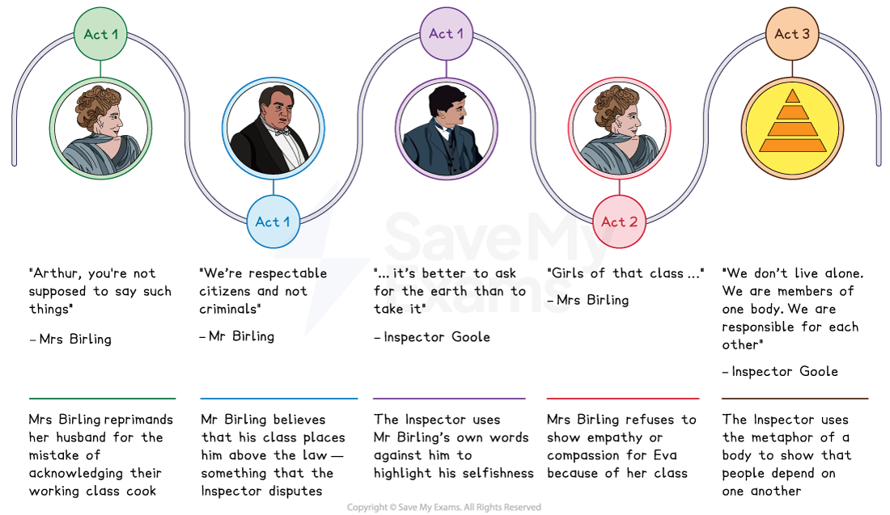
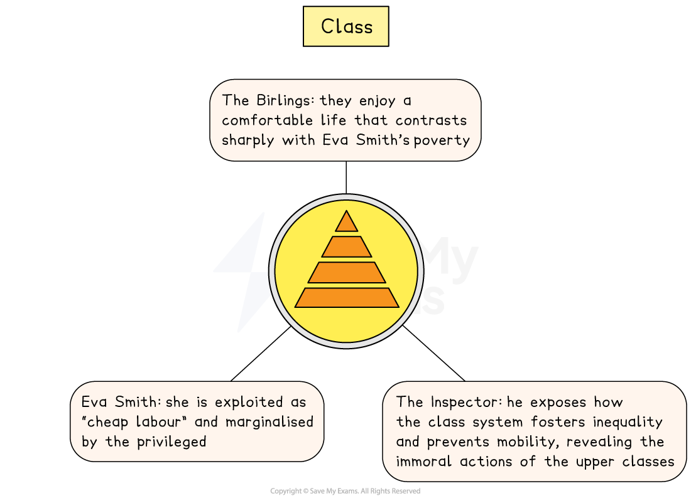

# An Inspector Calls Key Theme: Class

## An Inspector Calls Key Theme: Class: Class timeline

> **Spec point** — `spcpt_Q5yZ4f3GTqGsv9Wx`

## Class timeline

The themes of class in each act of An Inspector Calls:

*An Inspector Calls class timeline*

## An Inspector Calls Key Theme: Class: What are the elements of class in An Inspector Calls?

> **Spec point** — `spcpt_JkQgVgmtjndTnXGt`

## What are the elements of class in An Inspector Calls?

Priestley presents attitudes towards class in a variety of ways in the play, through [symbolic](https://www.savemyexams.com/glossary/gcse/english-language/symbolism-definition/) settings, exploited characters and prejudiced attitudes:

- **Settings: **The description of the Birlings’ *opulent* home** **is sharply contrasted with descriptions of the workers in Arthur’s factory
- **Prejudice:** Upper-class characters frequently make incorrect assertions about the working classes and view them as morally and socially inferior:

  - The Birlings, particularly Sybil, and Gerald are entrenched in the views of their class system; they cannot genuinely empathise with Eva’s plight or  that of the working classes
- **Exploitation: **Eric and Gerald use** **their class and status to take advantage of Eva Smith while keeping their relationship with her a secret to avoid reputational damage

> **Exam Hint**
> Examiners note that answers improve when they use the characters’ own language about class rather than describing the social system. Priestley gives both sides of the argument in only a few words.
> 
> For example, you could write: “Sheila objects that ‘these girls aren’t cheap labour – they’re people’, while her mother dismisses ‘girls of that class’, so the two women value Eva completely differently”. Putting two characters’ words side by side gives you a **contrast** you can develop across a whole paragraph.

## An Inspector Calls Key Theme: Class: The impact of class on characters

> **Spec point** — `spcpt_DFWPTs8cSkW4GqQD`

## The impact of class on characters

Priestley uses the characters in An Inspector Calls to criticise the inequality and unfairness of the British class system and argues that the privilege of class blinds people to their immoral behaviour.

*Class in An Inspector Calls*

| **Character** | **Impact** |
|---|---|
| **The Birlings ** | - Priestley depicts the comfortable, affluent life of the Birlings in contrast to Eva Smith’s poverty - Mr Birling is concerned that the wealthier Croft family might see Gerald’s engagement to Sheila, the daughter of a *new money*** **industrialist, as a social step down - Mrs Birling ignorantly links class with morality and cannot believe Eva, as a working-class girl, would refuse stolen money |
| **The Inspector** | - The Inspector suggests that the class system creates inequalities in society and prevents social mobility:    - His investigation also reveals the immoral behaviour of the ‘respectable’ upper classes |
| **Eva Smith** | - Working class Eva Smith is considered “cheap labour” by Mr Birling and Gerald, and is exploited and marginalised by more privileged characters - Class differences are a metaphorical “wall”, a barrier put up by the wealthy to separate them from the impoverished and vulnerable in society:    - Sheila warns her mother not to “build up a kind of wall” between herself and Eva |

## An Inspector Calls Key Theme: Class: Why does Priestley use the theme of class in his play?

> **Spec point** — `spcpt_DNjFWgbR5YFjdHcP`

## Why does Priestley use the theme of class in his play?

**1.  Setting and period**

- Priestley underscores how the wealthiest in society enjoy privileges and lives of excess, but are blind to the effects of their actions on the less fortunate in society
- Challenges the outdated values of the upper classes through the Inspector, who speaks for Priestley’s audience when he champions workers’ rights

**2. Plot driver **

- The revelations about how Birling family have abused their class and social status provide a clear dramatic structure

**3. Audience appeal **

- The play’s action is driven by revelations about the immorality of the Edwardian upper classes
- Its contemporary 1945 audience were more progressive, responsible and aligned with its socialist values

**4. Conflict between characters**

- Priestley quickly establishes the theme of class conflict in the opening act

## An Inspector Calls Key Theme: Class: Exam-style questions on the themes of class

> **Spec point** — `spcpt_z6qSXKGqqmhKFFFn`

## Exam-style questions on the themes of class

Try planning a response to the following essay questions as part of your revision of guilt and responsibility:

- Explore how Priestley depicts conflict between social classes in An Inspector Calls
- How does Priestley present Eva Smith in order to address different attitudes towards social class in An Inspector Calls?

#### Sources

Priestley, J.B.  (1992). An Inspector Calls. Heinemann.
