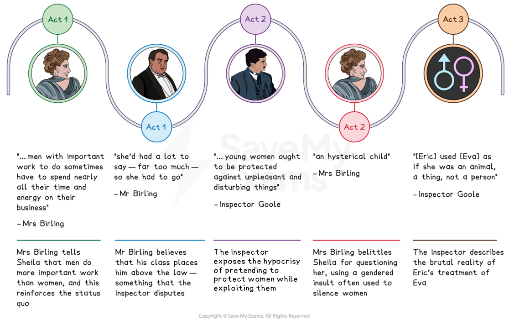
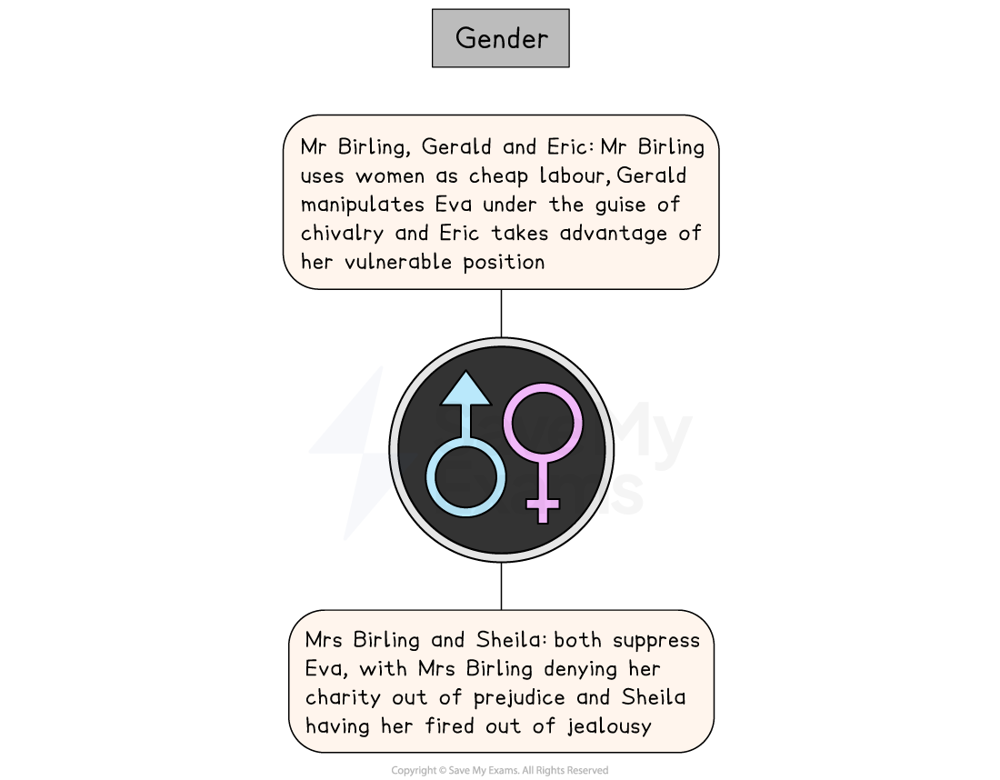

# An Inspector Calls Key Theme: Gender

## An Inspector Calls Key Theme: Gender: Gender timeline

> **Spec point** — `spcpt_dbzYdWX795d3VTvt`

## Gender timeline

The theme of gender in each act of An Inspector Calls:

*An Inspector Calls gender timeline*

## An Inspector Calls Key Theme: Gender: What are the elements of gender in An Inspector Calls?

> **Spec point** — `spcpt_jmWBws2gBKHHMZf8`

## What are the elements of gender in An Inspector Calls?

Gender is presented in An Inspector Calls in the following ways:

- **Relationships: **The relationship between Sheila and Gerald highlights the expectations of women in 1912 and their *subservience* to men
- **Exploitation: **Gender is linked closely to class in An Inspector Calls:

  - The Birlings’ mistreatment of Eva is due both to her gender and her low social status
  - Eric and Gerald use** **their gender and status to exploit Eva Smith, sexually and romantically objectifying her
- **Oppression: **Sheila is repeatedly belittled and patronised — even by her own mother — in ways that reflect a wider silencing of women

> **Exam Hint**
> Examiners praise answers that examine how the women in the play respond to a dominant man, rather than listing what happens to Eva. The differences between Sheila and her mother are the most useful place to start.
> 
> For example, you could write: “Sheila interrupts her mother to stop her talking about ‘girls of that class’, which shows a younger woman refusing the attitudes she has been raised with”. Comparing two women from different generations shows how far Priestley thinks attitudes can change.

## An Inspector Calls Key Theme: Gender: Gender: The impact of gender on characters

> **Spec point** — `spcpt_z32ZjP4WbwDYmSGm`

## The impact of gender on characters

Priestley explores the inequality between male and female characters in An Inspector Calls to criticise the mistreatment of women in society. Sexual discrimination is presented as a dark undercurrent throughout the play that informs the interactions between men and women, and between women of different classes:

*Gender in An Inspector Calls*

| **Character** | **Impact** |
|---|---|
| **Mr Birling, Gerald and Eric** | - Male characters are presented as exploiting female characters:    - Arthur Birling exploits working-class women, like Eva Smith, as one of the **cheapest forms of labour **   - Both Gerald and Eric also take advantage of the imbalance of power relating to her social position and lack of influence   - Gerald emphasises his *chivalry* in rescuing her, despite his manipulation and abuse of her   - Mr Birling even bargains with Sheila: a marriage to Gerald presents a business opportunity |
| **Mrs Birling and Sheila** | - Sybil Birling and Sheila use their power to suppress Eva Smith:    - Mrs Birling denies Eva charity on her prejudiced belief that “girls of that class” would refuse to accept stolen money   - Sheila is jealous of Eva’s looks and has her fired - Sheila’s attitude towards women’s rights and gender roles changes as the play progresses:    - She challenges her father and refuses to take back Gerald’s engagement ring |

## An Inspector Calls Key Theme: Gender: Why does Priestley use the theme of gender in his play?

> **Spec point** — `spcpt_cdJgB3ht4c3nByFH`

## Why does Priestley use the theme of gender in his play?

**1.  Setting and period**

- Priestley uses male and female characters in the play to comment upon traditional gender roles and emphasise how society has evolved since 1912
- Highlights the suppression of women’s rights in 1912 and draws attention to the ways that men *and* women can abuse their power

**2. Political commentary **

- Priestley’s depiction of pre-war values confronts his audience with the consequences of** ***patriarchal* traditions
- Eva Smith represents “millions and millions and millions” of women who are oppressed

**3. Audience appeal **

- Priestley’s 1945 audience would have recognised the influence of gender on restricting the rights of women like Eva
- Sheila plays the role of an *audience surrogate* in the play — her growing independence represents the audience’s values

## An Inspector Calls Key Theme: Gender: Exam-style questions on the themes of gender

> **Spec point** — `spcpt_qNxRCzrjr4fzw6SY`

## Exam-style questions on the themes of gender

Try planning a response to the following essay questions as part of your revision of gender:

- Explore how Priestley presents relationships between men and women in An Inspector Calls?
- How does Priestley use Sheila Birling to explore gender roles in An Inspector Calls?

#### Sources

Priestley, J.B.  (1992). An Inspector Calls. Heinemann.
