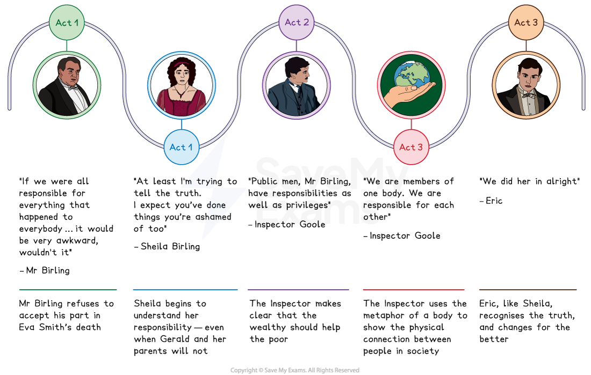
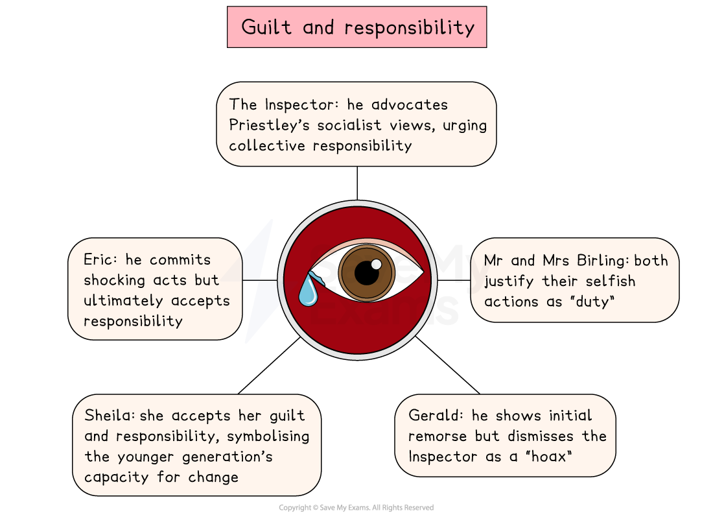

# An Inspector Calls Key Theme: Responsibility and Guilt

## An Inspector Calls Key Theme: Guilt and responsibility: Guilt and responsibility timeline

> **Spec point** — `spcpt_9VTyFcvm8yWJQ2g6`

## Guilt and responsibility timeline

The themes of guilt and responsibility in each act of An Inspector Calls:

*Guilt and responsibility timeline*

## An Inspector Calls Key Theme: Guilt and responsibility: What are the elements of guilt and responsibility in An Inspector Calls?

> **Spec point** — `spcpt_gx32KyxVNmT9WfDR`

## What are the elements of guilt and responsibility in An Inspector Calls?

Priestley presents the theme of guilt and responsibility in different ways through the characters. The telephone call that concludes the play is [symbolic](https://www.savemyexams.com/glossary/gcse/english-language/symbolism-definition/); there will be consequences for those who refuse to accept responsibility for their actions.

- **The Inspector: **He embodies social responsibility, holding each character to account for their role in the “chain of events” that led to Eva Smith’s death
- **Mr and Mrs Birling: **Representing a selfish older generation,** **they occupy an important position in society, but fail in their duty of care towards others
- **Sheila and Eric: **Through their guilt for their behaviour towards Eva, these characters represent the potential for a more progressive younger generation to show greater collective responsibility

> **Exam Hint**
> Examiners note that the strongest answers treat responsibility as something the play argues for, not just a topic it raises. The Inspector states the case directly, which makes it easy to quote and then examine.
> 
> For example, you could write: “The Inspector says ‘We are members of one body’, which turns guilt into something shared rather than something one person can be blamed for”. Explaining the **effect** a line has on the audience is what turns a quotation into analysis.

## An Inspector Calls Key Theme: Guilt and responsibility: The impact of guilt and responsibility on characters

> **Spec point** — `spcpt_dmHwZ75kSDJCjfK2`

## The impact of guilt and responsibility on characters

The play’s message of responsibility contributes to its dramatic tension and structure. The Inspector systematically questions each member of the Birling family, revealing their guilt and demonstrating how their actions all contributed to Eva Smith’s death.

*Guilt and responsibility in An Inspector Calls*

| **Character ** | **Impact ** |
|---|---|
| **The Inspector ** | - Priestley uses the Inspector as a *mouthpiece* for his *socialist* ideology, emphasising personal and collective responsibility:    - He argues that the wealthy and privileged have a responsibility to support the most vulnerable in society   - His message has a lasting, transformative effect on the younger members of the Birling family, but other characters refuse to admit guilt for their abuses of power |
| **Mr and Mrs Birling** | - Arthur and Sybil Birling use the words “responsibility” and “duty” to describe their selfish behaviours but begin the “chain of events”:    - Mr Birling fires Eva Smith and Mrs Birling abuses her power (in the Brumley Women’s Charity) by refusing to support her; this cruelty leads to Eva killing herself and her unborn child |
| **Gerald** | - Gerald appears *contrite* when the Inspector reveals his responsibility for the suicide of “Daisy Renton”, but he later calls the Inspector a “hoax”:    - When he tries to give Sheila back the engagement ring, it symbolises that he has not learnt anything |
| **Sheila ** | - Sheila feels deep guilt and regret for getting Eva Smith fired:    - She represents the younger generation’s acceptance of their responsibility to others |
| **Eric ** | - Eric is revealed to have raped Eva Smith, before stealing from Mr Birling to support her during her pregnancy    - Priestley shocks the audience by revealing this after Mrs Birling’s actions led to the unborn baby’s death - He demonstrates a capacity to change and an acceptance of his social responsibility, like Sheila, by refusing to accept Gerald’s “hoax” claim |

## An Inspector Calls Key Theme: Guilt and responsibility: Why does Priestley use the theme of guilt and responsibility in his play?

> **Spec point** — `spcpt_NWpYwHvjHxPQSMtf`

## Why does Priestley use the theme of guilt and responsibility in his play?

**1.  Setting and period**

- Priestley underscores how the wealthiest in society enjoy privileges and lives of excess, while refusing to show compassion for the poorest and most vulnerable
- Demonstrates the consequences of selfishness and ignorance (such as the disaster aboard the Titanic and the labour disputes)

**2. Plot driver **

- The plot is structured around the Inspector’s interrogations of the Birling family, revealing their guilt and responsibility one by one
- Reveals the “chain of events” that connect individuals and the importance of personal and collective responsibility

**3. Audience appeal **

- Sheila and Eric come to represent Priestley’s 1945 audience — a more progressive and responsible generation
- Mr and Mrs Birling, and Gerald, reflect the blinkered attitudes of an older generation whose irresponsibility would have unsettled Priestley’s audience

**4. Dramatic device  **

- Creates [dramatic irony](https://www.savemyexams.com/glossary/gcse/english-literature/dramatic-irony-definition/): the audience realise, before the Birlings do, that each will be interrogated by the Inspector, and therefore each bears some guilt
- Leads to dramatic tension, such as the cliffhangers that end each act

## An Inspector Calls Key Theme: Guilt and responsibility: Exam-style questions on the theme of guilt and responsibility

> **Spec point** — `spcpt_cqwjVJ8QtkVGsxh8`

## Exam-style questions on the theme of guilt and responsibility

Try planning a response to the following essay questions as part of your revision of guilt and responsibility:

- Explore how Priestley presents the attitudes of Arthur and Sybil Birling towards their role in the death of Eva Smith
- How does Priestley show that the effects of guilt and responsibility change the character of Sheila in An Inspector Calls?

#### Sources

Priestley, J.B.  (1992). An Inspector Calls. Heinemann.
