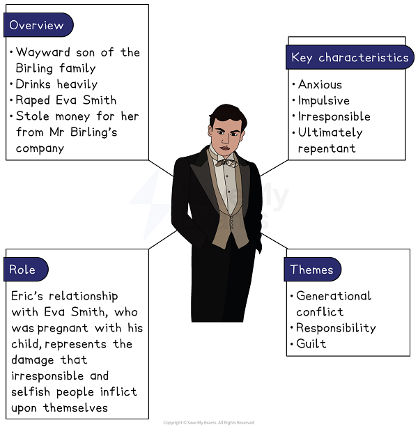
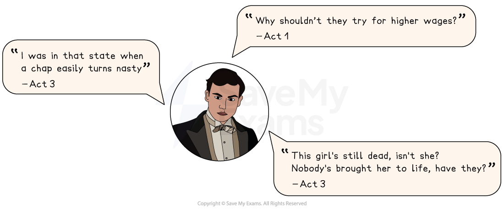

# Eric Birling Analysis

Eric represents the recklessness and misogyny of wealthy young men in the early 1900s, but his transformation into a more responsible person suggests that there is hope for the future.

## An Inspector Calls: Eric Birling Character Analysis: Eric character summary

> **Spec point** — `spcpt_RpQskbksMHVnPvJR`

## Eric character summary

*Eric Birling character summary*

## An Inspector Calls: Eric Birling Character Analysis: Why is Eric important?

> **Spec point** — `spcpt_XG2r9D9pvbKJC6sX`

## Why is Eric important?

Eric represents both the punishment that awaits those who refuse to listen to the Inspector’s message, and also the potential for the younger generation to change for the better.

- He has **a drinking problem**: he is known by his peers (including Gerald) to drink heavily, and while inebriated he can become aggressive; he forced himself upon Eva while he was drunk
- He has a **poor relationship with his father**: he appears to be jealous of Mr Birling’s respect for Gerald; he does not confide in his father when Eva becomes pregnant, and instead steals from Mr Birling’s business
- He is **able to accept responsibility**: at the [denouement](https://www.savemyexams.com/glossary/gcse/english-language/denouement-definition/), he and Sheila are the only characters to accept their roles in Eva’s death; he is stricken with guilt, and willing to face the consequences of his actions

> **Exam Hint**
> Examiners note that answers on Eric are stronger when they handle his behaviour honestly rather than excusing it, because the play does not let him off either.
> 
> For example, you could write: “Eric admits he was ‘in that state when a chap easily turns nasty’, and Priestley makes him say it plainly so the audience cannot treat it as a small thing”. Facing what a character admits about himself is what keeps your reading of him credible.

## An Inspector Calls: Eric Birling Character Analysis: Eric language analysis

> **Spec point** — `spcpt_6C6C328MZDnmRwSC`

## Eric language analysis

Priestley uses a range of techniques to present different aspects of Eric’s character:

- **Exclamatory language**: Eric is prone to sudden exclamations, such as “(involuntarily) My God!” in Act 1 and the stage direction “(bursting out)” in Act 3, both of which highlight his impulsive and immature tendencies
- [Dramatic irony](https://www.savemyexams.com/glossary/gcse/english-literature/dramatic-irony-definition/)**: **Act 2 ends with the audience realising that Eric, who is offstage, was the father of Eva Smith’s child; we know this because Eric is the only member of the family waiting to be interviewed by the Inspector. Sybil Birling does not realise this, and encourages the Inspector to punish the father of Eva Smith’s child; one by one, the other characters realise that Sybil is falling into the Inspector’s trap — and then, as the truth becomes obvious, Eric enters and the Act ends
- **Confrontational dialogue: **Eric’s dialogue with his father is frequently confrontational; in Act 1, he openly disagrees with Mr Birling’s position that workers should not strike for higher wages, while Mr Birling often chides Eric or dismisses his remarks. Another example is Mr Birling’s immediate (and incorrect) dismissal of Eric’s justifiable fears of war: “There isn’t a chance of war”. These interactions indicate a strained father-son relationship; Eric states in Act 3 that Mr Birling is not “the kind of father a chap could go to when he’s in trouble”

### Eric Birling key quotes

*Eric Birling key quotes*

## An Inspector Calls: Eric Birling Character Analysis: Eric character development

> **Spec point** — `spcpt_6tbv7nK2QXpMpCqT`

## Eric character development

| **Act 1** | **Act 2** | **Act 3** |
|---|---|---|
| **Eric lacks confidence and is uneasy**: Priestley <u>[foreshadows](https://www.savemyexams.com/glossary/gcse/english-language/foreshadowing-definition/)</u> Eric’s drinking problem early on (Sheila calls him “squiffy”). He disagrees with his father at several points, but is not strong or sober enough to contradict Mr Birling with any confidence. | **Eric is the father**: The Inspector reveals Eric to be the final link in the “chain of events” connecting the Birlings to Eva Smith’s death: he was the father of Eva’s unborn child. This means that when Sybil Birling refused to help Eva, Mrs Birling effectively sentenced her grandchild to death. | **Eric’s transformation**: Eric reveals his role in Eva’s death, admitting that he stole money to support her. He shows deep remorse, and argues forcefully against his parents and Gerald when they deny any responsibility. Eric and Sheila end the play changed for the better. |

## An Inspector Calls: Eric Birling Character Analysis: Eric character interpretation

> **Spec point** — `spcpt_jmnpBZnFRrgmFb9k`

## Eric character interpretation

### Eric’s redemption

Eric is guilty of atrocious behaviour towards Eva Smith, and then stole money to support her in secret rather than being honest about his behaviour. Modern audiences — and even Priestley’s 1945 audience — may struggle to forgive him, but he is redeemed somewhat by guilt and willingness to accept the consequences of his actions. He therefore embodies Priestley’s message of redemption, demonstrating that even the most irresponsible of individuals are capable of becoming positive forces for change in society.

### Capitalism versus socialism

Eric is a vital part of Priestley’s attack on the hypocrisy of 1912 and 1945 society. He openly condemns Mr Birling’s capitalist principles, and reveals socialist tendencies by arguing that Eva and her fellow workers were right to strike for higher wages. He points out that Mr Birling himself praised Eva’s work, and factory owners like him are always seeking to charge higher prices. In Act 3, he “bitterly” mocks his father for not telling the Inspector that it must be “every man for himself”, highlighting the absence of *conviction* among powerful men, who behave in whatever way is most convenient.

#### Sources

Priestley, J.B.  (1992). An Inspector Calls. Heinemann.
