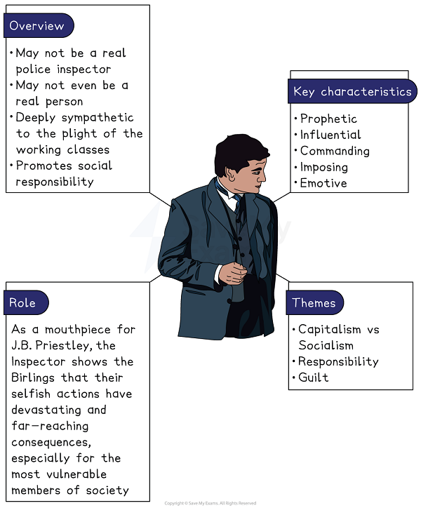
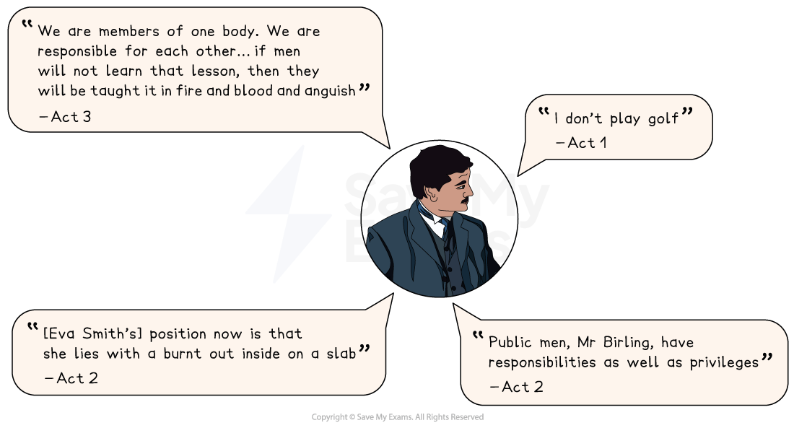

# Inspector Goole Analysis

Inspector Goole represents both J.B. Priestley’s own socialist beliefs, but also the moral authority of An Inspector Calls, shining a light on the moral failings of the Birling family.

## Inspector Goole character summary

> **Spec point** — `spcpt_BBh4NCcyRGfgyk7C`

## Inspector Goole character summary

*Inspector Goole character summary*

## Why is Inspector Goole important?

> **Spec point** — `spcpt_qXXtY54x4nhCRmZG`

## Why is Inspector Goole important?

Priestley uses the Inspector to comment on the inequalities in 1912 society and how it is organised:

- The Inspector highlights the **chain of events** connecting individuals in society. He establishes the links between the Birlings and Eva Smith / Daisy Renton to encourage the family to accept their responsibilities and change the way they behave towards others in the future.
- He highlights **generational conflict**: while Mr and Mrs Birling, the older generation, refuse to accept the Inspector’s message, Sheila and Eric, the younger generation, are open to social change and taking responsibility for one’s actions.
- He speaks **on behalf of the victimised and oppressed**: because his investigation is based upon Eva Smith’s diary, it is as though he speaks for Eva from beyond the grave. He forces the Birlings to consider the “millions and millions of Eva Smiths and John Smiths” who might struggle because of capitalist greed

## An Inspector Calls: Inspector Goole: Language analysis

> **Spec point** — `spcpt_ZcSc6tPYgkttdq9Q`

## Inspector Goole language analysis

Priestley’s language, in both dialogue and stage directions, is designed to give the impression that Inspector Goole is an omniscient moral authority. The language he uses, and is used about him, is characterised by:

- **Emotive language**:** **the Inspector expresses anger at the lack of empathy for Eva Smith shown by Mr and Mrs Birling; his final speech makes effective use of ***tricolons ***to warn that those who refuse to show responsibility for one another will be taught it “in fire and blood and anguish”. He describes Eva’s “burnt out” corpse using gruesome imagery in order to confront the Birlings with the awful consequences of their actions
- **Contrasts**: in the **stage directions** used to describe** **the Inspector in Act 1, his arrival is signalled by the “sharp” ring of the doorbell that cuts off Mr Birling’s speech about the importance of putting oneself first. Furthermore, when the Inspector arrives, the “pink and intimate” lighting becomes “brighter and harder”, the[* juxtaposition*](https://www.savemyexams.com/learning-hub/glossary/top-literary-devices/) indicating that Goole is about to illuminate the truth and expose the Birlings’ secrets.
- **A sharp tone:** the Inspector’s dialogue shows that he does not care for the trappings of the 1912 class system; he dismisses Mr Birling’s offer of port and is unimpressed when Mr Birling claims to golf with the Chief Constable: “I don’t play golf”. He is also talented at using other characters’ words against them to punish their lack of empathy, as when he convinces Mrs Birling to unwittingly blame Eric at the end of Act 2

### Inspector Goole key quotes

*Inspector Goole key quotes*

## Inspector Goole’s character development

> **Spec point** — `spcpt_yz8DCWBtbmZTNbvN`

## Inspector Goole’s character development

The Inspector does not develop as a character over the course of the play: he begins and ends the play as its moral authority, and encourages the others to learn from him. He is, however, the *catalyst *for the changes we see in other characters. He carries out his investigation purposefully, interrogating one person at a time.

| **Act 1** | **Act 2** | **Act 3** |
|---|---|---|
| **Mr Birling and Sheila**: Initially, the Inspector reveals that Mr Birling and Sheila set Eva on her tragic path. | **Gerald and Mrs Birling**: Inspector Goole forces Gerald to reveal the truth of his affair with Eva. He then diverges from his chronological investigation to expose Mrs Birling’s cruelty towards Eva. | **Eric**: The Inspector reveals Eric’s involvement with Eva, forcing him to admit that he raped and used Eva before stealing money for her. He leaves the Birlings with a warning about the perils of denying their responsibility towards others. |

## An Inspector Calls: Inspector Goole: Character interpretations

> **Spec point** — `spcpt_YHNnGwgrzhDbWSHB`

## Inspector Goole character interpretations

### Christianity and morality

An Inspector Calls is based on the morality plays of the late middle ages in which men are caught between the religious need for goodness and the temptations of evil. The Inspector could be seen to represent Christian ideals here, as he encourages the Birlings to confess their sins and seek repentance. He appeals to their better natures, but also warns them of the hellish “fire and blood and anguish” that awaits those who deny his message about helping the needy.

### 20th-century warfare

Because the play takes place a few years before the First World War, the Inspector highlights the ignorant attitudes of men like Arthur Birling about the future and the unrest throughout Europe. His message can be interpreted as a call to action for Priestley’s 1945 audience to not repeat the mistakes of the past.

### The Inspector as ghost

The Inspector might even be interpreted as the ghost of Eva Smith (“Goole”, after all, is a *homophone *for “ghoul”). His omniscient knowledge of her life, her story, and her feelings at various points suggests a connection between him and Eva. The idea of a ghost encouraging the living to change their ways imitates, again, the medieval morality plays that inspired Priestley, and evokes similar morality stories preaching social awareness such as Dickens’ A Christmas Carol.
