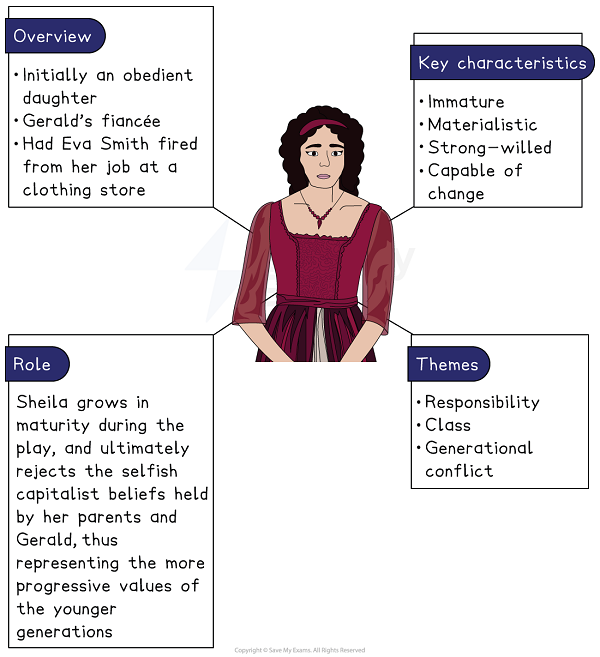
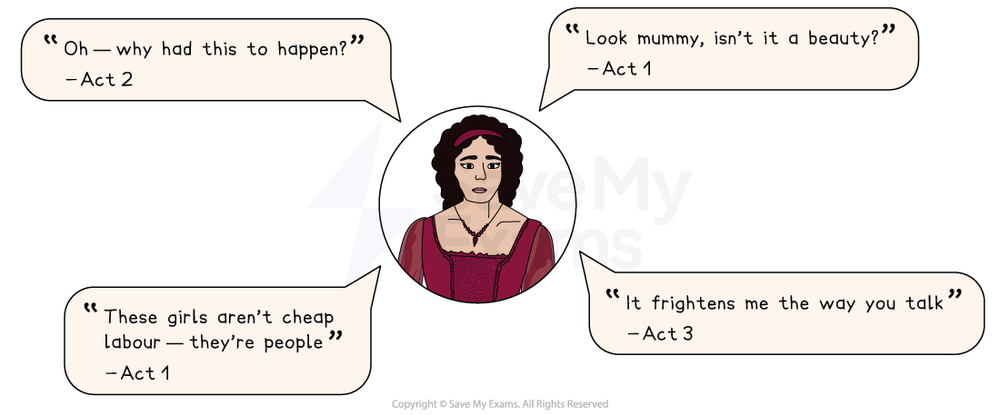

# Sheila Birling Analysis

Sheila is the conscience of the Birling family, and her redemption during the play represents hope for the younger, more progressive generation.

## An Inspector Calls: Sheila Birling Character Analysis: Sheila character summary

> **Spec point** — `spcpt_JCMyNXHRVW9qNKWd`

## Sheila character summary

*Sheila Birling character summary*

## An Inspector Calls: Sheila Birling Character Analysis: Why is Sheila important?

> **Spec point** — `spcpt_9GTHC9rWcR4ppgYD`

## Why is Sheila important?

Priestley uses Sheila to contrast the character of Eva: the two characters reflect how the class divide affects women from very different backgrounds. Sheila also represents the capacity of the younger generation to affect positive social change.

- She is **immature**: at the beginning of the play, she is blissfully unaware of the hardships faced by working-class women such as Eva Smith, who was her age. She is horrified to hear of Eva’s fate, which was partly caused by Sheila’s petty jealousy
- She is **materialistic**: she judges Eva based solely on appearances, and her jealousy arises from Eva looking better in a dress than Sheila; she also disregards immediately her suspicion of Gerald’s absence the previous summer because Gerald presents her with an expensive engagement ring
- She is **strong-willed **and **capable of change**: she not only accepts the blame for her part in Eva’s death, but sides with the Inspector’s call for social reform, and condemns her parents’ selfishness and irresponsibility

> **Exam Hint**
> Examiners note that Sheila rewards answers that **track** change across the whole play, since she moves further than any other character. Choose two moments far apart rather than several from one act.
> 
> For example, you could write: “Sheila begins by admitting she had Eva dismissed out of temper, but by the end she is the one insisting the family face what they have done”. Showing how a character **develops** is far more convincing than calling her sympathetic.

## An Inspector Calls: Sheila Birling Character Analysis: Sheila Birling: Language analysis

> **Spec point** — `spcpt_jyVg8t8J22JMr2Fm`

## Sheila Birling language analysis

Priestley uses a range of techniques to demonstrate Sheila’s development from childlike to more independent and morally responsible.

- **Childish language: **Priestley highlights Sheila’s naivety and immaturity by having her use infantile language, such as “Mummy” and “Daddy”, and through her emotional outbursts, such as her response to Eva’s suicide: “Oh — horrible!”
- **Descriptions of her physical behaviour:** Stage directions describing Sheila’s physical behaviour illustrate the way that her character develops over the course of the [tragedy](https://www.savemyexams.com/glossary/gcse/english-language/tragedy/). In Act 1, she is entirely obedient to her parents, and “looks attentive” as her father describes the importance of putting oneself first. In Act 2, she moves physically closer to the Inspector, demonstrating that she has fallen under his influence: “She goes closer to him, wonderingly”
- **Shift in tone: **Sheila’s dialogue with her parents and Gerald is important in establishing her rejection of their selfish beliefs. She begins the play by hanging on her parents’ every word, but by Act 3 she is confident enough to challenge them, even calling Sybil’s use of “impertinent” a “silly word”

### Sheila Birling key quotes

*Sheila Birling key quotes*

## An Inspector Calls: Sheila Birling Character Analysis: Sheila character development

> **Spec point** — `spcpt_p6jzCxxBfTWKgbHz`

## Sheila character development

| **Act 1** | **Act 2** | **Act 3** |
|---|---|---|
| **Sheila is entitled and immature**: Sheila is childish and excitable. Her view of the world is blinkered, and she has no understanding of the lives of those less privileged than herself. She is distraught when the Inspector reveals that Sheila’s spite and jealousy contributed to Eva Smith’s suicide. | **Sheila becomes more mature**: Sheila convinces Gerald to confess to his relationship with Eva. Sheila shows maturity in her handling of the situation: she breaks off her engagement to Gerald, but respects Gerald for finally being honest. She is the first to realise Eric’s involvement with Eva. | **Sheila’s transformation is complete**: Sheila sides fully with the Inspector, taking on board his message about the importance of social responsibility. She rejects Gerald’s suggestion that the investigation was a hoax, and condemns her parents for not changing their ways. |

## An Inspector Calls: Sheila Birling Character Analysis: Sheila character interpretation

> **Spec point** — `spcpt_FM87ffnhc2yV5RZ4`

## Sheila character interpretation

### Sheila’s progressive politics

By the end of the play, Sheila’s character is aligned firmly with the ideologies of Priestley’s postwar audience, who would have been more socially aware. Priestley’s 1945 audience would have witnessed the development of Britain’s Welfare State, an increased focus on workers’ rights and labour unions, and a renewed focus on community values following World War Two. Modern audiences, including that in 1945, may sympathise with Sheila’s position at the end of the play.

### Rights of women

Sheila also represents the social position of women in 1912 Britain, and might be seen as a victim of her environment. Her naivety and immaturity are indicative of the poor standard of education afforded to women at the time, and her excitement at Gerald’s expensive engagement ring [alludes](https://www.savemyexams.com/glossary/gcse/english-language/allusion-definition/) to the fact that women of this period depended entirely upon men for financial stability. Her father, Mr Birling, clearly sees her engagement to Gerald as a business opportunity more than anything else. Sheila’s new, socially progressive, ideas are dismissed by the selfish older generation, reflecting the relative powerlessness of women in 1912 to affect political change. Middle-class women were only granted the right to vote in 1918, and *universal suffrage* was not granted until 1928.

#### Sources

Priestley, J.B.  (1992). An Inspector Calls. Heinemann.
