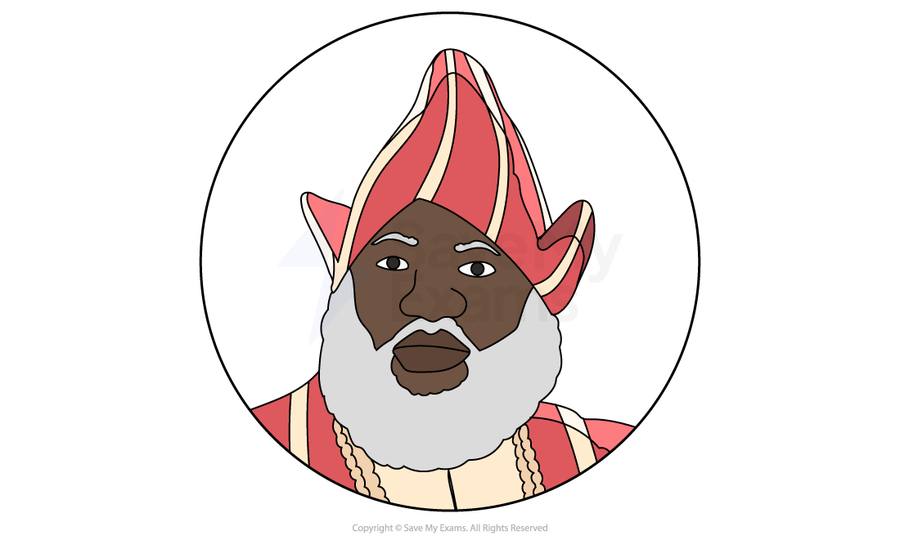
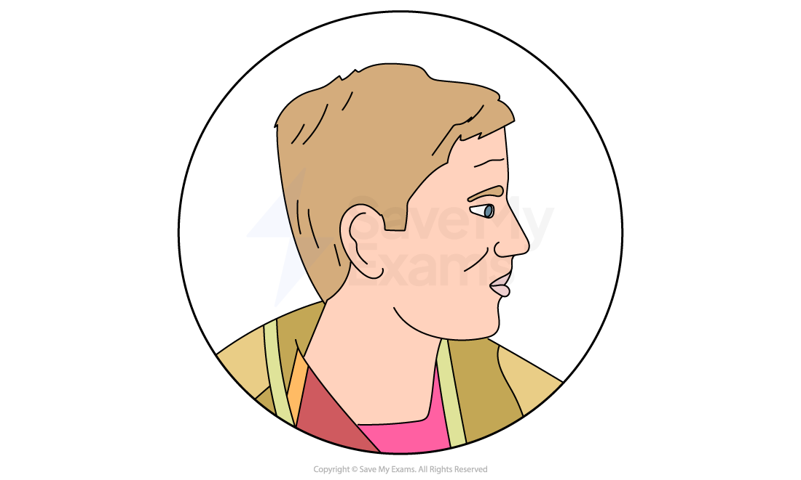
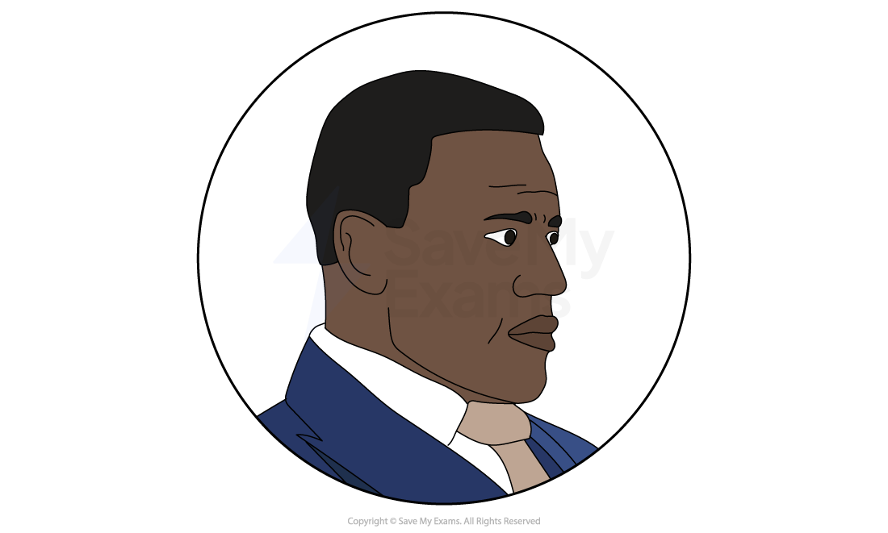
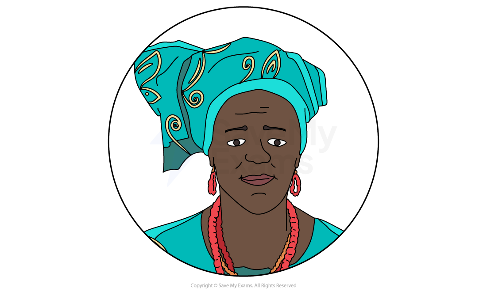
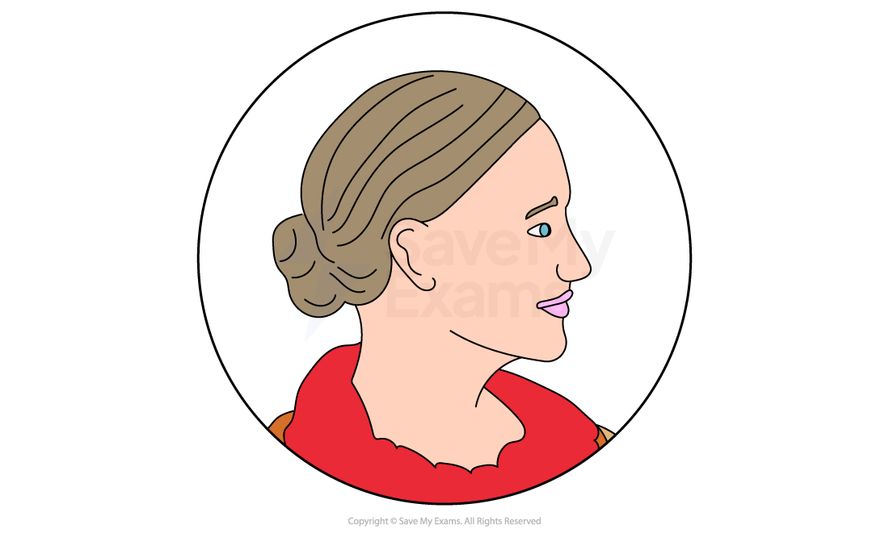
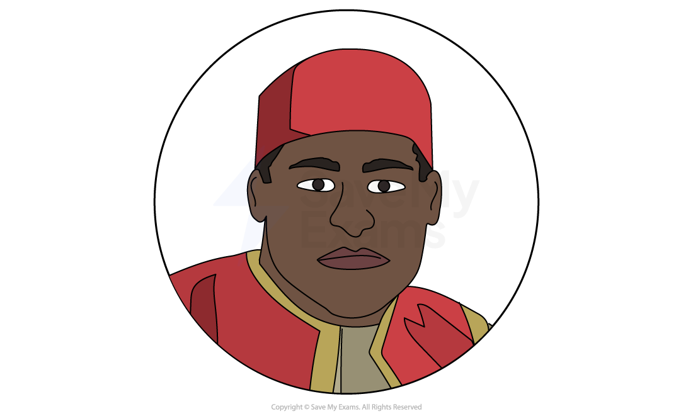
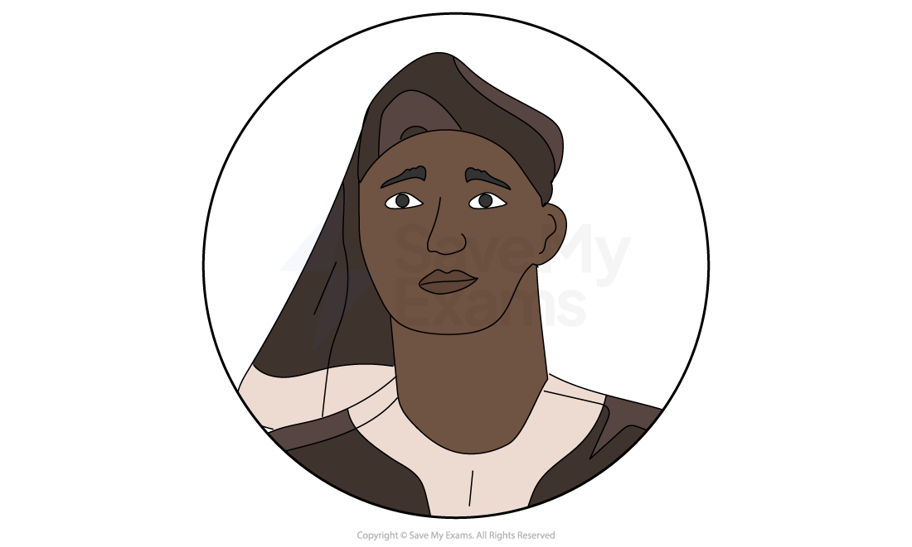

# Death and the King's Horseman: Characters

## Death & the King's Horseman: Characters

> **Spec point** — `spcpt_dqbh4YHvbqY9yDPJ`

## Characters

It is vital that you understand that characters are often used symbolically to express ideas. Wole Soyinka uses all of his characters to symbolise various ideas prevalent in his society, and the differences between characters reflect contemporary debates. Therefore, it is very useful not only to learn about each character individually, but how they compare and contrast to other characters in the play.

It is important to consider the range of strategies used by Soyinka to create and develop characters within Death and the King’s Horseman*. *These include:

- How characters are established
- How characters are presented:

  - Physical appearance or suggestions about their appearance
  - Their actions and motives
  - What they say and think
  - How they interact with others
  - What others say and think about them
- How far the characters conform to or subvert stereotypes
- The relationships between other characters

Below you will find character profiles of:

**Main Characters**

- *Elesin Oba*
- *Simon Pilkings*
- *Olunde Oba*
- *Iyaloja*

**Other Characters**

- *Jane Pilkings*
- *Amusa (the police sergeant)*
- *The praise-singer*

> **Exam Hint**
> In the exam, the idea of a character as a conscious construct should be evident throughout your response. You should demonstrate a firm understanding that Soyinka has deliberately created these characters to perform certain functions within the play.
> 
> For instance, you could begin to consider why Soyinka has chosen to present Simon Pilkings in the way that he does. Consider his actions and mannerisms, as well as what he says. As this is a play, an exploration of dramatic form is also essential to a study of his character. Consider the music playing in the background during the costume party, for example. Perhaps you could consider how his authority is signified by his uniform in Act 5. Try to explore reasons as to why Soyinka uses music or costume to represent ideas and how this can contribute to the overall presentation of characters.

## Death & the King's Horseman: Characters: Elesin Oba

> **Spec point** — `spcpt_3gjY7kwxYBjc6h2J`

## Elesin Oba

*Elesin Oba*

- Elesin Oba is the ***protagonist*** and ***tragic hero*** of the play
- According to ***Yoruba*** custom, as the dead king’s horseman he is duty-bound to perform a ***ritual*** suicide and follow the king into the afterlife
- However, Elesin is presented as a ***dubious*** and flawed hero:

  - Elesin’s elevated position has afforded him a luxurious life and this makes him hesitant to leave the pleasures on earth
  - Although it is made clear the village believes Elesin to be an honourable man, his reassurance to the village (that he is prepared to die) is met with doubt
- The ***praise-singer*** is concerned at his lack of ***reverence*** on such a spiritually significant day:

  - He is distracted by the women in the village and asks them to lavish attention and dress him in fine clothes
  - He insists he is granted a last wish, to bed a young woman who is already engaged
- The audience are introduced to his ***fatal flaw***: he is ***hedonistic***, selfish and somewhat shallow
- Soyinka’s tragic hero, though, is likeable and sympathetic:

  - His love for life is emphasised with exuberant comments about his love for women
  - He is dramatic and enjoys the attention he is paid
  - He dances and sings with the women and praise-singer
- Through Elesin, Soyinka conveys themes about life and death in relation to honour:

  - When Elesin is tested he hesitates and delays his death
  - Elesin’s** *****hubris*** can only lead to his downfall and doom the Yoruba community
  
    - The women and praise-singer remind him of this repeatedly
- Elesin’s ***anagnorisis*** comes when he is jailed and prevented from carrying out the ritual:

  - His son’s disgust shames him
  - He curses the British officers for their lack of understanding
  - Ultimately, he realises he is to blame
- Nevertheless, Elesin’s doomed ***fate*** is sealed: his son, Olunde, disrupts the order and takes Elesin’s place
- His son’s suicide is more than Elesin can bear and he strangles himself with his chains

## Death & the King's Horseman: Characters: Simon Pilkings

> **Spec point** — `spcpt_zJbNqcJPZkVhrVhx`

## Simon Pilkings

*Simon Pilkings*

- Simon Pilkings is the British ***district officer*** for Oyo, Nigeria:

  - His job is to control the local area and ensure British values and laws are adhered to properly
  - His character represents British** *****colonial*** rule
- He is the play’s ***antagonist***** **as he plays a crucial role in preventing Elesin from performing the ***sacred*** ritual:

  - Dismissing local advice, he charges Amusa with arresting Elesin while he attends a party
  - Despite repeated protest from the others, he insists on keeping Elesin isolated:
  
    - It is worth noting that the clock strikes midnight and the drums stop while Elesin is locked up in Simon’s study
    - Elesin says the moon has told him his moment has passed and the silence indicates impending disaster, not peace
    - This is a dramatic climax that shows the significance of Simon’s interference
- Simon is introduced immediately as oblivious to local beliefs:

  - He and his wife Jane wear an ***egungun*** costume to a party:
  
    - This offends Amusa the police sergeant
  - He asks his servant about the drums and is unfamiliar with the ritual Elesin is about to undertake
  - He calls the natives “devious bastards”, unaware this is deeply insulting
- Simon is presented as both reckless with his duties as well as unprincipled:

  - As district officer, Simon’s duty is to represent the Christian religion
  - Yet Simon is also disrespectful about this:
  
    - He remarks that Amusa is Muslim and therefore has no cause to be offended by the egungun costumes
    - He makes a disdainful comment to Joseph
- Simon is not ***remorseful***** **when he makes an error, thus making him an unsympathetic character:

  - He repeatedly offends his servant, Joseph, and Amusa, the police sergeant
  - Even when he is made aware of the significance of the Yoruba ritual in progress he remains dismissive, calling it “nonsense” and “mumbo-jumbo”
  - Although he is reminded of Elesin’s pleas to keep Olunde in Nigeria according to custom, he refuses to change his behaviour
- Simon is presented as self-important:

  - He is rude to his wife and ignores her
  - He is predominantly interested in meeting the prince
  - He wears his police uniform when he visits Elesin in jail although he has played a limited part in the arrest
- Simon represents a villainous character and the ***catalyst*** for the tragedy:

  - In the end, Iyaloja tells him he is responsible for Olunde’s death as well as the destruction of the community

## Death & the King's Horseman: Characters: Olunde Oba

> **Spec point** — `spcpt_tZd79hDKsdNdQnjy`

## Olunde Oba

*Olunde Oba*

- Olunde is Elesin’s eldest son and, thus, next in line as king’s horseman
- This position places him directly in the middle of the conflicting action
- He represents a character with a **dual-culture**:

  - Jane sees and greets him as a friend when he arrives at the party
  - Simon Pilkings believes he has “saved” him by sending him to England
  - However, his conversations with Jane at the party convey his loyalty to his homeland:
  
    - He says that while he admires the English for their survival skills, he also considers them disrespectful of things they do not understand
    - He says his time away has cemented his love for his culture
  - Olunde shocks Jane when he says he is proud of his father’s impending sacrifice:
  
    - This illustrates that Jane believes his time in England would have changed his mind about what she considers “barbaric” customs
- Olunde’s character can be seen as the victim of the play, or even as a **martyr**:

  - He pays the price for both Simon Pilkings’s mistakes and his father’s hesitation
  - He sacrifices himself for the village
- He is also presented as heroic:

  - He is principled and brave:
  
    - His father’s **impending** sacrificial** rite** brings him back from England where is studying to be a doctor
    - He stands up to Jane Pilkings and tells her she is easily persuaded to “desecrate an ancestral mask”
    - He disowns his father when he learns he has failed to complete the Yoruba ritual
  - He is shown as intelligent and a critical thinker:
  
    - Olunde reasons with Jane by comparing English and European events to the Yoruba custom
    - He compares the **patriotism **that allows Britain to send thousands to certain death to a mass suicide
    - He uses a British naval captain’s sacrificial actions as another example

## Death & the King's Horseman: Characters: Iyaloja

> **Spec point** — `spcpt_9V2pcBvPbvWhJ5bb`

## Iyaloja

*Iyaloja*

- Iyaloja can be considered another heroic character in the play
- She is presented as nurturing and kind:

  - She is the “mother of the market” as the women of the market look to her as a mother figure
  - Iyaloja can be seen as Elesin’s guide:
  
    - She helps Elesin prepare for his ritual
    - She often speaks in the Yoruba ***proverbs*** and explains them to Elesin
  - She asks the women to dress Elesin in fine clothes
- Iyaloja is presented as selfless and loyal to her community:

  - When Elesin asks to marry a woman in the market, Soyinka emphasises the huge personal sacrifice she is willing to make for the tribe
  - Elesin works hard to persuade her to request his last wish, to marry a woman who is engaged to Iyaloja’s son:
  
    - This means her daughter will be unable to marry her son even after Elesin’s death
  - That she agrees to grant him his request presents her as merciful and selfless
  - Iyaloja’s reason for this, that she does not want to disrupt the order on such a significant occasion, illustrates her loyalty to the Yoruba people
- By the climax of the play, Iyaloja’s generous nature changes to anger:

  - She denies Elesin any mercy and severely admonishes him for failing his community:
  
    - She tells him he has disrupted the order of the universe
    - She uses a ***metaphor*** to convey the significance of his disturbance of nature
- In the ***resolution***, Iyaloja concludes the play, which shows her ***omnipresent***** **and vital role in the community:

  - She stops Simon Pilkings from saving Elesin’s life and tells him he is responsible for Olunde’s death
  - She exits stage with Elesin’s new bride, the young woman who was to marry her son
  - Her last line refers to the play’s central theme regarding the living and the dead and the transition between each state: “Now forget the dead, forget even the living. Turn your mind only to the unborn”

## Death & the King's Horseman: Characters: Other characters

> **Spec point** — `spcpt_xnpjNZwjj6FTj8dB`

## Other characters

### Jane Pilkings

*Jane Pilkings*

- Jane is married to Simon Pilkings, the district officer
- She represents a British wife who begins to show an interest in local culture:

  - In this way, her character raises important issues and divisions
  - She engages in debate with Olunde about ***World War II***, a recent ship explosion and the customs in England and Nigeria
  - She sees Amusa is upset about the egungun costumes and questions it
  - She tries to convince her husband to be more careful with his words and appears to know some things about the local people:
  
    - She tells him that the word “bastard” has more serious connotations in Nigeria than in England
- Her character represents an unheard yet important warning voice in the play:

  - She attempts to stop Simon from his rash actions and asks him to talk to Elesin before arresting him
  - She asks Simon to attend to Elesin’s situation rather than attend the party
- Nevertheless, she is easily distracted:

  - At the end of Act 2, she is thrilled at the idea of meeting the prince and forgets about Amusa’s disgust at their costumes

### Amusa (the police sergeant)

*Amusa*

- Amusa, a native Nigerian, is a police sergeant who reports to Simon Pilkings
- Amusa’s character highlights important cultural issues:

  - His character is presented as weak
  - He seems unable to fit in as a result of his position
  - He is humiliated by the women in the market:
  
    - They mock his **subservience **to the “white men”
  - Yet he is also questioned at the party by a resident who believes he may be part of the riotous crowd
  - Even Simon Pilkings treats him with **disdain**:
  
    - He disrespects him repeatedly
    - He mocks his extreme reaction to the egungun costumes
    - He questions if Amusa has exaggerated his report on events in the market

### The praise-singer

*The praise-singer*

- The praise-singer, in particular, represents the Yoruba tribe
- His significant role in Elesin’s ritual is illustrated as the praise-singer accompanies Elesin on his journey to death with chanting, dancing and with songs of praise
- In the introduction, the praise-singer reassures Elesin of his immortality as a result of his sacrifice
- He warns Elesin not to disrupt the order of the universe by finding too much pleasure on earth
- He tells Elesin he should think about his family and friends, rather than women and ***carnal***** **pleasures
- He praises Elesin (although at times questions his earnestness) and guides him into a trance at his time of death
- In the resolution, the praise-singer tells Elesin he failed to prevent disorder and chaos
