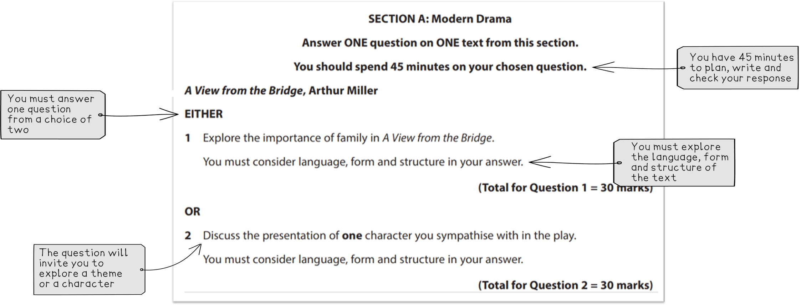

# How to Approach the Modern Drama Question

## Modern Drama: How to approach the Modern Drama question

> **Spec point** — `spcpt_xYGhSHc68QzB3qf3`

## How to Approach the Modern Drama Question

In Section A of Component 2 of your Edexcel IGCSE English Literature exam (4ET1/01), you will answer a 30-mark essay question analysing how language, form and structure are used to create meaning and effect in a modern drama text.

You have a choice from five plays:

| A View from the Bridge by Arthur Miller | An Inspector Calls by J.B. Priestley |
|---|---|
| The Curious Incident of the Dog in the Night-time by Mark Haddon (adapted by Simon Stephens) | Kindertransport by Diane Samuels |
| Death and the King’s Horseman by Wole Soyinka |   |

You can approach the question in Section A with confidence by learning more about the exam question:

- **Section A: Modern Drama question overview**
- **Understanding the exam question**
- **Understanding the Assessment Objectives**
- **Top grade tips for a Grade 9**

## Modern Drama: Section A: Question overview

> **Spec point** — `spcpt_xmdFt3bCwSN8Bx5x`

## Section A: Modern Drama question overview

In Section A you will answer one question from a choice of two on your chosen modern drama text.

Here is an overview:

| **Exam question** | Modern drama question |
|---|---|
| **Time that you should spend on the question** | 45 minutes |
| **Number of marks** | 30 marks |
| **How much you should write** | Approx. 3-4 paragraphs |

This is an open-book examination. This means you are allowed to bring a clean and unannotated copy of the text into the examination.

## Modern Drama: Understanding the exam question

> **Spec point** — `spcpt_rM6hgnSxvCFnCwZ2`

## Understanding the exam question

Below are some recent examples of exam questions from <u>[Edexcel IGCSE English Literature past papers (4ET1/01)](https://www.savemyexams.com/igcse/english-literature/edexcel/-/pages/past-papers/)</u>.

Look at the wording of the questions and the question structure and themes. Are there any exam questions that you might struggle to answer?

| **IGCSE Edexcel English Literature Modern Drama questions June 2022** |   |   |   |   |
|---|---|---|---|---|
| **A View from the Bridge** | **An Inspector Calls** | **The Curious Incident of the Dog in the Night-time** | **Kindertransport** | **Death and the King’s Horseman** |
| How is Eddie Carbone presented as a breaker of rules in the play? | Explore the significance of the title of the play, An Inspector Calls | ‘Both Ed Boone and Roger Shears have a relationship with Judy Boone.’ How are Ed and Roger presented in the play? | ‘Some of the key action of the play takes place in Evelyn’s attic.’ Discuss the significance of different settings in Kindertransport | ‘Jane Pilkings and Amusa both show that they are open to the views of others.’ How far do you agree with this statement about the play? |
| OR | OR | OR | OR | OR |
| ‘All the characters in the play make choices that have an impact on the unfolding events.’ Explore the significance of making choices in A View from the Bridge | Discuss the presentation of one character you sympathise with in the play | How is communication shown to be important in The Curious Incident of the Dog in the Night-time? | How does the character of Faith develop in the play? | Explore the theme of fear in Death and the King’s Horseman |

When approaching Section A, it is important to consider the quotation that you may have been given at the beginning of the question. It should give you a starting point for your answer.

You can significantly improve your exam performance by paying close attention to the question and understanding it thoroughly. Underlining the key words of the question can also help.

## Modern Drama: Understanding the assessment objectives

> **Spec point** — `spcpt_VCw4fGd4nmQp6J3q`

## Understanding the Assessment Objectives

In Section A, there are two assessment objectives which are both equally weighted:

| AO1 | Demonstrate a close knowledge and understanding of texts, maintaining a critical style and presenting an informed personal engagement |
|---|---|
| AO2 | Analyse the language, form and structure used by a writer to create meanings and effects |

> **Exam Hint**
> Although the mark scheme does not specify the need to use literary terminology, developing your use and understanding of literary terms could help you to focus your exploration of language, form and structure in your response in order to meet the requirements of AO2.
> 
> For example, in An Inspector Calls, you could focus on the language the Inspector uses in his final monologue in Act III before he exits the stage:
> 
> - This is the Inspector’s most significant and weighty statement in the play
> - The Inspector’s use of language is moralistic in tone and he uses violent imagery and metaphors to suggest impending conflict
> 
> Once you have identified these language features, you could then explore why Priestley has chosen to use violent imagery and metaphors in this speech.

## Modern Drama: Top tips for a grade 9

> **Spec point** — `spcpt_H6dNFSB64PQ7M5Dr`

## Top grade tips for a Grade 9

- Try to respond flexibly and imaginatively to the demands of the questions set:

  - Ensure you are answering the question, rather than what you think is being asked, by using the key words in your response
- Try to offer a personal response to the question posed rather than simply repeating facts you’ve revised
- Explore a variety of interpretations simply by using phrases such as “An alternative interpretation of this scene might suggest…”
- Avoid lengthy narrations about the plot:

  - This is* not* analysis and will severely limit your marks
- Write with care and accuracy:

  - Time spent reading, planning and checking is always well spent
  - The accuracy and legibility of your answer can make a substantial difference to your overall marks

Find out more about how you can write a [Grade 9 Modern Drama answer](https://www.savemyexams.com/igcse/english-literature/edexcel/16/revision-notes/modern-drama/how-to-approach-the-modern-drama-question/how-to-write-a-grade-9-modern-drama-essay/).
