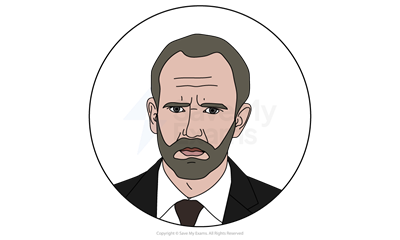

# The Curious Incident of the Dog in the Night-Time: Characters

## The Curious Incident of the Dog in the Night-time: Characters

> **Spec point** — `spcpt_xZDMm4RwzyCvWnZy`

## Characters

Examiners want to see clear evidence of your understanding that characters are constructs, used to represent ideas or a particular group in society. In this way, their function is, through their development or lack thereof, to convey themes. In The Curious Incident of the Dog in the Night-time, characters symbolise various ideas prevalent in modern society, and characters’ responses and interactions reflect certain debates. Therefore, it is useful to consider the way characters generally interact, and how each compares and contrasts with other characters.

Below you will find the profiles of:

**Main characters**

- Christopher Boone
- Ed Boone
- Judy Boone
- Siobhan

**Other characters**

- Mrs Eileen Shears
- Mr Roger Shears
- Mrs Alexander

## The Curious Incident of the Dog in the Night-time: Characters: Christopher Boone

> **Spec point** — `spcpt_9X6bR3hHTRmdqbtF`

## Christopher Boone

*Christopher Boone*

- Christopher John Francis Boone, the **protagonist**, represents a teenager with autism spectrum disorder
- His perspectives on the world around him are presented in a number of ways: the narration of his book, **monologue**, conversations and interactions with other characters
- The many challenges he faces are not only a result of his **autism spectrum disorder** but also his family circumstances, and this means he must face the unknown alone:

  - Nevertheless, his teacher, Siobhan, guides and reassures him on his journey
  - In this way, he proves his resilience and determination as the play progresses
  - Through this development, he challenges victimhood by becoming his own hero
- Christopher’s condition is never identified in the play, however modern audiences may recognise typical symptoms of **Asperger’s syndrome** or autism spectrum disorder:

  - In the opening scene, Christopher’s violent response to the police officer grabbing his arm illustrates that physical touch is a trigger for his anxiety
  - Throughout the play, when other characters ignore Christopher’s condition, he reacts with similar physical aggression
  - He repeatedly highlights his preference for literal communication
- His explanations, delivered through monologue or actions, raise the profile of autism spectrum disorder:

  - His extreme reactions to being touched are presented throughout as he screams, groans, hits and punches people who threaten him
  - He says that he finds people confusing, dishonest and vague
  - The play depicts his distressing experiences at home and in the outside world
  - This emphasises his vulnerability when interacting with individuals who do not understand his condition, such as the police and commuters on the train
- Christopher disrupts the social rules of his community, and this leads to many awkward exchanges and misunderstandings:

  - However, his presentation is sympathetic as he is clever, funny and truthful
- Christopher’s courage and kindness warms audiences to him:

  - He is confused by others’ casual attitude to the truth and to their dismissive reaction to Wellington’s death
  - He puts himself in harm’s way for his pet rat
- As well as this, his unwittingly honest responses create **ironic **humour:

  - He says he cannot tell jokes, yet his blunt comments are witty
  - He is humble, suggesting that he is not truthful because he is a good person but that, instead, it is because he is simply unable to “tell lies”
- The play emphasises Christopher’s clear advantages, highlighting his talent for mathematics and deduction, as well as his** **integrity and determination:

  - The **resolution** rewards the protagonist for his desire to find the truth and for his confidence to assert himself in such challenging circumstances

## The Curious Incident of the Dog in the Night-time: Characters: Ed Boone

> **Spec point** — `spcpt_n274rFRmYVRFKnz4`

## Ed Boone

*Ed Boone*

- Ed Boone, Christopher’s father, represents a typical working-class man:

  - He is a plumber and repairman and raises Christopher as a single parent
- Initially audiences are told his wife is in hospital and, later, that she has died:

  - This presents him as vulnerable and explains his frequent mood swings
- By the end of part one, though, Ed becomes the play’s **antagonist**:

  - Audiences learn that he has lied to his son, that Christopher’s mother is not dead, and that it is he who is responsible for killing Wellington
  - Christopher’s dismay at learning his father is a “murderer” and a liar forces him to go on his dangerous journey to London to live with his mother
- The complexities in Ed’s characterisation convey the damaging results of isolation and emotional stress, and depict the circumstances of abusive relationships:

  - Ed explains his violent temper, admitting to Christopher that he sees a “red mist” sometimes and tries very hard to control it
  - Christopher appears to accept his parent’s frustrated aggression
  - He explains to Siobhan that his father gets “angry” and grabs him
- Ed’s character functions to convey ideas about the conflicting nature of parenthood:

  - Ed’s protective nature is perceived by Christopher as discouragement at times
  - He describes his heartbreak over the break-up of his marriage, and his wife’s betrayal and abandonment
  - He is flawed and admits that “maybe I don’t tell the truth all the time” and explains, “Life is difficult, you know”
- However, Ed’s intimate bond with his son makes him a sympathetic character overall:

  - He understands Christopher’s condition and is patient and caring
  - He fights on his son’s behalf, instructing the school to facilitate his A Level exam and minimising Christopher’s charges when he is arrested
  - He has developed a special gesture to show affection that does not threaten Christopher (they touch fingers)
  - He works patiently to rebuild his relationship with Christopher
  - He apologises for his mistakes, buys Christopher a dog and plants vegetables with him to earn Christopher’s trust

## The Curious Incident of the Dog in the Night-time: Characters: Judy Boone

> **Spec point** — `spcpt_WmZcTnd744fTVBww`

## Judy Boone

*Judy Boone*

- Judy Boone, Christopher’s mother, is **estranged** from her family for much of the play, but her letters to Christopher become the source of the play’s conflict:

  - Initially, Ed tells Christopher she has died of a heart attack
  - Her surprise appearance in the play is shocking and creates tension
- Arguably, the play’s structure prompts audiences to judge her character as weak for abandoning Ed and Christopher:

  - At the end of part one, Ed tells Christopher that she is alive and left the family to be with their neighbour, Mr Shears, presenting her as deceitful and immoral
- However, the discovery of Judy’s hidden letters shifts Christopher’s (and the audience’s) perceptions and, in this way, the play challenges prejudice and promotes honesty:

  - The letters detail Judy’s love for her son and her insecurities as a mother, presenting her as vulnerable and flawed, yet caring
  - It becomes clear that her actions are a result of pressures dealing with her husband after the death of her mother, and Christopher’s condition
- Her** humility** and remorse present her sympathetically:

  - Her letter explains that she believes Christopher and his father are better off without her
  - She explains that she moved to London because she believed Christopher was “much calmer” with his father
  - Perhaps this could present her actions as** self-sacrificing**
  - This may be corroborated by the welcoming response she has to Christopher’s arrival at her house
- Judy’s development as a mother is portrayed by the play’s resolution, conveying ideas about forgiveness and understanding:

  - She leaves Roger and her home in London when Christopher returns to her life
  - Back in Swindon she makes attempts to rebuild a strong family unit with Ed

## The Curious Incident of the Dog in the Night-time: Characters: Siobhan

> **Spec point** — `spcpt_r96zrqwWvQvtTZgK`

## Siobhan

*Siobhan*

- Siobhan is Christopher’s teacher and mentor and she understands his condition well
- Siobhan functions as another way to present Christopher’s perspective and, thus, to raise the profile of autism spectrum disorder:

  - As she reads aloud from his book (which she has encouraged Christopher to write) her character blends with Christopher’s own thoughts and words
  - At other times, she appears in scenes at school, where she reassures him and offers advice
- She represents a source of invaluable assistance to Christopher:

  - The** **coping strategies she has taught him help him successfully manage his challenging journey to London
  - For example, she advises him to walk “Left right left right” and to count his steps
  - She encourages him with his A Level examination

> **Exam Hint**
> In the exam, the idea of character as a conscious construct should be evident throughout your response. You should demonstrate a firm understanding that Stephens has deliberately created these characters to perform certain functions within his play.
> 
> For instance, you could consider why the character of Judy Boone is presented in the way that she is. At first, we only learn about her through fragmented conversations, memories and other characters’ lies. Try to explore reasons why she may have been presented this way.

## The Curious Incident of the Dog in the Night-time: Characters: Minor characters

> **Spec point** — `spcpt_xJCfvY2jPMZs8r2X`

## Minor characters

*Eileen Shears*

**Mrs Eileen Shears **

- Mrs Shears opens the play with strong curses as she expresses her shock at Christopher, who is standing "frozen" over her dead dog, Wellington
- In this scene, Mrs Shears is introduced as unhelpful when the police officer arrives, appearing either reluctant to support Christopher or unaware of his condition
- However, audiences learn that Mrs Shears has been helpful to the family, especially Ed:

  - Christopher describes her as a friend and Ed relates how she helped him “through a difficult time”
- An argument between Mrs Shears and Ed is the **catalyst** for the play’s action
- As a result of Ed’s frustrations with Mrs Shears, he kills her dog and this begins the mystery that Christopher needs to resolve

**Mr Roger Shears**

*Roger Shears*

- Roger Shears, the estranged husband of Mrs Shears, is the cause of much conflict in the play and functions as a barrier between Christopher and his parents
- Audiences are prompted to dislike him when Christopher judges him as the “prime suspect” in Wellington’s murder:

  - He is the only person Christopher knows who actively dislikes Mrs Shears
- There is a great deal of suspicion created around his character when Ed instructs Christopher to never mention Mr Shears’ name in his house as he is “evil”:

  - Roger is presented as a source of pressure on the family:
  - He is portrayed as ignorant and mean-spirited in interactions with Christopher
  - He sarcastically (and drunkenly) says “You think you're so clever don't you?”
  - He actively works against Christopher and Judy’s reunion, yet** **ironically asks Christopher, “Don't you ever, ever think about other people for one second, eh?”
  - At the end, he throws Judy’s possessions outside their new house in Swindon

**Mrs Alexander **

*Mrs Alexander*

- Mrs Alexander is an elderly woman who lives on Christopher’s street
- She is presented as kind and sympathetic:

  - She cares for her dog and offers Christopher help and comfort
- While Christopher describes her as a “stranger”, she is the only person on his street to show an interest in Christopher’s concerns
- Her knowledge of events in the neighbourhood is key to Christopher’s development
- Arguably, Mrs Alexander’s honesty with Christopher can be seen as significant:

  - When she tells him about Judy’s relationship with Mr Shears, Christopher is prompted to discover more about his mother, and is grateful for the truth
