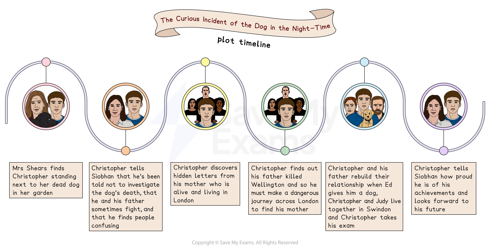

# The Curious Incident of the Dog in the Night-time: Plot Summary

## The Curious Incident of the Dog in the Night-time: Plot summary

> **Spec point** — `spcpt_ZnmjZ6ddfmM2f64K`

## Plot Summary

One of the most helpful things you can do in preparation for the exam is to “know” the plot of The Curious Incident of the Dog in the Night-time thoroughly. This way you can track the way themes are presented, or how characters develop. Having an in-depth knowledge and understanding of the play will help you to understand how dramatic methods and theatrical techniques have been used to convey key ideas.

Below you will find:

- plot storyboard
- a general overview of the whole play
- detailed summaries by act

## The Curious Incident of the Dog in the Night-time: Plot storyboard

> **Spec point** — `spcpt_tX9k7262V2DjkKqm`

## Plot Storyboard

*Plot storyboard*

## The Curious Incident of the Dog in the Night-time: Overview

> **Spec point** — `spcpt_PZ9wW6fzbhtByZNg`

## Overview

The Curious Incident of the Dog in the Night-time, adapted from Mark Haddon’s novel into a play by Simon Stephens in 2012, is considered a **Bildungsroman**. Fifteen-year-old Christopher Boone’s life-changing experiences are presented through** **the narration of his book, read by his teacher while events are acted out on stage. Settings shift constantly to reflect the protagonist’s turbulent emotional and physical journey.

The play opens in a garden at night-time. Christopher stands over his neighbour’s dead dog, Wellington, who has been stabbed with a pitchfork. Against his father’s instructions, Christopher decides to solve the mystery of who killed Wellington. When questioning his neighbours, Christopher is given confusing information by Mrs Alexander. Back home, he finds hidden letters from his mother, Judy, who he believed was dead, and learns that Judy is in London with their old neighbour, Mr Shears. When confronted, his father, Ed, admits that, after arguing with Mrs Shears (with whom he had become close), he killed Wellington in a rage.

Christopher boards a train to live with his mother. But the journey is overwhelming: Siobhan’s reading details how the lights, noise and crowds lead to anxiety attacks on Christopher’s way to London. His **autism spectrum disorder** is not identified in the play, and thus draws attention to the ignorance surrounding the condition.

Christopher’s arrival causes arguments between Judy and Mr Shears, and, as he cannot do his A Level mathematics exam in London, Christopher insists he and his mother return to Swindon.

At home, Judy and Ed apologise for their mistakes and Christopher takes his examination. The play ends as Christopher receives an A-star grade and informs the audience he is capable of anything.

> **Exam Hint**
> Knowing the plot of the play well is important, but it is equally important to pay attention to the setting changes that Stephens uses to convey the dramatic developments of the story. These give extra information about the action and the characters, which will help you to develop your own insights and interpretations about the play.

## The Curious Incident of the Dog in the Night-time: Scene-by-scene plot summary

> **Spec point** — `spcpt_v2Rxkx2fRY8znsfR`

## Scene-By-Scene Plot Summary

**Part I Scenes 1–11**

- The play opens in a garden where Christopher stands over a dog that has been stabbed by a pitchfork (the dog belongs to his neighbour, Mrs Shears)
- A policeman arrives and questions Christopher: the officer touches Christopher’s arm and Christopher explodes with anger and hits the officer
- Siobhan reads from Christopher’s book: he explains his struggle to understand people
- Christopher is taken to the police station where his father Ed persuades the policeman to give Christopher a caution rather than charge him with assault
- At school, Christopher discusses the challenges of a **metaphor** with his teacher, Siobhan
- Later, alone in his room, he is dismayed at his father’s casual attitude to the dog’s death
- Siobhan reads about the time when Ed told Christopher his mother was in hospital
- At school, Christopher discusses Wellington’s murder with Siobhan
- Later, at home, Christopher’s father says his mother has had a heart-attack and died:

  - Christopher does not react and Ed is confused
- On the street outside his neighbour’s house, Christopher tells Mrs Shears he did not kill her dog and that he wants to investigate the murder, but she sends him away
- At school the next day, Christopher tries to talks to a priest about Wellington

**Scenes 12–27**

- On the street, Christopher questions each of his neighbours
- At Mrs Alexander’s house she offers him cookies but takes so long and he runs away
- At school Christopher tells his teacher he suspects Mr Shears as the dog killer
- Christopher’s father arrives and insists Christopher takes the A Level mathematics exam
- At home, Christopher mentions his suspicions to his father, who instructs him to never mention Mr Shears’s name, and not to investigate Wellington’s death
- At school, Christopher is advised by his teacher to let the mystery go and obey his father
- Christopher visits Mrs Alexander again and she says she has something to tell him
- At the park, Mrs Alexander tells Christopher that his mother had an affair with Mr Shears
- At school, Christopher discusses his concerns with Siobhan and remembers his mother
- Meanwhile, his father Ed has found his secret book at home
- Christopher remembers a holiday at the beach, where his mother told him of her dreams
- When Christopher gets home, he and his father have a physical fight over the book:

  - While Christopher has an anxiety attack, Siobhan simultaneously reads out the moment Christopher found hidden letters from his mother in his father’s room
  - Siobhan reads out the letter Christopher received from his mother Judy, in which she explains why she left to be with Mr Shears, believing she was a bad mother
- Christopher has a panic attack and his father comes in to comfort him
- However Christopher learns that his father killed the dog in a fit of rage after an argument with Mrs Shears, with whom he had formed a close relationship
- Christopher tells Siobhan that he has to leave the house and believes his father is a murderer (these are presented as his thoughts)
- He visits Mrs Alexander, who invites him to stay, but Christopher leaves

**Part 2 Scenes 28–49**

- At school, Christopher and Siobhan discuss his book and how it could become a play
- Christopher visits Mrs Alexander and asks if she can take care of his pet rat while he goes to London, but Mrs Alexander goes inside to call his father and Christopher leaves
- Back home, Christopher finds his father’s credit card and decides to take it
- In the town centre he experiences difficulties when he asks the way to Swindon station
- He finds his way nonetheless but, on the platform, a police officer questions Christopher and says he must contact Christopher’s father
- Dreams and voices in his head reflect Christopher’s distractions as noise and conversations of commuters on the train resound around him
- On the train, the officer tries to help but touches Christopher, which causes an anxiety attack and, unable to manage his nervousness, he climbs into a luggage rack
- The frustrated policeman leaves and other passengers try to help Christopher or ignore him out of fear
- When the train is empty, Christopher disembarks and negotiates his exit from the station by remembering **coping techniques** Siobhan has taught him
- On the** **London Underground, Christopher has stressful interactions with passengers as they misunderstand his condition
- Christopher meets his mother and Roger Shears outside her house:

  - Christopher explains that he wants to live with Judy as his father killed Wellington
- At Judy’s house, a policeman arrives and questions him, and Christopher tells him that he wants to stay with his mother
- In the middle of the night, Christopher hears arguing in the corridor: Roger and Judy argue about him
- Ed, his father, arrives and tries to talk to Christopher in his room:

  - Christopher points his pocket knife at Ed and so the policeman makes Ed leave
- The next morning, Judy tells Christopher he cannot take his maths A Level exam there:

  - Distressed by this, he asks if they can return to Swindon (but not to his father)
- That night, unable to sleep, Christopher goes outside onto the street:

  - Siobhan talks with him about the night sky, and this calms him
  - Judy comes outside and tells Christopher to come back in and sleep
- On Hampstead Heath, Christopher and his mother reconnect
- Back at Judy’s home, Roger attempts to bond with Christopher and becomes frustrated
- Christopher and Roger fight, and Judy apologises to Christopher:

  - Meanwhile, Christopher packs his bags and says he has to return to Swindon
- Judy tells him to be quiet and get into the car and they leave together

**Scenes 50–57**

- Back in Swindon, Judy takes Christopher back to his father’s house and argues with Ed:

  - In the foreground, Christopher is anxious, struggling to cope
  - Judy tells Christopher he must take his exam next year but he rejects this
- The next day, on the way to school to arrange the exam, Judy is insulted by Mrs Shears
- In the exam room, Christopher tells Siobhan he is nervous and tired, unprepared for his exam, but Siobhan reassures Christopher and helps him through the exam paper
- Back home, Ed tells Christopher he is proud of him and on a supervised visit, gives Christopher a dog
- Christopher talks to Siobhan about his new life with his mother:

  - He asks if he can live with Siobhan, who explains why this cannot happen
- At school, Siobhan asks about Christopher’s relationship with his father:

  - Christopher says they planted vegetables and that he spent the week with him
  - Siobhan expresses her approval of this development
- Christopher announces that he is capable of anything now he has travelled to London on his own, and that he will succeed in his exam, go to university and get his own flat

**Postscript **

- After the curtain goes down, Christopher returns and thanks the audience for watching
- He offers the solution to the maths question that got him an A star in the exam, providing a light-hearted **finale** to the play
