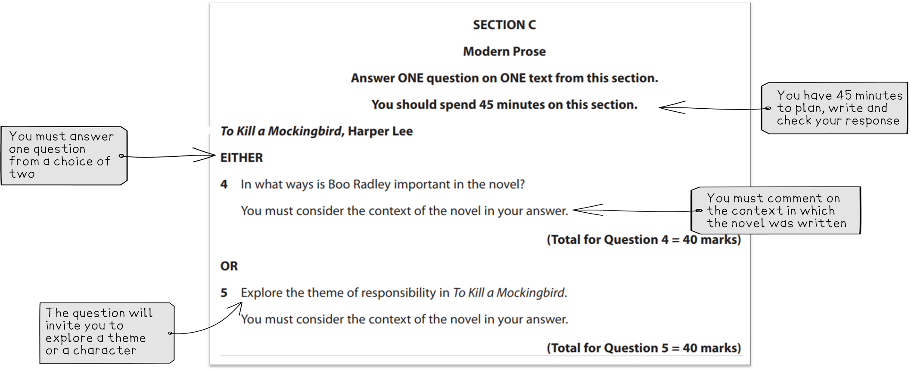

# How to Approach the Modern Prose Question

## Modern Prose: How to approach the Modern Prose question

> **Spec point** — `spcpt_G8v9qcHBpDpqCG6T`

## How to Approach the IGCSE Modern Prose Question

In Component 1, Section C of your Edexcel IGCSE English Literature (4ET1/01), you need to write an essay about a modern prose text.

You have a choice from five prose texts:

| To Kill a Mockingbird by Harper Lee | Of Mice and Men by John Steinbeck |
|---|---|
| The Whale Rider by Witi Ihimaera | The Joy Luck Club by Amy Tan |
| Things Fall Apart by Chinua Achebe |   |

You can approach the question in **Section C **with confidence by learning more about the exam question:

- **Section C: Modern Prose question overview**
- **Understanding the exam question**
- **Understanding the Assessment Objectives**
- **Top grade tips for a Grade 9**

## Modern Prose: Question overview

> **Spec point** — `spcpt_pKJqMfBcbbQnDvSN`

## Section C: Modern Prose question overview

You will have a choice of two questions for each prose text in Section C. Choose the question you feel most confident with.

Here is a summary:

| **Exam question ** | Modern Prose question |
|---|---|
| **Time that you should spend on the question** | 45 minutes |
| **Number of marks** | 40 marks |
| **How much you should write** | Approx. 3-4 paragraphs |

This is a closed-book examination, meaning that you will not have access to a copy of the text in the exam.

## Modern Prose: Understanding the exam question

> **Spec point** — `spcpt_mtd5M4FTJ2zB9GDN`

## Understanding the exam question

Below are some recent examples of exam questions from <u>[Edexcel IGCSE English Literature past papers (4ET1/01)](https://www.savemyexams.com/igcse/english-literature/edexcel/-/pages/past-papers/)</u>. Look at the wording of the questions and the question structure and themes. Can you identify any exam questions that would be challenging for you to answer?

| **IGCSE Edexcel English Literature Modern Prose questions June 2018** |   |   |   |   |
|---|---|---|---|---|
| **To Kill a Mockingbird** | **Of Mice and Men** | **The Whale Rider** | **The Joy Luck Club** | **Things Fall Apart** |
| Explore the character of Scout in To Kill a Mockingbird | In what ways is loneliness an important theme in Of Mice and Men? | Explore the character of Kahu in this novel | In what ways is telling stories important in The Joy Luck Club? | How significant is the theme of fear in Things Fall Apart? |
| **OR** | **OR** | **OR** | **OR** | **OR** |
| How significant is the theme of the mockingbird in this novel? | ‘Crooks is a cruel and aloof character.’ Explore the character of Crooks in this novel | ‘This novel is not only about the survival of some whales.’ How important is the theme of survival in The Whale Rider? | Discuss the relationship between Lindo and Waverly Jong in the novel | Explore the relationship between Okonkwo and his wives |

You can significantly improve your exam performance by paying close attention to the question and understanding it thoroughly.

*Example modern prose questions*

## Modern Prose: Understanding the assessment objectives

> **Spec point** — `spcpt_ZYg4dxVBrZD3Ztqs`

## Understanding the Assessment Objectives

In Section C, there are two assessment objectives which are both equally weighted:

| ** **  **AO1** | Demonstrate a close knowledge and understanding of texts, maintaining a critical style and presenting an informed personal engagement |
|---|---|
| ** **  **AO4** | Show understanding of the relationships between texts and the contexts in which they were written |

AO1 requires you to develop an informed personal response while maintaining a critical style throughout. AO4 requires you to write about the relationship between the text and the context in which it was written.

> **Exam Hint**
> For context, you could comment on a range of elements, including:
> 
> - the author's life
> - the historical setting, time and location of the novel
> - the social and cultural context
> - the literary context
> - how the text has been critically received at different times
> 
> The most successful responses integrate references to context throughout, often using context to support and develop points for AO1.

## Modern Prose: Top tips for a grade 9

> **Spec point** — `spcpt_8ppCqZr54kSp2KJ9`

## Top grade tips for a grade 9

When responding to the Modern Prose question you should remember to:

- Show the examiner your detailed knowledge of the text:

  - But never simply retell events from the narrative
  - Refer to specific examples throughout the novel and not just one section or chapter
- Provide a range of examples from your chosen text:

Remember this is a closed book examination so examples can be specific references to episodes or events or paraphrased quotations

- Keep your textual references succinct:

  - Textual references should be accurate and should fully support the points you make
- Link all contextual points with an example from the novel

  - Often AO3 is naturally illustrated through the actions, events, themes and characters of the novel
  - Integrate contextual comments throughout your response rather than writing separate sentences or bolt-on paragraphs
  - Context should not outweigh evidence from the novel

Find out more about how you can write a [Grade 9 IGCSE exam answer](https://www.savemyexams.com/igcse/english-literature/edexcel/16/revision-notes/3-modern-prose/how-to-answer-the-modern-prose-question/how-to-write-a-grade-9-modern-prose-essay/).
