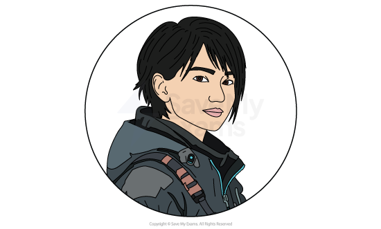
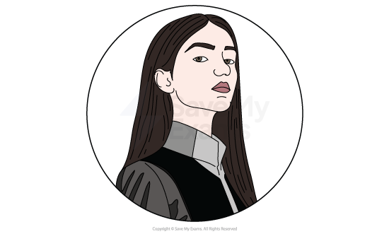
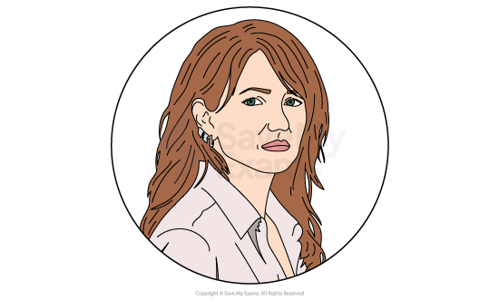
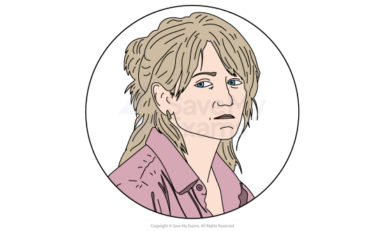
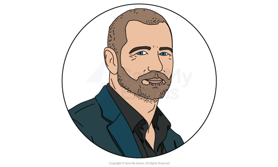
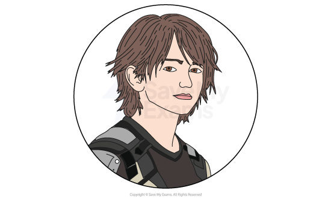
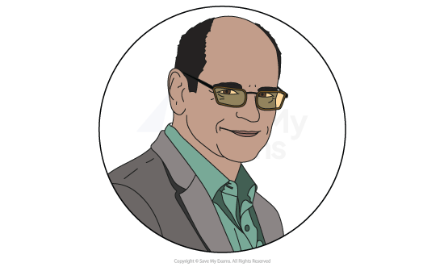

# Klara and the Sun: Characters

## Klara and the Sun: Characters

> **Spec point** — `spcpt_GFGj8gSgyvMqHkxb`

## Klara and the Sun: characters

[Characterisation](https://www.savemyexams.com/glossary/gcse/english-literature/characterisation-definition/) is an integral writer’s method and it is important to use this word in your responses. Characterisation can include:

- How characters are established
- How characters are presented:

  - Their physical appearance
  - Their actions and motives
  - What they say and think
  - How they interact with others
  - What others say and think about them
- How far the characters conform to or subvert stereotypes
- Their relationships to other characters

Below you will find character profiles of:

### Main characters

- Klara
- Josie

### Other characters

- Chrissie
- Helen
- Paul
- Rick
- Henry Capaldi

## Klara and the Sun: Characters: Klara

> **Spec point** — `spcpt_CXWmsg2btS8Bscj2`

## Klara

*Klara*

- Despite being an “Artificial Friend”, Klara is the novel’s *eponymous* central character and narrator
- The reader first meets Klara along with Rosa, another AF, on sale in a city store, with the [symbolical](https://www.savemyexams.com/glossary/gcse/english-language/symbolism-definition/) “Sun” also introduced in the novel’s first paragraph:

  - The “Sun” is capitalised and introduced as a *sentient* entity in the very first paragraph
- As the narrator, Klara offers to the reader a personal insight into people, places and events, and through these experiences the reader witnesses first-hand her growing understanding of human nature:

  - There is a tragic element to these observations, as Klara sees that even AFs mimic human behaviour by behaving in ways that are prejudiced and hierarchical
  - Klara is also guilty of human-like behavior, such as when she consciously defies Manager by not endearing herself to a potential buyer
  - In doing so, however, Klara shows loyalty to Josie, a loyalty that is justified when Josie’s mother returns to the store to buy Klara
- Once living at Josie’s house, Klara finds it hard to adapt but, driven by her loyalty to Josie, is determined to do everything she can to fit in:

  - At the start of Part Two, Klara explains that the kitchen is “especially difficult to navigate”, a [metaphor](https://www.savemyexams.com/glossary/gcse/english-language/metaphor-definition/) for her new existence, while her relationship with Melania Housekeeper is fraught with tension and misunderstanding
  - It is at this point in the novel that the retrospective nature of the narrative perspective becomes apparent:
  
    - The older Klara realises, with the benefit of hindsight, that she was unable to understand Melania Housekeeper’s “larger fears” about Josie’s health at the time immediately after her arrival
- As a solar-powered robot, Klara depends on the sun for “nourishment” and naïvely assumes that the sun also offers healing properties to humans:

  - This notion becomes an obsession for Klara, with the sun becoming a **symbol** of hope and faith in the novel, most notably explored in her visits to Mr McBain’s barn
  - She later attributes the power of the sun to the recovery of Josie and in her transition “from a child into an adult”
- Klara’s love for Josie is unconditional, with the depths of this love tragically explored in Part Four:

  - She agrees to “continue” Josie in the event of the child’s death
  - She then gives up some of her personal P-E-G Nine solution to sabotage the Cootings Machine that she believes is responsible for Josie’s sickness, even though her ability to function could be compromised
- Even after the pessimistic events of Part Four, Klara does not lose hope, and quickly returns to the barn to again request help from the sun, such is her enduring commitment to hope
- At the end of the novel, speaking to Manager, an elderly Klara explains how her observational skills had led her to realise the depth of human compassion and love

## Klara and the Sun: Characters: Josie

> **Spec point** — `spcpt_mGMgZgCZ3kjJKf32`

## Josie

*Josie*

- Josie is introduced to the story as a frail, sickly 14-year-old girl who communicates with Klara through the window of the city store
- Klara’s loyalty towards Josie is partly driven by the girl defying the words of Manager:

  - Manager lectures Klara about the whims of children, explaining that “children make promises” but the “child never comes back”
  - Josie, however, does come back, making it clear to Klara that she is specially chosen, even when Josie could have selected a newer model of AF instead
  - In a more sinister turn, it is at the point of purchase that Ishiguro [foreshadows](https://www.savemyexams.com/glossary/gcse/english-language/foreshadowing-definition/) the motivation of Josie’s mother who asks Klara to copy her “daughter’s walk”
  - It is Klara’s success in mimicking the walk that ultimately persuades Chrissie to make the purchase.

- Despite her poor health, Josie is “lifted”, having undergone a procedure of genetic enhancement and consequently elevating her in social status:

  - Josie thus becomes the main character through which the theme of status is explored, with her contrast to Rick used to show how her status offers financial, social and educational privileges
  - However, it can be assumed that Josie’s poor health can be blamed on genetic enhancement, offering an ironic twist to a treatment that is supposed to better a human

- Her closest friend, Rick, is not “lifted”, but the pair have an unspecified “plan” to spend their lives together:

  - The relationship, however, is never straightforward, starting from Rick’s first impressions when he has to be persuaded to attend Josie’s “interaction meeting”
  - The “bubble game” they play later starts innocently, as a way to communicate deeper without verbal conversation, but soon becomes a source of stress that fractures their relationship for a time

- The extent of Josie’s illness is revealed in Part Four when she visits the city for a further sitting with Henry Capaldi, who she assumes is an artist creating a portrait of her:

  - Capaldi’s work is actually a lifelike version of Josie
  - Unbeknown to Josie, Chrissie tells Klara that her purpose is actually to “continue” Josie in a seamlessly identical way if and when she dies.
  - Josie has no apparent knowledge of the plans her family has for her, and even Klara does not share these details
- When Josie becomes gravely ill, potentially close to death, in Part Five, Klara returns to the barn, telling the sun that she would have “willingly given more” fluid if only the sun offered “special help” to Josie:

  - This prayer-like plea again emphasises Klara’s devotion to Josie
  - The prayer is seemingly answered when, after the bedroom curtains are opened, the sun’s rays pour down on Josie and soon after she becomes visibly better
- As Josie recovers from her illness, she leaves behind Klara and Rick:

  - Klara is nonetheless happy for Josie, saying that the mood in the house was both “tension and excitement”
  - Their parting is “brief”, highlighting Josie’s adult maturity, with her offering an embrace to Klara and the simple words, “You be good now”
- At the end of the novel, Josie is used as a symbol for human compassion:

  - The novel essentially revolves around a group of characters who care very deeply for Josie
  - Klara observes that that could lead to the assumption that there was something “very special” within Josie
  - Instead, Klara understands that the “special” quality was contained “inside those who loved her”, highlighting how it is a unique part of human nature to love others
  - In doing so, Ishiguro rejects the functional ideas of Henry Capaldi that humanity can somehow be replicated by a machine

> **Exam Hint**
> Writers use characters to explore thematic concerns and the development of these themes. For instance, Ishiguro uses the progression of Klara’s character to explore the themes of love and compassion.
> 
> In writing about Klara or Josie, you should consider the impact the characters have on each other. It is the interactions of these characters as a pair that help shape thematic concerns such as love, loyalty and hope, and explore what it is to be human. For Klara in particular, her thoughts and actions are motivated by what she believes is best for Josie’s welfare.
> 
> You should also consider how other characters’ functions are important in impacting and developing your understanding of Klara and Josie.

## Klara and the Sun: Characters: Other Characters

> **Spec point** — `spcpt_GjGfTrczDJsKBvZ4`

## Other Characters

### Chrissie

*Chrissie*

- Chrissie is most frequently referred to as the “Mother”
- Throughout the novel, Chrissie has a troubled relationship with her daughter, largely stemming from her fear of losing Josie following the death of her other child, Sal:

  - Despite already having lost her eldest daughter to the genetic “lifting” process, she decides to take the gamble again with Josie
  - As a result of this decision, Josie suffers from the same life-threatening illness, which forms the central crisis of the plot
- It is Chrissie who is persuaded by Henry Capaldi to create an artificial Josie:

  - She is terrified of the loneliness and grief that would follow losing a second child
- Having spent much of the novel being dispassionate to Klara, she saves the robot at the end of the story by refusing to let Mr Capaldi experiment on her:

  - She provides a thematic *foil* to Klara, who represents pure, unwavering hope and faith, whereas Chrissie represents the burden of grief and fear of loneliness

### Helen

*Helen*

- Helen is the second major maternal figure in the novel, contrasting with Chrissie due to her unlifted son, Rick:

  - Despite their different circumstances, she shares a close, supportive friendship with Chrissie
  - While Chrissie made a deliberate choice to “lift” Josie despite the risks, Helen admits she simply failed to make a choice at all
  - This is a decision she regrets
- Unlike Chrissie, Helen treats Klara with warmth and compassion, and asks if she can tutor Rick
- However, when faced with the likelihood that Rick will not succeed in gaining a college place, Helen is forced to beg a former lover for a favour, which ultimately ends in humiliating failure
- Helen’s character highlights the brutal social divide of the novel’s *dystopian* society:

  - While Chrissie represents the extreme lengths a parent will go to to ensure a child’s success, Helen represents the paralysing guilt of parental failure, forcing Rick to navigate a prejudiced world relying entirely on his own talent

### Paul

*Paul*

- Josie’s father, Paul, appears later in the novel, and is an [antagonist](https://www.savemyexams.com/glossary/gcse/english-language/antagonist-definition/) to his ex-wife
- Formerly an expert engineer, Paul was “substituted”, meaning he lost his career to technological or AI advancements
- He notably nicknames Josie “animal” at the point in the novel at which her replacement with an artificial copy is being considered:

  - He displays scepticism towards Mr Capaldi’s plan and directly challenges the coldness of the society he finds himself in, questioning whether science can truly map the “human heart”
  - However, he confesses to Klara that his hatred for Capaldi stems from his fear that the scientist might actually be right
- Soon after, he plays a major role in Klara’s decision to sacrifice some of her precious P-E-G Nine solution, and respects Klara enough to support her notions even if he does not truly understand her motivation
- Paul provides a different perspective on the **dystopian** society of the novel:

  - He argues that being substituted was the best thing that ever happened to him, allowing him to finally realise what is really important

### Rick

*Rick*

- Despite being an unlifted character, Rick is inventive and intelligent, epitomised by his first appearance in the novel as he flies a series of drones or “machine birds”
- He lives with his mother and feels a deep responsibility to protect her, which initially makes him hesitant to leave her to pursue his own future
- He and Josie have a special relationship and have an unspecified “plan” to be together
- Rick’s ambition of going to college is unfulfilled despite his mother’s desperate attempts:

  - His future relies on getting into Atlas Brookings, the only “proper college” willing to accept a tiny percentage of unlifted students
- Through Rick, Ishiguro exposes the harsh segregation and prejudice of the novel’s dystopian society:

  - Because he is “unlifted”, he is treated as an outsider
  - However, he displays bravery and ethics: he is the only one who stands up to the hostile lifted boy Danny
- It is his enduring bond with Josie that confirms to Klara that she needs to save Josie’s life:

  - Because Rick confirms that their love is genuine and forever, Klara is able to use their pure, lasting love as her bargaining chip, asking the Sun to heal Josie so the young couple can share a future
- Ultimately, even though Josie eventually makes it clear that their childhood plan to stay together will not happen, Rick reassures Klara that he and Josie truly loved each other

### Henry Capaldi

*Henry Capaldi*

- Mr Capaldi is employed by Chrissie to make a “portrait” of Josie that turns out to be an artificial copy of her
- Ishiguro uses the character to raise ethical questions about the pursuit of robotic forms to duplicate humans:

  - Capaldi serves as the narrative’s representative of cold, calculated science, acting as the ideological opposite of Paul
  - He insists that humans must abandon their “sentimental” feelings and accept that a person’s entire essence can be mapped, learned and transferred into a machine
- At the end of the novel, Klara determines that Mr Capaldi was “wrong” about believing that there was “nothing special inside Josie that couldn’t be continued”:

  - In this observation, it is clear that Klara has a better understanding of human nature than humans who seek to replicate it in the name of science
