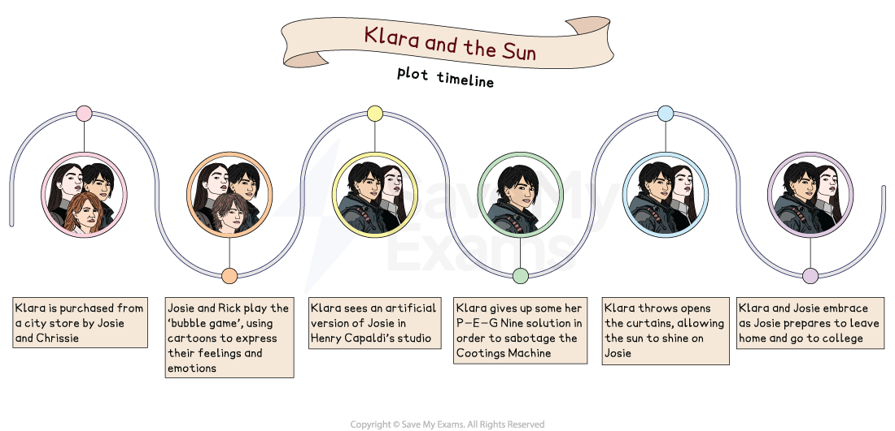

# Klara and the Sun: Plot Summary

## Klara and the Sun: Plot Summary

> **Spec point** — `spcpt_9XkhfcRn2KJNGPfg`

## Klara and the Sun: plot summary

Although examiners do not reward you for “rewriting” the plot of Kazuo Ishiguro’s Klara and the Sun, you will need to know it thoroughly so that you can reference events. It is also best to understand the order and key plot points to appreciate the overall structure of the novel, and how it conveys Ishiguro’s ideas.

## Klara and the Sun: plot storyboard

> **Spec point** — `spcpt_kj6Hdg7rVbYZxqS8`

## Klara and the Sun: plot storyboard

*Klara and the Sun plot timeline*

## Klara and the Sun: overview

> **Spec point** — `spcpt_8dZxShjRqsTTGZpD`

## Klara and the Sun: overview

Klara and the Sun is the story of the relationship between Klara, an “Artificial Friend”, and Josie, her child owner. Throughout much of the novel, Josie is unwell and Ishiguro uses the everlasting symbol of the sun and the “nourishment” it offers to explore ideas about hope, loyalty and love, and what it means to be human.

After observing the outside world from a store window, Klara is purchased to be a companion to Josie, a teenager suffering from a life-threatening illness caused by a genetic “lifting” process meant to secure her social and academic future.

Klara believes her purpose is to literally be a friend to Josie, a task she committedly devotes herself to, even when Josie rejects her. However, it is later revealed that Chrissie, Josie’s mother, wants Klara to replace Josie in the event of her daughter dying. Ever loyal, Klara agrees to do this, as well as seeking other ways to save Josie.

Josie eventually recovers from her illness, with Klara attributing this recovery to her faith in the healing power of the sun. The novel closes on a reflection about the power of human love, with Klara awed by the intensity of those who “loved” Josie.

## Klara and the Sun: chapter-by-chapter plot summary

> **Spec point** — `spcpt_75Xvt6dtwr9p2TzV`

## Klara and the Sun: plot summary

### Part One

- The story opens with a description of how the narrator (Klara) and Rosa, two “Artificial Friends” (AFs) are on display in a store
- From her position, Klara can see outside into a city street and describes the events that occur from her viewpoint, notably the movement of the Sun
- Klara explains that there are other AFs for sale in the store:

  - Klara, Rosa and Rex are identified as “B2, third and fourth series” models
  - Later in the chapter, unnamed “B3” models are introduced
- Klara and Rosa are moved to the window of the store, enabling Klara to see and describe more of the events that take place outside
- Josie, Klara’s future owner, is introduced as a weak, sickly 14-year-old girl who is immediately fascinated by Klara, telling the AF that her bedroom has a view of the sunset
- Between Josie’s visits to the store, Klara continues to observe events outside:

  - She sees AFs walking with children, but Klara realises that not all AFs are loved by their owners as some are made to walk behind the humans
  - Klara then witnesses a fight between two taxi drivers and an emotional reunion between Coffee Cup Lady and Raincoat Man
  - A “Cootings Machine” — the name Klara gives to a construction vehicle — terrifies her, temporarily blocking the sun and spewing “Pollution”
  - On another occasion, Klara believes Beggar Man and his dog to be dead, and is surprised the next day when the pair are alive and concludes the Sun returned them to life
- Before Josie returns to acquire Klara, a girl with “short spiky hair” takes an interest in her:

  - Klara is deliberately distant, causing the girl to buy a B3 boy instead and leading to a reprimand from Manager who warns her that children, like Josie, break promises
- A succession of sales follow: first Rosa, then two B3s, and Rex, and more B3s arrive in store, with Klara noticing that the newer models consciously separate themselves from the “older AFs”
- Josie returns to the store for a final time, with Manager telling Josie and her mother that Klara has a “quite amazing” ability for observation and empathy, and the mother agrees to buy the AF

### Part Two

- The action moves to Josie’s home, while a new character, Melania Housekeeper, is also introduced
- From the bedroom window, Klara notices a building, which Josie names as “Mr McBain’s barn”:

  - This offers the opportunity to introduce a further new character, Rick, who Josie describes as her “best friend”
- After a tutorial, Klara goes outside for the first time, with Josie taking her to meet Rick:

  - The reader first meets Rick on a “green mound” flying “machine birds” and he questions Josie’s decision to get an AF
  - She reminds Rick that he promised to attend her upcoming “interaction meeting”
- Klara observes the behaviour of the other young people at Josie’s “interaction meeting”, noting how Josie “changes”:

  - She seems to feel intimidated by the directness of the guests, notably Scrub who encourages Danny to throw Klara across the room to test her coordination
- At the meeting, Rick explicitly distances himself from the others, describing them as “lifted kids”
- After the others go outside, Klara pledges to help Rick prevent Josie becoming “one of them”
- Josie and her Mother, along with Klara, plan to visit Morgan’s Falls, but when Mother decides that Josie is too sick to travel, Mother and Klara go together
- At Morgan’s Falls, Mother asks Klara to imitate Josie, and Klara — pretending to be Josie — reassures Mother that Josie will get better

### Part Three

- Josie becomes unwell and stays in her bedroom, where she is attended by Klara and visited by Rick
- Josie and Rick play the “bubble game”, with Rick filling in blank speech bubbles drawn by Josie to represent social situations, but the game becomes increasingly fraught and the pair fall out when Rick mocks Josie’s sickness after Josie uses her drawings and comments to insult Rick’s mother
- In the meantime, Klara continues to look to the sun to offer “nourishment” to the ailing Josie
- As Josie’s mood mellows, she creates a “special gift” of a drawing for Rick, which Klara volunteers to deliver
- At Rick’s house, Klara meets his mother, Helen, and she explains her ambition for Rick to attend Atlas Brookings college and asks if Klara might consider tutoring her son, as well as to use her influence over Josie to pressure Rick into actually trying to succeed
- Thereafter, Klara visits Mr McBain’s barn, realising that the sun’s resting place could not be in the building, but she nonetheless enters — which reminds her of the store — as sunset occurs
- In the barn, she offers a prayer-like plea that the sun “make Josie better”
- As the section ends and in the run-up to a visit to the city, Klara describes a disturbing scene when Josie frantically calls out for her mother in the middle of the night

### Part Four

- Josie, Chrissie and Klara, along with Rick and Helen, visit the city where they meet up with Josie’s father (Paul):

  - The purpose of Chrissie’s visit is to see Henry Capaldi, so Josie can again sit for her “portrait”
  - Meanwhile, Helen has arranged to meet Vance, a former lover and senior figure at Atlas Brookings, to see if he might look favourably on Rick’s college application
- With the family at Mr Capaldi’s studio, Klara is asked to do a questionnaire that tests her knowledge on Josie, and thereafter discovers the outcome of Mr Capaldi’s work so far: an artificial version of Josie
- Later, Klara is told the truth by Mr Capaldi: in the event of Josie’s death, Klara will be asked to “inhabit” the artificial version she saw in the studio
- Paul challenges Klara about the complexity of the human heart, but also fears that Mr Capaldi’s science is actually correct
- Klara, meanwhile, clings to a different hope: that the destruction of the Cootings Machine, introduced in Part One, will help Josie get better
- Together, Paul and Klara find the machine, and Klara agrees to use some of the P-E-G Nine solution contained in her own machinery to sabotage the industrial unit, even though Paul warns that this action could have potential side effects
- Klara tells Rick that her actions will solve the problem of Josie’s ill-health — only to be confronted with the realisation at the end of Part Four that there are multiple Cootings Machines
- In the meantime, Helen, Rick and Vance meet at a diner, with Helen begging Vance to consider Rick for a college place:

  - Vance expresses his anger at the way Helen has historically treated him and leaves the diner promising nothing
- The part ends with Klara beginning to lose hope, understanding that there are numerous causes of “Pollution” and the promise the Sun apparently made to her in Mr McBain’s barn may not be kept

### Part Five

- Josie becomes unwell again on her return home and, in an attempt to help her, Klara asks Rick to take her again to the barn
- At the barn, Klara apologises to the Sun and asks for it to look kindly on Josie, while stressing the love that exists between Josie and Rick
- With Josie gravely ill, Chrissie confronts Rick, asking him if he now feels like a “winner” because he did not undergo genetic editing like Josie
- Rick responds by telling Chrissie that Josie did not regret “being lifted” and that Chrissie was the “best mother she could have”
- Moments later, Klara reacts to the emergence of the sun:

  - The curtains are pulled back to allow the light to fall on Josie, with the “nourishment” visibly rejuvenating the patient

### Part Six

- Time moves on: Josie gets better and goes to college; she and Rick do not form a romantic attachment, but Klara speculates how they might one day be like Coffee Cup Lady and Raincoat Man
- Mr Capaldi visits, encouraging Chrissie to allow him to experiment on Klara, but she refuses, insisting that Klara is allowed to have “her slow fade”
- After saying goodbye to Josie, Klara meets Manager and tells her that she “could have continued Josie”, but realises that the unique quality of Josie was not within her — it was around her, “inside those who loved her”
