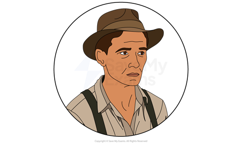
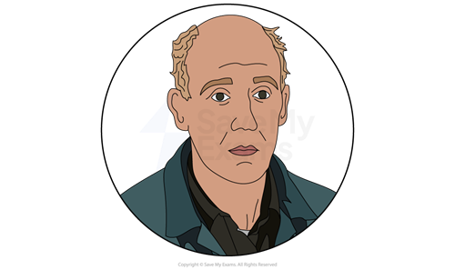
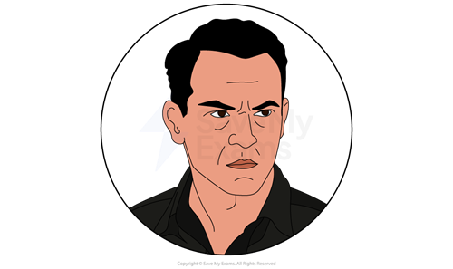
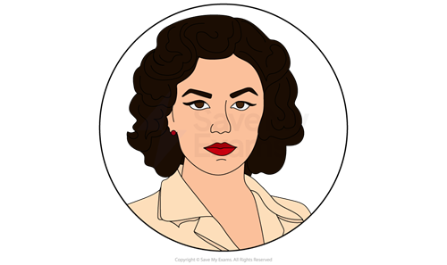
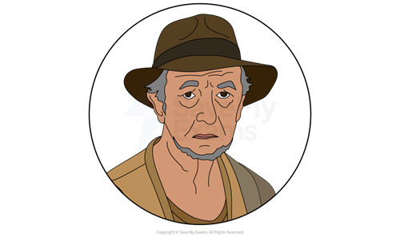
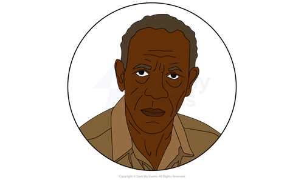
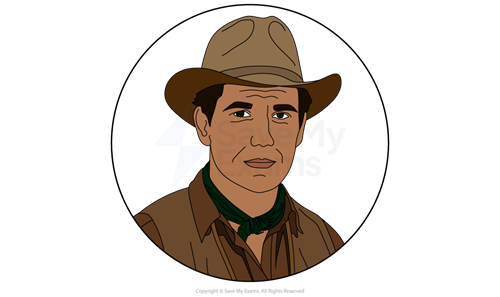

# Of Mice and Men: Characters

## CharactersOf Mice and Men: Characters

> **Spec point** — `spcpt_wsQyWcpr6MzjPgVb`

## Characters

Steinbeck’s characters symbolise ideas and represent elements of society. Therefore, it is important that you consider how Steinbeck portrays characters and how they reflect debates or themes. It is also very useful to explore how and why Steinbeck contrasts characters or shows similarities between them in Of Mice and Men.

Below you will find character profiles of:

**Main characters**

- George Milton
- Lennie Small
- Curley
- Curley’s wife

**Other characters**

- Candy
- Crooks
- Slim

## Of Mice and Men: Characters: George Milton

> **Spec point** — `spcpt_7KdhF9TDrgRMgKDT`

## George Milton

*George Milton*

- George can be considered the **protagonist** of the story and is introduced in the beginning of the novella as he travels to a ranch for work
- He represents an itinerant worker during the **Great Depression**
- His friendship with Lennie and his plan to buy a piece of land sets him apart from the other itinerant workers:

  - He and Lennie are the only characters with surnames
  - The other characters are suspicious of their unusual friendship
  - George repeatedly tells Lennie that they are different to other itinerant workers because they have a “future”
- George is presented sympathetically:

  - He is intelligent, observant and cautious
  - He is the sole care-giver to, and ally of, Lennie Small, his family friend
  - Readers are told he has looked after Lennie since Lennie’s Aunt Clara died
- George’s character represents the idea of responsibility:

  - George’s good intentions are **juxtaposed** with the many challenges he faces
  - George’s sense of accountability and his determination to succeed weigh heavily
  - In this way, Steinbeck questions the **American Dream**
- George’s characterisation throughout the novella illustrates the challenges of individuals who work hard to thrive while facing obstacles outside of their control:

  - He is described as “restless”, worried (he stares “morosely” into the fire), and impatient with Lennie
  - By the end, George realises his plans cannot be realised alongside Lennie
  - Despite earlier hopes, George realises he faces the future alone, like the others
  - In this way, Steinbeck uses his characterisation of George to represent the impossible circumstances facing itinerant workers

## Of Mice and Men: Characters: Lennie Small

> **Spec point** — `spcpt_qsCRt4CVPzG97txD`

## Lennie Small

*Lennie Small*

- Lennie Small is the novella’s other protagonist:

  - However, his learning difficulties and child-like nature mean he is entirely reliant on George
- His character represents the lack of social care in 1930s America:

  - Lennie was born with learning difficulties and was cared for by his Aunt Clara
  - This reinforces Steinbeck’s messages about the importance of communal care
- As an itinerant worker, Lennie’s impairment places him in a vulnerable position:

  - Steinbeck presents him as George’s fierce “pet” when Curley starts a fight:
  
    - Lennie reacts only when George instructs him to retaliate
  - The boss suspects George is exploiting him
  - Lennie’s physical strength is his only advantage on the ranch, but Steinbeck presents this as the main cause of conflict in the novella
- The novella’s poignant depiction of Lennie’s reliance on George is juxtaposed with the suspicion and conflict their friendship creates on the ranch:

  - Perhaps Steinbeck implies vulnerable individuals can become fearful and jealous
- Steinbeck’s use of **animal imagery** suggests that Lennie is unpredictable, instinctive and physically strong:

  - His characterisation can be linked to the book’s title, which relates to a poem (by Robert Burns) that suggests small animals are subject to the invisible yet greater force of humans
  - Lennie’s surname is **ironic**: he is compared to a bear and a horse
  - When Lennie pets a small mouse too hard, and then kills a puppy the same way, Steinbeck shows Lennie’s power and **foreshadows** further tragedy
- Despite his violence, Lennie is a sympathetic character, innocent and naive:

  - He likes caring for small animals and to touch soft things
  - He is upset when George admonishes him and is easily excited
- Lennie’s tragic death at the end of the novella illustrates Steinbeck’s messages about the powerlessness of disadvantaged individuals in harsh conditions

## Of Mice and Men: Characters: Curley

> **Spec point** — `spcpt_m9f9WqzhS6tyN3Xz`

## Curley

*Curley*

- Curley is the boss’s son and thus represents a powerful individual with status and land:

  - Steinbeck may have used his character to depict the result of wealth inequalities during the Great Depression and to represent the land-owning class
- He can be seen as a **foil **character for Slim, the “jerkline skinner”:

  - While Slim appears to bring a sense of calm to the ranch (which gains him respect and trust), the workers call Curley a coward behind his back
  - Equally, Curley’s quick-temper makes the men fear him
- Steinbeck presents Curley as the novella’s **antagonist**:

  - Steinbeck’s characterisation of Curley exemplifies a powerful individual whose insecurity brings conflict and tragedy
- Curley is introduced as aggressive in his stance and actions:

  - He is “pugnacious” (quick to anger), which Steinbeck illustrates when Curley singles out Lennie for his physical strength and size
  - His hands close “into fists” and he moves into a “slight crouch”
  - When Candy explains that Curley is like a “lot of little guys” who hate “big guys”, Steinbeck foreshadows the conflict Curley’s insecurity will bring to the ranch
- Curley attempts to control others with fear and intimidation:

  - He is characterised by his small size and his desperate desire to exert authority
  - He appears to flaunt his position wearing “high-heeled boots”
  - This, and his paranoia over his wife, isolates him from the rest of the ranchers
  - When Curley tells the men he wears one glove to keep his hand smooth for his wife, Steinbeck shows how, instead of earning him respect, this serves as a threat
- Curley’s characterisation can be seen as an illustration of sexism: he attempts to limit his wife’s freedoms and restrict her dreams

## Of Mice and Men: Characters: Curley's wife

> **Spec point** — `spcpt_95DQ6qfYkvjgzDCP`

## Curley’s wife

*Curley’s wife*

- Curley’s wife, the only female on the ranch, represents a **marginalised** and **displaced** woman whose marriage isolates her and, ultimately, leads to her death
- She can be considered one of the least powerful individuals on the ranch:

  - She is not given a name
  - She is ignored by almost all the men on the ranch (except Lennie) as she is seen as a sexual threat
  - Her husband perceives her as a possession and a sexual object
- While the men have the option to work towards their dream, Steinbeck portrays Curley’s wife’s dream as a fantasy:

  - Steinbeck emphasises how she dreamed she could “make something” of herself as a Hollywood filmstar
  - Yet, unlike the other men, Steinbeck presents her situation as hopeless as she is unable to earn money
  - Her limited agency is highlighted when she tells Lennie she married Curley as a way to progress her opportunities, but that Curley “ain’t a nice fella”
- Steinbeck portrays gender attitudes in 1930s America through the men’s reactions:

  - Candy calls her a “tart” and a “tramp”
  - Her sexuality is perceived as a threat to the mens’ jobs
  - She is seen as a temptress and a **femme fatale**, much like the sex-workers in the town where the men spend their money:
  
    - This is highlighted, perhaps, with the **motif **of red clothing
    - Lennie has previously lost a job for touching a girl’s red dress
    - Curley’s wife is described as having red fingernails, lips and shoes
- Steinbeck portrays Curley’s wife as an annoyance to the men:

  - She is introduced as “heavily made-up”, with a “nasal” voice
  - She is perceived as a bad wife, flirtatious and vain
- Her isolation leads her to look for company with the other men, particularly the weaker characters such as Crooks and Lennie:

  - Her bitter threat to Crooks presents her as dangerous because of her marriage
- Steinbeck uses **natural imagery** to depict how Curley’s wife disrupts order on the ranch:

  - When she meets Lennie, the “rectangle of sunshine in the doorway was cut off”
  - Steinbeck mirrors this when she is killed: “the sun went down, and the sun streaks climbed up the wall and fell”

## Of Mice and Men: Characters: Minor characters

> **Spec point** — `spcpt_QjzXYBgJCRkwkqx4`

## Minor characters

**Candy**

*Candy*

- Candy, an old rancher who has lost a hand in an injury, is a “swamper” or cleaner
- His character represents attitudes towards the elderly in 1930s America
- Steinbeck’s characterisation of Candy is sympathetic:

  - His place on the ranch is unstable and is mirrored in the depiction of his old dog
  - The dog is “so God damn old he can't hardly walk” and “damn near blind”
  - Steinbeck’s portrayal of Candy’s dog conveys the hopelessness Candy feels
- Candy’s brief hope that he and George can buy their own piece of land reflects Steinbeck’s ideas about the futility of making plans in 1930s America

**Crooks**

*Crooks*

- Crooks is the “stable-buck”, another character who is marginalised and **disenfranchised**
- Crooks’s name comes from his crooked back, the result of a horse kick
- However, Crooks is included in the novella particularly to explore racism:

  - He is segregated from the other ranchers and lives in the stable with the animals
  - Some of the men on the ranch use racial slurs when they discuss him, especially Candy, the oldest rancher
- Steinbeck highlights prejudice by portraying Crooks as intelligent and disciplined:

  - He is proud of his heritage and nostalgic about his childhood on his father’s chicken ranch where the “white kids” came to play
  - His knowledge of legal rights, and how few he has, makes him angry and “aloof”
- Steinbeck exemplifies how Crooks’s race disempowers him:

  - He is “reduced” to “nothing” by another minority character, Curley’s wife

**Slim **

*Slim *

- Slim is the jerkline skinner on the ranch and functions, mainly, as support to George, who treats Slim as a confidante
- He is calm and liked by the men
- He gives Lennie one of the new puppies and attempts to help Candy
