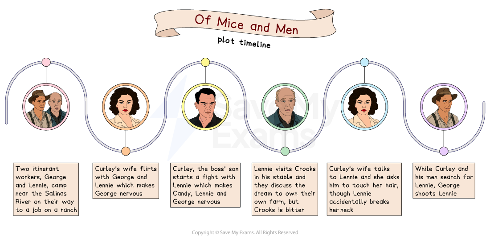

# Of Mice and Men: Plot Summary

## Of Mice and Men: Plot summary

> **Spec point** — `spcpt_YbdRp955M7Fms33j`

## Plot Summary

One of the best things you can do in preparation for the exam is to ensure you have a thorough understanding of the novella’s plot. However, the exam is not asking for a plot summary. Instead, key events in Of Mice and Men should be used to support your ideas.

Below you will find:

- Plot timeline
- An overview of the text
- Detailed summaries by chapter

## Of Mice and Men: Plot timeline

> **Spec point** — `spcpt_5WzxmzCfjRCP9qKy`

## Plot timeline

*Plot timeline*

## Of Mice and Men: Overview

> **Spec point** — `spcpt_78rMPrbfGPxmG7CW`

## Overview

Of Mice and Men begins in a **rural** area near a lake in California. Here, two itinerant workers, George and Lennie, arrive; they have found work on a nearby ranch called Soledad. The narrative begins on a Thursday evening. George and Lennie set up camp and discuss the importance of their next job, and find comfort in their dream to earn enough money to buy their own piece of land. George is responsible for his friend Lennie who has learning difficulties. Readers learn that this has previously caused problems and lost them their jobs.

When the pair arrive on the ranch most of the characters are **displaced**, and all of them are suspicious of one another. Candy, an old man who cleans the living areas, gossips about the other people on the ranch. Curley’s wife arrives looking aimlessly for her husband and George is warned about her flirtatious behaviour. She is seen as a threat to the men as she is Curley’s wife, the boss’s daughter-in-law. Candy also tells George that Crooks, the stable-buck, is segregated** **from the bunk-house (due to his race), but that the boss is fair. Curley arrives in the bunk-house, paranoid about his wife’s whereabouts, and he harasses Lennie. It becomes clear that Lennie’s child-like innocence makes him vulnerable, and consequently places George and their dream at risk.

When Curley starts a fight with Lennie, and Curley’s wife attempts to befriend him, events are taken out of George’s control. Lennie breaks Curley’s hand and, later, murders Curley’s wife by accident, forcing the pair to flee. However, the novella ends in tragedy as George shoots Lennie while reciting the story of their dream.

> **Exam Hint**
> Remember, key events can be used as evidence to support your ideas. The best answers do not provide a “plot summary” but, instead, examine how Steinbeck develops ideas and characters through the plot. For example, you could write, “Steinbeck shows Lennie’s desire to pet soft and vulnerable animals throughout the novella in order to convey ideas about …”

## Of Mice and Men: Chapter-by-chapter plot summary

> **Spec point** — `spcpt_vjWyNv4WM8MYrHNS`

## Chapter-by-Chapter Plot Summary

**Chapter 1**

- The novella opens as George and Lennie, two itinerant workers, are making their way to a ranch in a remote area of California to find work
- They stop near a lake for the night and issues occur:

  - Lennie accidentally kills a mouse he keeps as a pet
  - George is frustrated with Lennie’s impulsive and child-like behaviour
  - He warns Lennie not to speak when they reach the ranch and instructs Lennie to return to this area if he gets into trouble
- As they rest by a fire, George’s nervousness is **juxtaposed** with Lennie’s innocent hope
- George recites the story they have shared many times about a piece of land they will buy when they have earned enough money

**Chapter 2**

- George and Lennie are in trouble with the boss for arriving late
- The boss is immediately suspicious of the men travelling together but George reassures him that Lennie’s strength will make him a good labourer
- Candy, an old man, mops the floor of the bunk-house and gossips to George about the others on the ranch, especially Curley (who he says is insecure) and his wife (who is flirtatious)
- When Curley, the boss’s son, arrives he appears threatened by Lennie’s strength and warns the pair that he is a boxer
- Later on, Curley’s wife, dressed in red, enters the bunkhouse and flirts with George
- George warns Lennie to stay away from both Curley and his wife

**Chapter 3**

- Slim, the “jerkline skinner”, and George talk about giving Lennie one of the recently born puppies
- This follows a comment by Carlson, one of the itinerant workers, who says Candy’s old dog should be replaced by one of the new puppies
- George tells Slim a little about their past, that he has taken care of Lennie since Lennie’s Aunt Clara died and that they lost their previous job when Lennie was unfairly accused of rape:

  - George explains that Lennie held on to a woman’s dress a little too long because he loves to touch soft things
- Carlson pressures Candy into letting him shoot his dog and criticises it for being useless and smelly
- Eventually Candy silently agrees, Carlson leaves and the characters in the bunkhouse hear a loud shot
- Candy overhears George and Lennie discussing their dream to own a farm and asks if he can join them and offers to put money towards it
- Curley returns to the bunkhouse and, insecure about his lack of control over his wife, starts a fight with Lennie
- Lennie, desperate to please George, does not react until George finally tells him to retaliate, at which point he breaks Curley’s hand

**Chapter 4**

- It is Saturday night and most of the men on the ranch go into town to spend their wages drinking or in **brothels **
- Lennie, Candy, Crooks and Curley’s wife remain on the ranch and Lennie goes to Crooks’s stable
- Crooks shows an interest in Lennie (who has come to see the puppy) and remarks that Lennie is good to talk to as he presents no threat
- When Lennie tells Crooks about their dream, Crooks becomes jealous and resentful and asks Lennie to imagine what it would be like if George did not return
- Lennie becomes angry and Crooks backs down
- At this point, Candy arrives and Crooks insults him for thinking he will ever leave the ranch and buy his own land
- Curley’s wife enters the stable and expresses her loneliness
- She voices her suspicions about Curley’s accident (that his hand was not “caught in a machine”) but Candy tells her to leave the stable before she gets them fired
- Crooks, too, dismisses her attempts to be friendly and she becomes angry, threatening to use her power on the ranch to have Crooks “strung up on a tree”
- George arrives for Lennie and they all leave Crooks alone in the stable

**Chapter 5**

- On Sunday afternoon Lennie is in the barn, holding a puppy he has killed by petting it too hard
- He is anxious as he believes he will no longer be allowed to tend the rabbits when they get their own farm
- Curley’s wife arrives and believes Lennie is caring for the puppy
- She tells Lennie about her loveless marriage and her desires to leave the ranch and become famous
- Pleased to learn that he loves to touch soft things, she asks Lennie to stroke her hair,  though when he does this a little too hard she cries out and protests
- Lennie, fearing he will be caught, covers her mouth and accidentally breaks her neck
- In shock and believing that George will be angry with him, Lennie leaves the barn
- Candy arrives and finds Curley’s wife’s dead body
- He is furious and blames Curley’s wife for destroying his dream
- He finds George and they realise that Curley will seek revenge, so they arrange a plan to allow George and Lennie to permanently leave the ranch
- When Curley sees his wife’s dead body, he becomes enraged and insists that he and the ranchers find Lennie and kill him
- The ranchers notice that Carlson’s gun is missing
- George pretends that he has no idea where Lennie has gone and disappears to find him

**Chapter 6**

- The last chapter opens with Lennie in the same place where the novella began
- Lennie feverishly visualises his Aunt Clara and a huge rabbit
- George appears and approaches Lennie and Lennie asks George to recite their dream
- George tells Lennie to look across the water and, as he starts to tell the story, he shoots Lennie in the back of the head
