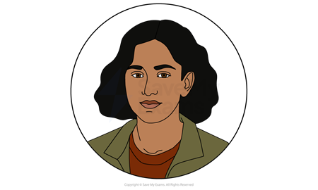
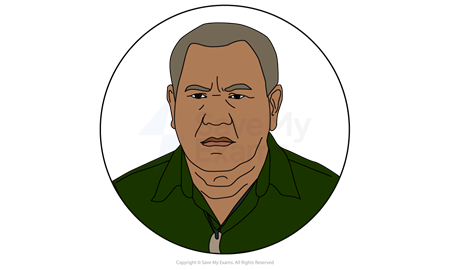
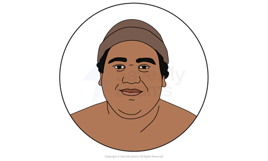
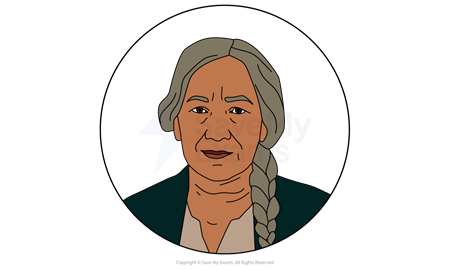
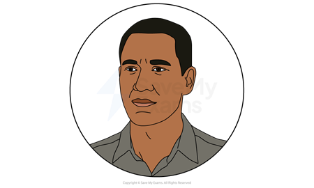
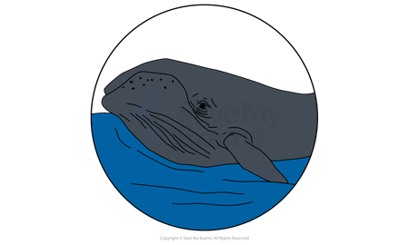

# The Whale Rider: Characters

In your answer to the The Whale Rider question, remember that characters represent a group of people or an idea about society. Ihimaera’s characters, for example, contrast with each other. This choice helps to illustrate differences between social groups and reflect contemporary debates.

[Characterisation](https://www.savemyexams.com/learning-hub/glossary/characterisation-definition/) is a writer’s method and it’s good to use this word in your responses. Characterisation can include:

- How characters are established
- How characters are presented:

  - Their physical appearance
  - Their actions and motives
  - What they say and think
  - How they interact with others
  - What others say and think about them
- How far the characters conform to or subvert stereotypes
- Their relationships to other characters

Below you will find character profiles of:

**Main characters**

- Kahu Apirana
- Koru Apirana
- Rawiri Apirana
- Nanny Flowers

**Other characters**

- Porourangi Apirana
- The bull whale
- Jeff

## The Whale Rider: Characters: Kahu Apirana

> **Spec point** — `spcpt_wGpzx99fwDxx7Phd`

## Kahu Apirana

*Kahu Apirana*

- The [protagonist](https://www.savemyexams.com/learning-hub/glossary/protagonist-definition/), Kahu, is immediately established as a significant member of the Māori village: she is named after the original whale rider, Kahuti Te Rangi
- Ihimaera’s portrayal of Kahu is sympathetic:

  - She struggles to fulfil her destiny as the whale rider as she is a female successor
  - She is separated from her immediate family after her mother’s death and raised by her maternal grandmother
- Ihimaera delivers key ideas about family, tradition, and progress through Kahu:

  - As a female successor, she causes family conflicts about tradition
  - She represents a modern female close to her heritage
  - Kahu’s unjust alienation hinders the tribe’s future
- Kahu [symbolises](https://www.savemyexams.com/learning-hub/glossary/symbolism-definition/) a return to harmony in the tribe and with the natural world:

  - In the resolution, Kahu rescues the whales and reunites the family
  - She is willing to sacrifice herself for her people: “I am not afraid to die”

## The Whale Rider: Characters: Koro Apirana

> **Spec point** — `spcpt_w268d7ZGzNjtQ4H6`

## Koro Apirana

*Koro Apirana*

- Koro’s character is presented as the strict, elderly *patriarchal* Whangara chief:

  - He is knowledgeable and passionate about Māori tradition and culture
- Ihimaera’s characterisation of the powerful chief facing modern problems symbolises the struggle between tradition and modernity:

  - His refusal to accept Kahu raises gender and cultural issues
  - However, his love of the Māori culture presents him as well-intentioned
  - In the resolution, his acceptance of Kahu *reconciles* the family
- Ihimaera characterises Koro as excessive in his actions:

  - Koro’s persistent shunning of Kahu portrays his stubbornness
  - His marriage is harmed because of his traditional outlook

> **Exam Hint**
> Often, ideas are conveyed by the character’s progression. This is why it is important to revise each character’s development (or “journey”) in the novel. For example, Koro’s stubbornness presents tradition as fixed and narrow-minded. But his acceptance of Kahu in the resolution revises this idea to show he, and therefore cultural custom, is capable of change.

## The Whale Rider: Characters: Rawiri

> **Spec point** — `spcpt_ZP8kQbM3xtHz7qNf`

## Rawiri

*Rawiri *

- Ihimaera uses a character with a neutral position to narrate: Rawiri Apirana, the younger brother of Porourangi, is not an heir:

  - As a quiet, calm member of the family, he is a reliable narrator
  - He provides distance as he relates Kahu’s spiritual journey
  - This objectivity places the magical events firmly in reality

- Rawiri symbolises the search for identity and belonging in a traditional world:

  - However, his journey to Australia also highlights *post-colonial* discrimination
  - His experiences abroad deepen his understanding of discrimination and help him reconnect with his Māori identity
- Rawiri’s return to Whangara shows him as a loving, loyal family member

## The Whale Rider: Characters: Nanny Flowers

> **Spec point** — `spcpt_5qdTwj4Jh6ZVNMq5`

## Nanny Flowers

*Nanny Flowers*

- Nanny Flowers is the *foil* to Koro, her husband, as she is patient and caring and understands the younger generation:

- She represents a harmonious integration of the past and the future

- Like Kahu, her character subverts gender and age expectations:

  - She is rebellious: she commandeers a motorboat to chase Koro and challenges his authority
- She is a significant role model to Kahu, encouraging her and supporting her
- Her likeable character allows Ihimaera to convey themes about family love:

  - She manages Koro’s stubborn nature, and guides Kahu to wait until the time is right to prove her destiny

## The Whale Rider: Characters: Porourangi

> **Spec point** — `spcpt_N7qNKNNVcHFcxf9z`

## Porourangi

*Porourangi*

- Through Porourangi Apirana, Kahu’s father, Ihimaera illustrates how tradition can create conflict:

  - Porourangi is caught between his duty as Koro’s successor and protecting his new daughter
- Although the natural successor, he declines the leadership role, indirectly increasing the pressure on Kahu
- Porourangi is characterised as an honest, kind father, although he does not raise Kahu and remarries to start a new family

## The Whale Rider: Characters: The bull whale

> **Spec point** — `spcpt_hjjTH6zSxQGhGCKC`

## The bull whale

*The bull whale *

- Ihimaera tells the story of the original whale from Māori legend:

  - He is characterised as a mystical creature with a tattoo of a sacred symbol
  - He is a spiritual symbol of the past and generational continuity
- The whale is the narrator of alternate chapters
- The whale shares similar characteristics to Koro:

  - He is stubborn and nostalgic for the past
- However, the whale story runs parallel with Kahu’s to illustrate their bond:

  - They both lose their mother, leave home, and become wise leaders

> **Exam Hint**
> When you answer the exam question, remember that characters have been created by the writer to deliver an idea. It is then your task to explore those ideas.
> 
> For example, you could write that “Ihimaera’s characterisation of Kahu, a female successor to a patriarchal chief, raises ideas about outdated and discriminatory traditions”.

## The Whale Rider: Characters: Jeff

> **Spec point** — `spcpt_gQKsNN2tMVJxd6hG`

## Jeff

*Jeff*

- Jeff, a European settler, represents *colonial* discrimination and racism:

  - Jeff becomes Rawiri’s best friend in Australia
  - In Papua New Guinea, on Jeff’s family *plantation*, Ihimaera illustrates the family’s casual racism towards Rawiri and the workers
- The [climatic](https://www.savemyexams.com/learning-hub/glossary/climax-definition/) event, when Jeff kills Rawiri’s worker friend Bernard and his parents dismiss it because he is a “native”, is a turning point for Rawiri
