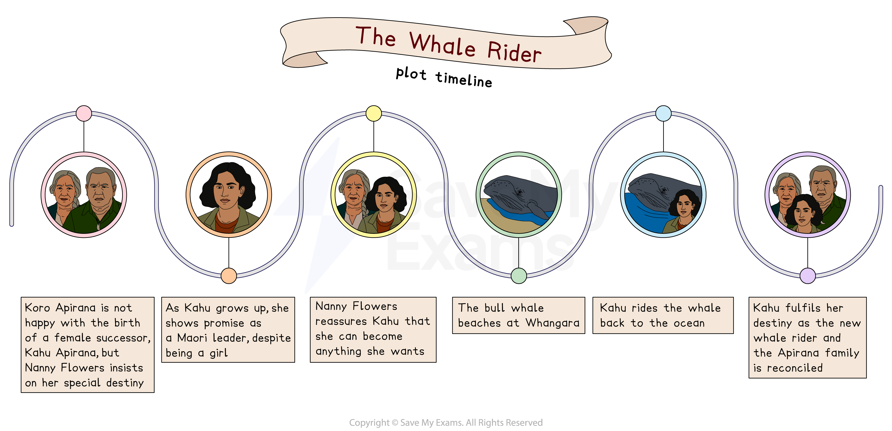

# The Whale Rider: Plot Summary

Although examiners do not reward you for “rewriting” the plot of The Whale Rider, you will need to know it thoroughly so that you can reference events. It is also best to understand the order and key plot points to understand the overall structure of the novel, and how it conveys Ihimaera’s ideas.

Below you will find:

- **Plot timeline**
- **An overview of the novel**
- **A plot summary broken down into chapters of the novel**

## The Whale Rider: Plot timeline

> **Spec point** — `spcpt_VP6WxXKdgZmCvygG`

## Plot timeline

*Plot timeline*

## The Whale Rider: Overview

> **Spec point** — `spcpt_MHDZfJFB99mPFXDP`

## Overview

The Whale Rider explores the Māori creation story which tells of a whale rider, Kahutia Te Rangi or Paikea, who symbolises harmony between man and nature. The story goes that the whale rider threw spears that became living creatures, such as pigeons and eels, representing the seeding of life across land and sea. However, one spear never falls and this, legend says, awaits someone worthy.

In Whangara, New Zealand, village chief Koro Apirana refuses to accept the birth of his new granddaughter, Kahu. Rawiri, Kahu’s uncle, is the narrator, and tells how Koro believes Māori tradition will not accept a female successor. After her mother Rehua dies, Kahu is raised by her maternal grandmother away from Whangara. But on her visits home, she begins to show signs of being the new whale rider.

During the telling of Rawiri’s story, seasons change, and the story of a local whale pod is narrated by the pod’s original bull whale. He describes how he misses his rider Paikea, how the pod migration is affected by human discord with nature, and how he returns home in the hope of finding his whale rider, who represents the pod’s last chance.

The humans and whales come together when the whales beach at Whangara. Although the tribe is unable to help, Kahu climbs on the bull whale’s back and helps the whale to swim free. Finally, Kahu is accepted by her grandfather as the new whale rider.

## The Whale Rider: Chapter-by-chapter plot summary

> **Spec point** — `spcpt_NFFzy8VqQnhCmfJ8`

## Chapter-by-chapter plot summary

**Prologue: Chapter 1 **

- The story opens with the Māori creation story: a tattooed whale swims with Kahutia Te Rangi (or Paikea) who throws spears that create life
- One spear does not land: legend says it is waiting for a time when it will be needed

**Spring: Chapter 2 **

- The original bull whale, migrating across the Southern Ocean, misses his rider, a human who rescued him after sharks killed his mother

**Chapter 3**

- In Whangara, New Zealand, the village chief, Koro Apirana, is not happy with the birth of his new granddaughter, Kahu, as she is a female successor
- Rawiri, Kahu’s 16-year-old uncle, relates how Koro ignores Kahu

**Chapter 4**

- Koro is furious that Nanny Flowers has named Kahu after the whale rider
- He refuses to bury Kahu’s umbilical cord as Māori tradition dictates
- Against the chief’s commands, Nanny Flowers buries Kahu’s umbilical cord near a statue of Kahuti Te Rangi

**Chapter 5: Summer**

- The whale pod migration is made harder by the discord between humans and whales, specifically pollution and nuclear testing
- The old bull whale longs to find his rider and wants to return to New Zealand

**Chapter 6**

- When her mother Rehua dies, three-month-old Kahu moves away with Rehua’s mother
- The orphaned Kahu is shunned by her grandfather, the chief
- Nanny Flowers is angry with her husband, Koro, but knows Kahu will return
- Koro is anxious to prepare the boys for leadership and creates a Māori culture school in Whangara

**Chapter 7**

- Kahu visits home when she is two years old, but despite signs she can already communicate with whales, her grandfather refuses to accept her

**Chapter 8**

- On a visit to Whangara, aged three, Kahu shows she has a special connection with the whales, and cries when she hears Koro discuss whale hunting

**Chapter 9: Autumn**

- The bull whale mourns the loss of their young due to radiation and pollution in their migratory path

**Chapter 10 **

- Rawiri, the narrator, leaves the village for Australia and meets a friend, Jeff

**Chapter 11**

- Rawiri and Jeff go to Papua New Guinea to work on Jeff’s family *plantation*
- There Rawiri encounters racial tension and witnesses the tragic death of Bernard, a friend and local worker
- This compels Rawiri to return home, deeply changed

**Chapter 12**

- Kahu has also come back to Whangara, but attempts to please her grandfather are ignored as he focuses on the boys’ school

**Chapter 13**

- Koro prepares a task to test his chosen male pupils (they must retrieve a stone in the ocean), but it is only Kahu who can do it
- This angers Koro, despite Kahu’s explanation that the sea creatures helped her and a clear indication of her special gifts

**Chapter 14: Winter **

- The whale pod is suffering: the bull whale wants to return to the islands, hoping to find his whale rider and salvation

**Chapter 15**

- The bull whale and his family beach themselves in Whangara

**Chapter 16**

- Koro and the village unsuccessfully attempt to return the whales to the ocean
- Koro worries that this is a sign the tribe will also die

**Chapter 17**

- Kahu climbs on the whale’s back and, excited to have his rider again, the bull whale swims with her back into the sea

**Chapter 18**

- Koro finally begins to accept that Kahu is the chosen one, particularly after learning she retrieved the sacred stone and seeing her connection to the whales

**Chapter 19: Epilogue**

- The mother whale convinces the bull whale that Kahu is the spear that never landed, not the original whale rider, and he takes her to the surface

**Chapter 20**

- Nanny Flowers becomes ill and Kahu is found floating in the sea
- The bull whale surfaces to check on Kahu

**Chapter 21**

- In hospital, Kahu tells Koro and Nanny Flowers that they are like the bull whale and mother whale, and that the whales are now singing
