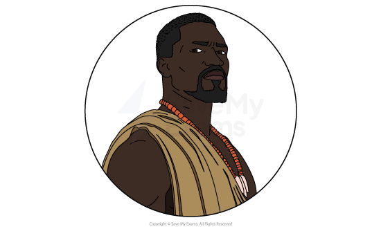
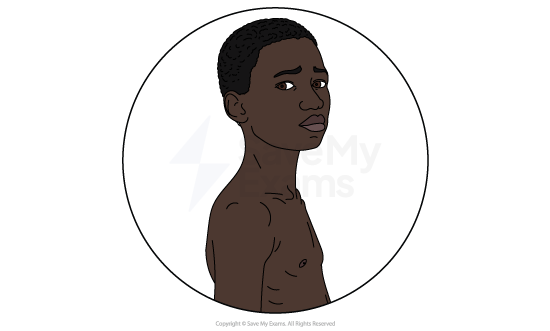
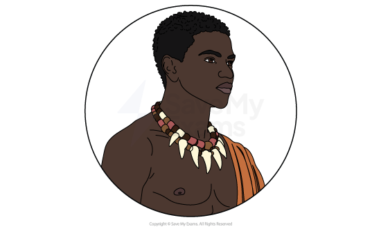
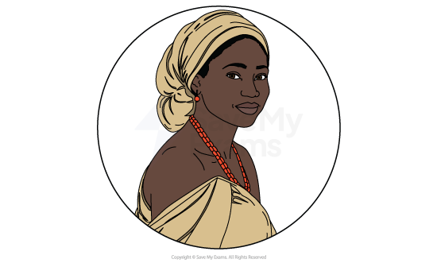
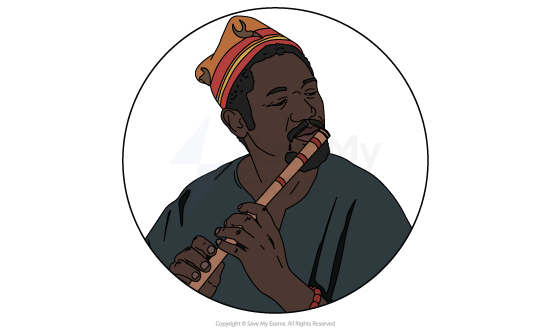
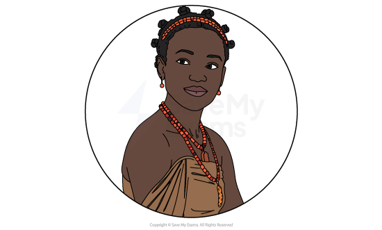
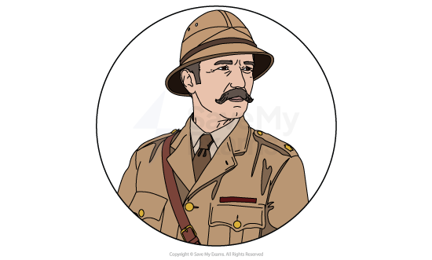
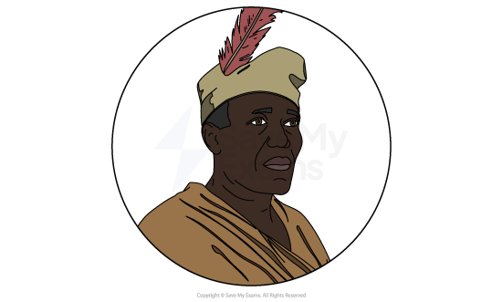

# Things Fall Apart: Characters

<u>**[Characterisation](https://www.savemyexams.com/learning-hub/glossary/characterisation-definition/)**</u>** **is a writer’s method and it’s good to use this word in your responses. Characterisation can include:

- How characters are established
- How characters are presented:

  - Their physical appearance
  - Their actions and motives
  - What they say and think
  - How they interact with others
  - What others say and think about them
- How far the characters conform to or subvert stereotypes
- Their relationships to other characters

Below you will find character profiles of:

**Main characters**

- Okonkwo
- Nwoye
- Ikemefuna
- Ekwefi

**Other characters**

- Unoka
- Ezinma
- District Commissioner
- Obierika

## Things Fall Apart: Characters: Okonkwo

> **Spec point** — `spcpt_b2DWkwfQbHrqFXvM`

## Okonkwo

*Okonkwo*

- Okonkwo’s complex characterisation raises issues about tradition:

  - He abides by traditional and ***patriarchal**** *views on masculinity
  - He is hardworking and driven, but rejects discussion and compassion
- He is a tragic hero: initially he is respected as a farmer and family man
- His <u>**[fatal flaw](https://www.savemyexams.com/glossary/gcse/english-language/hamartia/)**</u>, his aggressive rigidity, isolates him from his son and peers:

  - He is a responsible father and loving husband, but is unable to express his feelings or show mercy
- His love for his culture is presented as worthy, but his aggression leads to his inevitable downfall
- His suicide is portrayed with the complexity of his characterisation throughout:

  - He is a victim of the ***colonialists***’ cruelty, and alienated from his clan

## Things Fall Apart: Characters: Nwoye

> **Spec point** — `spcpt_28pkWdTbg7mmtvjg`

## Nwoye

*Nwoye*

- Nwoye’s character functions as a ***foil**** *to Okonkwo:

  - Okonkwo’s teenage eldest son, Nwoye does not take after his father and is more like his peaceful grandfather (who Okonkwo describes as lazy)
- Nwoye’s relationship with Okonkwo is presented as conflicted to highlight Okonkwo’s inability to understand or deal with differences peacefully
- The tense relationship worsens when Ikemefuna, Nwoye’s close friend, is killed by Okonkwo
- Nwoye eventually converts to Christianity to escape his father

## Things Fall Apart: Characters: Ikemefuna

> **Spec point** — `spcpt_FKvgZMvMNRYh2yxw`

## Ikemefuna

*Ikemefuna*

- Ikemefuna is central to the conflict between Okonkwo and his son, Nwoye:

  - A victim of a tribal dispute, Ikemefuna is a young boy taken from his home and brought to Umuofia, where he is placed in Okonkwo’s care
  - Although he is homesick to the point of illness and is beaten by Okonkwo, he begins to form a bond with the family, especially Nwoye
- His tragic murder by Okonkwo serves as a catalyst for Okonkwo’s guilt and downfall, as well as Nwoye’s broken relationship with his father

## Things Fall Apart: Characters: Ekwefi

> **Spec point** — `spcpt_pdNGqqgBmNfQjfcn`

## Ekwefi

*Ekwefi*

- Ekwefi, Okonkwo's second wife, allows Achebe to present another side to Okonkwo in order to portray him more sympathetically
- Ekwefi’s marriage to Okonkwo is portrayed as being more tender than Okonkwo’s other relationships with his wives
- Their shared concern for their sick daughter, Ezinma, presents Okonkwo as a loving and responsible father:

  - He helps her take Ezinma to the ***Oracle**** *and they reminisce about his kindness towards her when they first met

> **Exam Hint**
> Writers use characters to convey ideas, often opposing ideas, and to raise debates. For example, Okonkwo’s differences with his father and his own son are central to his emotional turmoil.
> 
> Other ideas are conveyed by the character’s progression (or “journey”) in the novel. For example, Okonkwo’s consistently stubborn rigidity and refusal to understand his son (despite advice to change) leads to his isolation.

## Things Fall Apart: Characters: Other Characters

> **Spec point** — `spcpt_GVnJsM46tRZtTV9m`

## Other Characters

### Unoka

*Unoka*

- Unoka is Okonkwo’s deceased father
- He provides readers with context regarding Okonkwo’s character
- He works as a **foil **to Okonkwo to raise issues about masculinity and tradition:

  - Unoka was a peaceful musician who preferred talking and drinking to working, which led to debt and poverty
  - Okonkwo’s rigid objective is to be the opposite of his father, which proves to be his downfall

### Ezinma

*Ezinma*

- Ezinma is the eldest, favoured child of Okonkwo and his second wife, Ekwefi
- Achebe presents ***Igbo**** *traditions via her journey to the Oracle and her encounters with a ***medicine man***
- Ezinma’s character highlights gender issues, as Okonkwo clearly favours her over his other children:

  - Achebe critiques his **patriarchal **values through Okonkwo’s regretful wish that she had been born a boy

### District Commissioner

*District Commissioner*

- The ***District Commissioner*** is a British governor placed in charge of local villages
- His character functions to show the disastrous impact of the British colonists:

  - As judge and governor, he uses British laws to rule the Igbo community and instil British culture on what he believes is a savage society
  - He arrests Okonkwo and the village men when they act out revenge on a Christian convert who has disrespected their culture
- His character also highlights the tragic circumstances of Okonkwo’s death:

  - In the resolution, Achebe draws attention to Okonkwo’s suicide and suggests the colonialist settlers are to blame
  - The **District Commissioner** passes comment on the suicide as reasonably good research for his book
  - The title of his book ends Achebe’s novel poignantly: “The Pacification of the Primitive Tribes of the Lower Niger”

### Obierika

*Obierika*

- Obierika, Okonkwo’s friend, serves as a voice of conscience to Okonkwo:

  - He offers advice when Okonkwo complains about his children and the ***missionaries***
  - He is critical of Okonkwo’s aggression towards Ikemefuna
- He represents loyalty, respect, patience and compassion:

  - In the final chapter, Obierika mourns Okonkwo’s death and expresses anger at how colonial rule has robbed his friend of dignity

**Sources**

[*“Reading Chinua Achebe’s Things Fall Apart from the Postcolonial Perspective”, Md. Mahbubul Alam, Research on Humanities and Social Sciences, Vol.4, No.12, 2014*](https://core.ac.uk/download/pdf/234673991.pdf)
