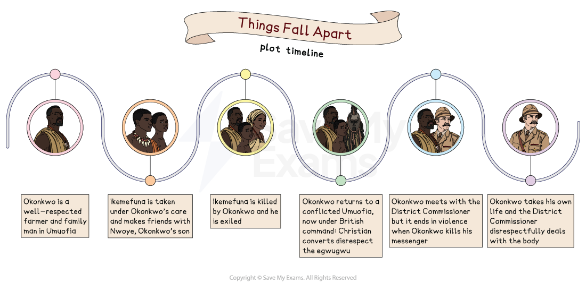

# Things Fall Apart: Plot Summary

It is best to understand the order and key plot points to understand the overall structure of the novel, and how it conveys Achebe’s ideas.

Below you will find:

- **Plot storyline**
- **An overview of the novel**
- **A plot summary broken down into sections of the novel**

## Things Fall Apart: Plot Storyline

> **Spec point** — `spcpt_gp7gRSzrhbHWyVNd`

## Things Fall Apart: Plot Storyline

*Plot storyline*

## Things Fall Apart: Plot Summary: Overview

> **Spec point** — `spcpt_wF7PxmMtjVc73gKn`

## Overview

The novel’s <u>**[protagonist](https://www.savemyexams.com/learning-hub/glossary/protagonist-definition/)**</u>, Okonkwo, is a respected member of the Umuofia ***Igbo ***clan, despite his father’s bad reputation and poverty. Okonkwo has grown up to be strict and unforgiving, and expects a lot from his own son, 12-year-old Nwoye.

Okonkwo helps settle a dispute with a neighbouring village by accepting their peace offering: a teenage boy, Ikemefuna, and a young virgin girl, given as compensation after a murder. Ikemefuna becomes close to Nwoye and the family. Later, Okonkwo is told that the ***Oracle**** *demands Ikemefuna’s life, but that he is not to be involved in his killing. Nevertheless, Okonkwo betrays and kills Ikemefuna. Already under the village’s judgement, Okonkwo accidentally kills the son of a respected elder during a funeral ceremony. As punishment, he is exiled for seven years.

Despite his comfortable settlement in Mbanta, he is dissatisfied with his new life. However, when Okonkwo returns to Umuofia, the community is under ***colonial**** *rule. ***Missionaries ***encourage the residents to convert to Christianity, and religious beliefs in the village clash. When a convert disgraces a sacred Igbo tradition, the clansmen burn his church and are subsequently arrested and tortured. During a village meeting to discuss how to respond to the colonisers, Okonkwo kills a court messenger who tries to break it up. When the clan refuses to support his action, Okonkwo realises they will not resist the new order, and, in despair, he takes his own life. As the clan cannot bury Okonkwo traditionally, the ***District Commissioner*** deals with the body. The novel ends portraying the disrespectful manner with which he carries this out.

## Things Fall Apart: Plot Summary: Chapter-by-chapter plot summary

> **Spec point** — `spcpt_RpygzZMSqfz5hQ3H`

## Chapter-by-chapter plot summary

### Part 1: Chapter 1

- Okonkwo, the **protagonist**, is respected in the clan as a fierce warrior, successful farmer, and family man with three wives
- Okonkwo’s hatred towards his father’s weaknesses has made him severe:

  - His father, a musician, had much debt and did not provide for his family

#### Chapter 2

- After a dispute in Mbaino, Okonkwo returns with a woman and teenage boy:

  - The scared boy, Ikemefuna, is taken in by Okonkwo’s family
- Okonkwo’s harsh treatment of his wives and son is judged by the village

#### Chapter 3

- The story returns to Okonkwo’s childhood to describe his father, Unoka
- An Oracle explains that Unoka is doomed for not working hard
- After Okonkwo’s father’s death, a farmer supports Okonkwo, and he builds a farm

#### Chapter 4

- The village begins to lose respect for Okonkwo because of his arrogance:

  - At a meeting he insults a man, and the clan turn on him
- During the traditional Igbo Week of Peace, Okonkwo beats his third wife:

  - He is punished by the clan and required to offer a sacrifice to atone for breaking the Week of Peace

#### Chapter 5

- By the time of the Feast of the New Yam, Okonkwo’s aggression is worsening:

  - He beats and shoots his second wife, Ekwefi, although he misses
- The story relates their initial meeting at one of the festival’s wrestling matches

#### Chapter 6

- The village come together to watch a wrestling match and Ekwefi, who is sitting with the women, speaks with the priestess Chielo while sitting with her own daughter, Ezinma

#### Chapter 7

- Ikemefuna grows closer to the family and Nwoye
- An elder tells Okonkwo that the Oracle has ordered Ikemefuna’s death, adding that Okonkwo is too close to the boy to carry it out:

  - Okonkwo ignores this warning and kills him in the forest
  - Nwoye is distressed that his father has abandoned him and his friend

#### Chapter 8

- Okonkwo complains about his children, but his friend Obierika challenges his severity
- During a traditional ceremony, the elders discuss strangers with “white skin”

#### Chapter 9

- Ekwefi alerts Okonkwo that their daughter, Ezinma, is very sick
- Okonkwo prepares her medicine and supports his wife

#### Chapter 10

- A traditional Igbo trial takes place in the village
- The nine ***egwugwu***, masqueraders representing spirits, rule that a husband must take back the wife he has beaten and be more respectful

#### Chapter 11

- Chielo informs Ekwefi that an Oracle, Agbala, wants to see Ezinma
- Ekwefi follows Chielo who carries Ezinma off to the Oracle’s cave
- The journey is long, but when Ekwefi arrives at the cave, Okonkwo is there

#### Chapter 12

- Although there is much festivity in the village the next day, Okonkwo, Ekwefi, and Chielo are exhausted from their night journey:

  - Ezinma is put to bed, and they help with preparations

#### Chapter 13

- At the funeral of Ezeudu, the oldest man in the village, Okonkwo’s gun accidentally goes off and kills Ezeudu’s son
- As this is a serious crime against the Earth goddess, the clan exiles Okonkwo and his family for seven years
- They go to Mbanta, his mother’s village

#### Chapter 14

- Although Okonkwo and his family are welcomed and his uncle helps the family, Okonkwo struggles to accept his exile
- He is offered advice by his uncle: he should consider himself lucky

#### Chapter 15

- Obierika visits Okonkwo in Mbanta and relates the colonists’ slaughter of the Abame clan
- They discuss an Oracle’s warning that white men will come like “locusts”

#### Chapter 16

- Two years later, Obierika visits Okonkwo again, this time with news that missionaries have arrived in Umuofia
- He discusses Nwoye’s interest in Christianity, but Okonkwo will not discuss it

#### Chapter 17

- Missionaries arrive in Mbanta and begin to encourage the villagers to convert
- Nwoye goes to the church, and, on his return, Okonkwo beats him for it

#### Chapter 18

- The villagers begin to worry about the changes the missionaries bring:

  - When a python (a sacred animal) is reportedly killed by a Christian convert, tensions rise
  - Okonkwo urges the elders to insist the missionaries leave but they let it pass

#### Chapter 19

- As Okonkwo prepares for his return to Umuofia, he is unsettled, but he hopes that things will go back to the way they used to be before his exile

#### Chapter 20

- Okonkwo’s return to Umuofia is disappointing when he sees it has changed:

  - The village is governed by a **District Commissioner**
- Obierika tells Okonkwo that they have no chance against the men with guns

#### Chapter 21

- As British culture ***supersedes**** *the Igbo culture, the village is pleased with the improved trade and education:

  - Mr Brown advises the elders that reading and writing is key
- Okonkwo becomes increasingly frustrated with Nwoye who goes to school

#### Chapter 22

- During a ceremony, a convert, Enoch, disrespects an **egwugwu**
- The clan leaders burn the church in retaliation for Enoch’s offence

#### Chapter 23

- Okonkwo and the elders go to the **District Commissioner**’s office
- Once there, they are arrested, tortured, humiliated, and released after the clan pays a heavy fine

#### Chapter 24

- The next day, an angry Okonkwo and villagers gather to plan their resistance
- When a messenger instructs them to disband the meeting, Okonkwo kills him
- But his shocked clansmen surrender and let the other men leave freely

#### Chapter 25

- When the **District Commissioner** comes to arrest Okonkwo, Obierika takes him to a tree where Okonkwo has hanged himself
- Obierika tells the commissioner to deal with Okonkwo’s body as Igbo beliefs disavow suicide
- The **District Commissioner** describes the event as British “pacification”
