# To Kill a Mockingbird: Characters

## To Kill a Mockingbird: Characters

> **Spec point** — `spcpt_Mn9MM5CZs2ZRfwy2`

## Characters

Authors of fiction construct characters to embody concepts, represent ideas and convey the key themes they want to communicate. In To Kill a Mockingbird, Harper Lee employs characters to convey themes, explore societal issues, and provide insight into human nature. Each character serves a distinct purpose, adding depth and meaning to the novel.

**Main characters**

- Scout (Jean Louise Finch)
- Atticus Finch
- Jem Finch
- Boo Radley

**Other characters**

- Calpurnia
- Dill (Charles Baker Harris)
- Bob Ewell
- Mayella Ewell
- Tom Robinson
- Mrs Dubose
- Aunt Alexandra
- Miss Maudie Atkinson

## To Kill a Mockingbird: Characters: Scout (Jean Louise Finch)

> **Spec point** — `spcpt_thWfM6bfkm5Dn4Yd`

## Scout (Jean Louise Finch)

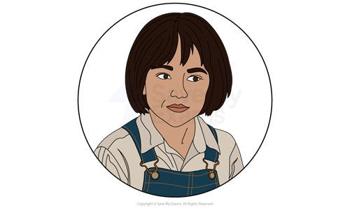

*Scout (Jean Louise Finch)*

- Scout Finch is the **protagonist** of the story who relays the events of the novel:

  - She is a **retrospective narrator**: the text is told by her as a child but is mediated by an adult
  - This adds a maturity and credibility to the events
  - By using the voice** **of a child, Lee is able to expose the injustices and absurdity of racism and discrimination
  - It also create **pathos** for the plight of Tom Robinson by interweaving her loss of innocence with his mistreatment
- Scout is intelligent and literate in contrast to her peers, who can only read and write in the “third grade”
- She is **precocious** and unafraid of speaking her mind:

  - This leads to her being punished at school when she explains why Walter Cunningham does not have his lunch money
  - However, this quality is shown to be important as it drives Scout to question the **social norms** that the community in the southern town of Maycomb, Alabama accept and **propagate**
- Scout understands that **segregation** does not **espouse** the American value of equality and realises this **hypocrisy**
- Scout is presented as a tomboy who defies gender stereotypes, choosing to wear “overalls” and “**britches**” rather than dresses:

  - Even when she is in a dress, she wears her overalls underneath
  - She defies traditional gender roles with her rejection of feminine clothing, symbolising her rebellious nature
- Following the conventions of the **bildungsroman** genre, Scout is shown to mature and grow throughout the text:

  - She embraces kindness and empathy **epitomised** by the evolution of her attitude towards Boo
- Similar to her community, she first considers Boo an outcast, but by the end she realises that he is a harmless, kind and vulnerable person:

  - This allows Lee to comment on Atticus’s parenting style, and the importance of it in educating his children in empathy, kindness and tolerance
  - This may be seen as a Lee offering a wider critique of parenting and education as vital in overcoming the ills of society
  - By the end of the text, Scout **embodies** these qualities, suggesting that Atticus has been successful in raising her

> **Exam Hint**
> Always remember that fictional characters in texts are not real; they are constructs created by the author. Therefore, you should always think about what Harper Lee was trying to achieve through her choice and presentation of the characters in To Kill a Mockingbird.

## To Kill a Mockingbird: Characters: Atticus Finch

> **Spec point** — `spcpt_cNsr95rX4N9nGyMt`

## Atticus Finch

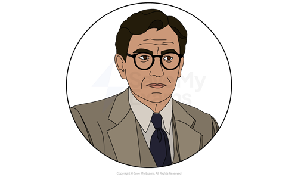

*Atticus Finch*

- Atticus is a lawyer and state representative who takes on the Tom Robinson case even though he knows he will lose:

  - It causes him to be intimidated and **shunned** by others
  - He symbolises honour, bravery, heroism, intelligence and empathy and is the **moral compass **of the text
- Atticus rejects society’s prejudices even when it puts him in harm’s way and sets him apart from the rest of the town:

  - For example, he calls Tom Robinson “respectable” in court and visits his wife after his death:
  
    - Through his empathy, he considers Tom Robinson an equal and not as the **other, **undermining the idea of segregation
    - His shooting of the rabid dog becomes a **motif** for his attempt to **eradicate **racism in his community
- Atticus empathises with others, even though they do not do the same:

  - He helps Mr Cunningham with his legal affairs even though he cannot pay
  - He tells his children to hold their heads high and keep their fists down:
  
    - “No matter what anybody says to you, don’t let ‘em get your goat”
- Lee uses Atticus to represent the qualities that will help make society a better place:

  - Walter Cunningham is welcomed into the Finch home for a meal, despite the difficult economic situation of the time
  - Atticus employs Calpurnia and treats her well, despite prejudice towards black women:
  
    - He keeps her in employment during the **Great Depression**,** **when there were likely many white women looking for work
- Through his insistence that it is a sin kill a mockingbird, Atticus is presented as believing that innocence should be protected:

  - He protects the vulnerable of the town by telling the children to leave Boo Radley alone, and by representing Tom Robinson

## To Kill a Mockingbird: Characters: Jem Finch

> **Spec point** — `spcpt_bsZ4D94Xfr7vHQkM`

## Jem Finch

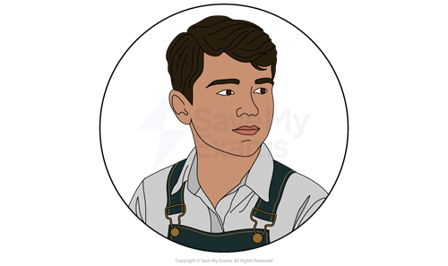

*Jem Finch*

- Jem is kind, mature and even tempered and is portrayed as a protective older brother to Scout:

  - When he catches his sister fighting with Walter Cunningham, he reprimands her and invites him round for dinner
  - This demonstrates the kindness and generosity of spirit he has learned from his father
- Although all of the children are fascinated by Boo Radley, Jem demonstrates leadership in a number of instances:

  - He takes charge of the idea to re-enact Boo's life, casting himself as the lead character
  - It is Jem who runs to the Radleys’ front porch to touch the front door
  - He protects Scout by telling her to run away during the Bob Ewell attack
- Lee presents Jem as intelligent and thoughtful, but also emotional:

  - When Nathan Radley seals the tree hole where the children find gifts, Jem is upset
  - In a fit of anger, he cuts Mrs Dubose’s camellia flowers, signifying his desire to cut intolerance out of his community:
  
    - After her death, he throws the flower she left for him into the fire
- As the novel progresses, Jem is presented as more mature than Scout, choosing to isolate himself and spend time reading instead of playing:

  - Jem’s **introspection** coincides with the beginning of the second part of the novel, bringing an end to the age of innocence at the start
  - Jem’s **adherence** to rules evolves over time, suggesting an understanding of the complexity of right and wrong:
  
    - During the midnight scene at the jail, he demonstrates a willingness to accept punishment rather than betray his father's trust
- Jem's character undergoes a **profound** shift following Tom Robinson's conviction:

  - The verdict shatters his faith in justice and exposes him to the harsh realities of prejudice and hatred:
  
    - Struggling to comprehend the divisions within society, Jem grapples with **disillusionment** and questions the **inherent **goodness of people
    - Despite this, like his father, he wants to become a lawyer so he can make a positive impact on the world

## To Kill a Mockingbird: Characters: Boo Radley

> **Spec point** — `spcpt_Pw5dqgydZCVrvMX4`

## Boo Radley

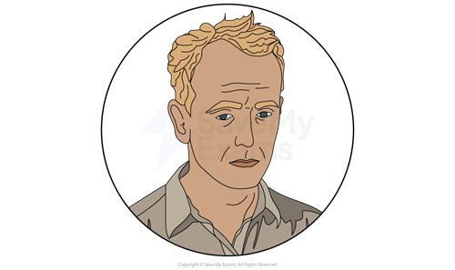

*Boo Radley *

- Although Boo Radley is rarely seen in the novel, the symbolism of his character is central to the novel
- Boo is presented as being tormented by the children, who are fascinated by rumours that he stabbed his father with scissors and has been confined to the house ever since:

  - Described as a “**malevolent** phantom” by Scout at the beginning, it is Boo who saves her life with an act of bravery and selflessness at the end:
  
    - As such, he symbolises innocence, kindness and the **juxtaposition **of **hearsay** and reality
- He is **ostracised** by the community and stigmatised as an outsider to be feared and shunned as he does not adhere to **social norms**:

  - He is a motif for those who are **marginalised** due to ignorance and rumour
  - He leaves gifts for the children in the hollow of a tree, suggesting he is **benevolent **and desires friendship and human connection:
  
    - The tree is filled in with cement, signifying social barriers that keep people apart and **hinder** understanding
- After saving Scout and Jem from Bob Ewell, Lee presents Boo as gentle and vulnerable:

  - He asks to be taken home: “He almost whispered it, in the voice of a child afraid of the dark”
- Scout’s realisation at the end of the novel that Boo seems “real nice” is symbolic of her evolution and maturity:

  - This represents the novel’s central message that people should be treated fairly and not discriminated against

## To Kill a Mockingbird: Characters: Minor characters

> **Spec point** — `spcpt_yVptdH6KnQ69WwdM`

## Minor characters

**Calpurnia**

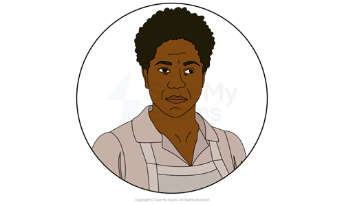

*Calpurnia*

- As the sole female presence in Scout's predominantly male household at the beginning of the novel, Calpurnia serves as a strong role model for Scout:

  - She assumes the role of a teacher, imparting valuable life lessons to Scout and Jem, helping them to understand the intricacies of racial and social divides
- By introducing them to her congregation, Calpurnia allows them to experience an aspect of African-American culture:

  - Scout and Jem’s visit to the church expands their horizons and enhances their comprehension of social justice
- Throughout the novel, Calpurnia exhibits strength of character and upholds admirable morals:

  - Like Atticus, Calpurnia refrains from passing judgement on others, **reprimanding **Scout for doing so when she comments on Walter’s eating habits
- In the era of segregation in the American south, Calpurnia exemplifies resilience and dignity:

  - Her portrayal epitomises the resilience of the black community during a time of pervasive oppression

**Dill (Charles Baker Harris)**

- Dill is a playmate for Scout and Jem whose presence is associated with the school holidays, games and adventures:

  - He symbolises the happiness and innocence of childhood in contrast to the complex issues Scout and Jem later encounter
- Although he is not from Maycomb, Dill is accepted into the community:

  - This contrasts with the experience of other characters such as Tom Robinson and Boo Radley
- As children, Dill and Scout plan to marry when they are adults:

  - This **alludes** to a young understanding of accepted social norms and the impressionability of children

** Bob Ewell **

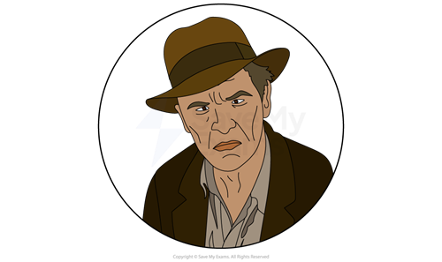

* Bob Ewell  *

- Bob Ewell is the **antagonist **of the novel,** **epitomising** **racial hatred in the story:

  - Atticus reveals that Bob is responsible for his daughter’s injuries, having caught her trying to kiss Tom Robinson because he is black:
  
    - As such, he symbolises racial hatred and is used by Lee to attack the **grotesqueness **of segregation and racism in America
- Bob Ewell is a **foil** of Atticus, whose racist attitudes and moral corruption set a bad example to his children:

  - “As Judge Taylor banged his gavel, Mr Ewell was sitting smugly in the witness chair, surveying his handiwork”
- In attacking Mayella Ewell and trying to kill Scout and Jem, Bob represents the harm that hatred is able to wreak:

  - The portrayal of him living at the dump is not only a commentary on poverty and class, but also on the **depravity** of his attitudes

**Mayella Ewell**

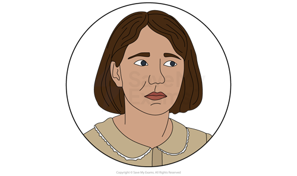

* Mayella Ewell*

- Mayella Ewell is the oldest daughter of Bob Ewell and accuses Tom Robinson of raping her
- As a character, she does not appear until Chapter 18 when she gives her testimony in court:

  - Despite her false accusation, Lee invites the reader to feel some sympathy for her due to her miserable home circumstances

**Tom Robinson**

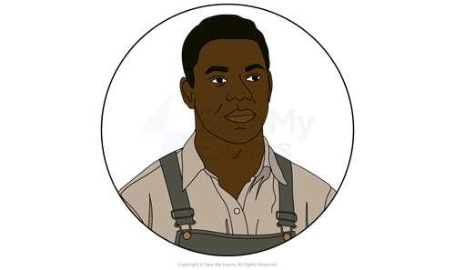

*Tom Robinson*

- Tom Robinson, a black man, stands as a** poignant** symbol of the injustice that plagues Maycomb:

  - Harper Lee depicts him as a hardworking family man wrongfully convicted of rape he did not commit:
  
    - Tom’s portrayal as a compassionate and honest character challenges the dehumanising stereotypes perpetuated by society
- By describing the injustice of Tom’s fate, Lee forces readers to consider the prejudices ingrained within the legal system and society at large:

  - His experience and subsequent death serve as a reminder of the devastating impact of racism and the need for justice and equality

** Mrs Dubose**

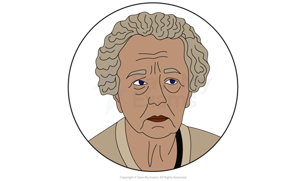

* Mrs Dubose*

- Mrs Dubose is portrayed as a stark embodiment of the racial prejudices deeply ingrained within Maycomb society
- Jem does not want to be in her presence but Atticus makes Jem read to her as a punishment for cutting her camelia flowers:

  - Their encounters with her expose the children to the harsh realities of racism and social injustice
  - They witness her illness and discomfort and learn about her history of addiction:
  
    - It becomes a **pivotal **moment in their moral education, emphasising the importance of confronting prejudice and fostering empathy

**Aunt Alexandra**

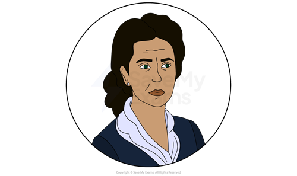

* Aunt Alexandra*

- Aunt Alexandra is portrayed as a traditional and conservative character:

  - She can be seen as the **antithesis **of her brother, Atticus
  - She embodies a rigid conception of femininity that stands in contrast to the more unconventional roles embraced by characters like Calpurnia and Scout:
  
    - Her presence serves as a reminder of the societal expectations placed upon women in Maycomb, highlighting the tensions between tradition and progress in the novel

**Miss Maudie Atkinson**

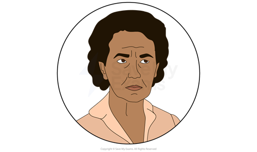

*Miss Maudie Atkinson*

- Miss Maudie Atkinson is one of the Finch’s neighbours in Maycomb
- She is depicted as a kind and compassionate character and provides a source of comfort and understanding for the children
- She has progressive views that stand in contrast to the rest of Maycomb society

**Sources:**

**Lee, H. (2010). To Kill a Mockingbird. Arrow Books.**
