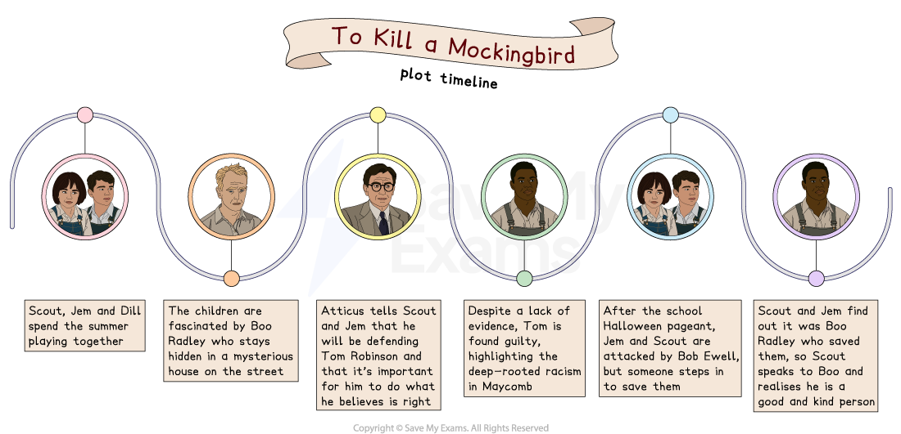

# To Kill a Mockingbird: Plot summary

## To Kill a Mockingbird: Plot summary

> **Spec point** — `spcpt_88vKbGqGddjCg36r`

## Plot summary

An important step in preparing for the exam is to thoroughly understand the plot of To Kill a Mockingbird. Once you're familiar with the text, you will feel confident connecting key events to broader themes. Having a deep understanding of the text will boost your confidence in finding relevant references to support your responses.

## To Kill a Mockingbird: Plot timeline

> **Spec point** — `spcpt_cWRNQKnHTcfVbVC8`

## Plot timeline

*Plot timeline*

## To Kill a Mockingbird: Overview

> **Spec point** — `spcpt_mVs8hcZ2BSJxrhjx`

## Overview

First published in 1960, To Kill a Mockingbird was written by Harper Lee who grew up near Alabama**, **a state in the south-eastern region of the US. Her father was a lawyer and unsuccessfully defended two African-American men accused of murder. Since its publication, the novel has sold over 40 million copies. A year after its publication, it won the **Pulitzer Prize.**

To Kill a Mockingbird is a **bildungsroman **and it is told through the eyes of the main character, Jean Louise Finch, otherwise known as Scout, set during her childhood between the ages of five and eight. It depicts life during the **Great Depression** in the 1930s in the fictional town of Maycomb, situated in the American south, not far from Alabama town. Maycomb is described as a poor town with deep racial and societal tensions.

The early part of the novel focuses on Scout’s childhood experiences growing up with her father Atticus Finch, her brother, Jem and their housekeeper, Calpurnia. During the summer holidays, Jem and Scout play with Dill, a neighbour’s nephew who comes to stay. The three of them become fascinated by a neighbour called Arthur “Boo” Radley, who lives across the street and is said to have attacked his father with a pair of scissors. Boo has been locked in the house ever since.

Atticus agrees to defend an African-American man called Tom Robinson who has been wrongfully convicted of raping a white woman, Mayella Ewell. As soon as the community learns that he will be defending a black man, the Finch family find themselves victims of discrimination. Atticus realises that the case will likely be lost but feels morally compelled to take it on; through his decision to defend Tom and the reactions that follow, Jem and Scout begin to understand the complex tensions within their community.

At the trial, it becomes clear that Tom Robinson did not rape Mayella, but that she tried to kiss him. This was seen by her father who then beat Mayella and threatened to kill Tom. Despite the evidence, Tom is found guilty and sent to prison. He later tries to escape and is shot dead. Mayella’s father, Bob Ewell, threatens to take revenge on the Finches for Atticus representing Tom.

After the trial, Scout and Jem are walking back from a school Halloween pageant when they are attacked by Bob Ewell. Jem suffers a broken arm. The attack happens at night but someone steps in to save them, although the children can’t see who it is. In the struggle, Bob Ewell is stabbed and dies. When they arrive home, they see the man who saved their lives: Boo Radley. Having been frightened of him for years, Scout Finch finally realises that Boo is a good person.

## To Kill a Mockingbird: Chapter-by-chapter plot summary

> **Spec point** — `spcpt_GkqZSTczP8q3mBsW`

## Chapter-By-Chapter Plot Summary

**Chapters 1–3**

- Scout explains that her older brother, Jem, broke his arm but no explanation is given as to how it happened
- Scout outlines her family history, explaining that an ancestor of the Finch family left England due to religious persecution
- The reader learns that the Finches set up a family farm, but that Atticus and his brother left to study Law and Medicine at university
- The reader is introduced to Maycomb, a fictional southern town

- Jem and Scout make friends with Dill, who is staying with his aunt in Maycomb for the summer
- Together the children play games and act out theatrical performances
- They become bored and they decide that they will try to **lure** out Boo Radley, a neighbour who is rumoured to have been constrained to the house after stabbing his father with a pair of scissors
- Dill convinces Jem to run over to the house and touch the Radleys’ door, after which Scout sees a brief movement in the shutters
- Scout has an eventful first few days day at school:

  - A classmate, Walter Cunningham, has no lunch or money to buy any and is scolded by the teacher, Miss Caroline
  - Scout explains that Walter can’t afford lunch, but is punished by Miss Caroline
- Atticus tells Scout that she should respect the Cunninghams, who lost all they had, except their farm, in the Great Depression
- Scout attacks Walter but Jem stops her and invites Walter to the Finch house for dinner
- Scout is shocked by the way that Walter eats and the housekeeper, Calpurnia, scolds her

**Chapters 4–8 **

- On her way home from school, Scout finds gum in the tree outside Boo Radley’s house
- In the days that follow, the children discover other items in the tree
- They play outside and Jem, Scout and Dill decide to get in a tyre and roll it down a hill
- Scout ends up in the Radley house and runs away
- Scout spends time with a neighbour, Miss Maudie Atkinson, who tells Scout that the rumours about Boo Radley are not true
- The children decide that they will put a note through Boo Radley’s door
- When they get close to his house, they are caught by Atticus, who tells them to stop tormenting him
- They try to look through the window of Boo Radley again and see a man:

  - He disappears and they run away and hear gunshots
- The gunshots are said to have been fired at a black man who was on the Radleys’ property
- The knothole in the tree is filled with cement by Nathan Radley, which upsets and confuses the children
- Dill leaves after kissing Scout, and both Scout and Jem become terrified that Boo will come after them in the night
- Jem's ripped trousers are found mended on the fence
- Miss Maudie’s house catches fire in the night, so all the neighbours leave their houses to help
- Atticus notices that Scout is covered by a blanket and asks where she got it from

**Chapters 9–11 **

- Scout fights with a classmate who insults her father for defending black people
- Atticus refuses to teach the children how to shoot, so Uncle Jack teaches them
- Atticus emphasises the importance of not shooting mockingbirds, as they do no harm and make beautiful birdsong
- While passing by the Radley house, the children notice Tim, a neighbour's dog, acting strangely
- They tell Calpurnia, and it's discovered that the dog is **rabid**
- The sheriff asks Atticus to shoot the dog, which he does in one shot
- Mrs Dubose, the Finch’s neighbour, insults Atticus
- Jem loses his temper and cuts off Mrs Dubose’s camellia flowers
- As a punishment, he is forced by Atticus to read to her every day for a month
- Jem finds out that Mrs Dubose was battling a **morphine** addiction, and the reading sessions served as a distraction for her
- She passes away, leaving Jem a box with a perfect camellia flower, which he throws into the fire

**Chapters 12–17 **

- Jem starts to spend less time with his sister and says she should act more like a girl
- Calpurnia takes Scout and Jem to her local church
- They learn about Calpurnia's personal life and the preacher, Reverend Sykes, urges the congregation to donate to Tom Robinson's family
- When they return home, they are surprised to find Aunt Alexandra waiting for them on the front porch
- Atticus returns home, and Aunt Alexandra moves in
- Scout asks her father what rape is and is overheard by Aunt Alexandra, who learns that the children heard about the case at Calpurnia’s church
- As a result, Aunt Alexandra suggests that Calpurnia should no longer work for the Finches, but Atticus refuses to let her go
- When Scout and Jem go to bed, they find Dill hiding in their room, having run away from home
- Dill is allowed to stay with the Finches and spends the summer with Scout
- A group of men, including the sheriff, arrive at Atticus’s house, as they discuss their concerns about Tom Robinson being **lynched**
- The following evening, Atticus leaves in his car and the children follow him to the jail
- They see a group of men standing in front of Atticus and run over to him
- Scout diffuses the tense situation by talking to Mr Cunningham about Walter, after which the gang of men leave
- When the trial begins both Jem and Scout get seats with the black people in the viewing gallery
- Bob Ewell is called to the stand states he saw his daughter being raped
- Mayella has bruises on the right-side of her face, which would likely have been inflicted by someone who is left-handed
- It is discovered that Bob Ewell is left-handed

**Chapters 18–25 **

- Mayella is cross-examined by Atticus
- Tom Robinson testifies that Mayella asked him to come and help him fix a door
- He claims she tried to kiss him, and that her father saw this and threatened to kill him
- Atticus delivers his closing remarks, arguing that there is no medical evidence to convict Tom and suggests that Mayella was beaten by her father
- Calpurnia tells Atticus that the children have not been at home, and Atticus is then told that they are in the “colored balcony”
- Atticus finds them and tells them to go home, telling them they can come back after supper
- Outside the court, Mr Dolphus Raymond offers Dill a sip from his brown bag, which Dill discovers is Coca-Cola, not whisky
- It becomes clear that Mr Raymond pretends to be an alcoholic rather than face persecution from the community for having a black partner and mixed heritage children
- Jem and Scout watch as the jury find Tom Robinson guilty
- As Atticus walks out, the black members of Maycomb stand to demonstrate their respect for him
- Jem says that he used to think that Maycomb was the best place in the world, but now he feels the opposite
- Miss Maudie points out that this case shows that some people tried to help and promote justice, such as their father
- Miss Stephanie runs to tell Aunt Alexandra that Bob Ewell has accosted Atticus
- Atticus learns that Tom Robinson has been killed as he tried to escape prison

**Chapters 26–31 **

- Back at school, Scout is furious that Miss Gates preaches about the inhumanity of the Holocaust
- Scout takes part in a Halloween pageant at the school, dressed as a ham
- On their way home from the pageant, Jem and Scout hear someone following them**; **Jem tells Scout to run, but her costume hinders her
- Scout hears Jem being beaten and runs back to help
- Suddenly, the attacker is pulled away and Scout sees a man carrying Jem to their house
- Atticus calls the sheriff; Aunt Alexandra tells Scout that Jem has a broken arm and a few bumps on his head
- The man who carried Jem home is in the room, but Scout does not recognise him
- The sheriff tells everyone that Bob Ewell has been stabbed
- Scout relays what happened
- The man in the comer looks at Scout and she realises that it is Boo Radley
- Atticus suggests that they should allow the law to run its course, but the sheriff insists it was an accident
- The novel ends with Atticus reading one of Jem’s books to Scout and she declares: “Atticus was right. One time he said you never really know a man until you stand in his shoes and walk around in them. Just standing on the Radley porch was enough.”

**Sources:**

**Lee, H. (2010). To Kill a Mockingbird. Arrow Books.**
