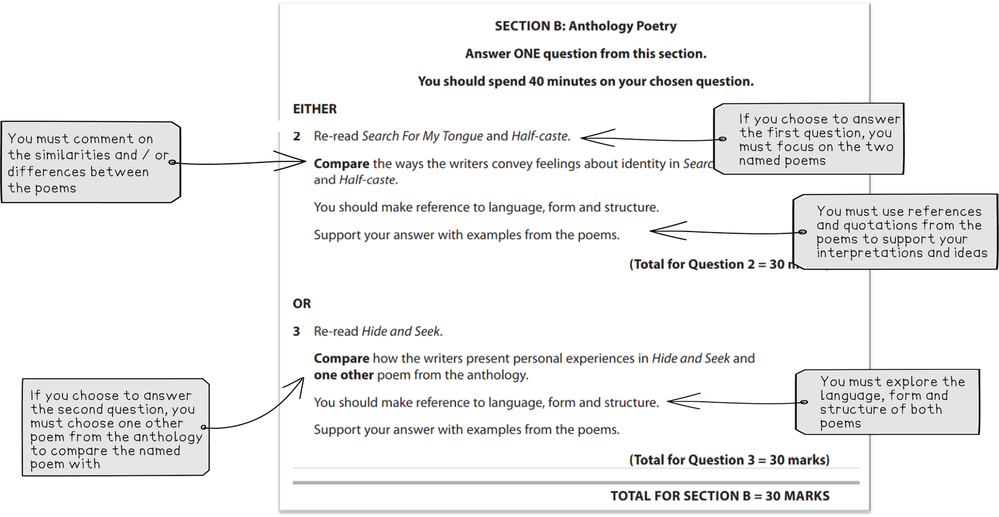

# How to Approach the Poetry Anthology Comparison Question

## Poetry Anthology: How to approach the Poetry Anthology comparison question

> **Spec point** — `spcpt_KWg4Rtgzpst7wv2z`

## How to Approach the IGCSE Poetry Anthology Comparison Question

In Section B of your Edexcel IGCSE English Literature (4ET1/01), you need to write about a poem from Part 3 of the Pearson Edexcel International GCSE English Anthology and compare it to another poem from that collection.

You can approach the question in **Section B **with confidence by learning more about the exam question:

- **Section B: Poetry anthology comparison question overview**
- **Understanding the exam question**
- **Understanding the Assessment Objectives**

## Poetry Anthology: Question overview

> **Spec point** — `spcpt_JVBxK97mFGy9DvqZ`

## Section B: Poetry anthology comparison question overview

In Section B you will answer one question on either two set poems **or** the set poem and one of your own choice from the anthology.

Here is an overview:

| **Exam question ** | Poetry anthology comparison question |
|---|---|
| **Time that you should spend on the question** | 40 minutes |
| **Number of marks** | 30 marks |

You will be given a booklet containing all the English Literature poems in the examination. You will study all 16 poems from the Poetry Anthology:

| 'If –' by Rudyard Kipling | ‘Prayer Before Birth’ by Louis MacNeice | ‘Blessing’ by Imtiaz Dharker | ‘Search For My Tongue’ by Sujata Bhatt |
|---|---|---|---|
| 'Half-past Two' by U.A. Fanthorpe | ‘Piano’ by D H Lawrence | ‘Hide and Seek’ by Vernon Scannell | ‘Sonnet 116’ by William Shakespeare |
| ‘La Belle Dame sans Merci’ by John Keats | ‘Poem at Thirty-Nine’ by Alice Walker | ‘War Photographer’ by Carol Ann Duffy | ‘The Tyger’ by William Blake |
| ‘My Last Duchess’ by Robert Browning | ‘Half-caste’ by John Agard | ‘Do not go gentle into that good night’ by Dylan Thomas | ‘Remember’ by Christina Rossetti |

## Poetry Anthology: Understanding the exam question

> **Spec point** — `spcpt_7cmXgyTpsgd9mx2P`

## Understanding the exam question

Below are some recent examples of exam questions from <u>[Edexcel IGCSE English Literature past papers (4ET1/01)](https://www.savemyexams.com/igcse/english-literature/edexcel/-/pages/past-papers/)</u>. Look at the wording of the questions and the question structure and themes. Are there any exam questions that you might struggle to answer?

| **IGCSE Edexcel English Literature Poetry Anthology questions** |   |   |   |   |
|---|---|---|---|---|
| **June 2019** | **June 2019 **  **(R paper)** | **January 2020** | **January 2020 **  **(R paper)** | **November 2020 (titled June 2020)** |
| Compare the ways the writers present concerns about society in ‘Prayer Before Birth’ and ‘Half-caste’ | Compare the ways the writers present memories in ‘Search For My Tongue’ and 'Poem at Thirty-Nine' | Compare the ways the writers present people giving advice to others in ‘If –‘ and ‘Do not go gentle into that good night’ | Compare how the writers present childhood in 'Half-past Two' and ‘Hide and Seek’ | Compare how the writers present isolation in ‘Hide and Seek’ and ‘War Photographer’ |
| *OR* | *OR* | *OR* | *OR* | *OR* |
| Compare how the writers present a moment in time in ‘Blessing’ and one other poem from the anthology | Compare how the writers convey personal thoughts in ‘Sonnet 116’ and one other poem from the anthology | Compare how the writers present sadness in ‘Remember’ and one other poem from the anthology | Compare the ways the writers present a woman in ‘La Belle Dame sans Merci’ and one other poem from the anthology | Compare the ways the writers present recollections of the past in ‘Piano’ and one other poem from the anthology |

You can significantly improve your exam performance by paying close attention to the question and understanding it thoroughly.

## Poetry Anthology: Understanding the assessment objectives

> **Spec point** — `spcpt_Xw6HjcH4cRFZkmvy`

## Understanding the Assessment Objectives

In Section B there are two assessment objectives which are both equally weighted. They are:

| ** **  **AO2** | Analyse the language, form and structure used by a writer to create meanings and effects |
|---|---|
| ** **  **AO3** | Explore links and connections between texts |

It is important to remember that the question in Section B is a **comparison **question. 50% of the marks available for this question are based on your ability to compare the similarities and differences between the two poems while directly addressing the question.

AO3 is addressed through the command word ‘**compare**’. You can compare ideas, themes, literary features, structure, form or any other relevant aspect.

AO2 is assessed through the command words ‘how’ and ‘the ways.’ Analysing language, structure and form means that you need to consider the deliberate choices the poets have made.

> **Exam Hint**
> When responding to the Poetry Anthology in Section B, you should try to:
> 
> - Show you are focusing on the question by using the command words and any other keywords from the question
> - Compare the form, structure and language of the poems, giving examples and explaining their effect on the reader
> - Provide a balanced response, giving each poem equal treatment
> - Include brief quotations from both poems
> 
> Remember, context is not assessed in this question though some knowledge of the poet is essential for understanding each poem.

**FAQs **

**How many paragraphs should I write for a 30-mark question?**

There is no set length for how long a 30-mark essay should be. However, in terms of content, your answer should include 3 developed paragraphs. Within these paragraphs there should be a detailed analysis of each point and evidence from the poems to back up every point you are making.

**How should I approach the poetry anthology comparison question?**

Try to** **take a whole-text approach to each of the poems. This could involve commenting on language. For example, have the poets used repetition or figurative language throughout their poems? You might also want to comment on structural changes throughout the poem, with phrases like “at the start”, “this changes when” or “in contrast”. You could comment on a poet’s choice of form, by thinking about what deliberate choices the poets have made with their verse form.

Find out more about how you can [write a Grade 9 answer](https://www.savemyexams.com/igcse/english-literature/edexcel/16/revision-notes/poetry-anthology/how-to-answer-the-poetry-anthology-question/how-to-write-a-grade-9-poetry-comparison-essay/).
