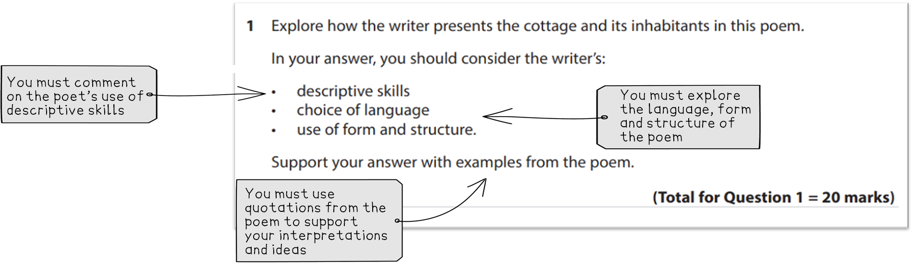

# How to Approach the Unseen Poetry Question

## Unseen Poetry: How to approach the Unseen Poetry question

> **Spec point** — `spcpt_MrctmgT3c8h6zn4v`

## How to Approach the IGCSE Unseen Poetry Question

In Section A of your Edexcel IGCSE English Literature (4ET1/01) exam, you need to write a 20-mark essay question exploring the meaning and effects created in an unseen poem. The poem will be printed on the exam paper

You can approach the question in **Section A **with confidence by learning more about the exam question:

- **Section A: Unseen poetry question overview**
- **Understanding the exam question**
- **Understanding the Assessment Objectives**
- **Top grade tips for a Grade 9**

## Unseen Poetry: Question overview

> **Spec point** — `spcpt_kdd6HG5FXqdpVPpP`

## Section A: Unseen poetry question overview

In Section A you will be presented with an unseen poem. This means that the poem will be completely new to you, but you can use the same skills you have developed while studying the poetry anthology

There will be one question on the unseen poem which you must answer. There is no choice

Here is an overview:

| **Section A** |   |
|---|---|
| **Exam question ** | Unseen poetry question |
| **Time that you should spend on the question** | 35 minutes |
| **Number of marks** | 20 marks |
| **How much you should write** | Approx. 3-4 paragraphs |

Approaching an unseen poem can seem very intimidating. However, examiners just want to see that you can demonstrate your ability to ‘notice’ things in the poem. They do not expect you to know and understand everything about a poem you have just read for the first time, so try not to be anxious about this. Indeed, examiners often comment that students generally excel in this section, as it is an opportunity for you to write about your own ideas and interpretations of the poem

Here are some of the poems used in previous past papers

| ‘Purple Shoes’ by Irene Rawnsley | ‘October’s Party’ by George Cooper | ‘Mum Dad and Me’ by James Berry | ‘A Cottage in the Lane’ by Brian Patten |
|---|---|---|---|
| ‘My Box’ by Gillian Clarke | ‘The Concerned Adolescent’ by Wendy Cope | ‘Careful With That, You Might Break It (an alien’s view of planet Earth)’ by John Rice | ‘Friday’ by Dennis O’Driscoll |
| ‘To Our Daughter’ by Jennifer Armitage | ‘Poem For My Sister’ by Liz Lochhead | ‘Slow Reader’ by Vicki Feaver | ‘On Turning Ten’ by Billy Collins |

Sometimes the title of a poem can be overlooked, but its title can be key to understanding the poem’s meaning, so make sure you use it as ‘evidence’ in your response if it is relevant

Look at the titles of the poems above. What predictions can you make about the poem from its title? What do you think the meaning of the title is? Why do you think the poet chose this particular title for their poem?

## Unseen Poetry: Understanding the exam question

> **Spec point** — `spcpt_FDCjpXt4wmDDpSKN`

## Understanding the exam question

You will have one question to answer about the poem, with bullet points to support you. In the table, you’ll find some recent examples of exam questions from <u>[Edexcel IGCSE English Literature past papers (4ET1/01)](https://www.savemyexams.com/igcse/english-literature/edexcel/-/pages/past-papers/)</u>. Look at the wording of the questions and the question structure and themes. Are there any exam questions that you might struggle to answer?

| **IGCSE Edexcel English Literature Unseen Poetry Questions** |   |   |   |   |
|---|---|---|---|---|
| **November / Jan 2022** | **November 2021** | **June 2021** | **June 2019** | **June 2018** |
| Read the following poem. ‘On Turning Ten’. Explore how the writer presents reaching the age of ten in this poem. | Read the following poem. ‘Slow Reader’.  Explore how the writer presents a child who is slow at learning to read in this poem. | Read the following poem. ‘Poem For My Sister’. Explore how the writer presents the narrator and her sister in this poem. | Read the following poem. ‘A Cottage in the Lane’. Explore how the writer presents the cottage and its inhabitants in this poem. | Read the following poem. ‘Purple Shoes’. Explore how the writer presents strong feelings in this poem. |

For this question, you will always be asked to write a response that explores how a poet conveys their message in their poem, focusing on a specific aspect or theme. Pay close attention to the question to improve your exam performance. The most common mistake students make is not carefully reading and understanding the question.

*Example unseen poetry question*

Remember, the bullet points in the exam question are given as a guide for you, so try to address each one in your answer.

> **Exam Hint**
> The unseen poetry section is about giving you a poem you haven’t had a chance to prepare for to see what you make of it. Examiners are looking to reward you for your comments and the overall quality of the response. This means you will receive the most marks for engaging with the poem’s ideas and forming a clear, critical argument about how the poet presents the speaker’s feelings. Marks will be awarded for understanding the poet’s ideas and exploring how the poet uses language, form and structural choices will help to reinforce those ideas.

## Unseen Poetry: Understanding the assessment objectives

> **Spec point** — `spcpt_bZhSBMJCjrwSbRj9`

## Understanding the Assessment Objectives

In Section A there is only one assessment objective:

| **AO2** | Analyse the language, form and structure used by a writer to create meanings and effects |
|---|---|

AO2 is assessed through the command words “explore” and “how". Analysing language, structure and form means that you need to consider the deliberate choices the poet has made, so you need to look more deeply into the poem and identify any interesting examples of language, form or structural features. This is very much about noticing things and considering why** **they stand out. Can you spot any patterns emerging or make connections between the ideas to see how they working together to make meaning?

## Unseen Poetry: Top tips for a grade 9

> **Spec point** — `spcpt_zhdHPKj49hXR9J7r`

## Top grade tips for a Grade 9

- Try not to worry about understanding what the poem means the first time you read it:

  - Often that meaning is not unlocked on a first reading so you need to be able to read, pause, reflect and re-read the poem in order to uncover its meanings
- Show that you understand the main ideas and explicit meanings in the poem, as well as the implied or hidden meanings:

  - A surface reading tells you what is happening in the poem
  - An inferential reading tells you what the poem means i.e. its message
- For the highest marks, the examiner wants to see what you think the poem means, not what the poem says
- Analyse in detail, the choices the poet has made in terms of their use of language, structure and form to convey their message and ideas
- Demonstrate your knowledge of the poem through the use of accurate, relevant quotations:

  - Use short quotations to support your ideas (never large sections of the poem)

Find out more about how you can [write a Grade 9 answer](https://www.savemyexams.com/igcse/english-literature/edexcel/16/revision-notes/unseen-poetry/how-to-answer-the-unseen-poetry-question/how-to-write-a-grade-9-unseen-poetry-essay/).
