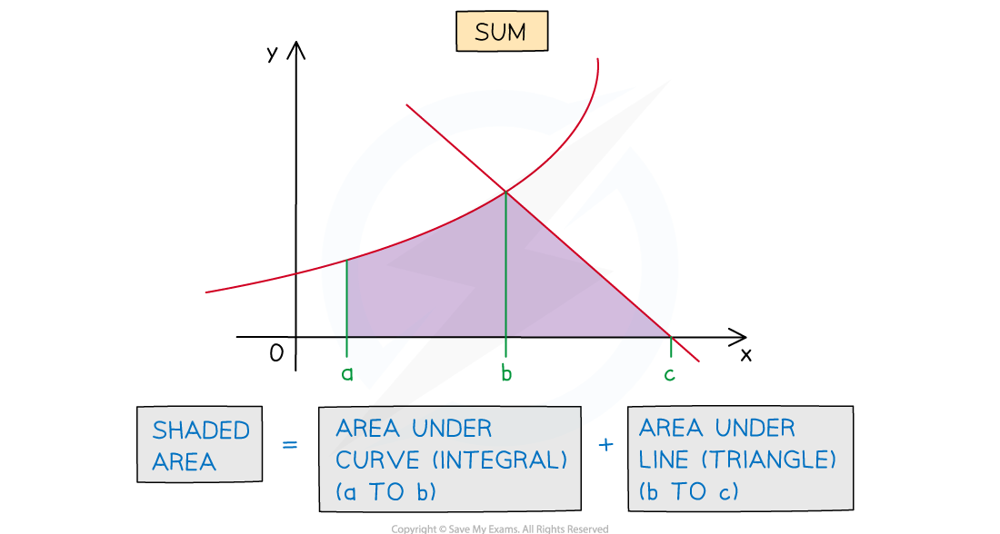
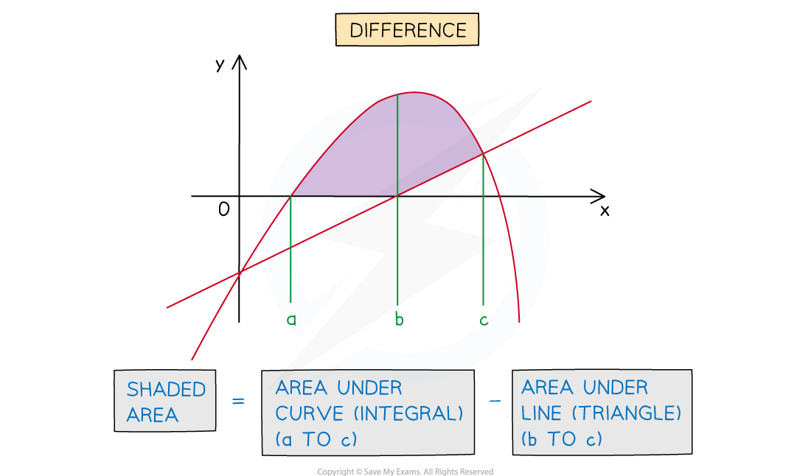
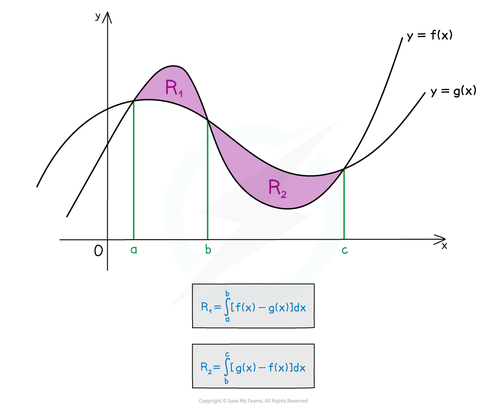

# Areas Between Curves

## Area Between a Curve and a Line

> **Spec point** — `spcpt_t6x5YNTWFJs9Vbwn`

## Area Between a Curve and a Line

### What do we mean by 'area between a curve and a line'?

- **Areas** whose boundaries include a **curve** and a (non-vertical) **straight** **line** can be found using integration

  - For an **area** under a **curve** a **definite** **integral** will be needed
  - For an **area** under a **line** the shape formed will be a **trapezium** or **triangle**
  
    - **basic** **area** **formulae** can be used rather than a definite integral
    - (although a definite integral would still work)
- The **area** required could be the **sum** or **difference** of areas under the curve and line

### How do I find the area between a curve and a line?

- **STEP 1**
If not given, **sketch** the graphs of the curve and line on the same diagram
- **STEP 2**
Find the **intersections** of the curve and the line

  - If no diagram is given this will help **identify the area(s)** to be found
- **STEP 3**
Determine whether the area required is a **sum or difference**

  - Calculate the **area under a curve** using a integral of the form `integral subscript a superscript b y space straight d x`
  - Calculate the **area under a line** using
  
    - $A=\frac{1}{2}bh$ for a **triangle**
    - $A=\frac{1}{2}(a+b)h$ for a **trapezium **
    
      - For a trapezium, y-coordinates will be needed for a  and  b
      - and the height  h will lie parallel to the x-axis
  - Those areas will need to be **added** or **subtracted**, depending on the question
- **STEP 4**
**Evaluate** the definite integral(s)

  - Then find the **sum** or **difference** of areas as required

> **Exam Hint**
> - Add information to any diagram provided
> 
>   - intersections between lines and curves
>   - mark and shade the area you’re trying to find
> - If no diagram is provided, sketch one!

> **Worked Example**
> The region$R$ is bounded by the curve with equation $y=10x-x^{2}-16$ and the line with equation$y=8-x$.
> 
> (a) Sketch the graphs of the curve and the line on the same set of axes.
> 
> Be sure to Identify and label the region$R$ on your sketch, and indicate the points of intersection between the curve and the line.  You may assume without proof that the curve's $x$-axis intercepts all lie on the positive $x$-axis.
> 
> > *Because of the minus sign in front of *$x^{2}$*, the curve will be an 'upside down u-shaped' parabola*
> 
> *We need to find the points of intersection of the curve and line*
> *Set their equations equal and solve to find the *$x$*-coordinates*
> 
> `table attributes columnalign right center left columnspacing 0px end attributes row cell 8 minus x end cell equals cell 10 x minus x squared minus 16 end cell row cell x squared minus 11 x plus 24 end cell equals 0 row cell open parentheses x minus 3 close parentheses open parentheses x minus 8 close parentheses end cell equals 0 end table`
> 
> $x=3\mathrm{or}x=8$
> 
> > *So the curve and line intersect when *$x=3$* and when *$x=8$
> 
> > *Substitute into the equation of the line to find the corresponding *$y$*-coordinates*
> 
> $x=3:y=8-3=5\,\,x=8:y=8-8=0$
> 
> > *So the points of intersection are *`open parentheses 3 comma space 5 close parentheses`* and *`open parentheses 8 comma space 0 close parentheses`
> 
> > *That gives us enough information to sketch the graphs*
> 
> 
> 
> (b) Find the area of region $R$
> 
> > *Here we're going to need a **difference** of areas:  (area under curve)*$-$*(area under line)*
> 
> > *The area under the line is a right-angled triangle with vertices at *`open parentheses 3 comma space 0 close parentheses`*, *`open parentheses 3 comma space 5 close parentheses`* and *`open parentheses 8 comma space 0 close parentheses`
> 
> > *So the height is *$5-0=5$* and the base is *$8-3=5$
> 
> $\mathrm{Area} \mathrm{of} \mathrm{triangle}=\frac{1}{2}\times5\times5=\frac{25}{2}$
> 
> > *For the area under a curve we need to use a definite integral between *$x=3$* and *$x=8$
> 
> `table row cell Area space under space the space curve end cell equals cell integral subscript 3 superscript 8 open parentheses 10 x minus x squared minus 16 close parentheses space straight d x end cell row blank equals cell open square brackets 5 x squared minus 1 third x cubed minus 16 x close square brackets subscript 3 superscript 8 end cell row blank equals cell open parentheses 5 open parentheses 8 close parentheses squared minus 1 third open parentheses 8 close parentheses cubed minus 16 open parentheses 8 close parentheses close parentheses minus open parentheses 5 open parentheses 3 close parentheses squared minus 1 third open parentheses 3 close parentheses cubed minus 16 open parentheses 3 close parentheses close parentheses end cell row blank equals cell open parentheses 320 minus 512 over 3 minus 128 close parentheses minus open parentheses 45 minus 9 minus 48 close parentheses end cell row blank equals cell 64 over 3 minus open parentheses negative 12 close parentheses end cell row blank equals cell 100 over 3 end cell end table`
> 
> > *For the area of *$R$*, subtract the area of the triangle from the area under the curve*
> 
> $\mathrm{Area} \mathrm{of} \mathrm{region}R=\frac{100}{3}-\frac{25}{2}=\frac{125}{6}$
> 
> $\frac{125}{6}\mathrm{units}^{2}$

## Area Between 2 Curves

> **Spec point** — `spcpt_ZQ4j8c8Zt59FSkXq`

## Area Between 2 Curves

### What do we mean by 'area between two curves'?

- **Areas** whose boundaries include **two** **curves** can be found by integration

  - The **area** **between** **two** **curves** will be the **difference** of the areas under the two curves
  
    - both areas will require a **definite** **integral**
  - Finding **points of intersection** may involve a more awkward equation than solving for a curve and a line

### How do I find the area between two curves?

- **STEP 1**
If not given, **sketch** the graphs of both curves on the same diagram
- **STEP 2**
If not given, find the **intersections** of the two curves

  - These are needed to identify the **area(s)** to be calculated
  - and also to set up the correct **integrals**
- **STEP 3**
Determine which curve is the **‘upper’ boundary** for each region

  - For each region, the area is given by **definite integral** of the form`space integral subscript a superscript b left parenthesis y subscript 1 minus y subscript 2 right parenthesis space straight d x`
  
    - $y_{1}$ is the function forming the **‘upper’ boundary**
    - $y_{2}$ is the function forming the ‘**lower’ boundary**
  - Be careful when there is **more than one** region
  
    - Which functions form the ‘upper’ and ‘lower’ boundaries can **change**

- **STEP 4**
**Evaluate** the definite integral(s)

  - If there is **more than one** region, **add** their areas together to find the total area
  - As long as '$y_{1}$' in the integrals is always the **upper** function
  
    - then  $y_{1}-y_{2}\geq0$
    - This means you don't have to worry about **negative integrals**
    - even if part or all of the area between the curves is **below the *****x-*****axis**

> **Exam Hint**
> - Add information to any given diagram as you work through a question
> 
>   - intersections between curves
>   - mark and shade the area you're trying to find
> - If no diagram is provided sketch one

> **Worked Example**
> The diagram below shows the curves with equations $y=f(x)$ and $y=g(x)$, where  $f(x)=(x-2)(x-3)^{2}$  and  $g(x)=x^{2}-5x+6$.
> 
> Find the area of the shaded region.
> 
> 
> 
> > *Start by finding the points of intersection*
> 
> > *Set the equations of the curves equal to each other, and solve to find the *$x$*-coordinates*
> 
> `open parentheses x minus 2 close parentheses open parentheses x minus 3 close parentheses squared equals x squared minus 5 x plus 6`
> 
> > *It's tempting to expand the brackets on the left-hand side of the equation*
> *Actually. here it will be more useful to factorise the right-hand side*
> 
> `table row cell open parentheses x minus 2 close parentheses open parentheses x minus 3 close parentheses squared end cell equals cell open parentheses x minus 2 close parentheses open parentheses x minus 3 close parentheses end cell row cell open parentheses x minus 2 close parentheses open parentheses x minus 3 close parentheses squared minus open parentheses x minus 2 close parentheses open parentheses x minus 3 close parentheses end cell equals 0 row cell open parentheses x minus 2 close parentheses open parentheses x minus 3 close parentheses open parentheses open parentheses x minus 3 close parentheses minus 1 close parentheses end cell equals 0 row cell open parentheses x minus 2 close parentheses open parentheses x minus 3 close parentheses open parentheses x minus 4 close parentheses end cell equals 0 end table`
> 
> $x=2,3\mathrm{or}4$
> 
> > *Note that we don't need to know the corresponding *$y$*-coordinates here!*
> 
> > *We have two regions here*
> 
> > *The first region is from *$x=2$* to *$x=3$*, and *`straight f open parentheses x close parentheses`* is the 'upper curve'*
> 
> `table row cell Region space 1 end cell equals cell integral subscript 2 superscript 3 open parentheses open parentheses x minus 2 close parentheses open parentheses x minus 3 close parentheses squared minus open parentheses x squared minus 5 x plus 6 close parentheses close parentheses space straight d x end cell row blank equals cell integral subscript 2 superscript 3 open parentheses x cubed minus 9 x squared plus 26 x minus 24 close parentheses space straight d x end cell row blank equals cell open square brackets 1 fourth x to the power of 4 minus 3 x cubed plus 13 x squared minus 24 x close square brackets subscript 2 superscript 3 end cell row blank equals cell open parentheses 1 fourth open parentheses 3 close parentheses to the power of 4 minus 3 open parentheses 3 close parentheses cubed plus 13 open parentheses 3 close parentheses squared minus 24 open parentheses 3 close parentheses close parentheses minus open parentheses 1 fourth open parentheses 2 close parentheses to the power of 4 minus 3 open parentheses 2 close parentheses cubed plus 13 open parentheses 2 close parentheses squared minus 24 open parentheses 2 close parentheses close parentheses end cell row blank equals cell open parentheses 81 over 4 minus 81 plus 117 minus 72 close parentheses minus open parentheses 4 minus 24 plus 52 minus 48 close parentheses end cell row blank equals cell negative 63 over 4 minus open parentheses negative 16 close parentheses end cell row blank equals cell 1 fourth end cell end table`
> 
> > *The second region is from *$x=3$* to *$x=4$* and *`straight g open parentheses x close parentheses`* is the 'upper curve'*
> 
> `table row cell Region space 2 end cell equals cell integral subscript 3 superscript 4 open parentheses open parentheses x squared minus 5 x plus 6 close parentheses minus open parentheses x minus 2 close parentheses open parentheses x minus 3 close parentheses squared close parentheses space straight d x end cell row blank equals cell integral subscript 3 superscript 4 open parentheses negative x cubed plus 9 x squared minus 26 x plus 24 close parentheses space straight d x end cell row blank equals cell open square brackets negative 1 fourth x to the power of 4 plus 3 x cubed minus 13 x squared plus 24 x close square brackets subscript 3 superscript 4 end cell row blank equals cell open parentheses negative 1 fourth open parentheses 4 close parentheses to the power of 4 plus 3 open parentheses 4 close parentheses cubed minus 13 open parentheses 4 close parentheses squared plus 24 open parentheses 4 close parentheses close parentheses minus open parentheses negative 1 fourth open parentheses 3 close parentheses to the power of 4 plus 3 open parentheses 3 close parentheses cubed minus 13 open parentheses 3 close parentheses squared plus 24 open parentheses 3 close parentheses close parentheses end cell row blank equals cell open parentheses negative 64 plus 192 minus 208 plus 96 close parentheses minus open parentheses negative 81 over 4 plus 81 minus 117 plus 72 close parentheses end cell row blank equals cell 16 minus 63 over 4 end cell row blank equals cell 1 fourth end cell end table`
> 
> > *Now just add the two areas together to get the total area*
> 
> $\mathrm{Total} \mathrm{area}=\frac{1}{4}+\frac{1}{4}=\frac{1}{2}$
> 
> **Final answer:** **Area of the shaded region **$=\frac{1}{2}\mathrm{units}^{2}$
