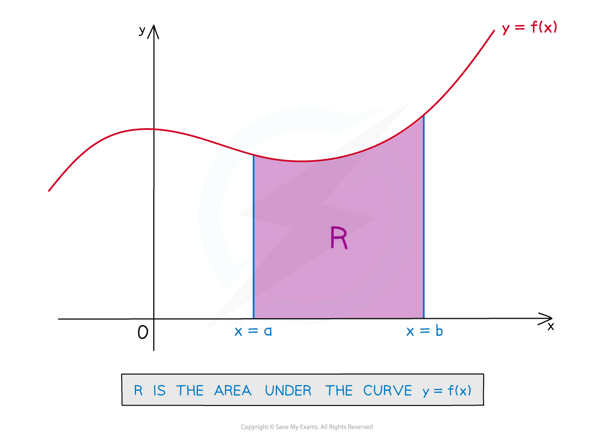
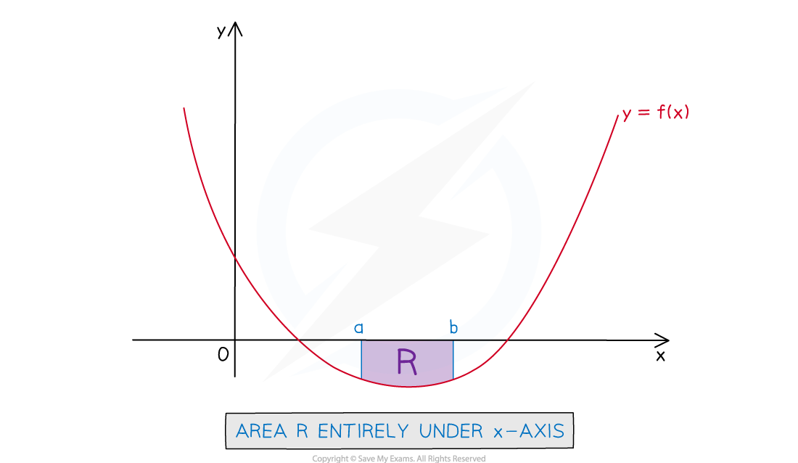
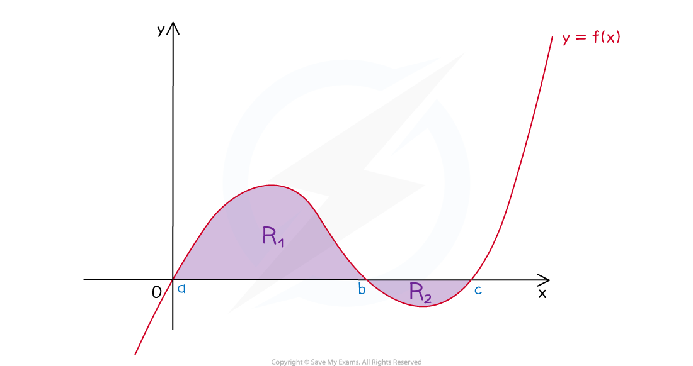

# Calculating Areas

## Definite Integrals

> **Spec point** — `spcpt_M2RHvyxt445bmXBD`

## Definite Integrals

### What is a definite integral?

- A definite integral is defined by the following formula

  - `integral subscript a superscript b straight f to the power of apostrophe open parentheses x close parentheses space straight d x equals open square brackets straight f open parentheses x close parentheses close square brackets subscript a superscript b equals straight f open parentheses b close parentheses minus straight f open parentheses a close parentheses`
  
    - i.e. **integrate** as usual to find `straight f open parentheses x close parentheses`
    - then **substitute** to find `straight f open parentheses b close parentheses` and `straight f open parentheses a close parentheses`
    - and subtract `straight f open parentheses a close parentheses` from `straight f open parentheses b close parentheses` to find the **value** of the definite integral
  - $a$ and $b$ are **numbers** and are called the **integration limits**
  
    - $a$ is the **lower limit**
    - $b$ is the **upper limit**
    - the integral is 'from $a$ to $b$'
  - A **constant** **of** **integration** (“$+c$”) is **not needed** with definite integrals
- Note that the answer to a **definite integral** is a **number**

  - The answer to an **indefinite integral** is another **function**

> **Exam Hint**
> - Be careful when substituting in to find `straight f open parentheses b close parentheses minus straight f open parentheses a close parentheses`
> 
>   - It's quite easy to make mistakes here
>   - Especially when fractions and negative numbers are involved
> - Your calculator may be able to find the value of definite integrals
> 
>   - You can use this to check your work
> - Look out for phrases in exam questions like "Use algebraic integration" or "Using calculus"
> 
>   - These mean that full working out of the integral 'by hand' is required
>   - A calculator answer without working would not score marks

> **Worked Example**
> Show that
> 
> `integral subscript 2 superscript 4 3 x left parenthesis x squared minus 2 right parenthesis space straight d x equals 144`
> 
> > *Start by expanding the brackets inside the integral*
> 
> `integral subscript 2 superscript 4 open parentheses 3 x cubed minus 6 x close parentheses space straight d x`
> 
> > *Integrate as usual (here it's a 'powers of *$x$*' integration)*
> 
> > *Write the answer in square brackets with the integration limits outside*
> 
> `table row cell integral subscript 2 superscript 4 open parentheses 3 x cubed minus 6 x close parentheses space straight d x end cell equals cell open square brackets 3 open parentheses fraction numerator x to the power of 3 plus 1 end exponent over denominator 3 plus 1 end fraction close parentheses minus 6 open parentheses fraction numerator x to the power of 1 plus 1 end exponent over denominator 1 plus 1 end fraction close parentheses close square brackets subscript 2 superscript 4 end cell row blank equals cell open square brackets 3 over 4 x to the power of 4 minus 3 x squared close square brackets subscript 2 superscript 4 end cell end table`
> 
> > *Now substitute 4 into that function*
> *And subtract from it the function with 2 substituted in*
> 
> `table row cell open square brackets 3 over 4 x to the power of 4 minus 3 x squared close square brackets subscript 2 superscript 4 end cell equals cell open parentheses 3 over 4 open parentheses 4 close parentheses to the power of 4 minus 3 open parentheses 4 close parentheses squared close parentheses minus open parentheses 3 over 4 open parentheses 2 close parentheses to the power of 4 minus 3 open parentheses 2 squared close parentheses close parentheses end cell row blank equals cell open parentheses 192 minus 48 close parentheses minus open parentheses 12 minus 12 close parentheses end cell row blank equals cell 144 minus 0 end cell row blank equals 144 end table`
> 
> > *And that's the answer we were asked to show!*
> 
> `bold integral subscript bold 2 superscript bold 4 bold 3 bold italic x stretchy left parenthesis x squared minus 2 stretchy right parenthesis bold space bold d bold italic x bold equals bold 144`

## Calculating Areas with Definite Integrals

> **Spec point** — `spcpt_yJ97KHnfRVsN7qBW`

## Calculating Areas with Definite Integrals

### How can I calculate areas using definite integrals?

- Region $R$ in the following diagram is the '**area under a curve**' between $x=a$ and $x=b$

  - It is the region bounded by
  
    - the **curve** `y equals straight f open parentheses x close parentheses`
    - the $x$**-axis**
    - and the **lines** $x=a$ and and $x=b$

- The **exact area** of a region like region $R$ in the diagram can be found by evaluating the **definite integral**

  - `Area equals integral subscript a superscript b straight f open parentheses x close parentheses space straight d x`
  
    - i.e. definite integrals can be used as **area calculators**!
  - Note that **for this to work**, $a$ **must** be 'on the left' and $b$ **must** be 'on the right'
  
    - i.e. $a\leqb$

### How do I form a definite integral to find the area under a curve?

- The curve $y=f(x)$ and the $x$-axis should be **obvious** boundaries

  - but the trick can be identifying $a$ and $b$
  
    - i.e. the **lower** and **upper** **limits** of the **definite integral**
- If a diagram is **given** in the question, this can help locate the limits

  - If a diagram is not given, then **sketch** one
- The 'left' and 'right' boundaries may be **vertical lines**

  - In that case their **equations** give the integral limits
  
    - $x=a$ and $x=b$
- The $y$**-axis** may be one of the (vertical) boundaries

  - in that case one of the limits will be $x=0$
- The 'left' and 'right' boundaries **don't have to be** vertical lines

  - One or both of them could be where `y equals straight f open parentheses x close parentheses` **intercepts the **$x$**-axis**
  
    - i.e., one of the **roots** of the equation $f(x)=0$
  - In this case **solve** the equation$f(x)=0$ to find the limit(s)

> **Exam Hint**
> - Look out for questions that ask you to find an indefinite integral in one part
> 
>   - where '$+c$**'**  is needed in the answer
>   - then in a later part use the same integral as a definite integral
>   
>     - where '$+c$' is not needed
> - Add information to any diagram provided in the question
> 
>   - axes intercepts
>   - values of limits
>   - mark and shade the area you’re trying to find
> - If no diagram is provided, sketch one!

> **Worked Example**
> The following diagram shows a part of the graph of the curve with equation  $y=3+2x-x^{2}$.  The region labelled $R$ is bounded by the curve, the positive $y$-axis, and the positive $x$-axis.
> 
> 
> 
> Find the exact area of region $R$.
> 
> > *Start by finding the integration limits.*
> 
> > *The *$y$*-axis is the left boundary, so *$x=0$* will be the lower integration limit*
> 
> > *The right boundary is where the curve intercepts the *$x$*-axis*
> *Solve the equation  *$y=0$*  to find its *$x$*-coordinate*
> 
> `table row cell 3 plus 2 x minus x squared end cell equals 0 row cell x squared minus 2 x minus 3 end cell equals 0 row cell open parentheses x plus 1 close parentheses open parentheses x minus 3 close parentheses end cell equals 0 end table`
> 
> $x=-1\mathrm{or}x=3$
> 
> > *We want the positive intercept, so the upper integral limit will be *$x=3$
> 
> > *Put all that info into the definite integral*
> 
> `table attributes columnalign right center left columnspacing 0px end attributes row Area equals cell integral subscript 0 superscript 3 open parentheses 3 plus 2 x minus x squared close parentheses space straight d x end cell row blank equals cell open square brackets 3 x plus 2 open parentheses fraction numerator x to the power of 1 plus 1 end exponent over denominator 1 plus 1 end fraction close parentheses minus open parentheses fraction numerator x to the power of 2 plus 1 end exponent over denominator 2 plus 1 end fraction close parentheses close square brackets subscript 0 superscript 3 end cell row blank equals cell open square brackets 3 x plus x squared minus 1 third x cubed close square brackets subscript 0 superscript 3 end cell row blank equals cell open parentheses 3 open parentheses 3 close parentheses plus open parentheses 3 close parentheses squared minus 1 third open parentheses 3 close parentheses cubed close parentheses minus open parentheses 3 open parentheses 0 close parentheses plus open parentheses 0 close parentheses squared minus 1 third open parentheses 0 close parentheses cubed close parentheses end cell row blank equals cell open parentheses 9 plus 9 minus 9 close parentheses minus open parentheses 0 plus 0 minus 0 close parentheses end cell row blank equals cell 9 minus 0 end cell row blank equals 9 end table`
> 
> $9\mathrm{units}^{2}$

## Negative Integrals

> **Spec point** — `spcpt_pRZp7s55nRN7j4fz`

## Negative Integrals

### What do we mean by a 'negative integral'

- The answer to a **definite integral** is a **number**

  - This number can be** positive** or ** negative** (or zero!)
- The **area between a curve and the **$x$**-axis** may lie fully or partially **below** the $x$-axis

  - This occurs when the function$f(x)$ takes **negative** values within the boundaries of the area
- A **definite** **integral** used to **find** such an area

  - will be **negative** if the area is **fully** under the$x$-axis
  - **possibly** **negative** if the area is **partially** under the$x$-axis
  
    - even if positive, the integral **will not calculate the correct area** in this case
    - the 'negative areas' will **subtract** from the 'positive areas'

### How do I find the area under a curve when the curve is fully under the x-axis?

** **

- **STEP 1**
Write the **definite integral** to find the area as usual

  - This may involve finding the lower and upper integration **limits**
- **STEP 2**
The answer to the definite integral will be **negative**

  - But the answer will have the **same 'size'** as the area
  - So just **remove the minus sign** to get the area
  
    - e.g.  if the value of the integral is $-36$
    - then the area will be $36$ (square units)

### How do I find the area under a curve when the curve is partially under the x-axis?

** **

- **STEP 1**
**Split** the area into parts

  - the area(s) that are **above** the $x$-axis
  - and the area(s) that are **below** the $x$-axis

- **STEP 2**
Write the definite integral **for each part**

  - This may involve finding the lower and upper integration **limits** for each part
  
    - e.g. **solving** `straight f open parentheses x close parentheses equals 0` to find where `y equals straight f open parentheses x close parentheses` crosses the $x$-axis
- **STEP 3**
**Find the value** of each definite integral separately
- **STEP 4**
**Change **the negative values to positive

  - Then find the **total area** by summing the 'positive versions' of each integral

> **Exam Hint**
> - If no diagram is provided, sketch one
> 
>   - This lets you see where the curve is above and below the $x$-axis
>   - Then you can split up your integrals accordingly

> **Worked Example**
> The diagram below shows the graph of $y=f(x)$, where  $f(x)=(x+4)(x-1)(x-5)$.
> 
> 
> 
> The region$R_{1}$ is bounded by the curve $y=f(x)$ and the positive $x$- and $y$-axes.
> 
> The region$R_{2}$ is bounded by the curve $y=f(x)$, the positive $x$-axis, and the line $x=3$.
> 
> (a) Determine the coordinates of the point labelled$P$.
> 
> > *That point is one of the *$x$*-axis intercepts  of the function*
> 
> > *Solve *`straight f open parentheses x close parentheses equals 0`* to find what those area*
> 
> `open parentheses x plus 4 close parentheses open parentheses x minus 1 close parentheses open parentheses x minus 5 close parentheses equals 0`
> 
> $x=-4,1,5$
> 
> > *It has to be positive, because the point is to the right of the origin*
> *And it has to be less than 3, because it's to the left of the line *$x=3$
> *So it must be the intercept at *$x=1$
> 
> $(1,0)$
> 
> (b) Find the exact total area of the shaded regions $R_{1}$ and $R_{2}$.
> 
> > $R_{1}$* is the region between *$x=0$* and *$x=1$
> 
> > *It lies totally above the *$x$*-axis, so the definite integral will calculate the area directly*
> 
> `table row cell Area space of space R subscript 1 end cell equals cell integral subscript 0 superscript 1 open parentheses x plus 4 close parentheses open parentheses x minus 1 close parentheses open parentheses x minus 5 close parentheses space straight d x end cell row blank equals cell integral subscript 0 superscript 1 open parentheses x cubed minus 2 x squared minus 19 x plus 20 close parentheses space straight d x end cell row blank equals cell open square brackets 1 fourth x to the power of 4 minus 2 over 3 x cubed minus 19 over 2 x squared plus 20 x close square brackets subscript 0 superscript 1 end cell row blank equals cell open parentheses 1 fourth open parentheses 1 close parentheses to the power of 4 minus 2 over 3 open parentheses 1 close parentheses cubed minus 19 over 2 open parentheses 1 close parentheses squared plus 20 open parentheses 1 close parentheses close parentheses minus open parentheses 1 fourth open parentheses 0 close parentheses to the power of 4 minus 2 over 3 open parentheses 0 close parentheses cubed minus 19 over 2 open parentheses 0 close parentheses squared plus 20 open parentheses 0 close parentheses close parentheses end cell row blank equals cell open parentheses 1 fourth minus 2 over 3 minus 19 over 2 plus 20 close parentheses minus open parentheses 0 minus 0 minus 0 plus 0 close parentheses end cell row blank equals cell 121 over 12 minus 0 end cell row blank equals cell 121 over 12 end cell end table`
> 
> > $R_{2}$* is the region between *$x=1$* and *$x=3$
> 
> > *It lies totally below the *$x$*-axis, so the integral will give us the negative version of the area*
> 
> `table row cell negative open parentheses Area space of space R subscript 2 close parentheses end cell equals cell integral subscript 1 superscript 3 open parentheses x cubed minus 2 x squared minus 19 x plus 20 close parentheses space straight d x end cell row blank equals cell open square brackets 1 fourth x to the power of 4 minus 2 over 3 x cubed minus 19 over 2 x squared plus 20 x close square brackets subscript 1 superscript 3 end cell row blank equals cell open parentheses 1 fourth open parentheses 3 close parentheses to the power of 4 minus 2 over 3 open parentheses 3 close parentheses cubed minus 19 over 2 open parentheses 3 close parentheses squared plus 20 open parentheses 3 close parentheses close parentheses minus open parentheses 1 fourth open parentheses 1 close parentheses to the power of 4 minus 2 over 3 open parentheses 1 close parentheses cubed minus 19 over 2 open parentheses 1 close parentheses squared plus 20 open parentheses 1 close parentheses close parentheses minus end cell row blank equals cell open parentheses 81 over 4 minus 18 minus 171 over 2 plus 60 close parentheses minus open parentheses 1 fourth minus 2 over 3 minus 19 over 2 plus 20 close parentheses end cell row blank equals cell negative 93 over 4 minus 121 over 12 end cell row blank equals cell negative 400 over 12 end cell end table`
> 
> > *So the area of *$R_{2}$* is *$\frac{400}{12}$* *`open parentheses equals 100 over 3 close parentheses`
> 
> > *Add the two areas together to get the total area*
> 
> $\mathrm{total} \mathrm{area}=\frac{121}{12}+\frac{400}{12}=\frac{521}{12}$
> 
> **Final answer:** $\frac{521}{12}\mathrm{units}^{2}$** **
