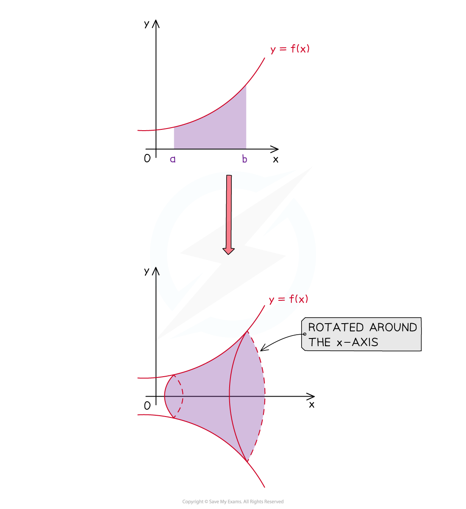

# Volumes of Revolution

## Volumes of Revolution About the x-axis

> **Spec point** — `spcpt_ZJ82Gv6yR2XWKRT4`

## Volumes of Revolution About the x-axis

### What is a volume of revolution about the x-axis?

- A **solid** **of** **revolution** is formed

  - when an **area** bounded by a function $y=f(x)$ and the lines $x=a$ and $x=b$
  - is **rotated** $2π$ radians $(360^{\circ})$ about the $x$-axis
- The **volume** **of** **revolution** is the volume of this solid

- Be careful – the ’front’ and ‘back’ of this solid are **flat**

  - they were created from **straight (vertical) lines**
  - 3D sketches can be misleading!

### What is the formula for a volume of revolution about the x-axis?

The **volume of revolution** of a solid rotated $2π$ radians ($360^{\circ}$) about the $x$-axis between $x=a$ and $x=b$ is given by:

- `V equals pi integral subscript a superscript b y squared space d x`

- This is **not** given on the exam formula sheet, so you need to remember it

  - Note that $πy^{2}$ is the **area** of the **circular cross-section** of the solid at any value of $x$
  - That might help you remember the form of the volume integral
- $y$ is a **function of **$x$

  - i.e.  `y equals straight f open parentheses x close parentheses`
- $x=a$ and $x=b$ are the equations of the (vertical) lines **bounding** the area

  - $a<b$  ($a$ is the 'left boundary' and $b$ is the 'right boundary')
  - $x=a$ and $x=b$ may be **given** in the question
  - one boundary may be the $y$**-axis** ($x=0$)
  - the $x$**-axis intercepts** of $y=f(x)$ may also be boundaries

### How do I calculate the volume of revolution about the x-axis?

- **STEP 1**
Identify the **limits** $a$ and $b$

  - These may be **given** in the question
  
    - or be indicated on a **graph** in the question
  - **Sketching** the graph of $y=f(x)$ can help if the graph is not provided
- **STEP 2**
**Square** the function  `y equals straight f open parentheses x close parentheses`

  - e.g.  `y equals x squared plus 1 space space rightwards double arrow space space y squared equals open parentheses x squared plus 1 close parentheses squared equals x to the power of 4 plus 2 x squared plus 1`
  - or  `y equals square root of 4 minus x end root space space rightwards double arrow space space y squared equals open parentheses square root of 4 minus x end root close parentheses squared equals 4 minus x`
- **STEP 3**
**Evaluate** the integral in the volume formula `V equals pi integral subscript a superscript b y squared space d x`

  - An answer may be required in **exact form**
  
    - i.e. as a multiple of $π$

> **Exam Hint**
> - Don't panic if  `y equals straight f open parentheses x close parentheses`  involves a square root
> 
>   - The square root will disappear when you find $y^{2}$
> - Don't forget to bring $π$ back in after working out the integral
> 
>   - In my experience that is a very common student error

> **Worked Example**
> Find the volume of the solid of revolution formed by rotating the region bounded by the graph of $y=\sqrt{3x^{2}+2}$, the coordinate axes and the line $x=3$ by $2π$ radians about the $x$-axis.  Give your answer as an exact value.
> 
> > *Start by finding the values of *$a$* and *$b$* for the formula*
> 
> > *'Bounded by the coordinate axes' tells us that the *$y$*-axis (*$x=0$*) is one boundary*
> *The question tells us that *$x=3$* is the other one*
> *So  *$a=0$*  and  *$b=3$
> 
> > *If in doubt, drawing a sketch can help*
> 
> 
> 
> > *Now square the function *`y equals straight f open parentheses x close parentheses`
> 
> `y squared equals open parentheses square root of 3 x squared plus 2 end root close parentheses squared equals 3 x squared plus 2`
> 
> > *Substitute everything into  *`V equals pi integral subscript a superscript b y squared space straight d x`
> 
> `V equals pi integral subscript 0 superscript 3 open parentheses 3 x squared plus 2 close parentheses space straight d x`
> 
> > *Work out the definite integral*
> 
> `table row cell integral subscript 0 superscript 3 open parentheses 3 x squared plus 2 close parentheses space straight d x end cell equals cell open square brackets 3 open parentheses fraction numerator x to the power of 2 plus 1 end exponent over denominator 2 plus 1 end fraction close parentheses plus 2 x close square brackets subscript 0 superscript 3 end cell row blank equals cell open square brackets x cubed plus 2 x close square brackets subscript 0 superscript 3 end cell row blank equals cell open parentheses open parentheses 3 close parentheses cubed plus 2 open parentheses 3 close parentheses close parentheses minus open parentheses open parentheses 0 close parentheses cubed plus 2 open parentheses 0 close parentheses close parentheses end cell row blank equals cell 33 minus 0 end cell row blank equals 33 end table`
> 
> > *Put that value back into the volume formula*
> 
> > *Don't forget to include the *$π$* !*
> 
> $V=33π$
> 
> > *The question asks for an exact value answer, so leave the answer in terms of *$π$
> 
> **Final answer:** **Volume **$=33π\mathrm{units}^{3}$
