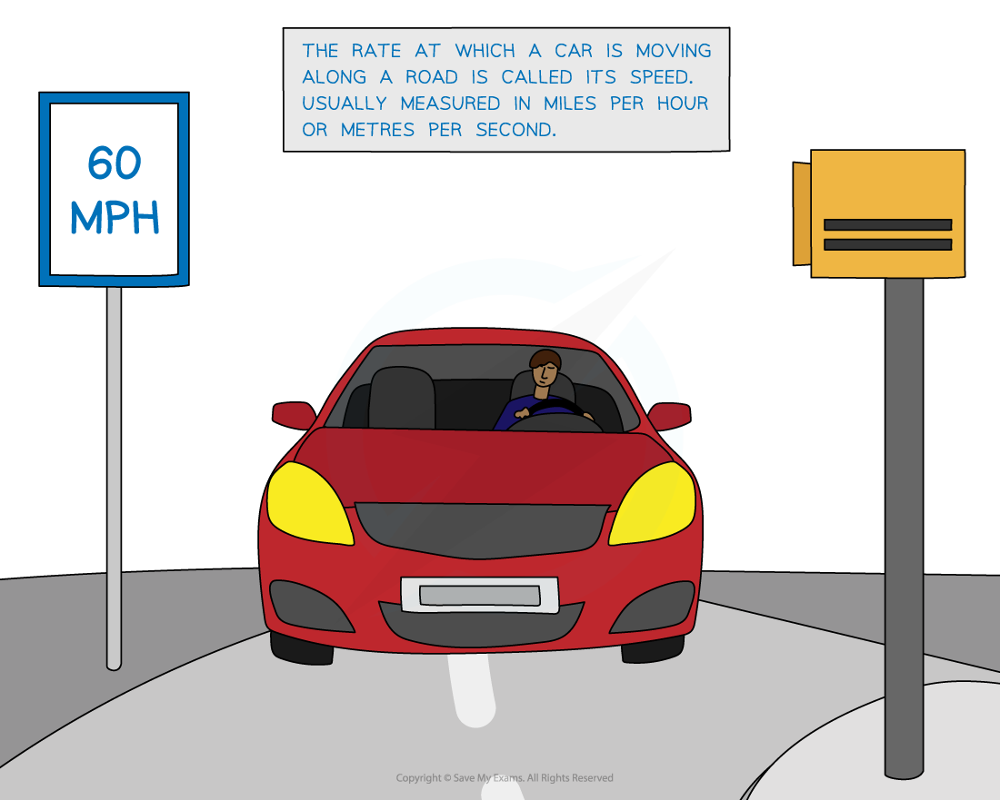
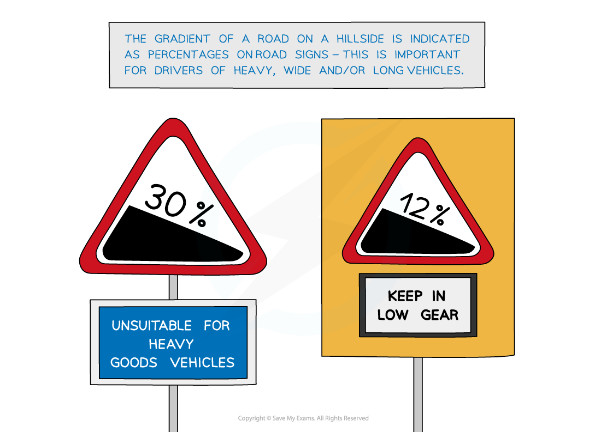
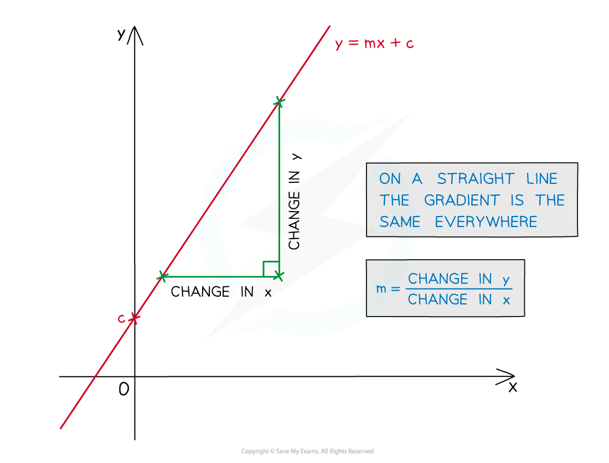
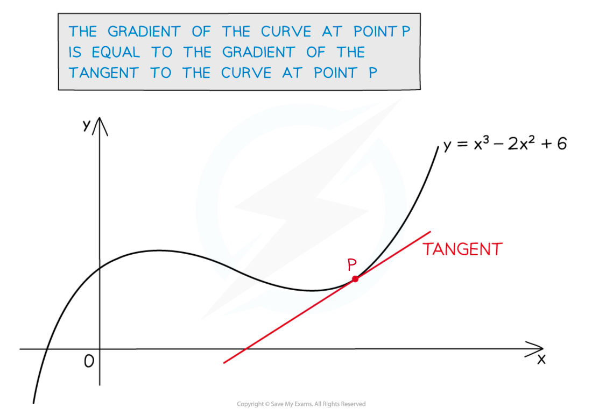

# Introduction to Derivatives

## Introduction to Derivatives

> **Spec point** — `spcpt_xMC4T9xtr5hyRDt5`

## Introduction to Derivatives

### What is differentiation?

- **Differentiation** is part of the branch of mathematics called calculus
- It is concerned with the **rate** at which **changes** takes place

  - So it has many **real‑world** applications:
  
    - The **rate** at which a car is moving (its speed)
    - The **rate** at which a virus spreads amongst a population

- To begin to understand differentiation you’ll need to understand **gradients**

### How are gradients related to rates of change?

- **Gradient** in everyday language refers to **steepness**.

  - For example, the **gradient** of a road up the side of a hill is important to lorry drivers
- On a **graph** the gradient refers to how 'steep' a **line** or a **curve** is
- It is a way of measuring how fast* ****y***  changes as ***x***  changes

  - This may be referred to as the '**rate of change of *****y  *****with respect to *****x****'*
- So **gradient** describes the **rate** at which **change** happens

### How do I find the gradient of a curve using its graph?

For a **straight line** the gradient is always the same (**constant**)

- Recall  ***y***** = *****mx***** + *****c***, where ***m***  is the gradient

- For a **curve** the **gradient** changes as the value of ***x***  changes

  - A **tangent** is a straight line that touches the curve at one point
  
    - At any point on the **curve**, the **gradient** of the curve is **equal** to the **gradient** of the **tangent** at that point

### How do I find the gradient of a curve using calculus?

- The **equation** of a curve can be given in the form `y equals straight f open parentheses x close parentheses`

  - Substituting *x*-coordinate **inputs** gives *y*-coordinate **outputs**
- It is possible to create an algebraic** function **that take **inputs** of *x*-coordinates

  - and gives **outputs** that are **gradients**
  
    - No graph sketching required!
- This type of function has a few commonly used names:

  - The **gradient function**
  - The **derivative**
  - The **derived function**
- The way to **write** this function is $\frac{dy}{dx}$

  - This is pronounced "d*y* by d*x*" or "d*y* over d*x*"
  - In **function notation**, it can be written `straight f apostrophe open parentheses x close parentheses`
  
    - pronounced "f-dash-of-*x" *or "f-prime-of-*x"*
- To get from `y equals straight f open parentheses x close parentheses` to `fraction numerator straight d y over denominator straight d x end fraction equals straight f apostrophe open parentheses x close parentheses` you need to do an operation called **differentiation**

  - Differentiation turns **curve equations** into **gradient functions**
  - There are **standard** **formulae** used to differentiate all the basic functions
  
    - See the '**Differentiating Basic Functions**' revision note
  - There are also various **methods** for differentiating more complicated functions
  
    - See the '**Techniques of Differentiation**' revision note
- Once you know `fraction numerator straight d y over denominator straight d x end fraction equals straight f to the power of apostrophe open parentheses x close parentheses` for a curve, you can find the **gradient** for **any point** on the curve

  - `straight f to the power of apostrophe open parentheses a close parentheses` gives the **value of the gradient** when $x=a$
  
    - See the '**Finding Gradients**' revision note for more details
