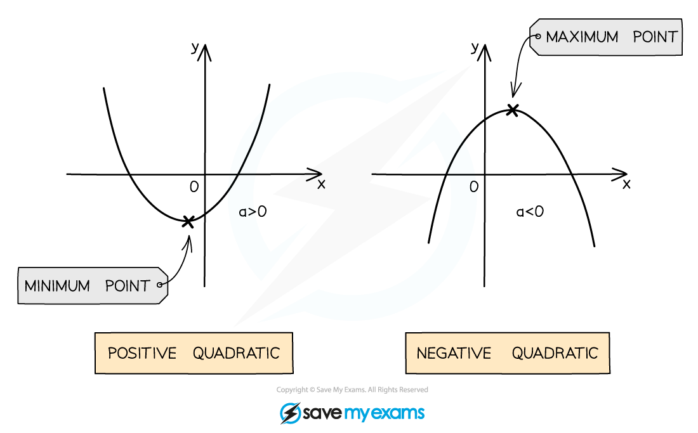
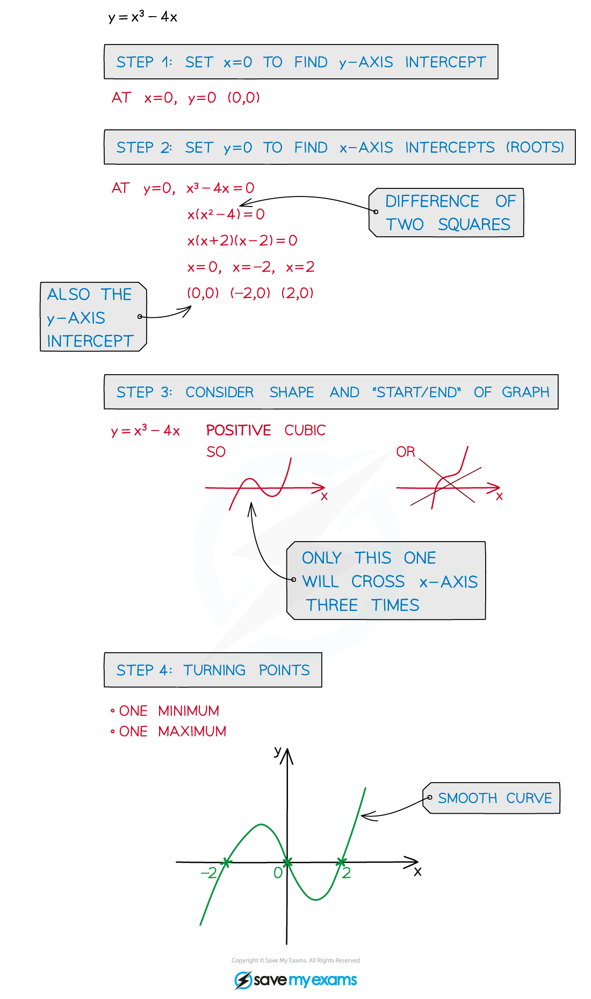

# Graphs of Polynomials

## Quadratic Functions & Graphs

> **Spec point** — `spcpt_3C6JG8MntWkWNfpJ`

## Quadratic Functions & Graphs

### What are the key features of quadratic graphs?

- A **quadratic** graph can be written in the form $y=ax^{2}+bx+c$ where $a\neq0$
- The shape of the graph is known as a **parabola**
- The value of *a* affects the shape of the curve

  - If *a *is **positive** the shape is **'u-shaped'** ∪
  - If *a *is **negative** the shape is **'upside down u-shaped'** ∩
- The ***y*****-intercept** is at the point (0, *c*)
- The **roots** are the solutions to $ax^{2}+bx+c=0$

  - These are also known as the ***x*****-intercepts** or **zeroes**
  - They can be found by
  
    - **Factorising**
    - **Quadratic formula**
    - **Completing the square**
    - Your **calculator** may also be able to find these for you
  - There can be **0, 1 or 2** *x-*intercepts
  
    - This is determined by the value of the **discriminant**
- There is an **axis of symmetry** at $x=-\frac{b}{2a}$

  - If there are two *x*-intercepts then the axis of symmetry goes through the **midpoint** between them
- The **vertex** lies on the axis of symmetry

  - It can be found by **completing the square**
  - The *x*-coordinate is $x=-\frac{b}{2a}$
  - The *y*-coordinate can be found by calculating *y *when $x=-\frac{b}{2a}$
  - If *a* is **positive** then the vertex is the **minimum point**
  - If *a* is **negative** then the vertex is the **maximum point**

### What are the equations of a quadratic function?

- $f(x)=ax^{2}+bx+c$

  - This is the **general form**
  - It clearly shows the *y*-intercept (0, *c*)
  - You can find the axis of symmetry by $x=-\frac{b}{2a}$
- $f(x)=a(x-p)(x-q)$

  - This is the **factorised form**
  - It clearly shows the roots (*p*, 0) & (*q*, 0)
  - You can find the axis of symmetry by $x=\frac{p+q}{2}$
- $f(x)=a(x-h)^{2}+k$

  - This is the **vertex form** (or **completed square form**)
  - It clearly shows the vertex (*h*, *k*)
  - The axis of symmetry is therefore $x=h$
  - It clearly shows how the function can be transformed from the graph of $y=x^{2}$
  
    - Vertical stretch by scale factor ­*a*
    - Translation by vector `stretchy left parenthesis table row h row k end table stretchy right parenthesis`

### How do I find an equation of a quadratic?

- If you have the **roots** *x *= *p *and *x* = *q*...

  - Write in **factorised form** $y=a(x-p)(x-q)$
  - You will need a third point to find the value of *a*
- If you have the **vertex** (*h*, *k*) then...

  - Write in **vertex form **$y=a(x-h)^{2}+k$
  - You will need a second point to find the value of *a*
- If you have **three random points** (*x**1**, y**1*), (*x**2**, y**2*) & (*x**3**, y**3*) then...

  - Write in the **general form** $y=ax^{2}+bx+c$
  - Substitute the three points into the equation
  - Form and solve a system of three linear equations to find the values of *a*, *b *& *c*

> **Exam Hint**
> - Your calculator may be able to find the roots and turning point of a quadratic function
> 
>   - Even on a 'show that' question this can be used to check your answers

> **Worked Example**
> The diagram below shows the graph of $y=f(x)$, where $f(x)$ is a quadratic function.
> 
> The vertex and the intercept with the $y$-axis have been labelled.
> 
> 
> 
> Find an expression for $y=f(x)$.
> 
> *Method 1*
> 
> *Since we know the vertex (turning point), it will be easiest to start with the completed square version of the equation *
> *This is  *$f(x)=a(x-h)^{2}+k$*,  where the vertex is at *`open parentheses h comma space k close parentheses`
> 
> `table row cell straight f open parentheses x close parentheses end cell equals cell a open parentheses x minus open parentheses negative 1 close parentheses close parentheses squared plus 8 end cell row blank equals cell a open parentheses x plus 1 close parentheses squared plus 8 end cell end table`
> 
> > *We also know the curve *`y equals straight f open parentheses x close parentheses`* goes through (0, 6)*
> *Put those coordinates into the equation and solve for *$a$
> 
> `table row 6 equals cell a open parentheses 0 plus 1 close parentheses squared plus 8 end cell row 6 equals cell a plus 8 end cell row a equals cell negative 2 end cell end table`
> 
> > *Substitute *$a=-2$* into the expression for *`straight f open parentheses x close parentheses`
> *Expand the brackets and rearrange into the form required*
> 
> `table row cell straight f open parentheses x close parentheses end cell equals cell negative 2 open parentheses x plus 1 close parentheses squared plus 8 end cell row blank equals cell negative 2 open parentheses x squared plus 2 x plus 1 close parentheses plus 8 end cell row blank equals cell negative 2 x squared minus 4 x minus 2 plus 8 end cell end table`
> 
> $f(x)=-2x^{2}-4x+6$
> 
> > *Method** **2*
> 
> *It is also possible to start with the *$y=ax^{2}+bx+c$* form*
> *Because the **y-**intercept is (0, 6) we know that *$c=6$
> 
> *Goes through *`open parentheses 0 comma space 6 close parentheses`* means  *`straight f open parentheses x close parentheses equals a x squared plus b x plus 6`
> 
> > *It also goes through (-1, 8)*
> *Substitute those coordinates into the equation of *`y equals f open parentheses x close parentheses`
> 
> *Goes through *`open parentheses negative 1 comma space 8 close parentheses`* means*
> 
> `table row 8 equals cell a open parentheses negative 1 close parentheses squared plus b open parentheses negative 1 close parentheses plus 6 end cell row 8 equals cell a minus b plus 6 end cell row cell a minus b end cell equals 2 end table`
> 
> > *We need one more piece of information*
> *You may remember that the turning point lies on the line  *$x=-\frac{b}{2a}$
> *If not, then use the fact that the **x-**coordinate of the turning point satisfies  *`straight f to the power of apostrophe open parentheses x close parentheses equals 0`
> 
> *Turning point at *`open parentheses negative 1 comma space 8 close parentheses`* means**  *`straight f to the power of apostrophe open parentheses negative 1 close parentheses equals 0`
> 
> > *Differentiate to find *`straight f to the power of apostrophe open parentheses x close parentheses`
> *Then solve *`straight f to the power of apostrophe open parentheses negative 1 close parentheses equals 0`* to find another equation with *$a$*and *$b$
> 
> `straight f to the power of apostrophe open parentheses x close parentheses equals 2 a x plus b`
> 
> `table row cell 2 a open parentheses negative 1 close parentheses plus b end cell equals 0 row cell negative 2 a plus b end cell equals 0 end table`
> 
> > *We now have two simultaneous equations that we can solve to find *$a$* and *$b$
> 
> `table row cell a minus b end cell equals cell 2 space space space space open square brackets 1 close square brackets end cell row cell negative 2 a plus b end cell equals cell 0 space space space space open square brackets 2 close square brackets end cell end table`
> 
> > *Add [1] and [2] together to eliminate *$b$
> 
> `table row cell negative a end cell equals 2 row a equals cell negative 2 end cell end table`
> 
> > *Substitute into [2] and solve to find *$b$
> 
> `table row cell negative 2 open parentheses negative 2 close parentheses plus b end cell equals 0 row cell 4 plus b end cell equals 0 row b equals cell negative 4 end cell end table`
> 
> > *Write final answer in form requested*
> 
> $f(x)=-2x^{2}-4x+6$

## Cubic Functions & Graphs

> **Spec point** — `spcpt_BVGDhJ8Vrx9MfGPk`

## Cubic Functions & Graphs

### What are the key features of cubic graphs?

- A **cubic **graph can be written in the form  $y=ax^{3}+bx^{2}+cx+d$  where $a\neq0$
- When asked to consider the **equation** of a cubic and its **graph**, think about the following

  - ***y****-*axis intercept
  
    - This occurs at  `open parentheses 0 comma space d close parentheses`
  - ***x****-*axis intercepts (**roots**)
  
    - *x-*coordinates are the solutions to  $ax^{3}+bx^{2}+cx+d=0$
  - **turning points** (**maximum** and/or **minimum**)
  
    - A cubic can have **0 or 2** turning points
    - *x-*coordinates are the solutions to  $3ax^{2}+2bx+c=0$
    - these are when the derivative of $ax^{3}+bx^{2}+cx+d$ equals 0
  - The value of $a$ affects the shape of the curve
  
    - If $a$ is **positive** the ends of the curve will go 'down on the left and up on the right'
    - If $a$ is **negative** the ends of the curve will go 'up on the left and down on the right'

### How do I sketch the graph of a cubic?

- **STEP 1**       
Find the ***y****-*axis intercept by setting ***x***** = 0**
- **STEP 2**
Find the ***x***-axis intercepts (roots) by setting ***y***** = 0*** *

  - This may require **factorising** the cubic
- **STEP 3**
Consider the shape and “start”/”end” of the graph

  - a **positive** **cubic** graph starts in third quadrant (“bottom left”) and ends in first quadrant (“top right”)
  - a **negative cubic **graph starts in second quadrant (“top left”) and ends in fourth quadrant (“bottom right”)
- **STEP 4**
Consider where any **turning points** should go

  - **Differentiate** the equation of the curve and set equal to zero
- **STEP 5**
Draw with a **smooth** curve (this takes practice!)

> **Worked Example**
> Consider the function  `straight f open parentheses x close parentheses equals negative x cubed plus b x squared plus c x`,  where $b$ and $c$ are constants.
> 
> The graph of  `y equals straight f open parentheses x close parentheses`  has two turning points, the $x$-coordinates of which are $1$ and $3$.
> 
> (a) Find the values of $b$ and $c$.
> 
> > *The turning points occur when *`straight f to the power of apostrophe open parentheses x close parentheses equals 0`
> 
> > *Start by differentiating to find *`straight f to the power of apostrophe open parentheses x close parentheses`
> 
> `straight f to the power of apostrophe open parentheses x close parentheses equals negative 3 x squared plus 2 b x plus c`
> 
> > *That is equal to 0 when *$x=1$* and when *$x=3$
> 
> > *Substitute those values in to find two equations in *$b$* and *$c$
> 
> `table row cell negative 3 open parentheses 1 close parentheses squared plus 2 b open parentheses 1 close parentheses plus c end cell equals 0 row cell negative 3 plus 2 b plus c end cell equals 0 row cell 2 b plus c end cell equals 3 end table`
> 
> `table row cell negative 3 open parentheses 3 close parentheses squared plus 2 b open parentheses 3 close parentheses plus c end cell equals 0 row cell negative 27 plus 6 b plus c end cell equals 0 row cell 6 b plus c end cell equals 27 end table`
> 
> > *Those are simultaneous equations in *$b$* and *$c$
> *Subtract the first from the second to eliminate *$c$* and find *$b$
> *Then substitute that value into either equation to find *$c$
> 
> $b=6c=-9$
> 
> (b) Sketch the graph of `y equals straight f open parentheses x close parentheses`.
> 
> > *There is no constant term in *`straight f open parentheses x close parentheses`*, so the **y**-intercept will be 0*
> 
> > *Substitute the **x**-coordinates of the turning points into *`straight f open parentheses x close parentheses`* to find the corresponding **y**-coordinates*
> 
> > * *
> 
> `negative open parentheses 1 close parentheses cubed plus 6 open parentheses 1 close parentheses squared minus 9 open parentheses 1 close parentheses equals negative 1 plus 6 minus 9 equals negative 4
> 
> minus open parentheses 3 close parentheses cubed plus 6 open parentheses 3 close parentheses squared minus 9 open parentheses 3 close parentheses equals negative 27 plus 54 minus 27 equals 0`
> 
> > *So the turning points are at  *`open parentheses 1 comma space minus 4 close parentheses`* and *`open parentheses 3 comma space 0 close parentheses`
> 
> > *Find the **x-**intercepts by solving *`straight f open parentheses x close parentheses equals 0`
> 
> `table row cell negative x cubed plus 6 x squared minus 9 x end cell equals 0 row cell negative x cubed open parentheses x squared minus 6 x plus 9 close parentheses end cell equals 0 row cell negative x cubed open parentheses x minus 3 close parentheses squared end cell equals 0 end table`
> 
> $x=0,x=3$
> 
> > *So the **x-**intercepts are *`open parentheses 0 comma space 0 close parentheses`* and *`open parentheses 3 comma space 0 close parentheses`
> *Note that the first is also the **y-**intercept. and the second is also a turning point*
> 
> > *Finally consider the shape of the curve*
> *It's a 'negative cubic', so it's going to be 'up on the left and down on the right'*
> *Draw a smooth curve incorporating all these features*
> *Label the turning points and intercepts*
> 
> 
