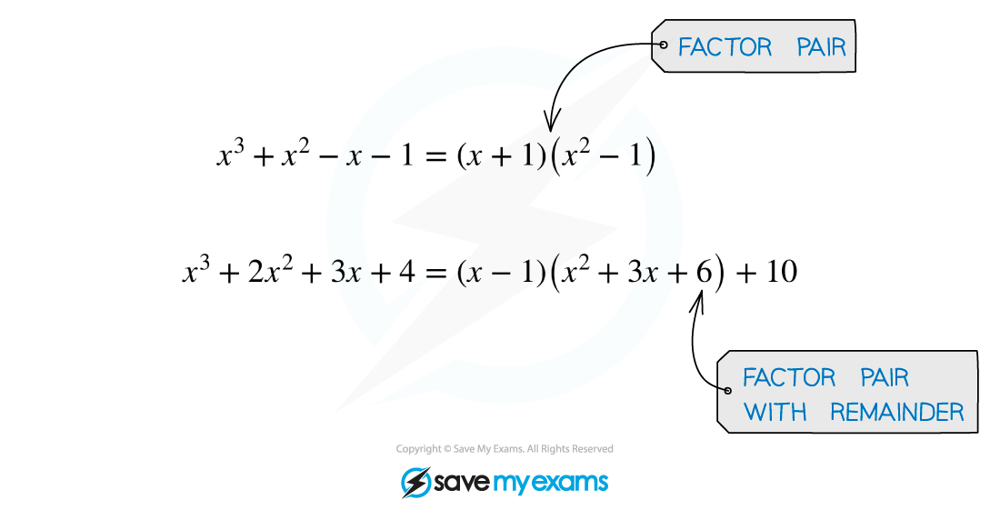
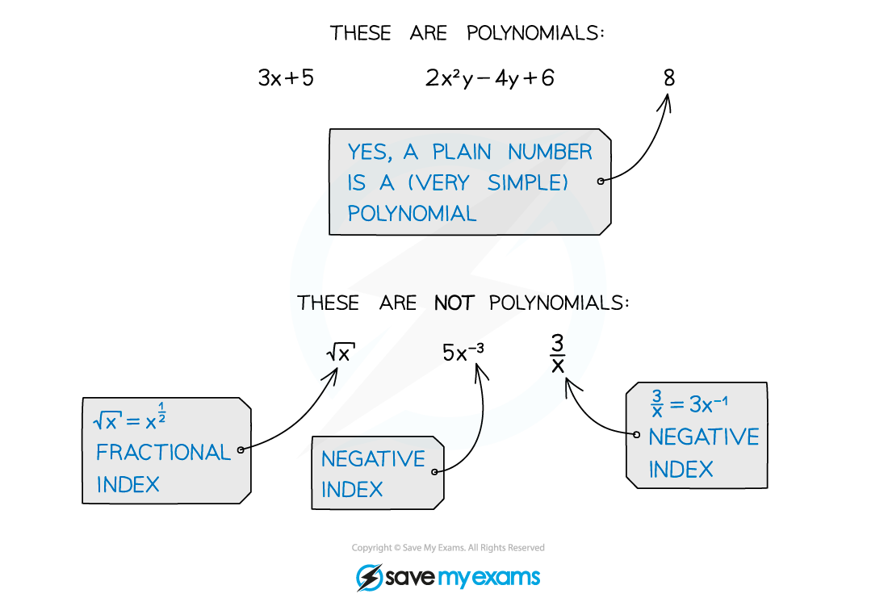
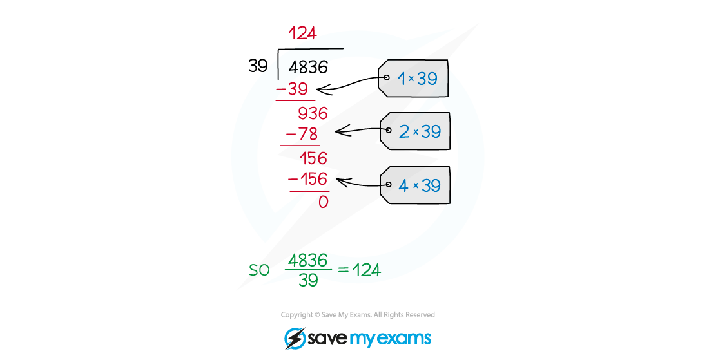
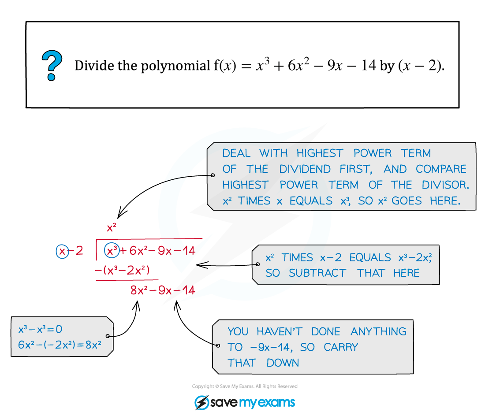

# Algebraic Division

## Algebraic Division

> **Spec point** — `spcpt_xBxjpCXMWrkf6mww`

## Algebraic Division

### What is algebraic division?

- **Algebraic division **(or **polynomial division**) is a method for **splitting polynomials** into **factor pairs** (with or without an accompanying **remainder** term)

  - On the exam you will use it to **factorise** polynomials, or to help **simplify** algebraic fractions

- Remember that a **polynomial** is an algebraic expression consisting of

  - a **finite** number of terms
  - with **non-negative integer indices** only

### How do I perform algebraic division?

- The **method** used for **algebraic division** is just like the method used to divide **regular numbers**

  - i.e. the **long division** method (sometimes called '**bus stop division**')

- On your exam the polynomial you are **dividing** (known as the **dividend**) will normally be of **degree 3 or 4**

  - That is, with powers of *x*  up to ***x*****3*** *or ***x******4***
- The term you are **dividing by** (known as the **divisor**) will be a **linear** term

  - Usually in the form **(*****x***** ± *****a*****)**
  - But possibly in the form **(a*****x***** ± *****b*****)**
- The answer to an algebraic division question is built up **term by term**

  - Working **downwards** in powers of the variable (usually ***x***)

- Start with the **highest power term** of the answer

  - Write out this **multiplied** by the divisor and **subtract**

- Continue the process for each **decreasing power term**

  - **multiplying** by the divisor and **subtracting** each time

- **Continue** until you are left only with a **number** (with no ***x***'s)

  - That number is the **remainder**
  - If the divisor is a **factor** of the polynomial, the remainder will be **zero**

> **Exam Hint**
> - Don't rush when doing algebraic division
> 
>   - Finding and fixing a mistake can take longer than taking the time to do it right the first time!
> 
> - Before starting algebraic division make sure it is really necessary
> 
>   - For example, if all you need is the remainder then using the **remainder theorem** would be quicker

> **Worked Example**
> 
