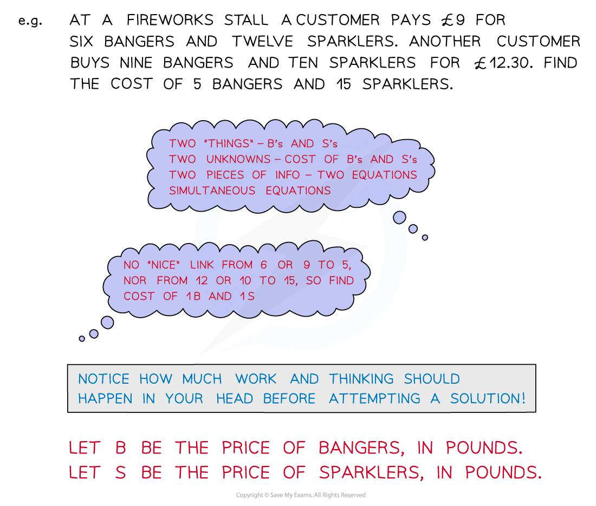
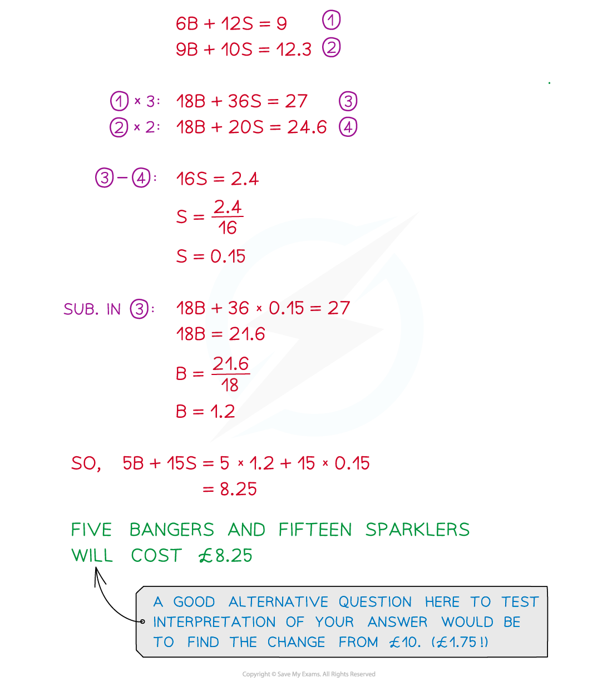

# Simultaneous Equations

## Linear Simultaneous Equations

> **Spec point** — `spcpt_CBbGQXTmRztnH5b3`

## Linear Simultaneous Equations

### What are linear simultaneous equations?

- When there are two unknowns (say ***x***** and *****y***) in a problem, we need two equations to be able to find them both: these are called simultaneous equations

  - you solve **two **equations to find **two **unknowns, *x* and *y*
  
    - for example, 3*x* + 2*y* = 11 and 2*x* - *y* = 5
    - the solutions are *x* = 3 and *y* = 1
- If they just have* x* and *y* in them (no *x*2 or *y*2 or *xy* etc) then they are **linear** simultaneous equations

### How do I solve linear simultaneous equations by elimination?

- "Elimination" completely removes one of the variables, *x *or *y*
- To eliminate the *x*'s from 3*x* + 2*y* = 11 and 2*x* - *y* = 5

  - Multiply every term in the first equation by 2
  
    - 6*x* + 4*y* = 22
  - Multiply every term in the second equation by 3
  
    - 6*x* - 3*y* = 15
  - **Subtract** the second result from the first to eliminate the 6x's
  
    - leaving 4*y* - (-3*y*) = 22 - 15, i.e. 7*y* = 7
  - Solve to find *y* (*y* = 1) then substitute *y* = 1 back into either original equation to find *x* (*x* = 3)
- Alternatively, to eliminate the *y*'s from 3*x* + 2*y* = 11 and 2*x* - *y* = 5

  - Multiply every term in the second equation by 2
  
    - 4*x* - 2*y* = 10
  - **Add** this result to the first equation to eliminate the 2*y*'s (as 2*y* + (-2*y*) = 0)
  
    - The process then continues as above
- **Check** that your final solutions satisfy both equations

### How do I solve linear simultaneous equations by substitution?

- "Substitution" means substituting one equation into the other
- Solve 3*x* + 2*y* = 11 and 2*x* - *y* = 5 by substitution

  - Rearrange one of the equation into *y* = ... (or *x* = ...)
  
    - For example, the second equation becomes *y* = 2*x* - 5
  - Substitute this into the first equation (replace all *y*'s with 2*x* - 5 in brackets)
  
    - 3*x* + 2(2*x* - 5) = 11
  - Solve this equation to find *x* (*x* = 3), then substitute *x* = 3 into *y* = 2*x* - 5 to find *y* (*y* = 1)
- **Check** that your final solutions satisfy both equations

### How do I use graphs to solve linear simultaneous equations?

- **Plot** both equations on the same set of axes

  - to do this, you can use a table of values or rearrange into *y* = *mx* + *c *if that helps
- Find where the lines **intersect** (cross over)

  - The *x* and *y  ***solutions** to the simultaneous equations are the *x- *and *y-***coordinates** of the point of **intersection**
- e.g. to solve 2*x *- *y* = 3 and 3*x* + *y* = 7 simultaneously, first plot them both (see graph)

  - find the point of intersection, (2, 1)
  - the solution is *x* = 2 and *y* = 1

### How do I solve linear simultaneous equations from worded contexts?

> **Exam Hint**
> - Always check that your final solutions satisfy the original simultaneous equations - you will know immediately if you've got the right solutions or not.

> **Worked Example**
> Solve the simultaneous equations
> 
> $5x+2y=11$
> 
> $4x-3y=18$
> 
> > *Number the equations.*
> 
> > `table row cell 5 x space plus space 2 y space end cell equals cell space 11 space space space space space space space space space space space space end cell row cell 4 x space minus space 3 y space end cell equals cell space 18 space space space space space space space space space space space space end cell end table``table row blank blank cell open parentheses 1 close parentheses end cell row blank blank cell open parentheses 2 close parentheses end cell end table`* *
> 
> > *Make the **y**  terms equal by multiplying all parts of equation (1) by 3 and all parts of equation (2) by 2.*
> *This will give two 6**y  **terms with different signs. The question could also be done by making the **x  **terms equal by multiplying all parts of equation (1) by 4 and all parts of equation (2) by 5, and subtracting the equations.*
> 
> `table row cell 15 x space plus space 6 y space end cell equals cell space 33 space space space space space space space space space space end cell row cell 8 x space minus space 6 y space end cell equals cell space 36 space space space space space space space space space space end cell end table``table row blank blank cell open parentheses 3 close parentheses end cell row blank blank cell open parentheses 4 close parentheses end cell end table`
> 
> > *The 6**y**  terms have different signs, so they can be eliminated by adding equation (4) to equation (3). *
> 
> `space space space space space space space space space space 15 x space plus space 6 y space equals space 33 space space space space space space space space space space space space
> bottom enclose space plus open parentheses space space space space space space 8 x space minus space 6 y space equals space 36 close parentheses space end enclose
> space space space space space space space space space space 23 x space space space space space space space space space space space space space equals space 69 space`
> 
> > *Solve the equation to find** x  **by dividing both sides by 23.*
> 
> `table row cell x space end cell equals cell space 69 over 23 equals space 3 end cell end table`
> 
> > *Substitute **x **= 3 into either of the two original equations**.*
> 
> > `open parentheses 1 close parentheses space space space space space`* *`5 open parentheses 3 close parentheses space plus space 2 y space equals space 11`
> 
> > *Solve this equation to find** y.*
> 
> `table row cell 15 space plus space 2 y space end cell equals cell space 11 end cell row cell 2 y space end cell equals cell space 11 space minus space 15 end cell row cell 2 y space end cell equals cell space minus 4 space end cell row cell y space end cell equals cell fraction numerator negative 4 over denominator 2 end fraction space equals space minus 2 end cell end table`
> 
> > *Substitute **x** = 3  and **y** = - 2 into the other equation to check that they are correct*
> 
> > `table row blank blank cell open parentheses 2 close parentheses space space space space space end cell end table`* *`table row cell 4 x space minus space 3 y space end cell equals cell space 18 end cell end table`
> *   *`table row cell 4 open parentheses 3 close parentheses space minus space 3 open parentheses negative 2 close parentheses space end cell equals cell space 18 end cell row cell 12 space minus open parentheses negative 6 close parentheses space end cell equals cell space 18 end cell row cell 18 space end cell equals cell space 18 end cell end table`
> 
> $x=3,y=-2$

## Quadratic Simultaneous Equations

> **Spec point** — `spcpt_KYCWyzCHHWynRdJg`

## Quadratic Simultaneous Equations

#### What are quadratic simultaneous equations?

- When there are two unknowns (say *x* and *y *) in a problem, we need two equations to be able to find them both: these are called** simultaneous equations**
- If there is an *x*2 or *y*2 or *xy  *in one of the equations then they are **quadratic** (or **non-linear**) simultaneous equations

#### How do I solve quadratic simultaneous equations?

- Use the method of substitution

  - **Substitute** the** linear** equation, *y* = ... (or *x* = ...), into the quadratic equation
  
    - Do not try to substitute the quadratic equation into the linear equation
- For example solve *x*2 + *y*2 = 25 and *y* - 2*x* = 5

  - **Rearrange** the **linear** equation into *y *= 2*x* + 5
  - **Substitute** this into the quadratic equation, replacing all *y*'s with (2*x* + 5) in **brackets**
  
    - *x*2 + (2*x* + 5)2 = 25
  - Expand and **solve** this **quadratic** equation (*x* = 0 and *x* = -4)
  - Substitute **each** value of *x* into the **linear** equation, *y* = 2*x* + 5, to get their value of *y*
  - Present your solutions in a way that makes it obvious which* x * belongs to which *y*
  
    - *x* = 0, *y* = 5 or *x* = -4, *y* = -3
- **Check** that your final solutions satisfy both equations

#### How do you use graphs to solve quadratic simultaneous equations?

- **Plot** both equations on the same set of axes

  - to do this, you can use a table of values (or, for straight lines, rearrange into *y* = *mx* + *c  *if it helps)
- Find where the lines **intersect** (cross over)

  - The *x * and *y  ***solutions** to the simultaneous equations are the *x- *and *y-***coordinates** of the point of **intersection**
- e.g. to solve y = *x*2 + 3*x* + 1 and *y* = 2*x* + 1 simultaneously, first plot them both (see graph)

  - find the points of intersection, (-1, -1) and (0, 1)
  - the solutions are *x* = -1 and *y* = -1, or *x* = 0 and *y* = 1

> **Exam Hint**
> - If the quadratic resulting from substitution has
> 
>   - a **repeated root,** then the line is a **tangent** to the curve
>   - **no roots,** then the line does not intersect with the curve – or you have made a mistake!
> - When giving your final answer, make sure you indicate which *x*  and *y*  values go together
> 
>   - If you don’t make this clear you can lose marks for an otherwise correct answer.
> - Don't make the common mistake of thinking each squared term in *x*2 + *y*2 = 25 can be square-rooted to give *x* + *y* = 5
> 
>   - They can't, the most you can do is $\sqrt{x^{2}+y^{2}}=\pm5$
>   - But you shouldn't be trying to make* x* or *y * the subject of this anyway!)

> **Worked Example**
> Solve the equations
> 
> $x^{2}+y^{2}=36$
> 
> $x=2y+6$
> 
> > *Number the equations.*
> 
> > $x^{2}+y^{2}=36\,x=2y+6$`open parentheses 1 close parentheses
> open parentheses 2 close parentheses`* *
> 
> > *There is one quadratic equation and one linear equation so this must be done by substitution.*
> 
> > *Equation (2) is equal to *$x$* so this can be eliminated by substituting it into the *$x$* part for equation (1).*
> *Substitute *$x=2y+6$* into equation (1).*
> 
> `open parentheses 2 y space plus space 6 close parentheses squared space plus space y squared space equals space 36`
> 
> > *Expand the brackets, remember that a bracket squared should be treated the same as double brackets.*
> 
> `open parentheses 2 y space plus space 6 close parentheses open parentheses 2 y space plus space 6 close parentheses space space plus space y squared space equals space 36
> 4 y to the power of 2 space end exponent plus space 6 open parentheses 2 y close parentheses space plus space 6 open parentheses 2 y close parentheses space plus space 6 squared space plus space y to the power of 2 space end exponent equals space 36`
> 
> > *Simplify.*
> 
> `table row cell 4 y to the power of 2 space end exponent plus space 12 y space plus space 12 y space plus space 36 space plus space y to the power of 2 space end exponent end cell equals cell space 36 end cell row cell 5 y to the power of 2 space end exponent plus space 24 y space plus space 36 space end cell equals cell space 36 end cell end table`
> 
> > *Rearrange to form a quadratic equation that is equal to zero.*
> 
> `table row cell 5 y to the power of 2 space end exponent plus space 24 y space plus space 36 space minus space 36 space end cell equals cell space 0 end cell row cell 5 y squared space plus space 24 y space end cell equals cell space 0 end cell end table`
> 
> > *Both terms contain a power of *$y$
> *So this can be factorised by taking out a common factor of *`table attributes columnalign right center left columnspacing 0px end attributes row blank blank y end table`*.*
> 
> `table row cell y open parentheses 5 y space plus space 24 close parentheses space end cell equals cell space 0 end cell end table`
> 
> > *Solve to find the values of *$y$*.*
> *Let each factor be equal to 0 and solve.*
> 
> `table row cell y subscript 1 space end cell equals cell space 0 space space space space space space space space space space space space space space end cell row cell 5 y subscript 2 space plus space 24 space end cell equals cell space 0 space space rightwards double arrow space space y subscript 2 equals space minus 24 over 5 space equals space minus 4.8 end cell end table`
> 
> *Substitute the values of *$y$* **into one of the equations (the linear equation is easier) to find the values of *$x$*.*
>               `x subscript 1 space equals space 2 left parenthesis 0 right parenthesis space plus space 6 space equals space 6 space space space space space space space space space space space space x subscript 2 space equals space 2 open parentheses negative 24 over 5 close parentheses space plus space 6 space equals space minus 9.6 space plus space 6`
> 
> **                                                                                                             **$x_{1}=6,y_{1}=0$
> *                                                                                         *$x_{2}=-3.6,y_{2}=-4.8$
