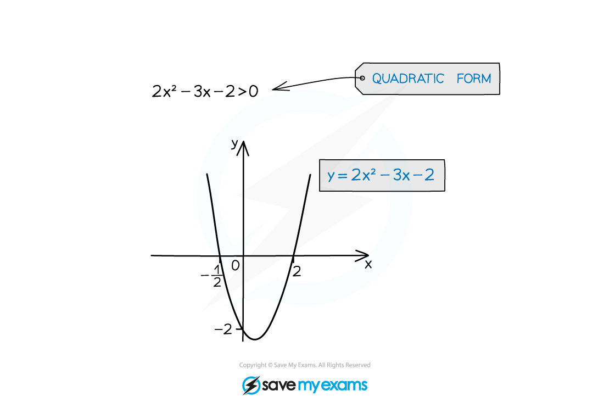
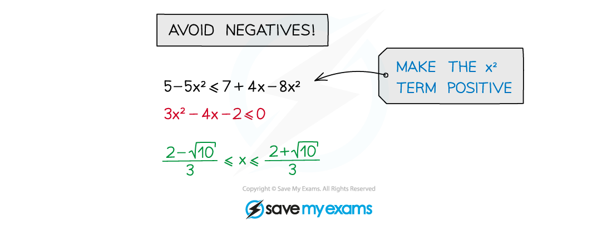

# Solving Inequalities

## Solving Linear Inequalities

> **Spec point** — `spcpt_z4dBxJJtXPYG3x86`

## Solving Linear Inequalities

### What is a linear inequality?

- An **inequality** tells you that one expression is greater than (“>”) or less than (“<”) another

  - “⩾” means “greater than or equal to”
  - “⩽” means “less than or equal to”
- A **linear inequality** only has constant terms (numbers with no letters) and terms in ***x*** (and/or ***y***)

  - but no* ****x*****2** terms or terms with other powers of *x*
  
    - 3*x*2 > 12 is not a linear inequality (it is a **quadratic inequality**)

### How do I solve linear inequalities?

- Solving linear inequalities is just like **solving linear equations**

  - Follow the same rules, but keep the inequality sign throughout
  
    - Changing the inequality sign to an equals sign changes the meaning of the problem
- When you **multiply **or **divide** both sides by a **negative **number, you must **flip the sign** of the inequality

  - e.g. **1 < 2**
  
    - Multiply both sides by –1 (negative number)
    - It becomes **–1 > –2 **(sign flips)
- **Never multiply **or **divide** by a **variable **(*x*)

  - It could be **positive or negative**
- The **safest way **to rearrange is simply to **add & subtract** to move all the terms onto one side
- You also need to know how to

  - use **set notation**
  - deal with **“double” inequalities**

### How do I represent linear inequalities using set notation?

- We use **curly brackets** and a** colon** in **set notation**

  - `open curly brackets x colon space... close curly brackets` means "*x* is in the set such that ..."
  
    - e.g. the set of all *x *such that *x *is greater than 3 is written `open curly brackets x colon space x greater than 3 close curly brackets`

- If *x * is **between** two values

  - you can write it as a single set
  
    - e.g. if *x* is greater than 3 **and** less than or equal to 5, then in set notation `open curly brackets x colon space 3 less than x less or equal than 5 close curly brackets`
  - or you can write it as separate sets, using the **intersection** symbol, $\cap$
  
    - so the above example could also be written in set notation as `open curly brackets x colon x greater than 3 close curly brackets intersection open curly brackets x colon x less or equal than 5 close curly brackets`
  - Either way will get the marks, unless a question specifically **asks for** one or the other

- If *x * is **less than one value OR greater than another value** (disjoint sets)

  - then the two end values must be written in separate sets using the **union** symbol, $\cup$
  
    - e.g. if *x* is less than 3 **or** greater than or equal to 5, then in set notation `open curly brackets x colon x less than 3 close curly brackets union open curly brackets x colon greater or equal than 5 close curly brackets`

### How do I solve double inequalities?

- Inequalities such as $a<2x<b$ can be solved by doing the same thing to **all three parts** of the inequality

  - Use the same rules as solving linear inequalities

> **Exam Hint**
> - Do not change the inequality sign to an equals when solving linear inequalities
> 
>   - You will lose marks in an exam for doing this.
> - Remember to **reverse the direction** of the inequality sign when **multiplying** or **dividing** by a **negative** number!

> **Worked Example**
> (a) Solve the inequality $-7\leq3x-1<2$.
> 
> > *This is a double inequality, so any operation carried out to one side must be done to all three parts.*
> *Use the expression in the middle to choose the inverse operations needed to isolate **x.*
> 
> > *Add 1 to all three parts.*
> *Remember not to change the inequality signs.*
> 
> $-6\leq3x<3$
> 
> > *Divide all three parts by 3.*
> *3 is positive so there is no need to flip the signs.*
> 
> $-2\leqx<1$
> 
> (b) Write your answer to part (a) in set notation as the intersection of two sets.
> 
> > *Rewrite your answer using the set notation rules discussed above*
> 
> `stretchy left curly bracket x colon x greater or equal than negative 2 stretchy right curly bracket bold intersection stretchy left curly bracket x colon x less than 1 stretchy right curly bracket`

> **Worked Example**
> Solve the inequality $5-2x\leq21$.
> 
> > *Subtract 5 from both sides, keeping the inequality sign the same*
> 
> $-2x\leq16$
> 
> > *Now divide both sides by -2.*
> *However because you are dividing by a negative number, you must flip the inequality sign*
> 
> $x\geq-8$
> 
> > *The final answer is normally written with the number first, but you won't be penalised for writing the **x** first so long as the inequality sign is the correct way around*
> 
> $x\geq-8$  **or ** $-8\leqx$

## Solving Quadratic Inequalities

> **Spec point** — `spcpt_ttvmgf7CXmh22B4h`

## Solving Quadratic Inequalities

### What are quadratic inequalities?

- A **quadratic inequality **is an inequality with a term in *x*2 (but no higher powers of *x*)
- Solving the inequality requires solving the corresponding **quadratic equation**
- Sketching a quadratic **graph** is essential

### How do I solve quadratic inequalities?

- **STEP 1**
**Rearrange** the inequality into quadratic form with a **positive squared term**

  - ***ax*****2**** + *****bx***** + *****c***** > 0**  with  ***a***** > 0**
  
    - The inequality sign may be >, <, ≤ or ≥
- **STEP 2**
Find the **roots** of the quadratic equation

  - **Solve** *ax*2 + *bx* + *c *= 0 to get ***x*****1*** *and* ****x*****2 **where** *****x*****1**** < *****x*****2**
- **STEP 3**
**Sketch** a graph of the quadratic and **label the roots**

  - As the squared term is positive it will be **"U" shaped**
- **STEP 4**
**Identify** the **region** that satisfies the inequality

  - For ***ax*****2**** + *****bx***** + *****c***** > 0 **you want the region **above** the *x*-axis
  
    - The solution is ***x *****< *****x*****1** **or** ***x *****> *****x*****2**** **
    - It is ***x *****≤ *****x*****1** **or** ***x *****≥ *****x*****2**** **if the original inequality was ≥ instead of >
  - For ***ax*****2**** + *****bx***** + *****c***** < 0 **you want the region below the *x*-axis
  
    - The solution is ***x >***** *****x*****1** **and** ***x *****< *****x*****2****  **
    - This is more commonly written as ***x*****1**** < *****x***** < *****x*****2**
    - It is ***x ≥***** *****x*****1** **and** ***x ≤***** *****x*****2****  **(***x*****1**** *****≤***** *****x***** *****≤***** *****x*****2****) **if the original inequality was ≤ instead of <
- **Avoid** multiplying or dividing by a negative number

  - If unavoidable, remember to “**flip**” the inequality sign (so **<** → **>**, **≥** → **≤**, etc)
- **Avoid** multiplying or dividing by a **variable** (**x**)

  - The variable **could** be negative
  - Multiplying or dividing by ***x*****2** is allowed
  
    - However this can create extra invalid solutions
- **Do** rearrange to make the x2 term positive

> **Exam Hint**
> - Always start by rearranging to a quadratic with positive squared term
> - Always sketch a graph of the quadratic before deciding the final answer

> **Worked Example**
> 
