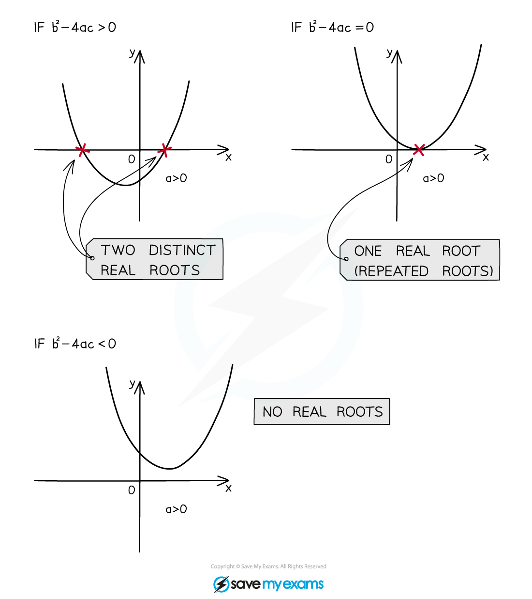

# Roots of Quadratic Equations

## Discriminants

> **Spec point** — `spcpt_3Y3zbWPNYp26vzMJ`

## Discriminants

### What is the discriminant of a quadratic function?

- The **discriminant** of a quadratic is often denoted by the Greek letter $Δ$ (upper case delta)
- For a quadratic  `a x squared plus b x plus c space space open parentheses a not equal to 0 close parentheses` the discriminant is given by

  - $Δ=b^{2}-4ac$
- The discriminant is the expression that is **inside the square root** in the **quadratic formula**

  - $x=\frac{-b\pm\sqrt{b^{2}-4ac}}{2a}$
- This is not on the exam formula sheet so you need to** remember **it

### How does the discriminant of a quadratic function affect its graph and roots?

- The discriminant tells us about the **roots** (or **solutions**) of the equation  $ax^{2}+bx+c=0$

  - It also tells us about the **graph** of  $y=ax^{2}+bx+c$
- If Δ > 0 then $\sqrt{b^{2}-4ac}$ and $-\sqrt{b^{2}-4ac}$ are **two distinct values**

  - The equation $ax^{2}+bx+c=0$ has **unequal real roots**
  
    - i.e. there are two **distinct real solutions**
  - The graph of $y=ax^{2}+bx+c$ **crosses** the *x*-axis **twice**
- If $Δ=0$ then $\sqrt{b^{2}-4ac}$ and $-\sqrt{b^{2}-4ac}$ are **both zero**

  - The equation $ax^{2}+bx+c=0$ has **equal real roots**
  
    - i.e. it has one **repeated real solution**
  - The** **graph of $y=ax^{2}+bx+c$ **touches** the *x*-axis at **exactly one point**
  
    - This means that the ***x*****-axis** is a **tangent** to the graph
- If $Δ<0$ then $\sqrt{b^{2}-4ac}$ and $-\sqrt{b^{2}-4ac}$ are **both undefined**

  - The **roots **of the equation $ax^{2}+bx+c=0$ are **not real**
  
    - i.e. it has **no real solutions**
  - The** **graph of $y=ax^{2}+bx+c$ **never touches **the** *****x*****-axis**
  
    - This means that graph is **wholly above **(or **below**) the ***x*****-axis**

### How do I solve problems using the discriminant?

- Often at least one of the coefficients of a quadratic will be given as an **unknown**

  - For example the letter $k$* *may be used* *for the unknown constant
- You will be given a fact about the quadratic such as:

  - The **number of real solutions** of the equation
  - The **number of roots** (i.e. ***x*****-intercepts)** of the graph
- To find the **value or range of values** of $k$

  - Find an **expression for the discriminant**
  
    - Use $Δ=b^{2}-4ac$
  - Decide whether $Δ>0$, $Δ=0$ or $Δ<0$
  
    - If the question says there are **real roots** but does not specify how many then use $Δ\geq0$
  - **Solve** the resulting equation or inequality for $k$

> **Exam Hint**
> - Questions won't always use the word discriminant
> 
>   - It is important to recognise when its use is required
>   - Look for
>   
>     - a number of roots or solutions being stated
>     - whether and/or how often the graph of a quadratic function intercepts the $x$-axis

> **Worked Example**
> A function is given by $f(x)=2kx^{2}+kx-k+2$ , where $k$ is a constant. The graph of $y=f(x)$ intercepts the $x$-axis at two different points.
> 
> a) Show that $9k^{2}-16k>0$.
> 
> > *The question says the graph 'intercepts the **x**-axis at two different points'*
> 
> > *This means that the discriminant *$b^{2}-4ac$* is greater than zero*
> 
> > *Here  *$a=2k$*,  *$b=k$*,  and  *$c=-k+2$
> 
> `open parentheses k close parentheses squared minus 4 open parentheses 2 k close parentheses open parentheses negative k plus 2 close parentheses greater than 0`
> 
> > *Expand the brackets and collect terms*
> 
> `table row cell k squared minus 8 k open parentheses negative k plus 2 close parentheses end cell greater than 0 row cell k squared plus 8 k squared minus 16 k end cell greater than 0 end table`
> 
> $9k^{2}-16k>0$
> 
> b) Hence find the range of possible values of $k$.
> 
> > *Solve the inequality, beginning by factorising*
> 
> `k open parentheses 9 k minus 16 close parentheses greater than 0`
> 
> > *This tells us the graph of  *$y=9k^{2}-16k$*  intercepts the horizontal axis at *$k=0$* and *$k=\frac{16}{9}$
> 
> > *It can be helpful to sketch a graph here*
> 
> 
> 
> > $9k^{2}-16k>0$* will be true to the left of 0 and to the right of *$\frac{16}{9}$
> 
> > *Write these down as inequalities*
> 
> $k<0\mathrm{or}k>\frac{16}{9}$

## Sum & Product of Roots

> **Spec point** — `spcpt_2jBnyf2TNPjJVC6z`

## Sum & Product of Roots

### How are the roots of a quadratic equation linked to its coefficients?

- A **quadratic equation** $ax^{2}+bx+c=0$ (where $a\neq0$) has **roots** $α$ and $β$ given by

  - $α,β=\frac{-b\pm\sqrt{b^{2}-4ac}}{2a}$
  
    - i.e. the **solutions** found by the **quadratic formula** (or any other solution method)
- This means the equation can be **rewritten** in the form  $a(x-α)(x-β)=0$

  - Note that $(x-α)(x-β)=x^{2}-(α+β)x+αβ$
  
    - It is possible that the roots are repeated, i.e. that $α=β$
  - You can then **equate** the two forms:
  
    - $ax^{2}+bx+c=a(x-α)(x-β)$
  - Then (because $a\neq0$) you can **divide** both sides of that by *a* and **expand** the brackets:
  
    - $x^{2}+\frac{b}{a}x+\frac{c}{a}=x^{2}-(α+β)x+αβ$
  - Finally, **compare the coefficients**
  
    - $x$ coefficients:  $-\frac{b}{a}=(α+β)$
    - Constant terms:  $\frac{c}{a}=αβ$

- Therefore for a quadratic equation $ax^{2}+bx+c=0$  :

  - The **sum of the roots** $α+β$ is equal to $-\frac{b}{a}$
  - The **product of the roots** $αβ$ is equal to $\frac{c}{a}$
- You **don't** need to **prove** these results on the exam

  - But you need to be able to **use** them to answer questions about quadratics
  - They are **not** on the exam **formula sheet**
  
    - So you need to **remember** (or be able to **derive**) them
- You can use them

  - to **find the** **sum** **and product of the roots** if you know the equation
  
    - Just substitute $a$, $b$ and $c$ into the formulae
  - or to **find the equation** if you know the sum and product of the roots
  
    - See the next section

### How do I find a quadratic equation from information about its roots?

- You may be **given** the **sum** and **product** of an equation's roots and then asked to **find the equation**

  - Usually the equation will need to have **integer coefficients**
  
    - For example  "A quadratic equation has roots $α$ and $β$, where  $α+β=\frac{7}{2}$  and  $αβ=-2$. Find a quadratic equation with integer coefficients that has roots $α$ and $β$."
- **STEP 1**
Start with the **formulae** linking the roots and coefficients

  - $α+β=-\frac{b}{a}$
  
    - So  $\frac{b}{a}=-\frac{7}{2}$
  - $αβ=\frac{c}{a}$
  
    - So  $\frac{c}{a}=-2$
- **STEP 2**
**Choose** a value for $a$, and find the **corresponding values** for $b$ and $c$

  - Choose a value for $a$ that will **multiply** to make the values for $α+β$ and $αβ$ into **integers**
  
    - Let $a=2$
    - Then  $b=-\frac{7}{2}\times2=-7$
    - And  $c=-2\times2=-4$
- **STEP 3**
**Write down** the equation using your values for $a$, $b$ and $c$

  - $2x^{2}-7x-4=0$
- Note that the answer is **not unique**

  - Any** multiple **of the equation will also have the **same roots**
  
    - e.g.  $4x^{2}-14x-8=0$

### How do I find a quadratic equation with related roots?

- You may be asked to find a quadratic equation whose roots are **related to the roots** of another quadratic equation

  - I.e. whose roots are expressed in terms of the roots of the first equation
- You will often need **algebraic tricks** to write other expressions with $α$ and $β$ **in terms of** $α+β$ and $αβ$

  - $α$ and $β$ are the roots of the first quadratic
  - For example:
  
    - `table row cell alpha squared plus beta squared end cell equals cell alpha squared plus 2 alpha beta plus beta squared minus 2 alpha beta end cell row blank equals cell open parentheses alpha plus beta close parentheses squared minus 2 alpha beta end cell end table`
    - `table row cell alpha cubed plus beta cubed end cell equals cell alpha cubed plus 3 alpha beta open parentheses alpha plus beta close parentheses plus beta cubed minus 3 alpha beta open parentheses alpha plus beta close parentheses end cell row blank equals cell alpha cubed plus 3 alpha squared beta plus 3 alpha beta squared plus beta cubed minus 3 alpha beta open parentheses alpha plus beta close parentheses end cell row blank equals cell open parentheses alpha plus beta close parentheses cubed minus 3 alpha beta open parentheses alpha plus beta close parentheses end cell end table`
    - `table row cell open parentheses alpha minus beta close parentheses squared end cell equals cell alpha squared minus 2 alpha beta plus beta squared end cell row blank equals cell alpha squared plus 2 alpha beta plus beta squared minus 4 alpha beta end cell row blank equals cell open parentheses alpha plus beta close parentheses squared minus 4 alpha beta end cell end table`

- Then if you know the values of $α+β$ and $αβ$ from the **first quadratic**, you can use them to find the **sum** or **product** of the **new roots**

  - For example "A quadratic equation has roots $α$ and $β$ where  $α+β=-\frac{3}{2}$  and  $αβ=2$.  Form a second quadratic equation with integer coefficients that has roots $\frac{α}{β^{2}}$ and $\frac{β}{α^{2}}$."
  - The **sum** of the new roots is  `alpha over beta squared plus beta over alpha squared equals fraction numerator alpha cubed plus beta cubed over denominator alpha squared beta squared end fraction equals fraction numerator alpha cubed plus beta cubed over denominator open parentheses alpha beta close parentheses squared end fraction`
  
    - We can use the substitution for $α^{3}+β^{3}$ from above
    - So  `Sum equals fraction numerator open parentheses alpha plus beta close parentheses cubed minus 3 alpha beta open parentheses alpha plus beta close parentheses over denominator open parentheses alpha beta close parentheses squared end fraction equals fraction numerator open parentheses negative begin display style 3 over 2 end style close parentheses cubed minus 3 open parentheses 2 close parentheses open parentheses negative begin display style 3 over 2 end style close parentheses over denominator open parentheses 2 close parentheses squared end fraction equals 45 over 32`
  - The **product** of the new roots is  $\frac{α}{β^{2}}\times\frac{β}{α^{2}}=\frac{αβ}{α^{2}β^{2}}=\frac{1}{αβ}$
  
    - So  $\mathrm{Product}=\frac{1}{αβ}=\frac{1}{2}$
  - With the sum and product we can **form the equation** as described in the last section
  
    - $32x^{2}-45x+16=0$

> **Worked Example**
> The roots of the quadratic equation $2x^{2}-11x+5=0$ are $α$ and $β$.
> 
> Given that  $α>β$  and without solving the equation,
> 
> (a)  show that  $α-β=\frac{9}{2}$
> 
> > *Use  *$α+β=-\frac{b}{a}$*  and *$αβ=\frac{c}{a}$*  to find the sum and product*
> 
> `alpha plus beta equals negative fraction numerator open parentheses negative 11 close parentheses over denominator 2 end fraction equals 11 over 2`
> 
> $αβ=\frac{5}{2}$
> 
> > *Express *`open parentheses alpha minus beta close parentheses squared`* in terms of  *$α+β$*  and  *$αβ$
> 
> `table row cell open parentheses alpha minus beta close parentheses squared end cell equals cell alpha squared minus 2 alpha beta plus beta squared end cell row blank equals cell open parentheses alpha squared plus 2 alpha beta plus beta squared close parentheses minus 4 alpha beta end cell row blank equals cell open parentheses alpha plus beta close parentheses squared minus 4 alpha beta end cell end table`
> 
> > *Substitute to find the value*
> 
> `table row cell open parentheses alpha minus beta close parentheses squared end cell equals cell open parentheses 11 over 2 close parentheses squared minus 4 open parentheses 5 over 2 close parentheses end cell row blank equals cell 121 over 4 minus 10 end cell row blank equals cell 81 over 4 end cell end table`
> 
> > *Take the square root, remembering the *$\pm$
> 
> $α-β=\pm\frac{9}{2}$
> 
> > *Finally, use the fact that *$α>β$
> 
> *But  *$α>β$*,  therefore  *$α-β>0$
> 
> $α-β=\frac{9}{2}$
> 
> (b) form a quadratic equation, with integer coefficients, which has roots  $\frac{α+β}{α}$ and $\frac{α-β}{β}$
> 
> > *Start by finding the sum and product of the new roots*
> 
> `table row Sum equals cell fraction numerator alpha plus beta over denominator a end fraction plus fraction numerator alpha minus beta over denominator beta end fraction end cell row blank equals cell fraction numerator beta open parentheses alpha plus beta close parentheses plus alpha open parentheses alpha minus beta close parentheses over denominator alpha beta end fraction end cell row blank equals cell fraction numerator alpha squared plus beta squared over denominator alpha beta end fraction end cell row blank equals cell fraction numerator open parentheses alpha squared plus 2 alpha beta plus beta squared close parentheses minus 2 alpha beta over denominator alpha beta end fraction end cell row blank equals cell fraction numerator open parentheses alpha plus beta close parentheses squared minus 2 alpha beta over denominator alpha beta end fraction end cell row blank equals cell fraction numerator open parentheses 11 over 2 close parentheses squared minus 2 open parentheses 5 over 2 close parentheses over denominator 5 over 2 end fraction end cell row blank equals cell 101 over 10 end cell row blank blank blank row blank blank blank row Product equals cell fraction numerator alpha plus beta over denominator a end fraction cross times fraction numerator alpha minus beta over denominator beta end fraction end cell row blank equals cell fraction numerator open parentheses alpha plus beta close parentheses open parentheses alpha minus beta close parentheses over denominator alpha beta end fraction end cell row blank equals cell fraction numerator open parentheses 11 over 2 close parentheses open parentheses 9 over 2 close parentheses over denominator 5 over 2 end fraction end cell row blank equals cell 99 over 10 end cell end table`
> 
> > *Now use  *$\mathrm{Sum} \mathrm{of} \mathrm{roots}=-\frac{b}{a}$*  and  *$\mathrm{Product} \mathrm{of} \mathrm{roots}=\frac{c}{a}$
> 
> $\frac{b}{a}=-\frac{101}{10}\mathrm{and}\frac{c}{a}=\frac{99}{10}$
> 
> > *Select  *$a=10$*  so *$b$* and *$c$* will have integer values*
> 
> $a=10b=-101c=99$
> 
> > *And finally use those coefficients to write the new equation*
> 
> $10x^{2}-101x+99=0$
