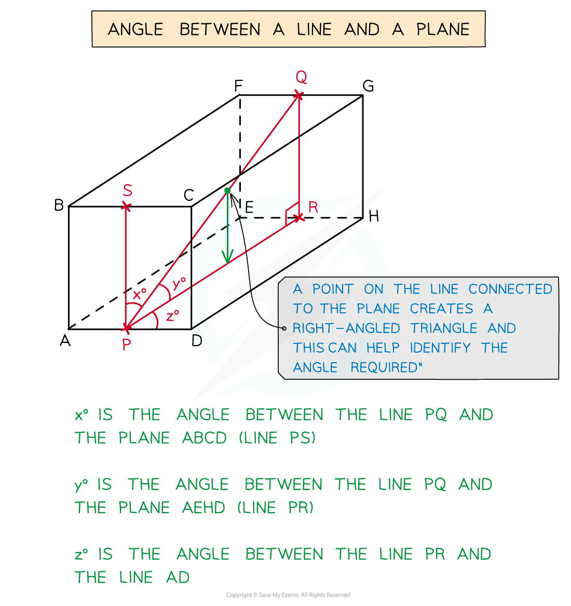

# Basic Trigonometry

## Right-Angled Trigonometry

> **Spec point** — `spcpt_kSxqyWsqD68xvRPc`

## Right-Angled Trigonometry

### What is right-angled trigonometry?

- **Right-angled trigonometry** is the study of right-angled triangles

  - In particular the relationships between their **side lengths** and **angles**
- Right-angled trigonometry includes** two **main components

  - The **Pythagorean theorem**
  - **SOHCAHTOA**
- You should **already** be familiar with right-angled trigonometry from your regular IGCSE Mathematics course

### What is the Pythagorean theorem?

- The **Pythagorean theorem** (or Pythagoras’ theorem ) connects the side lengths in a right-angled triangle

  - It **only** works for right-angled triangles!
- It says that for any right-angled triangle, the **square of the hypotenuse is equal to the sum of the squares of the other two sides**

  - The **hypotenuse **is always the **longest side** in a right-angled triangle
  
    - It will always be **opposite** the right angle
- If we **label** the hypotenuse *c*, and label the other two sides *a* and *b*, then

  - $c^{2}=a^{2}+b^{2}$
  
    - This is **not** on the exam formula sheet, so you need to remember it
- This lets us **find one side length** if we know the other two side lengths

  - To find the hypotenuse
  
    - $c=\sqrt{a^{2}+b^{2}}$
  - To find one of the other two sides
  
    - $a=\sqrt{c^{2}-b^{2}}$  or  $b=\sqrt{c^{2}-a^{2}}$
- Pythagoras' theorem can also be used to **prove** that a triangle is (or isn't) right-angled

  - If  $c^{2}=a^{2}+b^{2}$  is **true** for three side lengths $a$, $b$ and $c$
  
    - then the triangle is right-angled
  - If  $c^{2}=a^{2}+b^{2}$  is **not true** for three side lengths $a$, $b$ and $c$
  
    - then the triangle is not right-angled

### What is SOHCAHTOA?

- **SOHCAHTOA** is a way to help remember the **sine**, **cosine** and **tangent** formulae for right-angled triangles

  - These formulae **only** work for right-angled triangles!
- To use the formulae you must first **label** the sides of a right-angled triangle **in relation to** a chosen angle

  - The **hypotenuse, *****H*****, **is the **longest side** in a right-angled triangle
  
    - It will always be **opposite** the right angle
  - If we label one of the other angles *θ*,
  
    - the side opposite** ***θ* will be labelled **opposite**, ***O***
    - and the* *side next to *θ* will be labelled **adjacent**, ***A***
- The SOHCAHTOA **formulae** are

  - $\mathrm{Sin}θ=\frac{\mathrm{opposite}}{\mathrm{hypotenuse}}=\frac{O}{H}$  ('SOH')
  - $\mathrm{Cos}θ=\frac{\mathrm{adjacent}}{\mathrm{hypotenuse}}=\frac{A}{H}$  ('CAH')
  - $\mathrm{Tan}θ=\frac{\mathrm{opposite}}{\mathrm{adjacent}}=\frac{O}{A}$  ('TOA')

- These are **not **on the exam formula sheet, you need to remember them
- You can use SOHCAHTOA to **find**

  - an **angle**, if you know two side lengths
  - a **side length**, if you know an angle and another side length
- Start by choosing the **correct formula**

  - It needs to include two things you know as well as the thing you want to know
- Then **substitute** the values you know into the formula

  - and **solve** for the missing value
  
    - If finding an **angle**, you'll need to use $\mathrm{sin}^{-1}$, $\mathrm{cos}^{-1}$ or $\mathrm{tan}^{-1}$ on your calculator
    - Or use your knowledge of **exact trig values** where possible

> **Exam Hint**
> - Make sure you know the formulae for the Pythagorean theorem and SOHCAHTOA
> 
>   - They are not given to you on the exam formula sheet
> - An exam question probably won't tell you to use the Pythagorean theorem or SOHCAHTOA
> 
>   - But think about them whenever you see a right-angled triangle in an exam!

> **Worked Example**
> A chocolate bar is in the shape of a triangular prism $ABCDEF$.  The end of the chocolate bar is an isosceles triangle, where $AC=3\mathrm{cm}$ and $AB=BC=5\mathrm{cm}$.  Point $M$ is the midpoint of $AC$. This information is shown in the diagram below.
> 
> 
> 
> Calculate the length of BM, giving your answer correct to 3 significant figures.
> 
> 

> **Worked Example**
> Find the values of $x$ and $y$ in the following diagram. Give your answers correct to 3 significant figures.
> 
> 
> 
> 

## 3D Problems

> **Spec point** — `spcpt_89Q476Yv2SBqxqJx`

## 3D Problems

### How does Pythagoras work in 3D?

- **3D shapes** can often be **broken down** into several 2D shapes
- With **Pythagoras’ Theorem** you will be specifically looking for **right-angled triangles**

  - You need right-angled triangles with **two known sides and one unknown side**
  - Look for **perpendicular lines** to help you spot right-angled triangles
- There is a **3D version** of the Pythagorean theorem formula:

  - $l^{2}=x^{2}+y^{2}+z^{2}$
  
    - $l$ is the length of the line segment
    - $x$ is the '$x$-direction distance' between the endpoints of the line segment
    - $y$ is the '$y$-direction distance'
    - $z$ is the '$z$-direction distance'

- However it is usually **easier** to break a 3D problem down into two or more 2D problems

### How does SOHCAHTOA work in 3D?

- Again look for **right-angled triangles** including a missing angle or side

  - It may take **more than one** right-angles triangle to get to the answer
- The **angle** you are working with can be awkward in 3D

  - The **angle between a line and a plane** is not always obvious
  - If unsure choose a point on the line and **draw a new line** to the plane
  
    - This should create a **right-angled triangle**

> **Exam Hint**
> - Add values you have calculated to diagrams given in the question
> - Make additional sketches of parts of any diagrams that are given to you
> 
>   - Especially to help you 'see' a 2D portion of a 3D problem
> - If you are not given a diagram, sketch a nice, big, clear one!

> **Worked Example**
> A pencil is being put into a box in the shape of a cuboid with dimensions 3 cm by 4 cm by 6 cm.
> 
> Find:
> 
> (a) the length of the longest pencil that could fit inside the box,
> 
> 
> 
> (b) the angle that the pencil would make with the top of the box.
> 
> 
