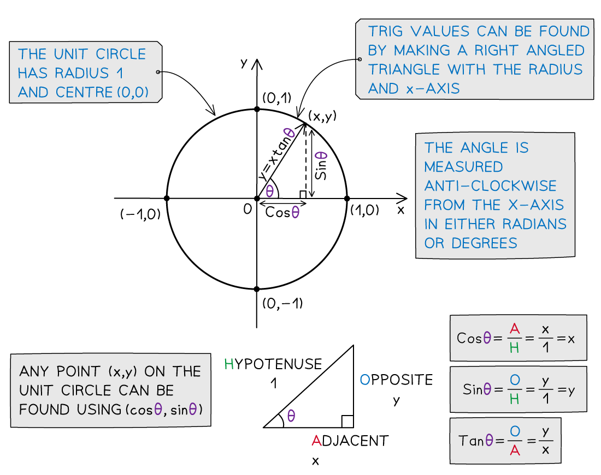
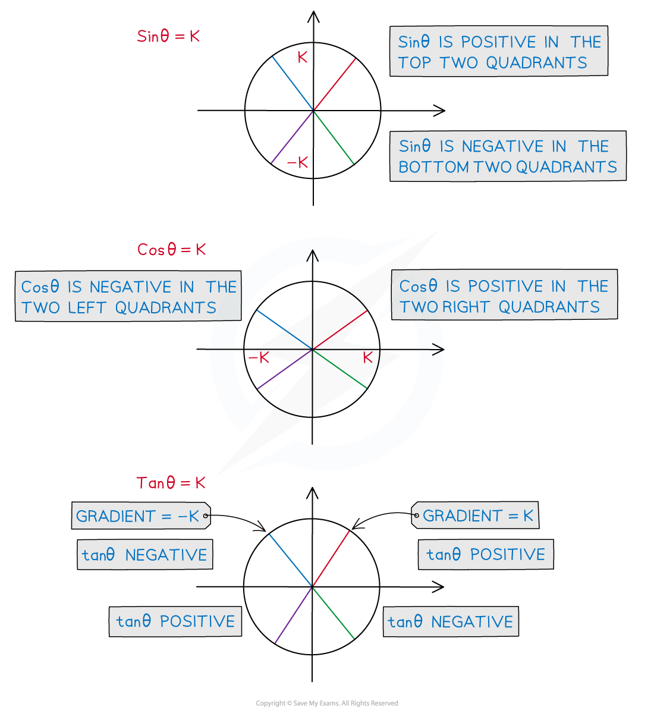
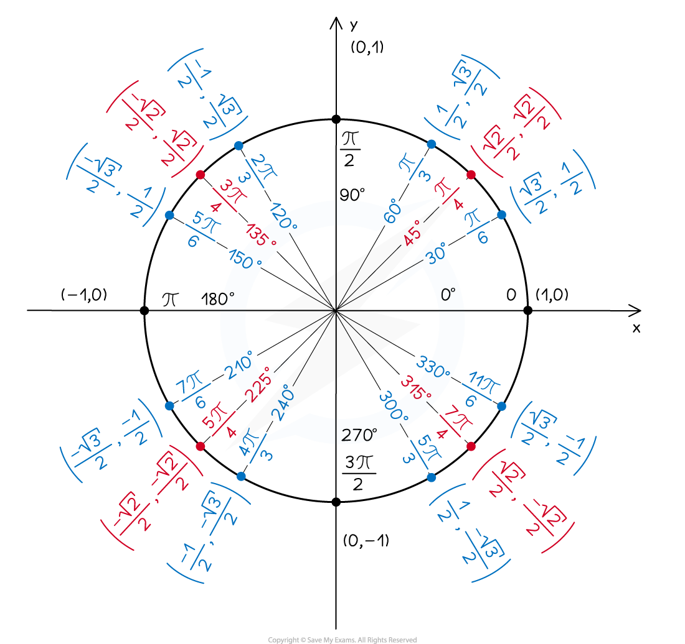
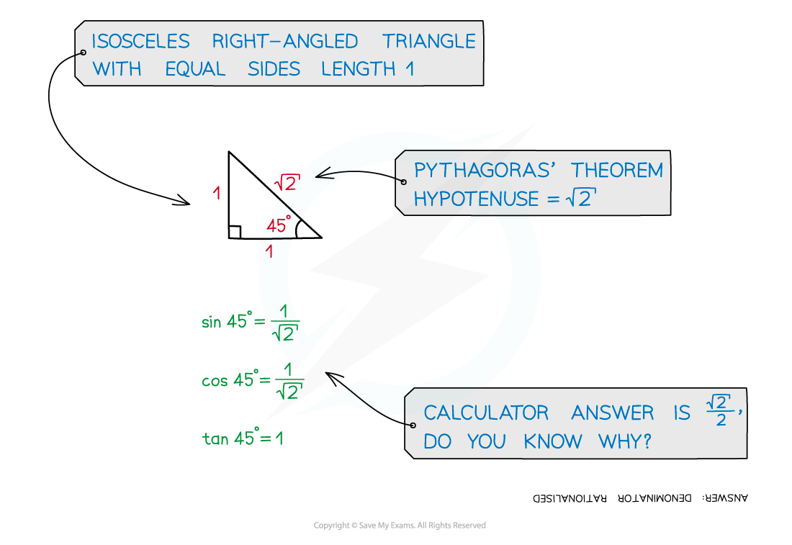

# Sin, Cos & Tan

## Defining Sin, Cos and Tan

> **Spec point** — `spcpt_j6n8KKDTbzyBfPRK`

## Defining Sin, Cos and Tan

### What is the unit circle?

- The **unit circle** is a circle with radius 1 and centre (0, 0)
- It helps us to define values for **sin *****θ****,* **cos *****θ *** and **tan *****θ  ***for **all** values of *θ*

  - $420^{\circ}$* *or $-750^{\circ}$doesn't make sense as an angle in a triangle or other shape
  - But sin *θ, *cos *θ * and tan *θ*  are defined for 'angles' like that
- **On the unit circle**

  - Angles are always measured **from the positive *****x-*****axis** and turn:
  
    - **anticlockwise **for **positive** angles
    - **clockwise** for **negative** angles
  - **After **$\pm360^{\circ}$ you can keep going
  
    - So $420^{\circ}$ is 'all the way around' anticlockwise ($360^{\circ}$) and then another $60^{\circ}$ anticlockwise
    - Or $-750^{\circ}$ is 'all the way around twice' clockwise ($-720^{\circ}$) and then another $30^{\circ}$ clockwise
- It can be used to **calculate trig values** as **coordinates** (*x, y*) on the circle

  - Make a right triangle with the **radius** as the hypotenuse
  
    - *θ* is the angle measured **anticlockwise** from the positive *x*-axis
    - (or **clockwise** for negative *θ*)
  - The *x*-axis will always be **adjacent** to the angle, *θ*
- **SOHCAHTOA** can then be used to find the values of sin*θ*, cos*θ* and tan*θ*

  - As the radius is 1 unit
  
    - the ***x *****coordinate** gives the value of **cos *****θ***
    - the ***y *****coordinate** gives the value of **sin *****θ***
  - **Dividing** the *y *coordinate by the *x *coordinate gives the value of **tan *****θ***
  
    - This is also the **gradient** of the line through the origin and the point on the unit circle
- Unlike SOHCAHTOA this allows us to **calculate sin**, **cos** and **tan** for

  - angles **greater than 90°** ($\frac{π}{2}$**radians**)
  - **negative** angles

> **Worked Example**
> The coordinates of a point on a unit circle, correct to 3 significant figures, are (0.629, 0.777).  Find the angle with the positive *x-*axis, *θ°,* to the nearest degree.
> 
> 

## Using The Unit Circle

> **Spec point** — `spcpt_7wWXJ4RMV6SzjD8S`

## Using The Unit Circle

### What are the properties of the unit circle?

- The unit circle can be split into four **quadrants**
- The **first quadrant** is for angles between 0 and 90°

  - **A**ll three of sin *θ,* cos *θ*  and tan *θ*  are positive in this quadrant
- The **second quadrant** is for angles between 90° and 180° ($\frac{π}{2}$ rad and $π$ rad)

  - **S**ine (sin *θ* ) is positive in this quadrant
- The **third quadrant** is for angles between 180° and 270° ($π$ rad and $\frac{3π}{2}$ rad)

  - **T**angent (tan *θ* ) is positive in this quadrant
- The **fourth quadrant** is for angles between 270° and 360° ($\frac{3π}{2}$ rad and $2π$ rad)

  - **C**osine (cos *θ *) is positive in this quadrant
- Starting from the **fourth** quadrant (on the bottom right) and working anti-clockwise

  - the positive trig functions spell out **CAST**
  
    - This is why it is often thought of as the **CAST** diagram
  - You may have **your own way** of remembering this
  
    - A popular one starting from the first quadrant is **All Students Take Calculus**
- To help yourself picture this try **sketching** all three trig graphs on one set of axes

  - Look at which graphs are **positive** in each 90° section

### How is the unit circle used to find additional solutions?

- **Trigonometric functions** have more than one 'input' for each 'output'

  - For example sin 30° = sin 150° = 0.5
- This means that **trigonometric equations** have **more than one** solution

  - Both 30° and 150° satisfy the equation $\mathrm{sin}x=\frac{1}{2}$
- The **unit circle** can be used to find **all solutions** to trigonometric equations in a given interval

  - Your **calculator** will only give **one solution** to an equation like  `x equals sin to the power of negative 1 end exponent open parentheses 1 half close parentheses`
  
    - This solution is called the **primary value**
  - However due to the **periodic **nature of the trig functions there there are **an infinite number** of solutions
  
    - You need to be able to find such **additional values**
  - On the exam you will be given an **interval** in which the solutions should be found
  
    - This could either be in **degrees** or in **radians**
    - If you see ***π*** or some multiple of π then you must work in radians
- The following steps can help you use the unit circle to find **additional values**
- **STEP 1**
**Draw** the primary value angle using the *x* or *y *coordinates to help you

  - This will be in the first or second quadrants if using $\mathrm{cos}^{-1}$ to get the primary angle
  
    - Or in the first or fourth quadrants if using  $\mathrm{sin}^{-1}$ or $\mathrm{tan}^{-1}$
  - If you are working with $\mathrm{sin}x=k$
  
    - draw the line from the origin to the circumference of the circle
    - the point on the circumference is where the ***y***** coordinate** is *k*
  - If you are working with $\mathrm{cos}x=k$
  
    - draw the line from the origin to the circumference of the circle
    - the point on the circumference where the ***x***** coordinate** is *k*
  - If you are working with $\mathrm{tan}x=k$
  
    - draw the line from the origin to the circumference of the circle
    - such that the **gradient** of the line is *k*
  - This will give you the angle which should be measured from the **positive x-axis…**
  
    - … anticlockwise for a **positive** angle
    - … clockwise for a **negative** angle
- **STEP 2**
Draw the radius in the other quadrant which has the same...

  - *... ****x *****coordinate** if* *solving $\mathrm{cos}x=k$
  
    - This will be the quadrant which is vertically below the original quadrant
  - *... ****y *****coordinate** if* *solving $\mathrm{sin}x=k$
  
    - This will be the quadrant which is horizontally to the left of the original quadrant
  - ... **gradient** if solving $\mathrm{tan}x=k$
  
    - This will be the quadrant which is diagonally opposite to the original quadrant
- **STEP 3**
Work out the size of the second angle, measuring from the positive x-axis

  - … anticlockwise for a positive angle
  
    - or clockwise for a negative angle
  - Look at the given **interval** of solution values
  
    - This will help you to decide whether you need a **negative** or **positive** angle measure
- **STEP 4**
Add or subtract (multiples of) either 360° or 2*π* radians to or from both values

  - until you have **all solutions** in the required interval

> **Exam Hint**
> - Practice sketching out the unit circle
> 
>   - and using CAST to remember what is positive in what quadrant
> - This can help you to find all solutions to a problem in an exam question

> **Worked Example**
> It is given that one solution of $\mathrm{cos}θ=0.8$ is *θ *= 0.6435 radians, correct to 4 decimal places.
> 
> Use this to find all other solutions in the interval  $-2π\leqθ\leq2π$, giving your answers correct to 3 significant figures.
> 
> 

## Trigonometry Exact Values

> **Spec point** — `spcpt_5GVxSp9Frzf5Mctm`

## Trigonometry Exact Values

### What are exact values in trigonometry?

- For certain angles the values of sin *θ*, cos *θ* and tan *θ* can be written **exactly**

  - This means using **fractions** and **surds**
  - You should be familiar with these values
  
    - and able to derive them using geometry
- You should know the **exact values** of sin, cos and tan for angles of

  - **0°, 30°, 45°, 60°, 90°,  **and** 180°**  (in degrees)
  - or $0,\frac{π}{6},\frac{π}{4},\frac{π}{3},\frac{π}{2}$ and $π$  (in radians)
- These values are in the following **table**

  - Note that for 360° ($2π$ radians) the trig values are all the same as for 0

### How do I find the exact values of other angles?

- The exact values for **cos** and **sin** can be seen on the **unit circle**

  - They are the ***x*** and ***y *****coordinates** respectively
  - If using the unit circle coordinates to memorise the exact values
  
    - remember that cos (*x  *value) comes **before** sin (*y*  value)
- The unit circle can also be used to find **exact values of other angles** using symmetry
- If you know the exact values for an angle in the **first quadrant**

  - you can draw the same angle from the *x-*axis in other quadrants to find values for other angles
- Remember that the angles are **measured anticlockwise **from the positive *x-*axis
- For example if you know that the exact value for sin 30° is 0.5

  - **draw** a 30° angle from the horizontal axis in the three other quadrants
  - **measuring from the positive *****x-*****axis** you have the angles of 150°, 210° and 330°
  
    - sine is **positive** in the **second quadrant** so  sin 150° = 0.5
    - sine is **negative** in the **third quadrant** so  sin 210° = - 0.5
    - sine is **negative** in the **fourth quadrant** so  sin 330° = - 0.5
- It is also possible to find the **negative** angles by measuring **clockwise **from the positive *x-*axis

  - **draw** a 30° angle from the horizontal in the three other quadrants
  - measuring **clockwise** from the positive *x-*axis you have the angles of -30°, -150°, -210° and -330°
  
    - sin is **negative** in the **fourth quadrant** so sin(-30°) = - 0.5
    - sin is **negative** in the **third quadrant** so sin(-150°) = - 0.5
    - sin is **positive** in the **second quadrant** so sin(-210°) = 0.5
    - sin is **positive** in the **fourth quadrant** so sin(-330°) = 0.5

### How can I derive exact trig values?

- Being able to **derive **basic exact trig values can help if you forget them
- Values for 30° and 60° ($\frac{π}{6}$ and $\frac{π}{3}$ radians) can be derived by using an **equilateral triangle**

  - See the **Worked Example** below
- Values for 45° ($\frac{π}{4}$ radians) can be derived using a **right-angled isosceles triangle**

  - See the following **diagram**

> **Exam Hint**
> - It can be easy to muddle up exact trig values if you just try to remember them from a list,
> - Sketch the unit circle and/or trig graphs on your exam paper
> 
>   - This can help you keep the trig functions and their values straight
> - Note that for $0^{\circ}$, $30^{\circ}$, $45^{\circ}$, $60^{\circ}$, $90^{\circ}$
> 
>   - The sine values run  `0 comma fraction numerator space square root of 1 over denominator 2 end fraction space open parentheses equals 1 half close parentheses comma fraction numerator space square root of 2 over denominator 2 end fraction comma fraction numerator space square root of 3 over denominator 2 end fraction comma fraction numerator space square root of 4 over denominator 2 end fraction space open parentheses equals 1 close parentheses`
>   - The cosine values run  `fraction numerator space square root of 4 over denominator 2 end fraction space open parentheses equals 1 close parentheses comma space fraction numerator space square root of 3 over denominator 2 end fraction comma space fraction numerator space square root of 2 over denominator 2 end fraction comma space fraction numerator space square root of 1 over denominator 2 end fraction space open parentheses equals 1 half close parentheses comma space 0`
>   - Values for tangent can be found using  $\mathrm{tan}θ=\frac{\mathrm{sin}θ}{\mathrm{cos}θ}$

> **Worked Example**
> Using an equilateral triangle of side length 2 units, derive the exact values for the sine, cosine and tangent of $\frac{π}{6}$ and $\frac{π}{3}$.
> 
> 
