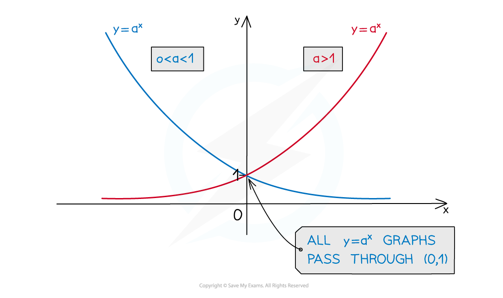
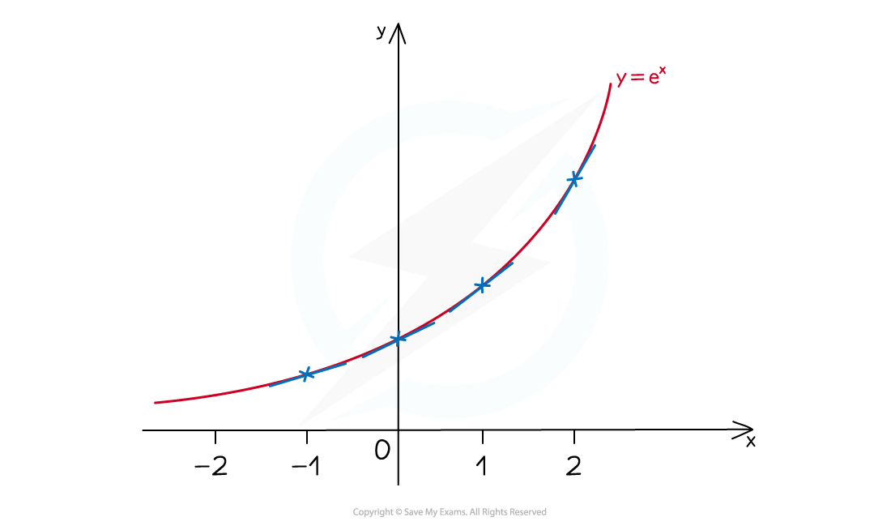
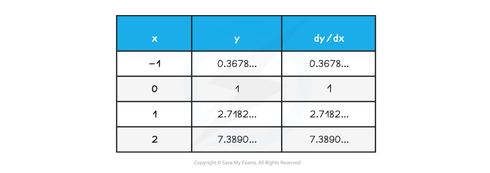

# Exponential Functions

## Exponential Functions & Graphs

> **Spec point** — `spcpt_Svk7s3qn6mTBnm4G`

## Exponential Functions & Graphs

### What is an exponential function?

- An **exponential function** is of the form $f(x)=a^{x},a>0$
- Its **domain** is the set of **all real numbers**
- Its **range** is the set of **all positive real numbers**
- An important exponential function is $f(x)=e^{x}$

  - e is the mathematical constant $2.718281\dots$
  - See the following note on "$e$" for more details

### What are the key features of exponential graphs?

- The graphs have a $y$**-intercept** at `open parentheses 0 comma space 1 close parentheses`

  - Because  $a^{0}=1$
- The graph** will always** pass through the **point **`open parentheses 1 comma space a close parentheses`

  - Because  $a^{1}=a$
- The graphs **do not intersect the **$x$**-axis**

  - The graphs have **a horizontal asymptote** at the *x*-axis $y=0$
- The graphs **do not have any minimum or maximum points**

- **When **$a>1$

  - For $x<0$ the higher value of $a$ is the “lower” graph
  - Where $x>0$ the higher value of $a$ is the “higher” graph 
- **When **$0<a<1$

  - Where $x<0$ the higher value of $a$ is the “lower” graph
  - Where $x>0$ the higher value of $a$ is the “higher” graph 
- **When** $a=1$

  - The graph is a horizontal line through $y=1$
  - Because  $1^{x}=1$  for all values of $x$

> **Worked Example**
> On the same set of axes, sketch the graphs of  $y=3^{x}$  and  $y=4^{x}$.
> 
> *Both graphs will have the 'typical' *$y=a^{x}$* exponential shape for the *$a>1$*case*
> 
> > $y=4^{x}$* will be the 'lower' graph for *$x<0$*,and the 'higher' graph for *$x>0$
> 
> > *Both graphs go through *`open parentheses 0 comma space 1 close parentheses`* and have an asymptote at the *$x$*-axis*
> 
> 

## "e"

> **Spec point** — `spcpt_bSVNXtwhvFqkxn6z`

## "e"

### What is e, the exponential constant?

- $e$  is one of the most important **mathematical constants**

  - $e=2.718281...$
  - $e$ is an **irrational** number
  - `straight f open parentheses x close parentheses equals straight e to the power of x`**  **is often referred to as '**the exponential function**'
- As with other **exponential graphs**, $y=e^{x}$ 

  - passes through `open parentheses 0 comma space 1 close parentheses`
  - has the $x$-axis as an asymptote

### Why is e so important?

- $y=e^{x}$ has the particular **property** that  $\frac{dy}{dx}=e^{x}$

  - i.e. if  `straight f open parentheses x close parentheses equals straight e to the power of x`, then `straight f to the power of apostrophe open parentheses x close parentheses` is also equal to $e^{x}$
- This means that for **every** real number $x$, the **gradient** of $y=e^{x}$ is **also** equal to $e^{x}$

### The negative exponential graph

- $y=e^{-x}$ is a **reflection** in the $y$-axis of $y=e^{x}$

  - Note by laws of indices that  `straight e to the power of negative x end exponent equals open parentheses straight e to the power of negative 1 end exponent close parentheses to the power of x equals open parentheses 1 over straight e close parentheses to the power of x`
- They are of the form `y equals straight f open parentheses x close parentheses` and `y equals straight f open parentheses negative x close parentheses` 

> **Worked Example**
> On the same set of axes, sketch the graphs of  $y=e^{x}$,  $y=e^{2x}$  and  $y=e^{-2x}$.
> 
> *By laws of indices, *`straight e to the power of 2 x end exponent equals open parentheses straight e squared close parentheses to the power of x`
> 
> > $e^{2}>e$*,  so  *$y=e^{2x}$* will be the 'lower' graph for *$x<0$*,and the 'higher' graph for *$x>0$
> 
> > $y=e^{-2x}$* is the reflection of  *$y=e^{2x}$*in the *$y$*-axis*
> 
> > *All three graphs go through *`open parentheses 0 comma space 1 close parentheses`* and have an asymptote at the *$x$*-axis*
> 
> 
