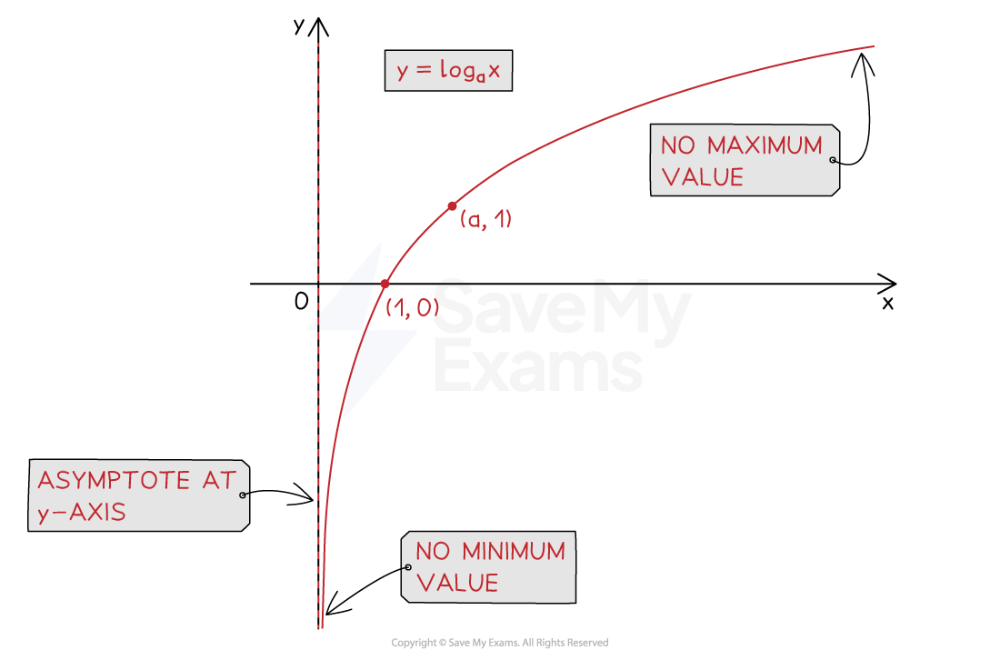

# Logarithmic Functions

## Introduction to Logarithms

> **Spec point** — `spcpt_bqzd27kqmFf8PQfn`

## Introduction to Logarithms

### What are logarithms?

- A **logarithm** is the **inverse of an exponent**

  - If  $a^{x}=b$  then  `log subscript a open parentheses b close parentheses equals x`,  where  $a>0,b>0,a\neq1$
  
    - This is the essential **definition** of a logarithm
    - The number $a$ is called the **base** of the logarithm

- Try to get used to **‘reading’ logarithm statements** to yourself

  - $\mathrm{log}_{a}(b)=x$  means “$x$ is the power that you raise $a$ to, to get $b$"
  - So  $\mathrm{log}_{5}125=3$  means “3 is the power that you raise 5 to, to get 125”

- Two important **special cases** are:

  - `ln space x equals log subscript straight e open parentheses x close parentheses`
  
    - Where $e$ is the mathematical constant 2.718…
    - This is called the **natural logarithm** and will have its own button on your calculator
  - `log space x equals log subscript 10 open parentheses x close parentheses`
  
    - Logarithms of **base 10** are frequently used
    - They are often abbreviated simply as $\mathrm{log}x$

### Why use logarithms?

- Logarithms allow us to **solve equations** where the **exponent** is the unknown value

  - We can solve some of these by **inspection**
  
    - For example, for the equation  $2^{x}=8$  we know that $x$* *must be $3$
  - But logarithms allow us to solve **more complicated** problems
  
    - For example, the equation  $2^{x}=10$  does not have an obvious answer
    - Instead we can **rewrite** the equation as a logarithm

$\mathrm{log}_{2}10=x$

- and use our **calculator** to find the decimal value of $\mathrm{log}_{2}10$

$x=3.321928...$

> **Exam Hint**
> - Make sure you are completely familiar with your calculator's logarithm functions

> **Worked Example**
> Solve the following equations:
> 
> i) $x=\mathrm{log}_{3}27$,
> *Use the definition of a logarithm to rewrite this as an exponential equation*
> 
> > *Remember, this equation means "*$x$* is the power that you raise 3 to, to get 27"*
> 
> $3^{x}=27$
> 
> > *This can be solved by inspection*
> 
> $3^{3}=27$
> 
> $x=3$
> 
> ii) $2^{x}=21.4$, giving your answer to 3 s.f.
> 
> > *Use the definition of a logarithm to rewrite this as a logarithm equation*
> 
> > *We want the logarithm that means "*$x$* is the power that you raise 2 to, to get 21.4"*
> 
> $x=\mathrm{log}_{2}21.4$
> 
> > *Use your calculator to find the value of that logarithm*
> 
> $x=4.419538...$
> 
> > *Round to 3 significant figures*
> 
> > $x=4.42$* **(3 s.f.)*

## Logarithmic Functions & Graphs

> **Spec point** — `spcpt_r82CHwYg4ZxfDTgc`

## Logarithmic Functions & Graphs

### What is a logarithmic function?

- A l**ogarithmic function** is of the form $f(x)=\mathrm{log}_{a}x,x>0$

  - In this course the **base** $a$ for a logarithmic function will always be an **integer greater than one**
- Its **domain** is the set of all **positive real numbers**

  - You can't take a log of zero or a negative number
- Its **range** is the set of **all real numbers**
- $\mathrm{log}_{a}x$ and $a^{x}$ are **inverse** functions

  - `log subscript a open parentheses a to the power of x close parentheses equals x`  and  $a^{\mathrm{log}_{a}x}=x$

### What are the key features of logarithmic graphs?

- The graph of  $y=\mathrm{log}_{a}x$

  - **does not have a **$y$**-intercept**
  - has a **vertical asymptote **at the *y*-axis: $x=0$
  - has **one **$x$**-intercept** at (1, 0)
  - **passes through** the point (*a*, 1)
  - **does not have any minimum or maximum points**

> **Worked Example**
> On the same set of axes, sketch the graphs of  $y=\mathrm{log}_{3}x$  and  $y=3^{x}$.  Be sure to label any axis intercepts.
> 
> > $y=\mathrm{log}_{3}x$* will have the typical logarithmic graph shape*
> *The *$y$*-axis is an asymptote, and the *$x$*-intercept is *`open parentheses 1 comma 0 close parentheses`
> 
> > $y=3^{x}$* will have the typical exponential graph shape*
> *The *$x$*-axis is an asymptote, and the *$y$*-intercept is *`open parentheses 0 comma space 1 close parentheses`
> 
> > $\mathrm{log}_{3}x$* and *$3^{x}$*are inverse functions*
> *Therefore their graphs will be reflections of each other in the line *$y=x$
> 
> 
