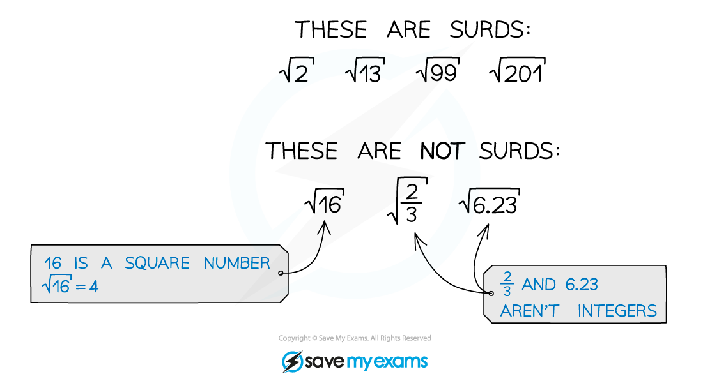

# Simplifying Surds

## Surds & Exact Values

> **Spec point** — `spcpt_bfBq8bY3CcYDvMy7`

## Surds & Exact Values

### What is a surd?

- A **surd** is the square root of a non-square integer
- Using surds lets you leave answers in exact form

  - e.g. $5\sqrt{2}$  rather than $7.071067811...$

### How do I calculate with surds?

- ** Multiplying surds**

  - You can multiply numbers under square roots together
  - $\sqrt{a}\times\sqrt{b}=\sqrt{ab}$
  
    - e.g. $\sqrt{3}\times\sqrt{5}=\sqrt{3\times5}=\sqrt{15}$
- **Dividing surds**

  - You can divide numbers under square roots
  - $\frac{\sqrt{a}}{\sqrt{b}}=\sqrt{\frac{a}{b}}$
  
    - e.g. $\sqrt{21}\div\sqrt{7}=\sqrt{21\div7}=\sqrt{3}$
- **Factorising surds**

  - You can **factorise** numbers under square roots
  
    - This lets you **split** a single square root into a **product** of square roots
  - $\sqrt{ab}=\sqrt{a}\times\sqrt{b}$
  
    - e.g. $\sqrt{35}=\sqrt{5\times7}=\sqrt{5}\times\sqrt{7}$
- **Adding or subtracting surds** is very like adding or subtracting letters in algebra

  - you can only **add** or **subtract** multiples of **“like” surds**
  
    - e.g.  $3\sqrt{5}+8\sqrt{5}=11\sqrt{5}$  or  $7\sqrt{3}--4\sqrt{3}=3\sqrt{3}$
    - but  $3\sqrt{5}-4\sqrt{3}$  can't be simplified further
  - Be very careful here, you **cannot** add or subtract numbers under square roots
  
    - $\sqrt{a}+\sqrt{b}$  is **not equal** to  $\sqrt{a+b}$
    - $\sqrt{a}-\sqrt{b}$ is **not equal** to $\sqrt{a-b}$
  - Think about $\sqrt{9}+\sqrt{4}=3+2=5$
  
    - It is not equal to $\sqrt{9+4}=\sqrt{13}=3.60555\dots$

> **Exam Hint**
> - If your calculator gives you an answer as a surd
> 
>   - Leave the value as a surd throughout the rest of your calculations
>   - This will make sure you do not lose accuracy
>   - Round only at the very end (if necessary)
> - A question might ask for an 'exact value' answer
> 
>   - In that case leave your answer as a surd

## Simplifying Surds

> **Spec point** — `spcpt_8dk5pGRpPPkvXWw8`

## Simplifying Surds

### How do I simplify surds?

- To **simplify a surd**, separate out any **square factors** and take their square root 

  - Look for the **greatest square number** that is a factor of the number you are simplifying
  
    - e.g. $\sqrt{48}=\sqrt{16\times3}=\sqrt{16}\times\sqrt{3}=4\times\sqrt{3}=4\sqrt{3}$

  - If you don't spot the greatest square factor the first time **continue** the process
  
    - e.g. $\sqrt{450}=\sqrt{9\times50}=\sqrt{9}\times\sqrt{50}=3\times\sqrt{50}=3\sqrt{50}$
    - But 50 still has a square factor so continue
    - `3 square root of 50 equals 3 square root of 25 cross times 2 end root equals 3 open parentheses square root of 25 cross times square root of 2 close parentheses equals 3 open parentheses 5 cross times square root of 2 close parentheses equals 15 cross times square root of 2 equals 15 square root of 2`

- You can **collect like terms** with surds like you do with letters in algebra
- Understanding how to **simplify** surds can **help** with simplifying expressions and collecting like terms

  - e.g. simplify $\sqrt{32}+\sqrt{8}$ by simplifying each part separately

`table row cell square root of 32 space plus space square root of 8 space end cell equals cell space open parentheses square root of 16 space cross times space square root of 2 close parentheses space plus space open parentheses square root of 4 space cross times space square root of 2 close parentheses space end cell row blank equals cell space 4 square root of 2 space plus space 2 square root of 2 space end cell row blank equals cell space 6 square root of 2 end cell end table`

- An important skill is **expanding brackets** containing surds

  - This is done in the same way as expanding brackets algebraically
  - But the property  `open parentheses square root of a close parentheses squared equals a`  can be used to simplify the expression, once expanded

> **Exam Hint**
> - In exam questions different surds being simplified will often have the same non-square factor
> 
>   - This can help you find the correct highest square factors
>   - e.g. $\sqrt{48}+\sqrt{75}$ can be rewritten as $\sqrt{3\times16}+\sqrt{3\times25}$
>   
>     - This then simplifies easily to $4\sqrt{3}+5\sqrt{3}=9\sqrt{3}$

> **Worked Example**
> Write $\sqrt{54}-\sqrt{24}$ in the form $p\sqrt{q}$ where $p$ and $q$ are integers and $q$ has no square factors.
> 
> > *Simplify both surds separately by finding the highest square number that is a factor of each of them*
> 
> > *9 is a factor of 54, so *
> 
> $\sqrt{54}=\sqrt{9\times6}=3\sqrt{6}$
> 
> > *4 is a factor of 24, so*
> 
> $\sqrt{24}=\sqrt{4\times6}=2\sqrt{6}$
> 
> > *Simplify the whole expression by collecting the like terms*
> 
> * *$\sqrt{54}-\sqrt{24}=3\sqrt{6}-2\sqrt{6}=\sqrt{6}$
> 
> > *This is in the required form with  *$p=1$*  and  *$q=6$
> 
> $\sqrt{6}$
