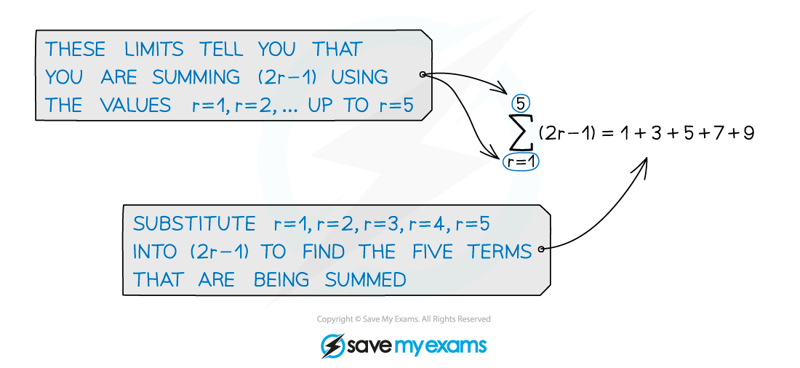

# Sigma Notation

## Sigma Notation

> **Spec point** — `spcpt_swdRnhvMhXTQXpzj`

## Sigma Notation

### What is sigma notation?

- **Sigma notation** is used to show the sum of a certain number of terms in a sequence

  - The symbol Σ is the capital Greek letter **sigma**
- Σ stands for ‘**sum**’

  - The expression to the right of the Σ tells you **what is being summed**
  - The **limits** above and below tell you **which terms** you are summing
  - $r$ and $k$ are both common variables to use when writing sigma sums

- Be careful, the **limits don’t have to start with 1**

  - For example `sum from k space equals space 0 to 4 of left parenthesis 2 k plus 1 right parenthesis`  or  `sum from k space equals space 7 to 14 of left parenthesis 2 k minus 13 right parenthesis`
- You need to be able to **read** and **use** sigma notation when answering questions about **series**

  - For example the sum of the fifth through ninth terms of an arithmetic series
  
    - This could be written as  `sum from k equals 5 to 9 of open parentheses a plus open parentheses k minus 1 close parentheses d close parentheses`
  - Or the sum of the first $n$ terms of a geometric series
  
    - This could be written as  `sum from k equals 1 to n of a r to the power of k minus 1 end exponent`

> **Exam Hint**
> - Your calculator may be able to use sigma notation
> 
>   - If so make sure you know how it works
>   - You can use this to check your work

> **Worked Example**
> The terms of a series are defined by  $u_{n}=2\times3^{n-1}$, * *for  $n=1,2,3,...$ .
> 
> (a) Write an expression for the sum of the first six terms of the series using sigma notation.
> 
> > *Use sum limits from 1 to 6*
> 
> > `sum from k equals 1 to 6 of u subscript k space`
> 
> *Note that '*$n$*' is replaced by '*$k$*' to match the variable used for the sigma sum *
> 
> > *Now replace *$u_{k}$* with the actual formula, being sure to use *$k$* instead of *$n$* again*
> 
> `bold sum from bold k bold equals bold 1 to bold 6 of stretchy left parenthesis 2 cross times 3 to the power of k minus 1 end exponent stretchy right parenthesis`
> 
> (b) Write an expression for the sum of the seventh through twelfth terms of the series using sigma notation.
> 
> > *This will be the same as in part (a), except that the limits will be 7 on the bottom and 12 on the top*
> 
> `bold sum from bold k bold equals bold 7 to bold 12 of begin bold style stretchy left parenthesis 2 cross times 3 to the power of k minus 1 end exponent stretchy right parenthesis end style`
> 
> (c) Write an expression for the sum of the first $n$ terms of the series using sigma notation.
> 
> > *This is very similar to the above, but the sum limits will start at 1 and go to *$n$
> 
> `sum from k equals 1 to n of u subscript k`
> 
> > *Be careful here  –  *$k$* is the variable for the sigma sum, and *$n$* means we're going up to the *$n$*th** term *
> 
> `bold sum from bold k bold equals bold 1 to bold n of begin bold style stretchy left parenthesis 2 cross times 3 to the power of k minus 1 end exponent stretchy right parenthesis end style`
