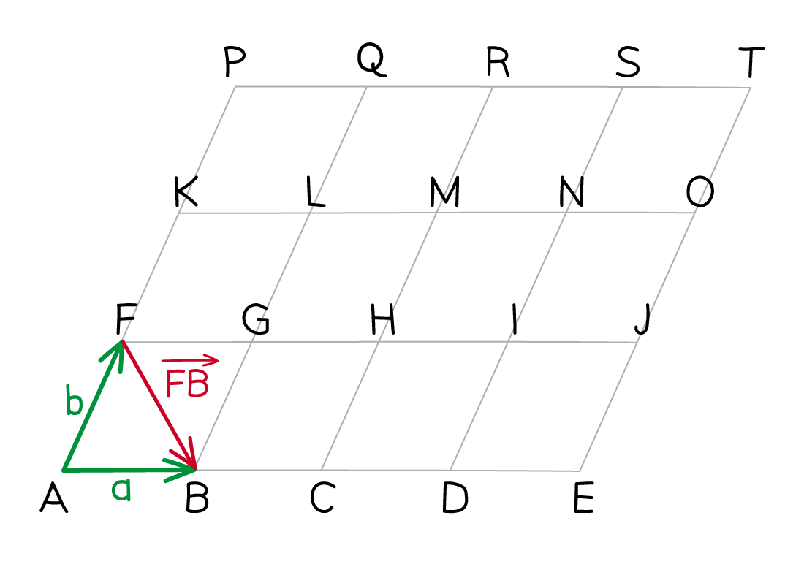
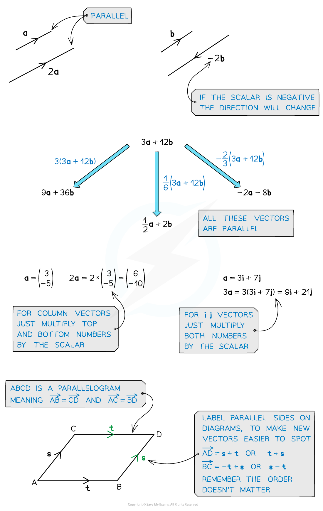
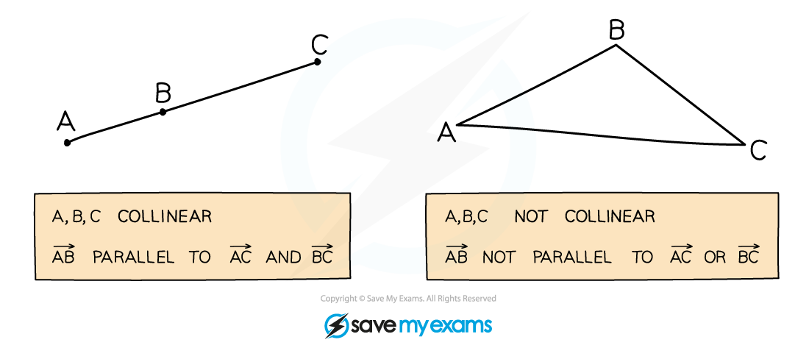

# Geometric Proof with Vectors

## Vector Paths

> **Spec point** — `spcpt_8hQvXWh3XrFvX25s`

## Vector Paths

### How do I use vector paths?

- A **vector path** is a path of vectors taking you from a **start point **to an **end point**
- On the diagram shown

  - *F  *to *B * has the **path** *F * to *A * to *B*
  
    - $\overset{\rightarrow}{FB}=\overset{\rightarrow}{FA}+\overset{\rightarrow}{AB}$
  - There are other possible paths too
  
    - *F * to *G*  to *B*
- You can write vector paths in terms of vectors given (**a**, **b**, ...)

  - The rule $\overset{\rightarrow}{XY}=-\overset{\rightarrow}{YX}$ helps
  
    - $\overset{\rightarrow}{FB}=\overset{\rightarrow}{FA}+\overset{\rightarrow}{AB}=-\overset{\rightarrow}{AF}+\overset{\rightarrow}{AB}=-b+a$
- Vectors given can be used to build bigger paths

  - $\overset{\rightarrow}{FM}=\overset{\rightarrow}{FG}+\overset{\rightarrow}{GH}+\overset{\rightarrow}{HM}=a+a+b=2a+b$
  
    - **Different** correct paths **simplify** to the** same** final answer

### How do I use ratios in vector paths?

- Convert** ratios** into **fractions**
- In the example shown, if $AX:XB=3:5$ then

  - $\overset{\rightarrow}{AX}=\frac{3}{8}\overset{\rightarrow}{AB}$
  - $\overset{\rightarrow}{XB}=\frac{5}{8}\overset{\rightarrow}{AB}$
  
    - The ratio 3:5 has 3 + 5 = 8 parts
- Always **check** which ratio you are being asked for

  - $\overset{\rightarrow}{AX}=\frac{3}{5}\overset{\rightarrow}{XB}$
  - $\overset{\rightarrow}{XB}=\frac{5}{3}\overset{\rightarrow}{AX}$

> **Exam Hint**
> - Mark schemes will accept different correct paths, as long as the final answer is fully simplified.
> - Check for symmetries in the diagram to see if the vectors given can be used anywhere else.

> **Worked Example**
> The following diagram shows a grid formed of identical parallelograms.
> 
> Vectors $a$* *and $b$*** ***are given by $\overset{\rightarrow}{AB}$ and $\overset{\rightarrow}{AF}$ respectively.
> 
> 
> 
> Find the following vectors in terms of $a$ and $b$, fully simplifying your answer.
> 
> (a) $\overset{\rightarrow}{EK}$
> 
> > *There are many ways to get from** E ** to **K *
> *One option is **E  **to **O  **(**b** **twice) then **O  **to **K  **( **-a** four times). *
> 
> `table row cell stack E K with rightwards arrow on top space end cell equals cell space stack E J with rightwards arrow on top space plus thin space stack J O with rightwards arrow on top space plus space stack O N with rightwards arrow on top space plus space stack N M with rightwards arrow on top space plus space stack M L with rightwards arrow on top space plus space stack L K with rightwards arrow on top space space end cell row blank equals cell bold b plus bold b minus bold a space minus bold a minus bold a minus bold a end cell end table`
> 
> > * *$\overset{\rightarrow}{EK}=2b-4a$
> 
> **-4****a ****+ 2****b**** ****also accepted**
> 
> (b) $\overset{\rightarrow}{AX}$, where $X$is the point on the line $AT$such that $AX:XT=1:3$.
> 
> *Start by imagining the vector *`table row blank blank cell stack A T with rightwards arrow on top end cell end table`
> *It is easy to write this vector in terms of **a** and **b** *
> 
> `table row blank blank cell stack A T with rightwards arrow on top end cell end table equals 4 bold a plus 3 bold b`
> 
> *To find *`table row blank blank cell stack A X with rightwards arrow on top end cell end table`*, use the given ratio to write it as a fraction of *`table row blank blank cell stack A T with rightwards arrow on top end cell end table`
> *There are 1 + 3 = 4 parts*
> 
> `table row cell stack A X with rightwards arrow on top space end cell equals cell 1 fourth stack A T with rightwards arrow on top end cell end table`
> 
> *Substitute in the known expression for *`table row blank blank cell stack A T with rightwards arrow on top end cell end table`
> *Expand and simplify to get the final answer*
> 
> `table row cell stack A X with rightwards arrow on top end cell equals cell 1 fourth open parentheses 4 bold a plus 3 bold b close parentheses end cell row blank equals cell bold a plus 3 over 4 bold b end cell end table`
> 
> `table row cell stack bold italic A bold italic X with bold rightwards arrow on top end cell bold equals cell bold a bold plus bold 3 over bold 4 bold b end cell end table`

## Parallel Vectors

> **Spec point** — `spcpt_MqKYJCxtBRDQCVcd`

## Parallel Vectors

### How do I know if two vectors are parallel?

- Two vectors are **parallel **if one is a **scalar multiple** of the other

  - This means if **b** is parallel to **a**, then **b** = *k***a**
  
    - where *k* is a **constant number **(scalar)
- For example, `bold a equals open parentheses table row 1 row 3 end table close parentheses` and `bold b equals open parentheses table row 2 row 6 end table close parentheses`

  - `open parentheses table row 2 row 6 end table close parentheses equals 2 cross times open parentheses table row 1 row 3 end table close parentheses` so $b=2a$
  - **b** is a scalar multiple of **a**, so **b** is **parallel** to **a**
- If the scalar multiple is **negative**, then the vectors are **parallel** and in **opposite** directions

  - `bold c equals open parentheses table row cell negative 3 end cell row cell negative 9 end cell end table close parentheses equals negative 3 bold a`
  
    - **c** is **parallel** to **a** and in the** opposite** direction

### How do I use factorisation to show two vectors are parallel?

- If two vectors **factorise** with a **common bracket**, then they are parallel

  - They can be written as **scalar multiples**
- For example

  - 9**a** + 6**b **factorises to 3(3**a** + 2**b**)
  - 12**a** + 8**b **factorises to 4(3**a** + 2**b**)
  - This means `12 bold a plus 8 bold b equals 4 over 3 open parentheses 9 bold a plus 6 bold b close parentheses`
  
    - so they are **scalar multiples** of each other
    - and therefore **parallel**

> **Exam Hint**
> - If a question asks you to show that two vectors are parallel
> 
>   - Don't stop after showing two vectors are scalar multiples of each other
>   - You must conclude with "therefore **a** and **b** are parallel" to get all the marks!

> **Worked Example**
> Show that the vectors $a=2p-4q$ and $b=6q--3p$** **are parallel.
> 
> *It helps to write **b** in the same order as **a*
> 
> $b=-3p+6q$
> 
> *Factorise both vectors to form a common bracket*
> 
> `table row bold a equals cell 2 open parentheses bold p minus 2 bold q close parentheses end cell row bold b equals cell negative 3 open parentheses bold p minus 2 bold q close parentheses end cell end table`
> 
> *Write **b** in terms of **a*
> *It can help to make the brackets the subject of the first equation, i.e. *`open parentheses bold p minus 2 bold q close parentheses equals bold a over 2`
> *Then substitute that into the equation for **b*
> 
> $b=-3\times\frac{a}{2}=-\frac{3}{2}a$
> 
> > *Write a conclusion showing the scalar multiple*
> *State that this shows they are parallel*
> 
> $b=-\frac{3}{2}a$ **therefore b is parallel to a**
> 
> **You could also use **$a=-\frac{2}{3}b$** **

## Collinearity

> **Spec point** — `spcpt_ytFXnVjhmx9fBzdT`

## Collinearity

### What does collinear mean?

- The points *A *, *B * and *C * are **collinear** if they all lie along the **same straight line**
- In the image on the left in the diagram below, the following vectors are all **parallel**:

  - $\overset{\rightarrow}{AB},\overset{\rightarrow}{BC},\overset{\rightarrow}{AC},\overset{\rightarrow}{BA},\overset{\rightarrow}{CA},\overset{\rightarrow}{CB}$

### How do I use vectors to show that three points are collinear?

- To show the points *A *, *B * and *C * are **collinear**

  - prove that two line segments are **parallel**
  - and show that there is at least **one point** that **lies on both **segments
  
    - This makes them parallel and **connected **(not side-by-side)
- For example, if you show that $\overset{\rightarrow}{BC}=2\overset{\rightarrow}{AB}$ then

  - the line segments *AB*  and *BC  *are parallel
  - and they have a **common point**, *B *
  
    - So *A *, *B * and *C  *must be collinear
- Similarly, $\overset{\rightarrow}{AC}=3\overset{\rightarrow}{AB}$ means *AC * and *AB * are parallel

  - and they have a common point, *A*
  
    - so *A *, *B * and *C  *must be collinear

### How can collinearity be used when extend lines?

- **Extending** the line segment *OA*  means **continuing** the straight line** beyond ***A*

  - If the extended line passes through the point *X *
  
    - then *O* , *A*  and *X*  are **collinear**
- To **test **whether another point, *Y *, is on* ****OA*****  extended**

  - test whether *O* , *A*  and *Y*  are **collinear**

> **Exam Hint**
> - Even though it's 'obvious' that $\overset{\rightarrow}{AB}$ and $\overset{\rightarrow}{AC}$ have a common point at *A*, you should still write this fact in your answer to complete a collinearity proof.

> **Worked Example**
> The diagram shows a quadrilateral, $OABC$, where
> 
> $\overset{\rightarrow}{OA}=2a$
> 
> $\overset{\rightarrow}{OC}=c$
> 
> It is also know that
> 
> $\overset{\rightarrow}{OB}=2a+3c$
> 
> 
> 
> > * *
> 
> (a) Juan believe that the point $X$, which is halfway along $AC$, lies on the line $OB$.
> 
> Show that $O$, $X$ and $B$ are not collinear.
> 
> *O **, **X  **and **B  **are collinear if two line segments are parallel and share a common point*
> *Consider the vectors *$\overset{\rightarrow}{OX}$* and  *$\overset{\rightarrow}{OB}$
> *They have a common point, **O*
> *Check if they are parallel by first finding *$\overset{\rightarrow}{OX}$
> 
> `table row cell stack O X with rightwards arrow on top end cell equals cell stack O A with rightwards arrow on top plus 1 half stack A C with rightwards arrow on top end cell row blank equals cell 2 bold a plus 1 half open parentheses stack A O with rightwards arrow on top plus stack O C with rightwards arrow on top close parentheses end cell row blank equals cell 2 bold a plus 1 half open parentheses negative 2 bold a plus bold c close parentheses end cell end table`
> 
> *Expand and simplify*
> 
> `table row cell stack O X with rightwards arrow on top end cell equals cell 2 bold a minus bold a plus 1 half bold c end cell row blank equals cell bold a plus 1 half bold c end cell end table`
> 
> *Now compare it to *$\overset{\rightarrow}{OB}=2a+3c$* (given in the question)*
> *Try factorisation to write *$\overset{\rightarrow}{OB}$* in terms of *$\overset{\rightarrow}{OX}$
> 
> `table row cell stack O B with rightwards arrow on top end cell equals cell 2 bold a plus 3 bold c end cell row blank equals cell 2 open parentheses bold a plus 3 over 2 bold c close parentheses end cell end table`
> 
> > *The *$a$* inside the brackets matches the *$a$* in *$\overset{\rightarrow}{OX}=a+\frac{1}{2}c$
> *But the *$+\frac{3}{2}c$* inside the brackets does not match the *$+\frac{1}{2}c$* in *$\overset{\rightarrow}{OX}=a+\frac{1}{2}c$
> *Therefore you cannot write *$\overset{\rightarrow}{OB}$* and *$\overset{\rightarrow}{OX}$* as scalar multiples of each other*
> 
> **Final answer:** $\overset{\rightarrow}{OX}$** is not a scalar multiple of **$\overset{\rightarrow}{OB}$
> **Therefore ****OX **** and ****OB****  are not parallel**
> **O ****, ****X****  and ****B **** cannot be collinear**
> 
> > * *
> 
> (b) Maria believes that the point $Y$, which is three quarters along $AC$ from $A$, lies on the line $OB$.
> 
> Show that $O$, $Y$ and $B$ are collinear.* *
> 
> > *Similarly to part (a), find *$\overset{\rightarrow}{OY}$* and see if it is parallel to *$\overset{\rightarrow}{OB}$* *
> 
> > `table row cell stack O Y with rightwards arrow on top end cell equals cell stack O A with rightwards arrow on top plus 3 over 4 stack A C with rightwards arrow on top end cell row blank equals cell 2 bold a plus 3 over 4 open parentheses negative 2 bold a plus bold c close parentheses end cell row blank equals cell 1 half bold a plus 3 over 4 bold c end cell end table`
> * *
> 
> > *Use factorisation to write *$\overset{\rightarrow}{OB}$* in terms of *$\overset{\rightarrow}{OY}$* *
> 
> > `stack O B with rightwards arrow on top equals 2 bold a plus 3 bold c
> equals 4 open parentheses 1 half bold a plus 3 over 4 bold c close parentheses
> equals 4 space stack O Y with rightwards arrow on top`
> * *
> 
> > *So** OB ** is parallel to **OY** *
> *They also have a common point, **O*
> 
> **Final answer:** $\overset{\rightarrow}{OB}=4\overset{\rightarrow}{OY}$
> **Therefore ****OY****  and ****OB****  are parallel**
> **They also have a common point, ****O**
> **Therefore ****O****, ****Y**** and ****B**** are collinear**

## Equating Coefficients of Vectors

> **Spec point** — `spcpt_tGntZJkkRgq8czMm`

## Equating Coefficients of Vectors

### How do I equate coefficients of vectors?

- In the vector $10a-3b$

  - the coefficient of **a** is $10$
  - the coefficient of **b** is $-3$
- Two vectors can **only** be equal if **all** their coefficients are equal
- So if the vectors $3a+kb$ and $ma+5b$ are both **equal **

  - then $3=m$ (by equating coefficients of **a**)
  - and $k=5$ (by equating coefficients of **b**)

### How do I use equating coefficients to find points of intersection?

- Some diagrams have vectors that meet at a **point**

  - These are called **concurrent** vectors
- To find this point, create **two different vector paths** that approach the point from **different directions**

  - Then set them **equal** and **equate coefficients**
- For example, if the lines *AB * and *CD * **intersect **at the point *P *,* *find $\overset{\rightarrow}{AP}$

  - One path is along the line *AB*
  
    - *A* , *P*  and *B*  are **collinear**
    - so $\overset{\rightarrow}{AP}=k\overset{\rightarrow}{AB}$ (they are **parallel**)
  - Another path is along the line *CD*
  
    - For example, $\overset{\rightarrow}{AP}=\overset{\rightarrow}{AC}+\overset{\rightarrow}{CP}$
    - *C* , *P*  and *D*  are also collinear so $\overset{\rightarrow}{CP}=λ\overset{\rightarrow}{CD}$
    - $λ$ is a **different** scalar to $k$
  - Set both paths** equal **and equate coefficients
  
    - This forms** simultaneous equations** in $k$ and $λ$
    - **Solve** these and **substitute **their values back in to find $\overset{\rightarrow}{AP}$

> **Exam Hint**
> - The method of equating two different paths is really useful for other hard situations.
> 
>   - For example, extending lines out of a diagram, or continuing lines within a diagram.

> **Worked Example**
> The diagram shows the diagonals of quadrilateral $OABC$, where
> 
> $\overset{\rightarrow}{OA}=2a$
> 
> $\overset{\rightarrow}{OC}=c$
> 
> You are also given that
> 
> $\overset{\rightarrow}{AB}=3\overset{\rightarrow}{OC}$
> 
> 
> 
> The diagonals $AC$ and $OB$ intersect at the point $P$.
> 
> Find the vector $\overset{\rightarrow}{OP}$, giving your answer fully simplified in terms of $a$ and $c$.
> 
> > *Find two different paths from **O ** to **P ** that come in along different diagonals*
> *The first path is along **OB**  itself*
> *Although the length **OP ** is unknown, *$\overset{\rightarrow}{OP}$*  is definitely a scalar multiple of *$\overset{\rightarrow}{OB}$* (they are parallel)*
> * *
> 
> > $\overset{\rightarrow}{OP}=k\overset{\rightarrow}{OB}$
> * *
> 
> > *Use *`table attributes columnalign right center left columnspacing 0px end attributes row cell stack O B with rightwards arrow on top end cell equals cell stack O A with rightwards arrow on top plus stack A B with rightwards arrow on top equals stack O A with rightwards arrow on top plus 3 stack O C with rightwards arrow on top end cell end table`* to write this first path in terms of **a** and **c*
> * *
> 
> > `stack O P with rightwards arrow on top equals k open parentheses 2 bold a plus 3 bold c close parentheses`
> * *
> 
> > *The second path needs to come in along the **AC** diagonal*
> * *
> 
> > `table row cell stack O P with rightwards arrow on top end cell equals cell stack O A with rightwards arrow on top plus stack A P with rightwards arrow on top end cell end table`* *
> 
> > *Although the length **AP  **is unknown, *$\overset{\rightarrow}{AP}$* is definitely a scalar multiple of *$\overset{\rightarrow}{AC}$* (they are parallel)*
> *Give the scalar a letter different to *$k$* used above *
> 
> > *  *`table row cell stack O P with rightwards arrow on top end cell equals cell stack O A with rightwards arrow on top plus lambda space stack A C with rightwards arrow on top end cell end table`
> *  *
> 
> > *Use *$\overset{\rightarrow}{AC}=\overset{\rightarrow}{AO}+\overset{\rightarrow}{OC}$* to write this second path in terms of **a** and **c *
> 
> > `stack O P with rightwards arrow on top equals 2 bold a plus lambda open parentheses negative 2 bold a plus bold c close parentheses`* *
> 
> > *Set the first path equal to the second path *
> 
> > `k open parentheses 2 bold a plus 3 bold c close parentheses equals 2 bold a plus lambda open parentheses negative 2 bold a plus bold c close parentheses`
> * *
> 
> > *Collect the terms into their **a **and **c** components on each side *
> 
> > `2 k bold a plus 3 k bold c equals open parentheses 2 minus 2 lambda close parentheses bold a plus lambda bold c`
> * *
> 
> > *Equate (and simplify) the **a** coefficients *
> 
> > `table row cell 2 k end cell equals cell 2 minus 2 lambda end cell row k equals cell 1 minus lambda end cell end table`
> * *
> 
> > *Equate the **c** coefficients  *
> 
> > $3k=λ$
> * *
> 
> > *This gives two simultaneous equations in *$k$* and *$λ$
> *Solve these simultaneously *
> 
> `table row k equals cell 1 minus 3 k end cell row cell 4 k end cell equals 1 row k equals cell 1 fourth end cell end table`
> *and ** *$λ=\frac{3}{4}$
> * *
> 
> > *Go back to either of the two paths for *$\overset{\rightarrow}{OP}$* *
> *Substitute in *$k$* or *$λ$
> *Simplify to get the final answer*
> * *
> 
> `table row cell stack O P with rightwards arrow on top end cell equals cell k open parentheses 2 bold a plus 3 bold c close parentheses end cell row blank equals cell 1 fourth open parentheses 2 bold a plus 3 bold c close parentheses end cell row blank equals cell 1 half bold a plus 3 over 4 bold c end cell end table`
> 
> `table row cell stack bold italic O bold italic P with rightwards arrow on top end cell bold equals cell bold 1 over bold 2 bold a bold plus bold 3 over bold 4 bold c end cell end table`
