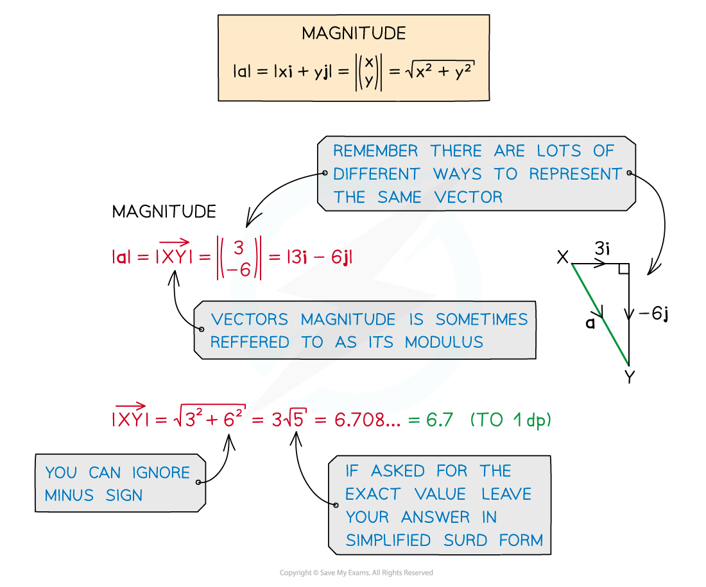

# Magnitude of a Vector

## Magnitude of a Vector

> **Spec point** — `spcpt_zqGQtK2S4rZfWPy8`

## Magnitude of a Vector

### How do I find the magnitude of a vector?

- The **magnitude **of a **vector** is its **length **(distance)

  - It is also called the **modulus**
- The magnitude of $\overset{\rightarrow}{AB}$ is written `open vertical bar stack A B with rightwards arrow on top close vertical bar`

  - The magnitude of **a** is written |**a**|
- In** component** form, the magnitude is the **hypotenuse** of a right-angled triangle

  - Use **Pythagoras' theorem** to find it
  - The magnitude of $a=xi+yj$ is
  
    - `open vertical bar bold a close vertical bar equals blank square root of x to the power of 2 space end exponent plus blank straight y squared end root`
    - where `bold a equals blank open parentheses table row x row y end table close parentheses`

### How do I find harder magnitudes?

- The magnitude of a **sum** of vectors is **not equal** to the sum of the magnitudes

  - `vertical line bold a plus-or-minus bold b vertical line not equal to vertical line bold a vertical line plus-or-minus vertical line bold b vertical line`
  
    - Work out **a** + **b** (or **a** - **b**) first, then find its magnitude
- You may need to **form an equation**

  - For example, |**a**| = 5 where **a** = 4**i** + *x***j**
  
    - $\sqrt{4^{2}+x^{2}}=5$
    - This solves to give $x=\pm3$

### How do I find the magnitude of a displacement vector?

- You can use **coordinate geometry** to find **magnitudes **of **displacement vectors** from *A * to *B*

  - From the **position vectors** of *A*  and *B*  you know their coordinates
  
    - If  `bold a equals stack O A with rightwards arrow on top equals x subscript 1 bold i plus y subscript 1 bold j equals open parentheses table row cell x subscript 1 end cell row cell y subscript 1 end cell end table close parentheses`,  then point A has coordinates `open parentheses x subscript 1 comma space y subscript 1 close parentheses`
    - If  `bold b equals stack O B with rightwards arrow on top equals x subscript 2 bold i plus y subscript 2 bold j equals open parentheses table row cell x subscript 2 end cell row cell y subscript 2 end cell end table close parentheses`,  then point B has coordinates `open parentheses x subscript 2 comma space y subscript 2 close parentheses`
  - The **distance** between two points is given by `d space equals blank square root of open parentheses x subscript 1 minus blank x subscript 2 close parentheses squared space plus space open parentheses y subscript 1 minus blank y subscript 2 close parentheses squared end root blank`
  
    - So  `open vertical bar stack A B with rightwards arrow on top close vertical bar space equals blank square root of open parentheses x subscript 1 minus blank x subscript 2 close parentheses squared space plus space open parentheses y subscript 1 minus blank y subscript 2 close parentheses squared end root blank`
  - For example, if points A and B have position vectors $5i+3j$ and $3i-6j$ respectively
  
    - then  `open vertical bar stack A B with rightwards arrow on top close vertical bar equals square root of open parentheses 5 minus 3 close parentheses squared plus open parentheses 3 minus open parentheses negative 6 close parentheses close parentheses squared end root equals square root of 85 equals 9.22 space open parentheses 3 space straight s. straight f. close parentheses`

- Alternatively, you could find `open vertical bar stack A B with rightwards arrow on top close vertical bar` by

  - first using  $\overset{\rightarrow}{AB}=-\overset{\rightarrow}{OA}+\overset{\rightarrow}{OB}$ to find $\overset{\rightarrow}{AB}$ in **vector form**
  
    - and then calculating its **magnitude** directly
  - See the Worked Example below

> **Exam Hint**
> - When magnitudes involve algebra, it helps to square both sides to get rid of the square root sign!

> **Worked Example**
> $O$, $A$and $B$ are fixed points, where $\overset{\rightarrow}{OA}=2i+mj$ and $\overset{\rightarrow}{OB}=-i+4j$.
> 
> Given that `vertical line stack A B with rightwards arrow on top vertical line equals 3 square root of 2` and $m>5$, find the value of $m$.
> 
> > *Use  *$\overset{\rightarrow}{AB}=\overset{\rightarrow}{AO}+\overset{\rightarrow}{OB}=-\overset{\rightarrow}{OA}+\overset{\rightarrow}{OB}$
> *Simplify and collect components *
> 
> > `table row cell stack A B with rightwards arrow on top end cell equals cell negative open parentheses 2 bold i plus m bold j close parentheses plus open parentheses negative bold i plus 4 bold j close parentheses end cell row blank equals cell negative 2 bold i minus m bold j minus bold i plus 4 j end cell row blank equals cell negative 3 bold i plus open parentheses 4 minus m close parentheses bold j end cell end table`
> * *
> 
> > *Use  *`vertical line x bold i plus y bold j vertical line equals square root of x squared plus y squared end root`* *
> 
> > `table row cell open vertical bar stack A B with rightwards arrow on top close vertical bar end cell equals cell square root of open parentheses negative 3 close parentheses squared plus open parentheses 4 minus m close parentheses squared end root end cell end table`
> * *
> 
> > *Expand and simplify inside the square root*
> *You cannot just take the square root of the individual terms!*
> * *
> 
> > `table row cell open vertical bar stack A B with rightwards arrow on top close vertical bar end cell equals cell square root of 9 plus 16 minus 8 m plus m to the power of 2 space end exponent end root end cell row blank equals cell square root of 25 minus 8 m plus m to the power of 2 space end exponent end root end cell end table`
> * *
> 
> > *Substitute in *`open vertical bar stack A B with rightwards arrow on top close vertical bar equals 3 square root of 2`* from the question*
> *Square both sides and form a quadratic in *$m$
> * *
> 
> > `table row cell 3 square root of 2 end cell equals cell square root of 25 minus 8 m plus m squared end root end cell row cell open parentheses 3 square root of 2 close parentheses squared end cell equals cell 25 minus 8 m plus m squared end cell row 18 equals cell 25 minus 8 m plus m squared end cell row 0 equals cell m squared minus 8 m plus 7 end cell end table`
> * *
> 
> > *Factorise and solve *
> 
> > `0 equals open parentheses m minus 1 close parentheses open parentheses m minus 7 close parentheses
> m equals 1 comma space space m equals 7`
> * *
> 
> > *You are given that *$m>5$* in the question*
> *This means *$m=7$* is the only valid answer*
> 
> $m=7$

## Unit Vectors

> **Spec point** — `spcpt_7bdp3GppCFjsMw5y`

## Unit Vectors

### What is a unit vector?

- A **unit vector** is a vector of **length 1**
- Any vector, **a**, can be made a unit vector by **dividing** it by its **magnitude**,`fraction numerator bold a over denominator open vertical bar bold a close vertical bar end fraction`

  - This will result in a vector of length 1
  
    - It still points in the same direction as **a**
- For example, to make 3**i** – 4**j** a unit vector

  - find its magnitude, `square root of 3 squared plus open parentheses negative 4 close parentheses squared end root equals square root of 25 equals 5`
  - divide by its magnitude
  
    - $\frac{(3i-4j)}{5}=\frac{3}{5}i-\frac{4}{5}j$
    - Each** component **is divided by the magnitude

> **Exam Hint**
> - Read vector questions carefully
> 
>   - Some may want you to give your final answer as a unit vector!

> **Worked Example**
> The position vector of a point,* *$A$, relative to the origin,* *$O$, is given by $\overset{\rightarrow}{OA}=-7i+j$
> 
> Find a unit vector in the direction of $\overset{\rightarrow}{OA}$, giving your answer in exact form.
> 
> > *To find a unit vector, divide the vector by its magnitude*
> *Find and simplify the magnitude, *`vertical line stack O A with rightwards arrow on top vertical line`*, using *$\sqrt{x^{2}+y^{2}}$
> * *
> 
> > `table row cell vertical line stack O A with rightwards arrow on top vertical line end cell equals cell square root of open parentheses negative 7 close parentheses squared plus 1 squared end root end cell row blank equals cell square root of 49 plus 1 end root end cell row blank equals cell square root of 50 end cell row blank equals cell square root of 25 cross times 2 end root end cell row blank equals cell 5 square root of 2 end cell end table`
> * *
> 
> *Divide each component in *$\overset{\rightarrow}{OA}$* by *`table attributes columnalign right center left columnspacing 0px end attributes row blank blank cell 5 square root of 2 end cell end table`
> 
> `fraction numerator stack O A with rightwards arrow on top over denominator vertical line stack O A with rightwards arrow on top vertical line end fraction equals negative fraction numerator 7 over denominator 5 square root of 2 end fraction bold i plus fraction numerator 1 over denominator 5 square root of 2 end fraction bold j`
> 
> **Final answer:** **The unit vector is **$-\frac{7}{5\sqrt{2}}i+\frac{1}{5\sqrt{2}}j$
> 
> $-\frac{7}{\sqrt{50}}i+\frac{1}{\sqrt{50}}j$** would be accepted**
> **Decimals would not be accepted**
> **Rationalised denominators would be accepted, **$-\frac{7\sqrt{2}}{10}i+\frac{\sqrt{2}}{10}j$
