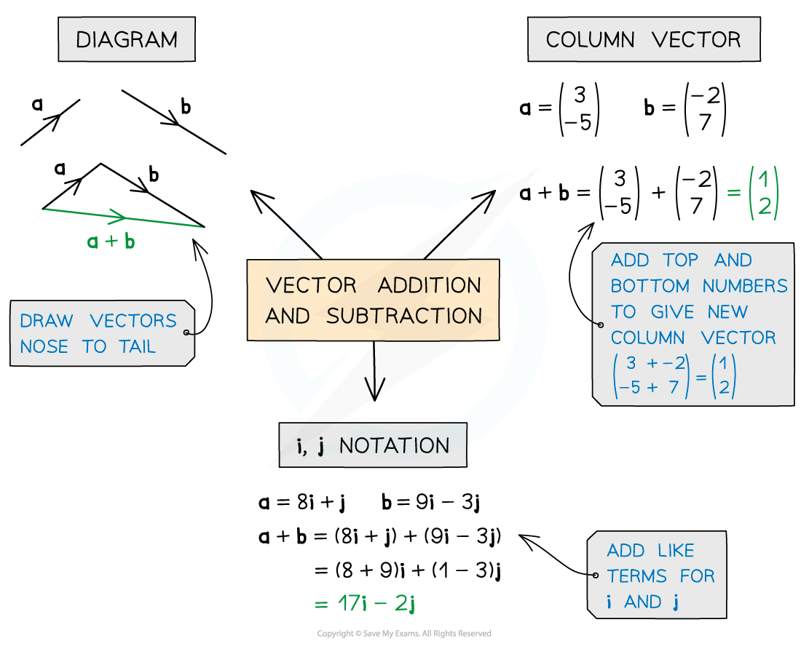
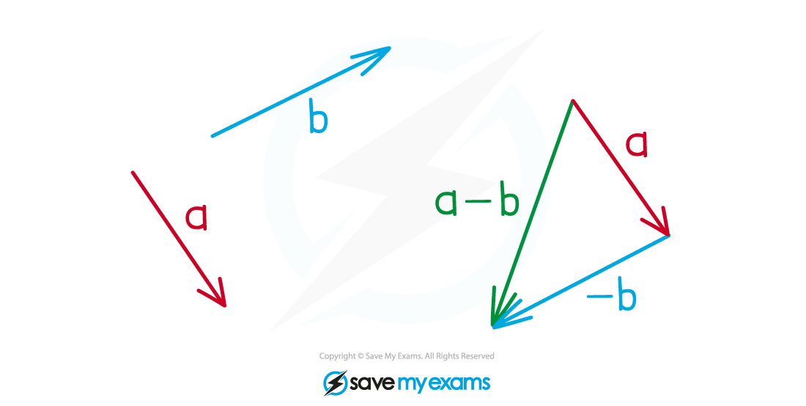
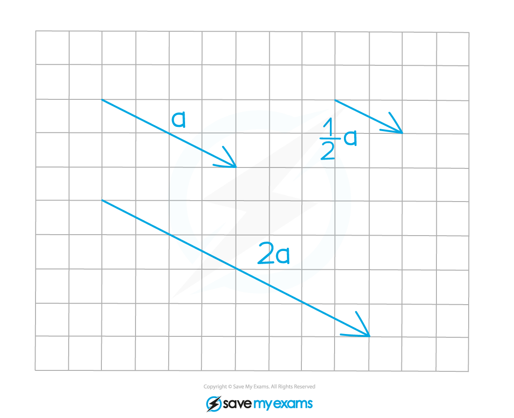
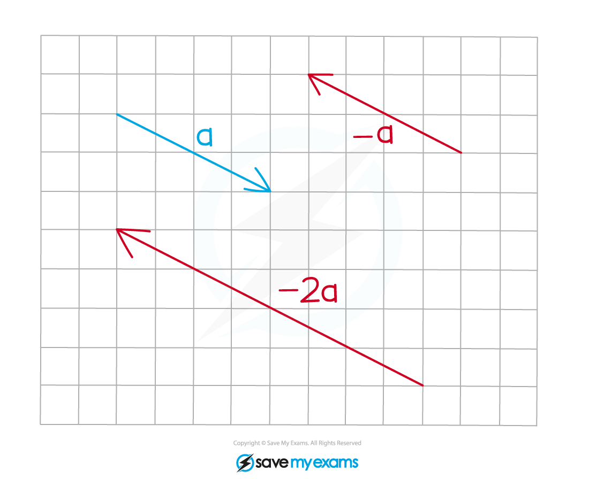

# Vector Basics

## Vector Notation

> **Spec point** — `spcpt_b7s2qVSRbVQBBK49`

## Vector Notation

### What is a vector?

- **Vectors** represent a **movement** of a certain distance (**magnitude**) in a given **direction**
- In **one dimension**, the **sign** of a number represents its direction

  - For example, two objects with** **velocities 7 m/s and ‑7 m/s are travelling:
  
    - at the **same speed **(magnitude)
    - but in **opposite** **directions**
- In** two dimensions**, vectors consist of *x-* and *y-***components**

  - This shows movement parallel to the* x*  and *y*-**axes**
  - Components can be **positive **or** negative **

### What is a scalar?

- A** scalar** is an **ordinary number** that does **not **represent movement

  - A scalar is **not** a vector

- Scalars can still be **negative**

  - For example
  
    - temperature is a scalar (it's -2°C today)
    - but **change** in temperature is a vector (it's +3°C from yesterday)

### How do I write vectors?

- If you know the **two components **of a vector, you can write it as

  - either a **column vector**
  
    - `open parentheses table row 3 row 2 end table close parentheses` is 3 right and 2 up
  - or in **i and** **j** **notation**
  
    - $3i+2j$
- If you do not know the components, use a **lower-case letter** to represent the entire vector

  - Exams use** bold** letters
  
    - **a**, **b**, ...
  - You should write **underlined** letters
  
    - <u>a</u>, <u>b</u>, ...
- If points *(A ,* *B *, ...) are given, $\overset{\rightarrow}{AB}$ means the vector **from** *A * **to** *B*

  - The **order** matters

> **Exam Hint**
> - Diagrams can help. If there isn’t one, try sketching one!

## Adding & Subtracting Vectors

> **Spec point** — `spcpt_xxTkjVSfywvrd578`

## Adding & Subtracting Vectors

### How do I add vectors?

- To **add **vectors you add their **components**

  - For** column vectors**, add the tops together and bottoms together
  
    - `open parentheses 2 over 1 close parentheses plus open parentheses 1 fourth close parentheses equals blank open parentheses 3 over 5 close parentheses`
- In **i and** **j** **notation**, add **i** and **j** parts separately

  - (2**i **+ **j**)** **+ (**i** + 4**j**) = (3**i** + 5**j)**
- Visually, the vector **a **+ **b** is the shortest route

  - from the start of **a**
  - to the end of **b**

### How do I subtract vectors?

- To **subtract **vectors you subtract their **components**

  - `open parentheses 2 over 1 close parentheses minus open parentheses 1 fourth close parentheses equals blank open parentheses fraction numerator 1 over denominator negative 3 end fraction close parentheses`
- In **i and** **j** **notation**, subtract **i** and **j** parts separately

  - Be careful with** brackets** and **negatives**
  
    - (2**i **+ **j**)** **- (**i** + 4**j**) = (**i** - 3**j)**
- Visually, the vector **a **- **b** is the shortest route

  - from the start of **a**
  - to the end of **-b**

### How do I add and subtract vectors on diagrams?

- Think of travelling along vectors as a journey

  - **a **+ **b** means follow **a**, then follow **b**
  
    - This is the same as **b** + **a**
    - They both end up at the same place
- The diagram below shows vectors **s**, **t** and **u**

  - To get from *A * to *C * do **s** then **t**
  
    - **s **+** t**
- If you have to travel the **wrong direction** along a vector, add the **negative** of that vector

  - To get from *B * to *D * do **t** then the **reverse** of **u**
  
    - **t** + (**-u**)
    - This simplifies to **t **-** u**
- A vector plus its negative gives the **zero vector, 0**

  - **a** + (**-a**) = **0**
  
    - The zero is bold (or underlined)

### How do I multiply a vector by a scalar?

- The **vector a** multiplied by a **scalar** (constant number) *k***  **is *k***a**

  - *k***a** is **parallel** to **a**
  - *k* is the **scale factor** of enlargement
  - A **negative** *k* **reverses** the direction
- Multiply all components by the scalar constant

  - For example
  
    - `2 open parentheses table row 4 row 5 end table close parentheses equals open parentheses table row 8 row 10 end table close parentheses`
    - 2(4**i** + 5**j**) = 8**i** + 10**j**

> **Exam Hint**
> - In the exam, questions with lots of parts usually build on each other.
> 
>   - Check if any previous results give shortcuts!

> **Worked Example**
> Two vectors are given by **a** = 4**i** + 2**j** and **b** = *p***i** – **j **where *p* is an unknown constant.
> 
> If **a** + 2**b** = –6**i**, find the value of *p*.
> 
> *Substitute the vectors into the left-hand side*
> 
> *(4****i**** + 2****j****) + 2(***p*****i**** – ****j****)*
> 
> *Expand the brackets*
> 
> *4****i**** + 2****j**** + 2***p*****i**** – 2****j***
> ** **
> 
> *Add the vectors by adding the components*
> *The 2**j** and -2**j** cancel*
> 
> *(4 + 2***p***)****i***
> 
> *This must equal the right-hand side of –6**i*
> *Write down an equation in **p** to balance both sides*
> 
> *4 + 2***p*** = –6*
> 
> *Solve it to find **p*
> 
> *2***p*** = –10*
> 
> **Final answer:** **p**** = –5**
