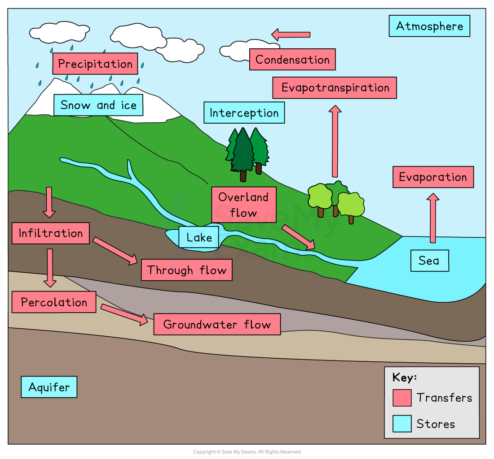

# The Hydrological Cycle

## Characteristics of the Water Cycle

> **Spec point** — `spcpt_xc9fjqyV7r7HwFtY`

## Characteristics of the hydrological cycle

- The **hydrological cycle **is a ***closed*** system
- Water is constantly recycled through the system
- The hydrological cycle includes **stores** and** transfers**

*The stores and transfers of the hydrological cycle*

> **Exam Hint**
> Remember there are no inputs and outputs in the hydrological system. There are only transfers and stores because it is a **closed** system.

## Stores of the Water Cycle

> **Spec point** — `spcpt_qtBtnr5xgWWkRbnq`

## Stores of the hydrological cycle

- **Stores **are those places where water is held for a period of time
- Stores of the hydrological cycle include:

  - the **atmosphere** where water is stored in the form of **water vapour** or as **water droplets** in clouds
  - **surface stores** such as puddles, lakes, rivers and reservoirs
  - **aquifers** which are permeable rocks such as limestone and sandstone which can hold water
  - **ice** and **snow**
  - **seas **and** oceans **
- **Interception** is how precipitation is prevented from reaching the ground, usually by being caught on leaves or branches

  - Some of the water will be stored on the leaves and evaporate into the atmosphere
  - The remaining water will flow down the leaves, branches and trunk until it reaches the ground (**stemflow**)

## Transfers of Water Within the Cycle

> **Spec point** — `spcpt_Ygtnq4RRcWjqZJWx`

## Transfers of water within the cycle

- **Transfers **are how water is moved around the hydrological cycle
- Transfers include:

  - **evaporation** is the change of water from a liquid to a gas (**water vapour**) due to heat from the sun
  
    - This process transfers water from the surface up into the **atmosphere**
    - Higher temperatures and strong winds lead to increased evaporation
  - **condensation** which occurs when water cools and changes from water vapour into a liquid (water droplets)
  
    - Condensation leads to the formation of **clouds**
  - **transpiration **which occurs when plants release water vapour from their leaves
  
    - This process transfers water from the plants into the atmosphere
  - **evapotranspiration** is the combined transfer of water vapour from the Earth's surface and plants
  - **precipitation** is the transfer of water from the atmosphere to the Earth's surface in the form of hail, sleet, rain or snow
  - **overland flow** is any water flowing across the Earth's surface
  - when water is transferred from the surface into the soil, this is known as **infiltration**
  - **percolation** is the transfer of water from the soil into the rocks and **aquifers**
  - **throughflow** occurs when water is transferred through the soil between the surface and the water table
  - **groundwater flow** is the transfer of water through rocks

### Advection

- **Advection** is the horizontal movement of air that carries water vapour and tiny water droplets from one place to another
- Wind moves air from one place to another
- If that air contains moisture (water vapour or droplets), the moisture moves with it.
- For example:

  - Warm, moist air from over the ocean can be blown over land
  - This can bring clouds, humidity, or rain to new areas
- Advection is important because it spreads heat and moisture around the Earth, helping to control weather patterns

> **Worked Example**
> **Identify the statement that best defines through flow  (1)**
> 
> **          A. ** Water moving through the soil
> 
> **          B.  **Water taken up by plants from the soil and released into the atmosphere
> 
> as water vapour
> 
> **         C. **Movement of water over the ground
> 
> **         D. **Movement of water through the rocks
> 
> - **Answer:**
> 
>   - ** A **** -**Through flow is the water moving through the soil below the surface and above the water table
> - The alternative answers are incorrect because:
> 
>   - B is transpiration
>   - C is overland flow
>   - D is groundwater flow

> **Exam Hint**
> Try sketching the hydrological cycle from memory. Remember to add a key to show stores and transfers.
