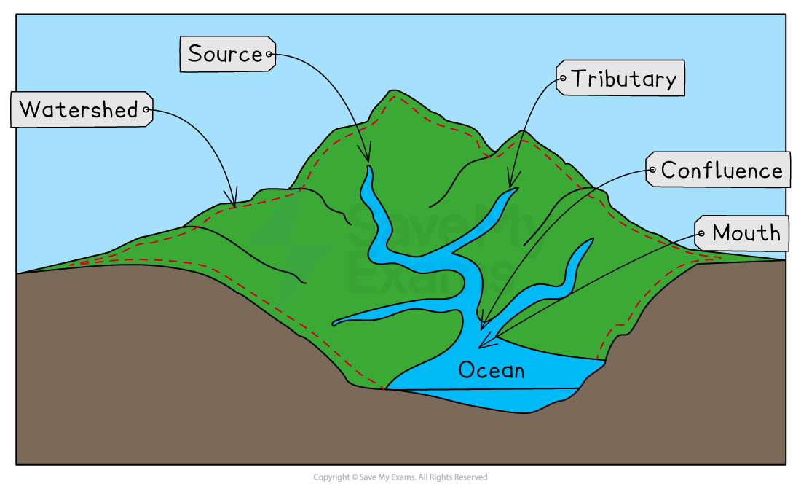

# The Drainage Basin

## The Drainage Basin

> **Spec point** — `spcpt_xmwGsYQQVHMRkGdP`

## What is a drainage basin?

- A **drainage basin** is the area of land drained by a river and its tributaries

  - This is also known as the catchment area of the river
- Drainage basins are ***open systems***
- As well as **stores **and** transfers** drainage basins have** inputs **and **outputs**

  - The** input** is any water **entering** the system (**precipitation**)
  - **Outputs** are where water is** lost **from the drainage basin (**evaporation, transpiration** and into the** sea/lake**)
- When precipitation falls into the drainage basin it will take different paths. These include:

  - **direct channel precipitation** which occurs when the water falls directly into a river
  - **overland flow** (surface runoff) when the water cannot infiltrate the soil due to the ground being *impermeable*
  - **throughflow **when the water flows through the soil
  - **groundwater flow** when the water flows through the rocks
- Every drainage basin is unique
- They have different:

  - shapes
  - sizes
  - rock types
  - ***relief***
  - land use

### Drainage basin features

- All drainage basins have some features in common:

  - The **watershed** is the boundary between drainage basins
  - A **source** is the point of the river which is **furthest from the mouth**; this is the point at which the river begins and is usually an upland lake, spring or glacier
  
    - Gravity then causes water to flow downhill, taking the fastest and easiest path
  - A **confluence** is the place where two or more streams/rivers meet
  - **Tributaries** are streams or rivers flowing into larger streams or rivers
  - The** mouth **of a river is where it enters the sea/ocean or sometimes a lake

*The main features of a drainage basin*

### Channel network

- The **channel network** consists of the **main river channel** and all of its **tributaries**
- Every drainage basin is covered by a network of tributaries which connect to the main river channel
- The number of tributaries in a drainage basin is referred to as the ***drainage density***:

  - Drainage basins with lots of tributaries have a **high drainage density**
  - Drainage basins with few tributaries have a **low drainage density**
- The drainage density is the result of the soil and rock under the surface
- Where the rock or soil is **impermeable** this leads to **high drainage density **because the water cannot **infiltrate**

  - This means it flows over the surface in tributaries
- Where the rock or soil is **permeable** water can** infiltrate** leading to **low drainage density**

> **Exam Hint**
> You need to ensure that you are clear about the difference between a** closed system** such as the **hydrological cycle** and an **open system** such as a **drainage basin**. Remember a closed system has no inputs or outputs whereas an open system has both inputs and outputs.
