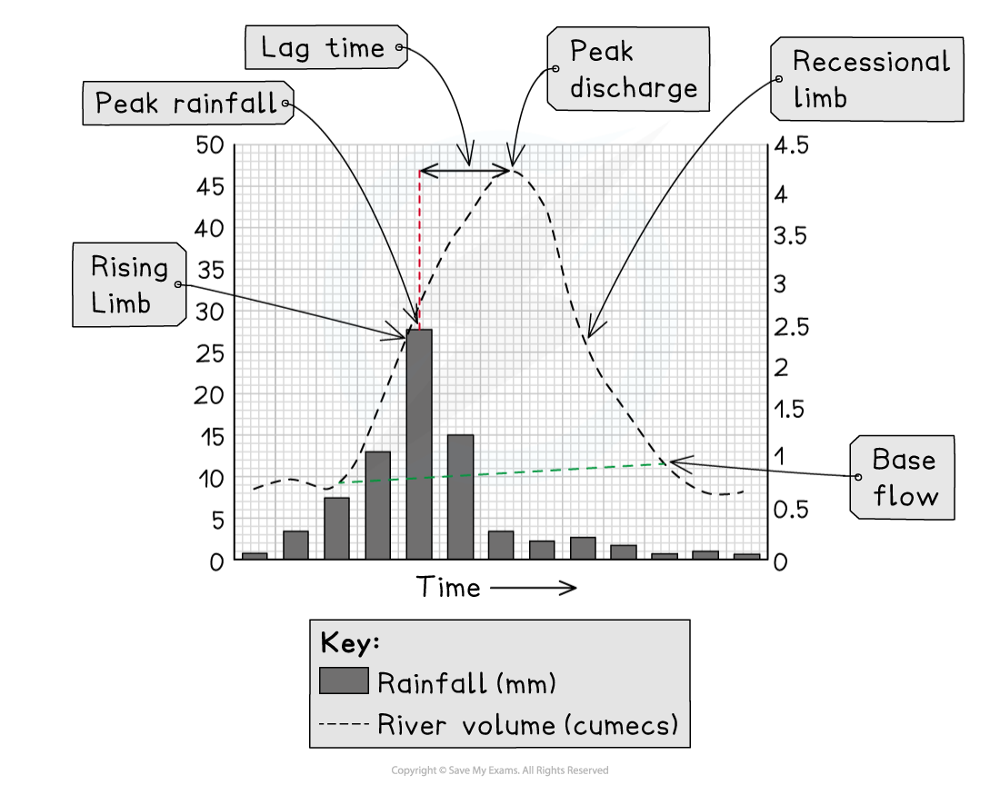

# River Regime & Hydrographs

## River Regimes & Storm Hydrographs

> **Spec point** — `spcpt_Kg5grCz6jvJn6Brx`

## River regimes & storm hydrographs

### River regimes

- The **discharge** of a river is defined as the amount of water passing a specific point on the river at a given time
- Discharge changes over time

  - The** river regime** is a record of these changes over a year
- Many factors can influence the river regime including:

  - climate
  - vegetation
  - land use
  - geology
  - soil
  - human activity
  - drainage basin size and shape
  - drainage density
  - relief

### Storm hydrographs

- A *** storm hydrograph*** shows the changes in river discharge after a storm event
- The graph shows a short period, usually 24 hours
- The storm hydrograph has several features:

  - **Base flow **which is the 'normal' level of river discharge
  
    - The water mainly comes from **groundwater flow**
  - **Peak rainfall** is the highest rainfall level during the storm
  
    - The time of the peak rainfall is taken from the centre of the bar
  - The** rising limb** shows the increase in the river discharge
  
    - The steeper the limb the faster the river discharge has increased
  - **Peak discharge** or **peak flow** is the highest level of discharge
  - **Lag time** is the time difference between the peak rainfall and the peak discharge
  
    - The shorter the lag time the higher the risk of flooding because the river may not have the capacity to contain the increase in discharge
    - Where there is more **overland flow** (surface runoff) the lag time will be shorter
  - The **recessional limb** shows the river discharge returning to normal flow
  
    - The steeper the recessional limb is the faster the river returns to normal flow

*Storm hydrograph in an urban area*

> **Worked Example**
> **Study Figure 1, which shows storm hydrographs for rivers A and B**
> 
> 
> 
> **River A                                                River B**
> 
> ***Figure 1 Storm Hydrographs***
> 
> **What is the lag time for river A?  (1)**
> 
> - To work out the answer, you need to calculate the difference between the peak rainfall and peak discharge:
> 
>   - The peak rainfall is between 2 and 3 hours from the start of the storm; taken at the midpoint, this would be 2 hours and 30 minutes.
>   - The peak discharge is at 8 hours from the start of the storm
>   - 8 hours - 2 hours and 30 mins = 5 hours and 30 mins
> 
> **Final answer:** **Answer**
> 
> **Lag time = 5 hours and 30 mins (1)**

> **Exam Hint**
> Remember, a **storm hydrograph** shows the changes in discharge over a short period after a storm event, whereas the **river regime** shows changes in discharge over a long period, usually a year.

## Factors Affecting Regimes

> **Spec point** — `spcpt_Y992zFgZDJHVptGS`

## Factors affecting regimes

- There are many factors which affect the discharge or regime of a river
- The **shape** of storm hydrographs is also affected by these factors
- Factors which increase overland flow (surface runoff) lead to:

  - **shorter lag times**
  - **increased discharge**
  - **steeper rising limb**

### Climate

- Snow and ice melt leads to **higher discharge** – usually in the spring months
- High temperatures increase evaporation and **reduce river discharge**
- Higher rainfall, often in autumn and winter, **increases river discharge**
- ***Convectional*** rainfall in summer or hot, moist climates **increases river discharge**

### Vegetation

- Vegetation increases ***interception*** and ***infiltration,*** leading to **reduced overland flow** and so** lower river discharge**
- Deciduous trees lose their leaves in winter, decreasing interception and increasing overland flow and river discharge

### Land use

- Concrete and tarmac in urban areas and built environments are ***impermeable,*** leading to high **overland flow**

  - This is rapidly taken by drainage systems to the rivers/streams, **increasing river discharge**

### Geology

- ***Permeable*** rocks increase infiltration and percolation, which** reduces overland flow** and **decreases river discharge**
- **Impermeable rock **decreases infiltration and percolation; this **increases overland flow** and** river discharge**

### Soils

- Soils which are compacted or frozen reduce infiltration, **increasing overland flow **and **river discharge**

### Abstraction

- Water taken for ***irrigation*** and domestic use **decreases the river discharge**

### Dams

- Dams control the flow of water, so can **both increase** and **decrease river discharge**
- **Reservoirs** experience higher levels of evaporation which can **decrease river discharge**

### Relief

- Steep slopes **increase overland flow **because the water is moving fast, reducing infiltration; this leads to **increased river discharge**

### Drainage density

- High ***drainage density ***leads to increased discharge, particularly after a rainfall event

> **Exam Hint**
> Remember, all the factors which affect river regimes also affect the risk of flooding. Any factor which **increases overland flow** and **discharge** also **increases the risk of flooding.**
