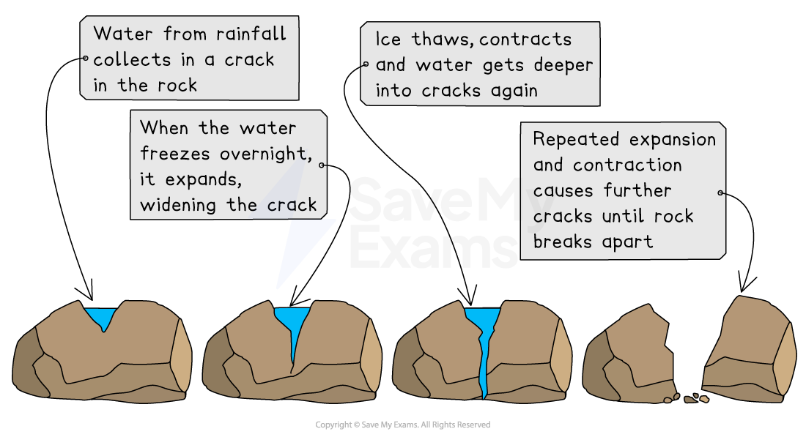
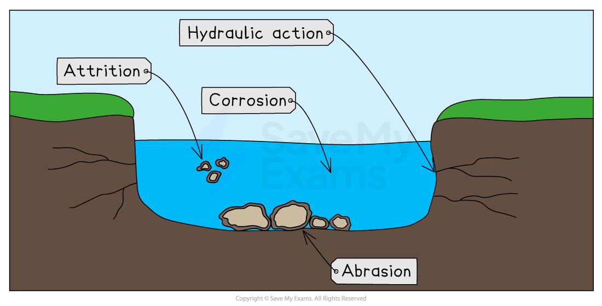
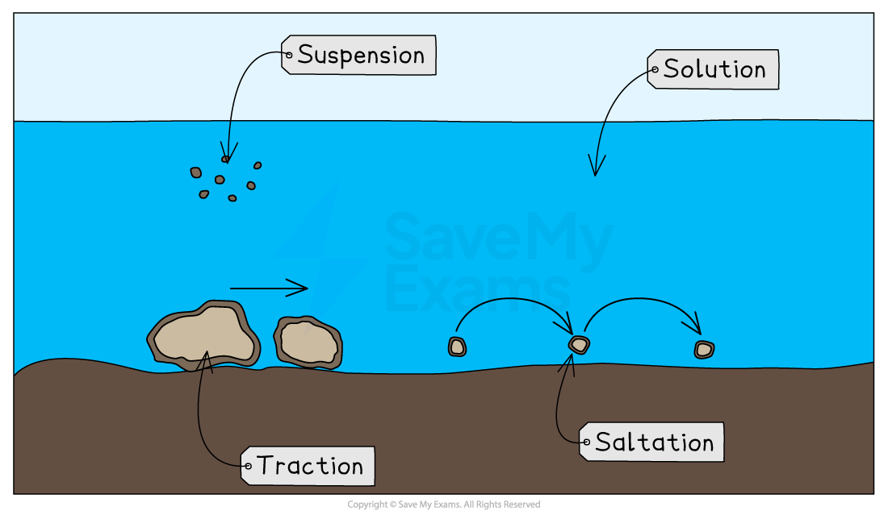

# Fluvial Processes

## Weathering & Mass Movement

> **Spec point** — `spcpt_FVbS7vPbmqXt57TS`

## Weathering & mass movement

### River valley processes

- Both ***fluvial*** and** landscape processes** shape the river and surrounding land in the drainage basin
- The landscape processes of** *****weathering*** and ***mass movement*** shape the land surrounding the river channel
- Fluvial processes shape the river channels and the landforms linked to them. They include:

  - **erosion **
  - **transportation**
  - **deposition**

### Weathering and mass movement

- There are three types of **weathering**
- These happen ***in-situ***

#### Physical

- Rock is broken down into smaller pieces
- This occurs due to changes in temperature, such as ***freeze-thaw*** and ***exfoliation***

*Diagram illustrating the process of freeze-thaw weathering*

#### Chemical

- Rocks disintegrate and dissolve in slightly acidic rainwater

#### Biological weathering

- Rocks are broken apart by the roots of plants

#### Mass movement

- There are several types of **mass movement **where large-scale movement of material occurs
- In river valleys there are two main types of mass movement:

  - **Slumping **occurs when the slope is eroded by the river.
  
    - This undercuts the slope, causing large-scale movement of material down the slope
    - Slumping often occurs when a softer, less resistant material overlies a harder, more resistant material
  - **Soil creep ** happens when the influence of gravity causes weathered material to slowly move down the slope towards the river

### Factors affecting weathering and mass movement

- There are a range of factors that affect weathering and mass movement, including:

  - **Climate**: in hot**,** wet climates, chemical and biological weathering are dominant
  - **Weather: **heavy rainfall increases mass movement
  - **Slope: **any slope over 5° experiences mass movement
  
    - The steeper the gradient of the slope, the more mass movement there will be
  - **Geology:** different rocks have different levels of resistance to weathering
  - **Altitude:** at higher altitudes, freeze-thaw weathering occurs frequently due to the low temperatures
  - **Aspect:** physical weathering is more common on a colder, north-facing slope due to a higher likelihood of freeze-thaw
  - **Vegetation: **roots bind the soil together, which limits mass movement

> **Worked Example**
> ### Explain two factors which influence mass movement (4)
> 
> - Identify the command word
> - The command word is 'explain'
> - The focus of the question is 'mass movement'
> - You can select any **two** factors from climate/weather, geology, vegetation, slope, altitude or aspect
> - For the second mark for each factor, you must explain why it increases or decreases mass movement
> 
> - **Answer:**** **(Any two factors and explanations from below)
> 
>   - All slopes that have a gradient of more than 5° experience mass movement **(1)**. The steeper the slope, the more mass movement **(1)**
>   - Where rock types are less resistant to weathering **(1),** there will be more mass movement as there will be more loose material** (1)**
>   - Vegetation decreases the amount of mass movement** (1)** as the roots bind the soil together, holding the slope in place **(1)**
>   - On the north-facing slopes, there will be more physical weathering** (1), **leading to more mass movement as there will be more loose materia**l (1)**
>   - At higher altitudes, freeze-thaw weathering may be more common** (1), **leading to more mass movement as there will be more loose material** (1)**

> **Exam Hint**
> Students often confuse weathering and erosion. Remember, weathering is the physical, biological, or chemical breakdown of the rock where it is located – **'in situ'**. Erosion is the wearing away **and **movement of the material, usually by wind, water, or ice.

## The Process of Erosion

> **Spec point** — `spcpt_dhWN8czxF2STKbmm`

## The process of erosion

- Most (**about 95%**) of a river's energy is used to overcome** friction**

  - There is more friction in the upper course of the river
  
    - It is shallow and narrow so more water is in contact with the bed and banks
    - The rocks in the river are larger so more energy is used to overcome the friction to move over and around them
- The rest of the river's energy is used in erosion and transportation
- Energy in the river depends on the river's:

  - discharge
  - ***velocity***
- The greater the discharge and velocity, the more energy a river has for erosion and transportation

### Erosion

- Erosion is the wearing away and movement of material
- There are four erosion processes that change the shape of the river channel:

  - **Hydraulic action **is when the force of the water removes material from the banks and bed of the river
  - **Abrasion (corrasion) **occurs when materials carried by the river scrape away at the banks and bed
  - **Attrition **is when the material being carried by the river hits each other; as a result, the pieces become rounder and smoother
  - **Corrosion (solution)** occurs when some rocks are dissolved by the slightly acidic water

*Diagram showing the four types of river erosion*

- Erosion can be mainly **vertical** or **lateral**:

  - **Vertical erosion** is dominant in the upper course of rivers
  
    - It increases the depth of the river and valley as the river erodes **downwards**
  - **Lateral erosion** is dominant in the middle and lower course of rivers
  
    - It increases the width of the river and valley as it erodes **sideways**

## Processes of Transportation & Deposition

> **Spec point** — `spcpt_QCYwkdCJpfYFxwSc`

## Processes of transportation & deposition

### Transportation processes

- There are four processes of **transportation**:

  - **Traction **occurs when larger rocks and materials are rolled along the riverbed
  - **Saltation **is when smaller material is lifted by the water and bounces along the riverbed
  - **Suspension **occurs when lighter material is carried within the river flow
  - **Solution **is when materials are dissolved in the water

*Diagram showing the processes of transportation*

### Deposition

- When a river does not have enough energy to carry materials, it drops them
- This is **deposition**
- The causes of reduced energy include:

  - Reduced discharge due to a lack of precipitation or ***abstraction*** upstream
  - Decreased ***gradient***
  - Slower flow on the inside of a river bend
  - When the river enters a sea/ocean or lake
- The heaviest material is deposited first; this is known as the **bedload**
- The lighter materials, gravel, sand and silt, are known as** alluvium** and they are carried further downstream
- The dissolved materials are carried out to sea

> **Exam Hint**
> It can sometimes help to remember a word and the process it refers to if you know what the word means.
> 
> **Traction—**the** **action of pulling something over a surface
> 
> **Saltation—**leaping or jumping

## Factors Affecting Processes

> **Spec point** — `spcpt_SZ2hQVng4yQgGttV`

## Factors affecting processes

- There are several factors that affect the fluvial and landscape processes, including:

  - climate
  - slope
  - geology
  - altitude
  - aspect

### Climate

- Heavy rainfall and/or low temperatures lead to higher discharge, which increases erosion and transportation
- Below-average rainfall and/or high temperatures lead to lower discharge and decreased erosion and transportation

### Slope

- Rivers on a steep slope will be fast-flowing and there will be increased erosion
- Gentle slopes will result in more deposition

### Geology

- Softer, less resistant rocks erode more rapidly than harder, more resistant rocks

### Altitude

- Melting snow and ice increases discharge and therefore there is more erosion and transportation

### Aspect

- South-facing slopes have higher rates of evaporation and transpiration, which decreases discharge
