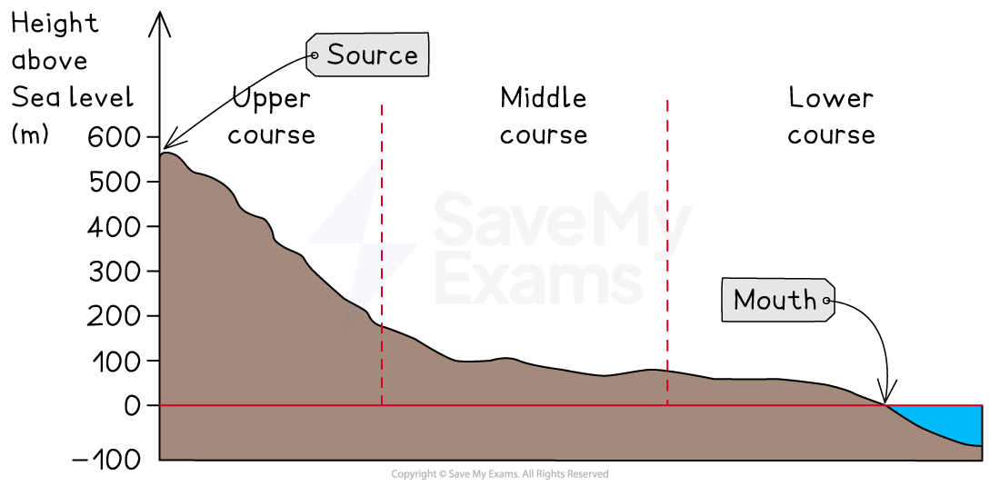
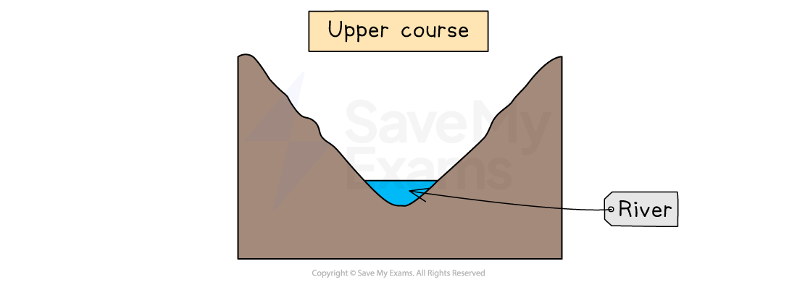
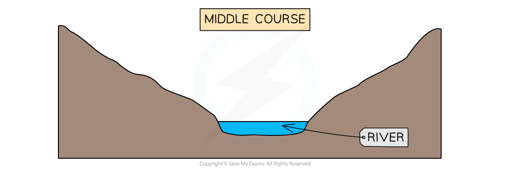
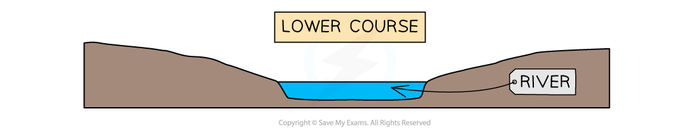

# Changes in River Characteristics

## Changes in River Characteristics

> **Spec point** — `spcpt_jdsvSqgRzCc77jFP`

## Changes in river characteristics

### River characteristics

- All rivers have a **long profile** and **cross-profiles**
- Each river's long and cross-profiles are unique but they do have some characteristics in common
- These profiles show changes in river characteristics from the **source** to the **mouth**

### Long profile

- The long profile of a river shows the changes in the river ***gradient*** from the source to the mouth
- Most long profiles have a **concave** shape with similar characteristics:

  - The source is usually in an upland area
  - The **upper course **of the river includes areas which are steep with uneven surfaces
  - In the **middle course**, the gradient decreases
  - In the** lower section**, the gradient decreases further until it becomes almost flat

*Illustration showing the long profile of a river*

### Cross profiles

- The cross profiles of a river are** cross-sections** from one bank to another
- Cross profiles of the upper, middle and lower courses show the changes in the river channel
- Upper course characteristics include:

  - Shallow channel
  - Steep valley sides
  - Narrow channel
  - Low ***velocity***
  - Large bedload
  - Rough channel bed
  - High levels of friction
  - Vertical erosion

*Cross-profile of the upper course of a river*

- Middle course characteristics:

  - Deeper than upper course channel
  - Gentle valley sides
  - Wider than upper-course channel
  - Greater velocity than the upper course channel
  - Material in the river decreases in size
  - Smoother channel bed
  - Lower levels of friction than the upper course channel
  - Lateral erosion

*Cross-profile of the middle course of a river*

- Lower course characteristics:

  - Deeper than middle course channel
  - Flat floodplains
  - Wider than middle course channel
  - Greater velocity than the middle course channel (apart from as the river enters the mouth)
  - Material carried mainly sediment and alluvium
  - Smooth channel bed
  - Lowest friction
  - Deposition is dominant

*Lower Course*

> **Exam Hint**
> Remember **valley shape** and **river shape **are not the same thing. If you are asked to describe valley shape you should focus on the gradient and shape of the land either side of the river channel.

## Case Study: River Tees

> **Spec point** — `spcpt_JDh6CfVnkMp5KdhS`

## Case Study: River Tees

> **Case Study**
> - Location - North-East England
> - Drainage basin - 1830km2
> - Source -** Cross Fell,** Pennines 754m above sea level
> - Length - 137km
> - Mouth - **Tees Estuary,** North Sea
> - The direction of flow is from west to east
> 
> 
> 
> *Map of River Tees Drainage Basin*
> 
> ### Features of the River Tees
> 
> #### Upper course
> 
> - The land use in the upper course is moorland, with peat soil
> - The land is mainly used for sheep grazing
> - It has an average annual precipitation of over  2000mm
> - The geology of the area is primarily **limestone** and **sandstone**
> - The river channel in the upper course:
> 
>   - is narrow and shallow
>   - has** a large angular bedload**
>   - has **high levels of friction**
>   - is dominated by ***vertical erosion***
>   - has a **steep *****gradient***
> - Landforms in the upper course include:
> 
>   - **High Force waterfall** where **hard rock** (**dolerite** also known as whinstone) overlies **softer rock** (**limestone** and** sandstone**)
>   - a steep-sided gorge which is left behind as the waterfall retreats upstream
>   - rapids
>   - v-shaped valleys created by **vertical erosion **
>   - interlocking spurs
> - Human activity in the upper course includes:
> 
>   - Several **dams **and ***reservoirs***, including** Cow Green**, were built to supply the urban areas to the east
>   - The dams also help to **control *****discharge***** **downstream
> 
> #### Middle course
> 
> - The land use in the middle course is mainly farmland as the river valley widens
> - The number and size of settlements increase including Barnard Castle
> - The geology continues to be dominated by **limestone **and **sandstone**
> - Average annual rainfall decreases to approximately 1000mm
> - The river channel:
> 
>   - increases in **width **and **depth**
>   - the** gradient** is **more gentle**
>   - bedload is smaller and more** rounded**
>   - experiences **decreasing friction** as less of the water is in contact with the banks and bed
>   - is dominated by ***lateral erosion***
> - Landforms in the middle course include:
> 
>   - **meanders **which develop due to the increase in lateral erosion
> 
> #### Lower course
> 
> - The land use in the lower course includes:
> 
>   - arable farming
>   - increasingly large settlements such as Middlesborough and Stockton on Tees
>   - industrial areas
> - Annual average rainfall decreases further to approximately 773mm
> - The river channel:
> 
>   - increases in width and depth
>   - the** gradient** is **very gentle**
>   - bedload is now **small sediment **
>   - is dominated by** lateral erosion** and then **deposition** nearer to the mouth where the river becomes*** tidal***
> - Landforms in the lower course include:
> 
>   - large meanders
>   - ox-bow lakes
>   - levees
>   - floodplains
> - There is lots of human activity in the lower course impacting the river channel and the surrounding landscape
> 
>   - **Flood prevention** schemes in **Yarm** and other settlements
>   - The **Tees Barrage** which was built to prevent flooding at high tides
>   - **River straightening** downstream of Stockton to allow easier *navigation* further up the river
>   
>     - The Mandale Loop was a meander which was cut off to reduce the distance ships had to travel by 4km
>   - Industrial developments on the floodplains close to the* estuary*
