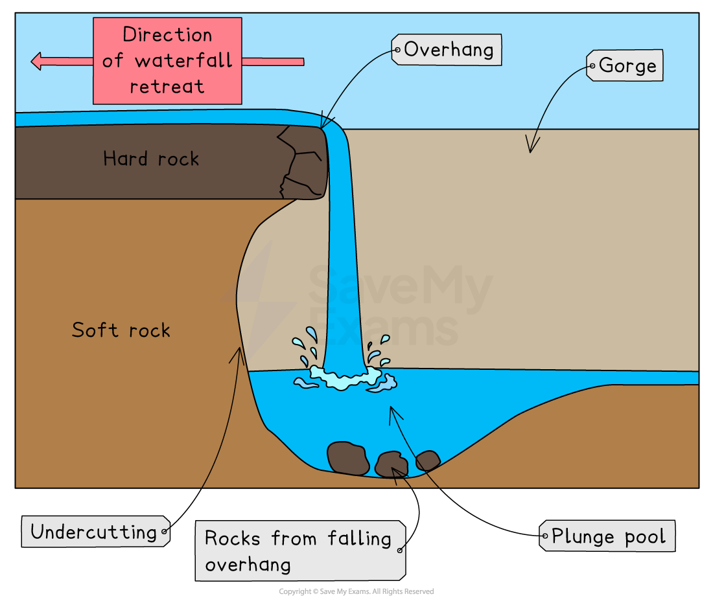
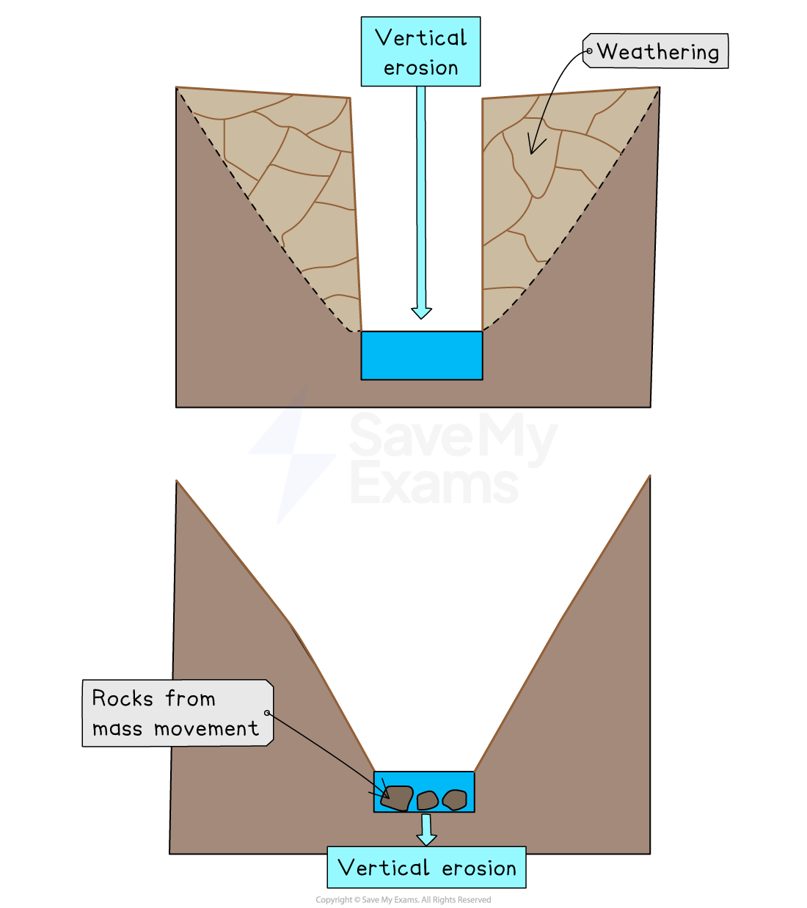
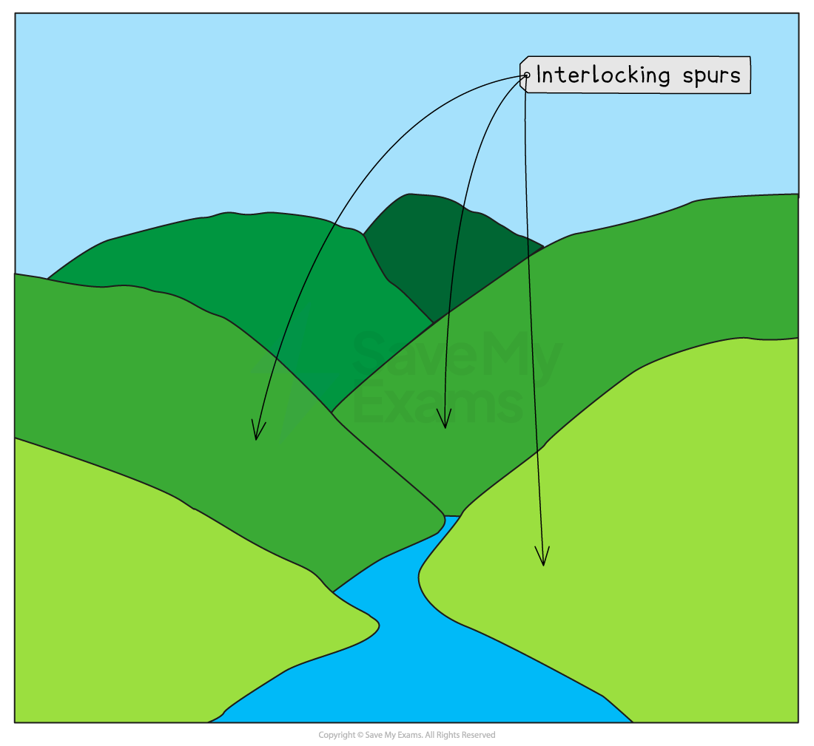
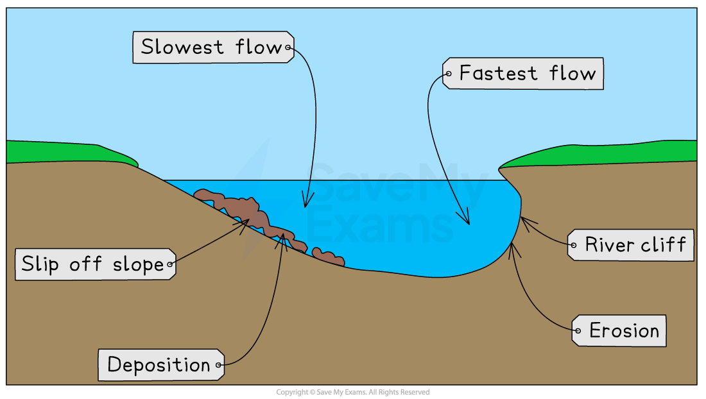
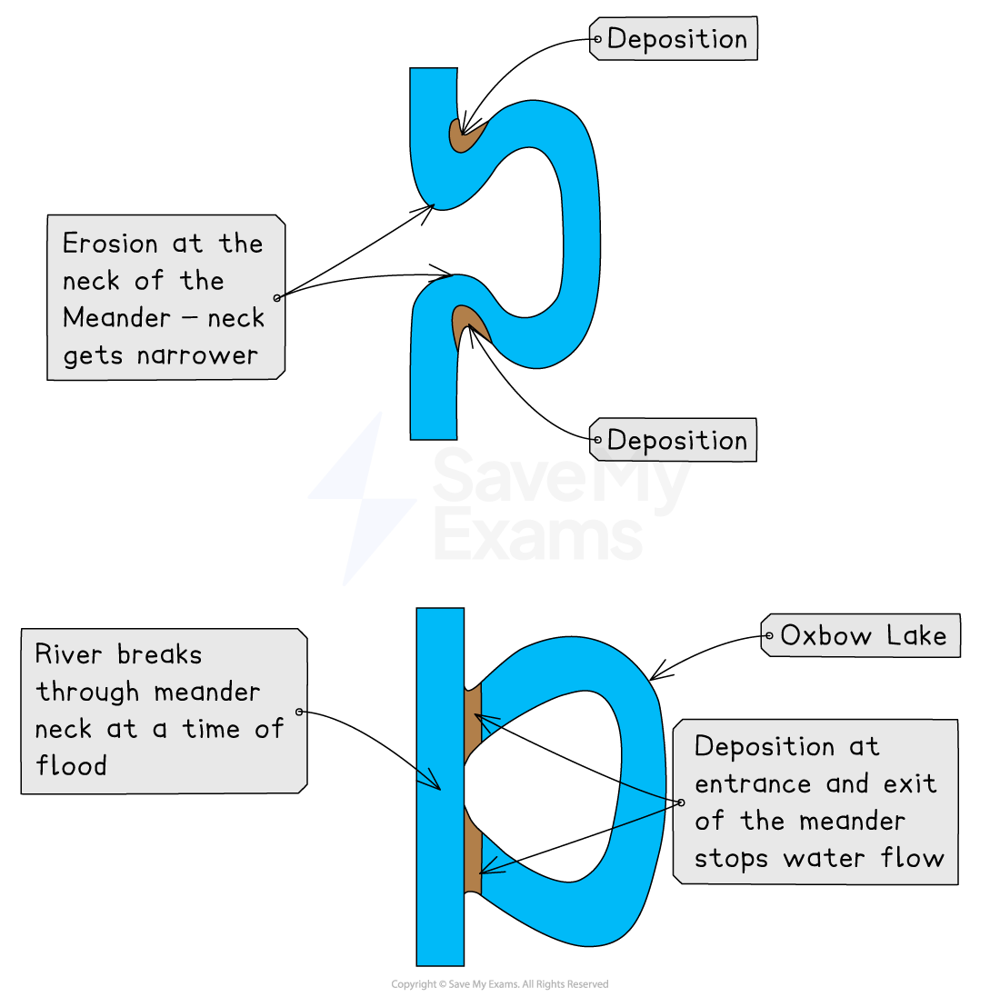
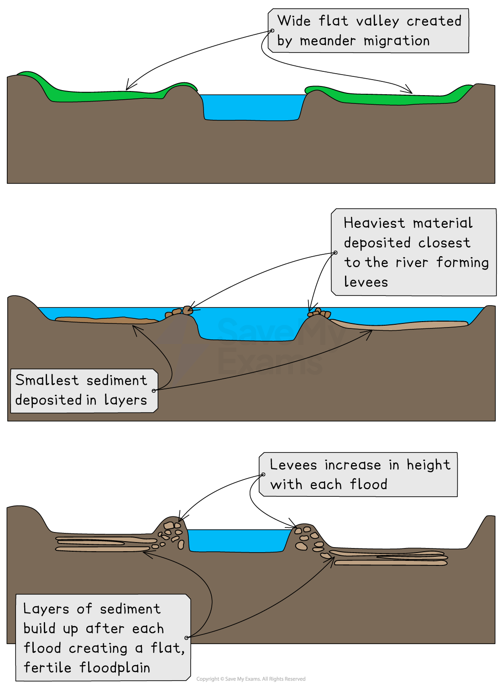

# River Landscapes

## Upland Landforms

> **Spec point** — `spcpt_bsRJn8NvHh6kwnvr`

## Upland landforms

### River landscape characteristics

- The changes in river channel characteristics, lead to changes in the river landscape
- The upland and lowland areas of rivers have distinctive landforms
- In upland areas, the common landforms include:

  - waterfalls
  - gorges
  - v-shaped valleys
  - interlocking spurs

#### Waterfalls and gorges

- Waterfalls form when there is a drop in the river bed from one level to another

  - This drop is often due to changes in the hardness of rock, where hard rock overlies soft rock
- ***Hydraulic action*** and ***abrasion*** are the main [erosional processes](https://www.savemyexams.com/igcse/geography/edexcel/19/revision-notes/1-river-environments/1-2-river-processes-and-landforms/1-2-1-fluvial-processes/) in waterfall formation
- The softer rock erodes quicker, **undercutting** the harder rock and creating a** plunge pool**
- This leads to the development of an **overhang** of hard rock which eventually over time, collapses
- The overhang falls into the plunge pool increasing abrasion and making the plunge pool deeper
- The process then begins again and the waterfall retreats upstream leaving a **steep-sided gorge**

*Diagram showing waterfall and gorge formation*

#### V-shaped valleys

- [Vertical erosion](https://www.savemyexams.com/igcse/geography/edexcel/19/revision-notes/1-river-environments/1-2-river-processes-and-landforms/1-2-1-fluvial-processes/) is dominant in the upper course of the river
- This cuts down into the river bed and deepens the river channel
- ***Weathering*** and ***mass movement*** lead to material from the valley sides collapsing into the river forming a **steep v-shaped valley**

*Diagram showing the formation of a v-shaped valley*

### Interlocking spurs

- In the upper course of the river, the channel starts to **meander**
- **Erosion **happens on the **outside **of the bend
- In the upland areas this forms **interlocking spurs**

*Diagram showing interlocking spurs*

> **Worked Example**
> **Explain the formation of a waterfall.  ****(4)**
> 
> - Identify the command word
> - The command word is 'explain'
> - Your focus is on '**waterfall**'
> 
> - **Answer: **(you should include 4 points from the following)
> - Waterfalls occur where there is a step in the landscape often where hard rock such as dolerite overlays soft rock such as limestone **(1)**
> - The soft rock erodes due to hydraulic action, at a faster rate than the hard rock **(1) **leading to undercutting and the formation of a plunge pool **(1)**
> - This leaves an overhang of hard rock which eventually collapses due to gravity **(1)**
> - The process is then repeated causing the waterfall to retreat upstream leaving a steep side gorge **(1)**

## Lowland Landforms

> **Spec point** — `spcpt_SnwmNkdHjrBsPVzr`

## Lowland landforms

- Landforms found in lowland areas of the river include:

  - meanders
  - ox-bow lakes
  - floodplains
  - levees

#### Meanders

- In lowland areas [lateral erosion](https://www.savemyexams.com/igcse/geography/edexcel/19/revision-notes/1-river-environments/1-2-river-processes-and-landforms/1-2-1-fluvial-processes/) is dominant
- Meanders increase in size
- The **fastest water flow** **(thalweg)** is on the** outside** of the river bends, leading to **erosion**:

  - The erosion **undercuts** the river bank forming a **river cliff**
  - The river bank collapses and the edge of the meander moves further out
- The **slowest flow** is on the **inside** of the river bends, leading to **deposition**:

  - The deposits form a gentle slope known as a **slip-off slope**
- Deposition on one side and erosion on the other leads to the meander **migrating** across the valley

  - This forms a **wide, flat floodplain** on either side of the river

*Cross-section of a meander*

#### Ox-bow lakes

- With distance downstream, the size of the meanders increases
- The erosion on outside bends can eventually lead to the formation of a **meander neck**
- At a time of **flood**, the river may cut through the neck of the meander, forming a straighter course for the water
- The flow of water at entry and exit from the meander will then be slower, leading to **deposition**
- The meander becomes cut off from the main river channel, forming an **ox-bow lake**

*Oxbow Lake Formation*

> **Exam Hint**
> Remember when describing the formation of ox-bow lakes it is important to state that the river will break through the neck of the meander during a **flood**. At other times the river does not have enough power to break through.

#### Floodplains and levees

- **Floodplains** are **flat** expanses of land on either side of the river

  - They are formed by the migration of meanders across the valley
  - Material is then added to the floodplain during times of flood
- **High discharge** may cause the river to overflow the banks (**flooding**)
- More of the water is in contact with the land surface as the water spreads across the floodplain
- Increased friction caused by this contact reduces velocity and material is deposited across the floodplain gradually increasing the floodplain height
- The heaviest material is deposited first nearest to the river channel forming natural embankments called **levees**

*Diagram showing floodplain and levee formation*

> **Exam Hint**
> When describing landform formation it is helpful to write the formation down as a sequence of steps. This will make the process easier to remember.
