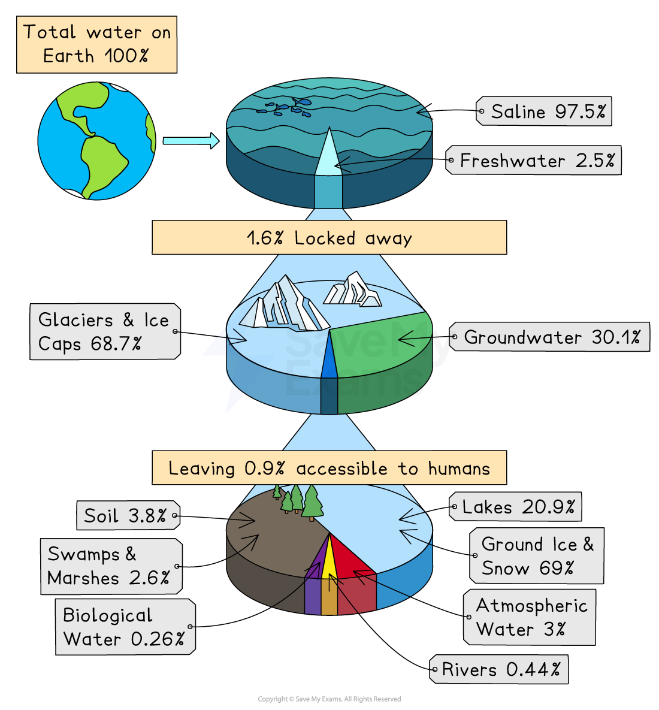
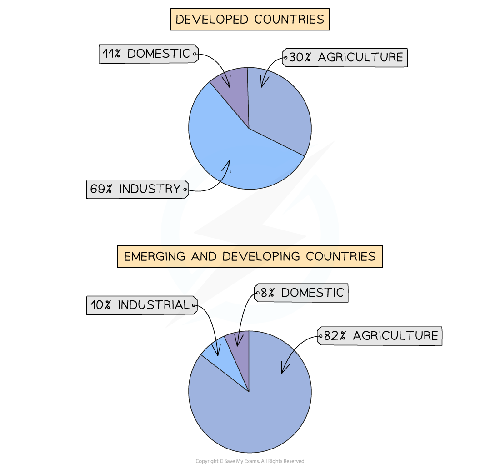
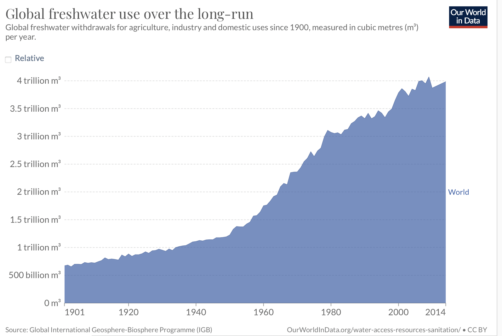
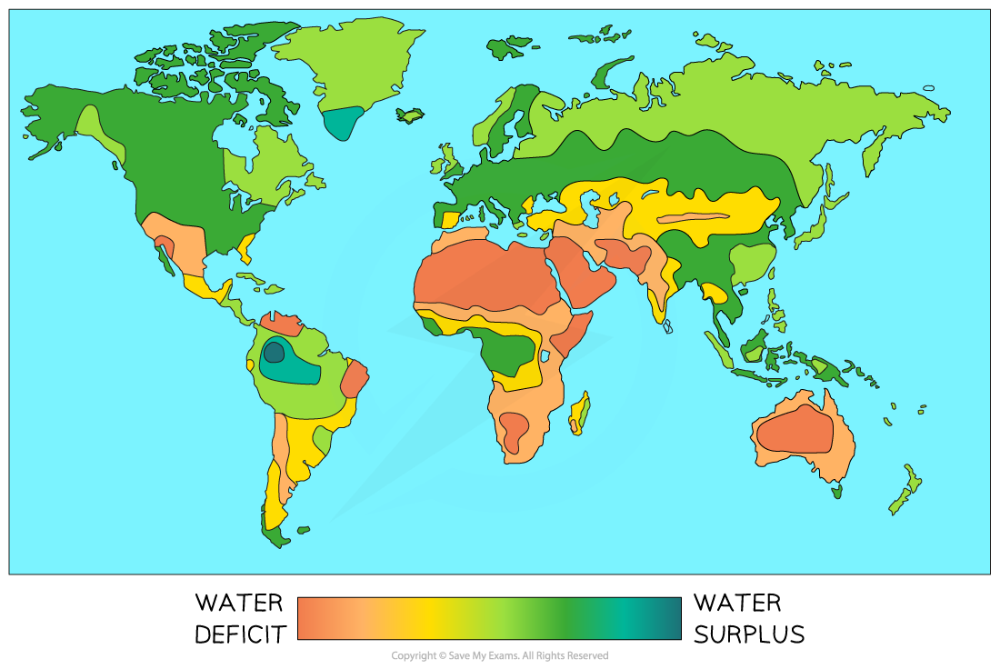

# Water Uses, Demand & Supply

## Water Uses

> **Spec point** — `spcpt_V3JVkpsNNM2NxWtv`

## Water uses

- Only **2.5%** of the water on Earth is ***freshwater***
- Of this, **1.6% **is stored in **glaciers **and **ice sheets **
- The remaining **0.9%** of freshwater is in rivers, soil moisture, lakes and the atmosphere

*Global water availability*

- Global water use by sector is:

  - **69% agriculture **- ***irrigation*** of crops and water for livestock
  - **19% industry **- producing goods and generating energy
  - **12%** **domestic** - toilets, cooking, cleaning, washing
- The use of water by sector varies across countries depending on whether they are developed, emerging or developing

*Water Use *

- In developing and emerging countries most water is used for **agriculture**

  - Areas with high average temperatures and low natural water supply have some of the highest levels of water use for agriculture
- The global use of water in leisure and tourism is increasing, particularly in developed countries
- In developed countries, most water is used for **industry**

## Rising Demand for & Supply of Water

> **Spec point** — `spcpt_HHHz3sqsQ4XHFFXR`

## Rising demand for & supply of water

- **Demand** is the amount of water required by users to meet their needs
- **Supply** is the amount of water available
- **Water balance **is the difference between supply and demand
- Countries may have a** deficit** (greater demand than supply) or **surplus** (more supply than demand)
- **Water security** is defined as the needs of the population being met by an acceptable quantity and quality of water

### Water demand

- The global demand for water is increasing
- Between 1934 and 2014 demand increased from 1 trillion m3 to 4 trillion m3

*Global water use*

#### Reasons for increased water demand

- There are several reasons for the global increase in water use:

  - improving **living standards** - people have more appliances/sanitation which use water
  - increased use of water in** leisure and tourism** - water parks, golf courses
  - increased** *****urbanisation**** *
  - **population growth** - the more people there are, the more water is needed
  - increasing** industry **- water is needed for the production of goods and energy production
  - increasing use in** agriculture** - more water is needed for livestock and crops

### Water supply

- The supply of water comes from three main sources:

  - Lakes and rivers
  - ***Aquifers***
  - ***Reservoir***
- This supply of water is not evenly distributed

  - Many of the world's most populated areas are also the driest
- The **World Health Organisation (WHO)** estimates that **73% **(2022) of the world's population have access to safely managed drinking water

> **Exam Hint**
> Remember when interpreting graphs you need to
> 
> - Identify the overall trend - is it increasing/decreasing/fluctuating
> - Identify the highest and lowest points
> - In any answer based on a graph make sure that you include figures

## Areas of Water Shortages & Surpluses

> **Spec point** — `spcpt_qb6mf4gZvXZb6CDZ`

## Areas of water shortages & surpluses

### Water Shortages (Deficit)

- Many areas of the world have water shortages** (deficits)**
- Water deficit can be due to:

  - **Low supply** - lack of precipitation, high levels of evaporation, poor water management
  - **High demand** - increasing population, industry and agriculture
  - A combination of low supply and high demand
- Areas with the greatest water deficit include:

  - Australia
  - North, East and South Africa
  - Middle East
  - West USA
  - Parts of South America
  - India

*Water surplus and deficit*

- Many of these areas have a **deficit** due to **low precipitation **throughout the year
- In some areas, demand is greater than supply due to increasing population, industry and agriculture

#### Water stress and water scarcity

- There are different levels of water shortage:

  - **Water stress **occurs when the supply of water is **below 1700m****3** a year per person
  
    - Over 2 billion (2021) people live in water-stressed countries
  - **Water scarcity** is when the supply is **below 1000m****3** a year per person
  
    - UNICEF estimates that 4 billion people (2024) experience water scarcity for at least one month of the year

### Water surplus

- Some areas of the world have a water surplus
- Water surplus can be due to:

  - **High supply** - high precipitation, low evaporation rates, effective water management
  - **Low demand** - low population, effective water management, low temperatures
  - A combination of high supply and low demand
- Areas with a surplus include:

  - North-east Brazil in the Amazon rainforest
  - Canada and parts of the northern USA
  - Russia

> **Exam Hint**
> Remember when interpreting maps you need to pay close attention to the key and title.
> 
> In the above example, the map shows both the surplus and deficit of water supply on a sliding scale. Areas of greatest water surplus are dark blue and areas of greatest water deficit are dark orange.
