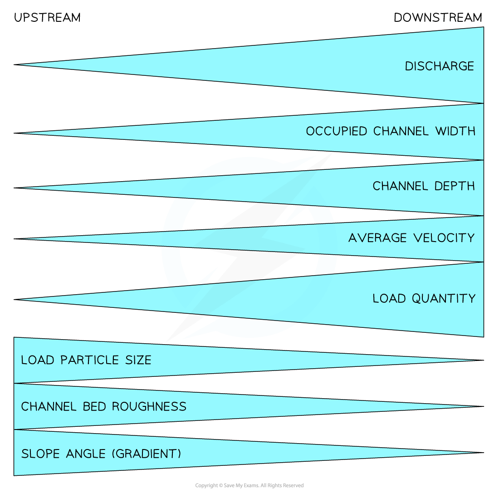
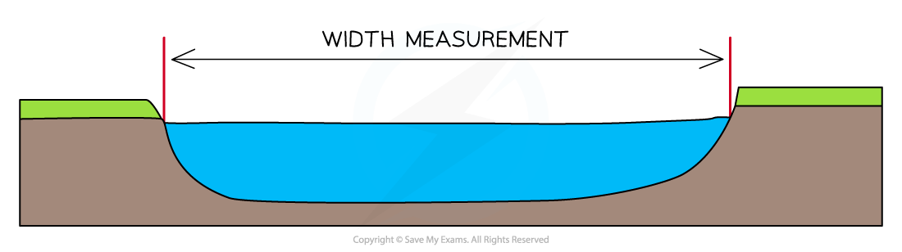
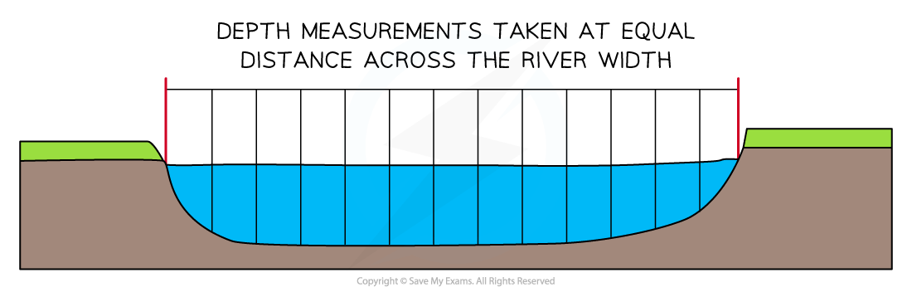
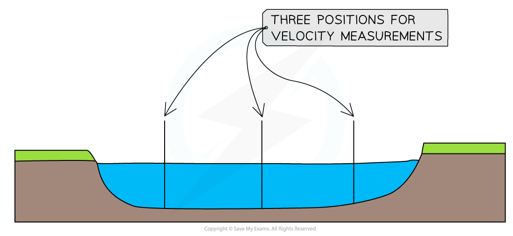

# River Practical Skills

## River Practical Skills

> **Spec point** — `spcpt_nVvQ2JvtsHhYbz9C`

## River practical skills

### River fieldwork enquiry

- To undertake a river fieldwork enquiry there are a range of practical skills and methods that will be used

  - These can be applied to any river fieldwork
- The fieldwork enquiry should be linked to **geographical theory**

  - In the river fieldwork enquiry, the **Bradshaw model** is usually used

*The Bradshaw Model*

### Aims and hypothesis

- The aims and hypothesis come from questions asked about the river such as:

  - Does discharge increase along the length of River Y?
  - Does the average velocity increase along the length of River Y?
  - How and why does the cross profile change along the long profile of River Y?
- Examples of an **aim **would be:

  - An investigation into how a river's cross-profile changes downstream
  - An investigation into changes in discharge with distance downstream
- Examples of a **hypothesis **would be:

  - The width and depth of River Y will increase with distance downstream
  - The discharge of River Y increases with the distance downstream
- After the aims and hypothesis of the fieldwork have been established the next steps include:

  - Selecting the sites - this will involve sampling
  - Deciding on the equipment to be used
  - Considering any health and safety issues - completing a risk assessment
  - Data collection method

> **Worked Example**
> **(i) Suggest one possible aim of a river channel investigation **
> 
> **(2 Marks)**
> 
> - **Answer:**** **This should be an aim, not a hypothesis so should outline what the enquiry/investigation is attempting to achieve
> 
>   - To investigate the changes in velocity **(1) **with increasing distance from the source **(1)**
>   - To investigate the changes in channel cross-profile **(1)** with increasing distance from the source **(1)**
>   - An investigation into changes in river discharge **(1)** after confluences within the river **(1)**
> 
> **(ii) Identify three reasons why a river channel investigation may not achieve the aim given in (i) **
> 
> ** ****(3 Marks)**
> 
> - **Answer:**
> 
>   - Data inaccurate** (1)**
>   - Insufficient data collected **(1)**
>   - Inaccurate data analysis **(1)**
>   - Human errors in data recording **(1)**
>   - Aim not practical** (1)**
>   - Unsuitable sites selected **(1)**

### Site selection and sampling

- To collect data it is not practical to measure all parts of the river
- To select the river sites **sampling** should be used to** reduce bias**
- There may be situations where access to the river is limited meaning an ***opportunistic*** approach to sampling may need to be taken

  - This should be as close as possible to the site selected using sampling
- The most commonly used **sampling strategies** for a river enquiry are:

  - **Systematic **- a sampling of sites at regular intervals means that all parts of the river are covered
  - **Random **- the use of random sampling means that all sites have an equal chance of being selected which eliminates bias
  - **Stratified **- by sampling sites immediately downstream of a confluence significant changes in discharge can be identified
- **Site location** can be recorded using GPS to give an accurate location using latitude and longitude

> **Worked Example**
> **Suggest which sampling method would be appropriate to use in a river channel investigation **
> 
> **(3 Marks)**
> 
> - **Answer:**
> 
>   - Systematic because measuring at regular intervals** (1)** ensures that no parts of the river are missed **(1)** and it reduces bias **(1)**
>   - Random because using a random number generator** (1) **means all sites have an equal chance of being selected** (1) **which means that there is no bias** (1)**

### Equipment

- To complete the river measurements a range of equipment is needed
- The equipment includes the following:

  - **25+ meter tape** to measure the river width and for marking out distance downstream for velocity measurements
  - **1-metre rule** for measuring the depth
  - **Clipboard** for holding recording sheets
  - **Pencil **for writing in data
  - **Camera **to take photographs of sites and river features
  - **Float** or **flowmeter **for measuring velocity
  - **Stopwatch** if not using a flowmeter

> **Worked Example**
> **Identify a suitable piece of equipment to measure river velocity**
> 
> **(1 Mark)**
> 
> **      A. **Anemometer
> 
> **      B. **Quadrat
> 
> **     C. **Clinometer
> 
> **     D. **Stopwatch
> 
> - **Answer:**
> 
>   - **D** **(1) **- Stopwatch which is used to time how long it takes a float to cover a specified distance

### Risk assessment

- Any fieldwork will involve consideration of** health and safety** using a risk assessment
- Risks associated specifically with river fieldwork may include:

  - weather conditions
  - slippery rocks
  - polluted water
  - working in an unfamiliar place
  - misuse of equipment

> **Worked Example**
> A group of students has investigated the changes in a river channel shape.
> 
> State one risk that the students might identify in their risk assessment
> 
> **(1 Mark)**
> 
> - **Answer:**** **Any one of the following would be acceptable
> 
>   - Slip or fall** (1)**
>   - Infection from dirty water** (1)**
>   - Flash flooding **(1)**
>   - Weather conditions (heavy rain/sun)** (1)**
> 
> **Suggest one way the risk stated could be managed **
> 
> **(1 Mark)**
> 
> - **Answer:**** **This should follow from the answer above
> 
>   - Sturdy/suitable footwear e.g. walking boots** (1)**
>   - Wash hands/use antibacterial hand wash/cover cuts and wounds** (1)**
>   - Do not enter the river after heavy rainfall **(1)**
>   - Check the weather forecast before going out to collect fieldwork data** (1)**

## Using Equipment in the Field - rivers

> **Spec point** — `spcpt_6mwVS2y9NCbXkZ7R`

## Using equipment in the field - rivers

### Data collection methods

- The data collection methods will depend on the **aims/hypothesis **of the fieldwork
- The starting point with most river fieldwork is to measure the **width** and **depth**
- Data collection should include both ***quantitative*** and ***qualitative*** methods

  - **Quantitative data** may include:
  
    - channel measurements
    - measurements of sediment
  - **Qualitative data** may include:
  
    - field sketches
    - photographs
- The collection of **quantitative** data can be completed in several ways in a river study

### Width

- The measurement of width is taken where the water surface comes into contact with the river banks.

*Measurement of River Width*

- To take an accurate measurement:

  - Measure from the point where the dry bank meets the water on one side to the point where the dry bank meets the water on the opposite side
  - Ensure that the tape is held ***taut*** and does not touch the water. This could affect the reliability of the data

### Depth

- The measurement of depth should be completed at **regular intervals** across the width
- This ensures a full picture of the changes in depth across the whole channel width is recorded
- It also allows a mean depth to be calculated for use in the calculation of river discharge

*Depth Measurements *

- To take an accurate depth measurement:

  - Work out the **distance **apart each depth measurement needs to be
  - Place a meter rule into the water at the correct point
  - Ensure the meter rule is placed **sideways **with the flat side facing the banks - this reduces any impact on the water height ensuring more accurate measurements
  - Record the distance from the bed to the surface of the water
  - Repeat this across the width of the river

### Velocity

- The velocity is the speed at which the river flows
- This can vary across the channel width as well as along the course of the river so velocity should be recorded in three positions - towards the left bank, centre and towards the right bank

*Positions in River Channel for Velocity Measurements*

- Using a flow meter velocity can be easily measured by:

  - Taking readings at three equal distances across the river width
  - Placing the flow meter into the water at least 3cm below the surface
  - **Three readings** should be taken at each of the three places across the channel to allow the calculation of a mean
- To take an accurate measurement using a float:

  - Measure a set distance upstream - for example, 10 meters
  - Drop a float at the start of the 10 meters
  - Time how long it takes for the float to travel the distance using a stopwatch
  - Repeat at each position three times to allow the calculation of a mean

### Discharge

- The discharge of the river is calculated rather than measured
- The first step is to calculate the cross-sectional area:

  - **Cross-sectional area (m****2****) = width (m) x mean depth (m)**
- The second step is to calculate the velocity:

  - If a flow meter the mean velocity should be calculated by adding the velocity measurements and dividing by the number of measurements
  - If a float has been used and a distance of 10m then the meantime should be divided by 10 to calculate the time taken to travel 1m
  - **Discharge (m****3****/s) = cross-sectional area (m****2****) x velocity (m/s)**

> **Worked Example**
> **Calculating Discharge **
> 
> Step One - Depth
> 
> - Calculate the mean depth
> - All units of measurement should be the same
> - The mean depth should be calculated in meters not centimetres
> 
> **Depth measurements for Site One**
> 
> |   | 1 | 2 | 3 | 4 | 5 | 6 | 7 | 8 | Mean |
> |---|---|---|---|---|---|---|---|---|---|
> | Depth in m | 0.05 | 0.12 | 0.17 | 0.23 | 0.30 | 0.35 | 0.28 | 0.18 | 0.21 |
> 
> - To calculate the mean depth add the 8 measurements together and divide by 8
> - This gives a measurement of mean depth = 0.21m
> 
> Step Two - Cross-sectional area
> 
> - **Cross-sectional area (m****2****) = width (m) x mean depth (m)**
> - If the width is 4m x mean depth 0.21m the cross-sectional area = 0.84m2
> 
> Step Three - Velocity
> 
> **Time Measurements for Site One**
> 
> | Time measurement | Left | Centre | Right |
> |---|---|---|---|
> | 1st | 35 | 28 | 37 |
> | 2nd | 42 | 30 | 39 |
> | 3rd | 36 | 27 | 45 |
> | Mean | 37.7 | 28.3 | 40.3 |
> 
> - To work out the mean time taken for the float to travel 10 metres for site one the following calculations need to be completed:
> 
>   - 37.7 + 28.3 + 40.3 = 106.3
>   - 106.3 is then divided by 3 (number of positions) to give a mean time for site one of 35.43 seconds
>   - Divide this by 10 to get the velocity in m/s
>   - 10 ÷ 35.43 = **0.282 m/s**
>   - The **surface velocity **for site one is **0.282** m/s
> 
> Step Four - Discharge
> 
> - **Discharge = Cross-sectional Area 0.84m****2 ****x Velocity 3.543 m/s**
> - Discharge = 2.98 m3/s (cumecs)

### Photographs and field sketches

- Photographs and field sketches are **qualitative** data
- Just as with any data collection and presentation they have strengths and weaknesses
- In a river enquiry photographs and field sketches can be used to show landforms and particular features such as bed load
- Photographs are also ideal for illustrating the data collection methods used

> **Worked Example**
> **During a geographical enquiry exploring changes in a river, channel students completed annotated field sketches as part of their data collection.**
> 
> **Suggest two advantages of this technique **
> 
> **(4 Marks)**
> 
> - **Answer:**
> 
>   - Students can get a quick view of the areas they are working on by recording key features **(1) **to support recall later **(1)**
>   - Students can highlight features **(1) **that they want to focus on as part of their study **(1)**

> **Exam Hint**
> Annotations and labels are not the same. A label is a simple descriptive point. For example, 'meander'. Whereas an annotation is a label with a more detailed description or an explanatory point. For example, 'slip off slope where the material has been deposited due to slower flow'
