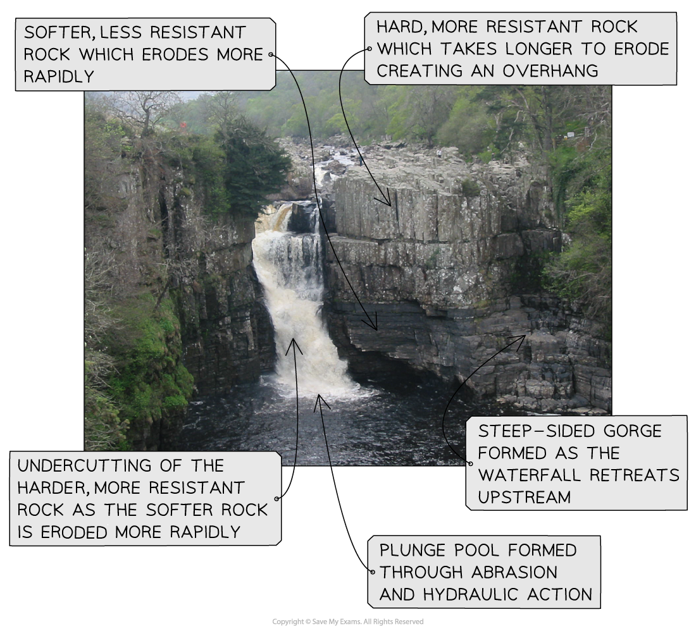

# River Enquiry Skills

## The Fieldwork Report - rivers

> **Spec point** — `spcpt_m8WvNHM9jmzq9jXC`

## The fieldwork report - rivers

### River enquiry data presentation

- Data presentation can take many forms

### Primary data

- **Primary data** is data that is collected by the student completing the fieldwork
- Much of the primary data collected in a river enquiry will be presented in the form of **graphs **

  - Each type of graph is suitable for particular data sets
  - The graphs also may have strengths and limitations
- Suitable graphs include:

  - **line graphs** for river channel cross-sections
  - **bar graphs** to compare different sites
  - **scattergraphs** to show the relationship between two sets of data. For example, the river width and discharge

> **Worked Example**
> **Using the data in Figure 4a, complete Figure 4b below for measurements 1 and 4 **
> 
> **(2 Marks)**
> 
> 
> 
> 
> 
> **Figure 4b**
> 
> **Measurements times taken for float to travel between points A and B at one site**
> 
> - **Answer**
> 
>   - The first bar needs to be between 21 and 22 (each small square is 1 second). The second bar must be on the line. The bars do not need to be shaded but should be the same width as the other bars.
> 
> 
> 
> **Figure 4b**
> 
> **Measurements times taken for float to travel between points A and B at one site**
> 
> **Mark an x in the box on Figure 4b which represents the float with the anomalous result **
> 
> **(1 Mark)**
> 
> - **Answer **
> 
>   - Number 5 **(1)** is the anomalous one as it does not fit the pattern of the other measurements
> 
> **Suggest one explanation for this anomaly **
> 
> **(2 Marks)**
> 
> - **Answer**
> 
> - The float could have got stuck as it flowed down the river **(1)** this would have slowed the float down **(1)**
> - There could have been a strong wind blowing upstream **(1)** which would have slowed down the float / which would have led to unreliable results** (1)**
> - Human error with the operation of the stopwatch **(1) **which meant that the timing was inaccurately recorded for number 5** (1)**

> **Exam Hint**
> In the exam, you will not be asked to draw an entire graph. However, it is common to be asked to complete an unfinished graph using the data provided. You may also be asked to identify anomalous results or to draw the best fit line on a scattergraph.
> 
> - Take your time to ensure that you have marked the data on the graph accurately
> - Use the same style as the data which has already been put on the graph
> 
>   - Bars on a bar graph should be the same width
>   - If the dots on a graph are connected by a line you should do the same

### Secondary data

- Any fieldwork should include **secondary data** as well as primary data
- Secondary data is all information that is not collected by the student completing the study
- In a river enquiry, suitable secondary data may include:

  - River discharge data from the **Environment Agency**
  - Weather data from the **Meteorological Office (Met Office)**
  - Old photographs of the river sample site
  - Newspaper articles/websites about the river
  - **Ordnance Survey **maps to identify the sample sites
  - Geology maps
  - Aerial photographs

> **Worked Example**
> **Describe two sources of secondary data that might be useful when planning a river channel enquiry **
> 
> **(4 Marks)**
> 
> - **Answer:**
> 
>   - Environment Agency or National Rivers Authority (NRA) discharge data **(1) **gives information about normal flow** (1)**
>   - Met Office rainfall data **(1)** gives information regarding any weather events impacting on data collected **(1)**
>   - Ordnance Survey (OS) map **(1) **enables the identification of sample site locations** (1)**
>   - Geology map **(1) **rock type information for the drainage basin** (1)**
>   - Aerial photographs** (1) **changes in the river channel path **(1)**

## Analysing & Interpreting Data - rivers

> **Spec point** — `spcpt_QPBQ8ftzVHrBXVxd`

## Analysing & interpreting data - rivers

### Analysis

- Once data has been collected and presented it needs to be **analysed**
- The data which is collected from the river such as width, depth, and velocity is **quantitative** and will need to be analysed using **statistical methods**
- One of the main statistical methods used in a river enquiry will be the **mean** where mean depth or velocity needs to be calculated

> **Worked Example**
> **Study Figure 1. It shows sample data from one site on a river. A float was used to measure the time taken to travel between two points**
> 
> **Calculate the mean time taken for the float to travel from site A to site B. Give your answer to one decimal place**
> 
> **You must show all your workings in the space below **
> 
> **(2 Marks)**
> 
> | Sample | Time taken (seconds) |
> |---|---|
> | 1 | 12.5 |
> | 2 | 16.2 |
> | 3 | 18.1 |
> | 4 | 20.3 |
> | 5 | 35.0 |
> 
> **Figure 1 - River Data Collected by a Group of Students**
> 
> - **Answer:**
> 
>   - Add all the values together - 12.5 + 16.2 + 18.1 + 20.3 + 35.0 = 102.1
>   - Divide the total by the number of values in the data set   - 102.1 divided by 5 = 20.42 **(1)**
>   - To one decimal place 20.4 **(1) **

> **Exam Hint**
> Calculation of the mean is a popular exam question. You must remember the following:
> 
> - Show your workings if it is asked for by writing out in full the calculation. This is usually worth 1 mark
> - If asked to give your answer to one decimal place remember to round up or down
> 
>   - If the number after the first digit following the decimal point is 5 or higher you need to round up - 10.15 would become 10.2
>   - If the number after the first digit following the decimal point is 4 or lower you need to round down - 10.13 would become 10.1

### Analysing photographs and field sketches

- The use of photographs and field sketches is** **a** qualitative **analysis
- Photographs can be used in a river enquiry to analyse several features:

  - landforms and their formation
  - data collection techniques

*Annotation of a photograph in fieldwork*

> **Worked Example**
> **You have studied river environments for your geographical enquiry**
> 
> **Evaluate how successful your chosen data analysis methods were in answering your geographical enquiry question  **
> 
> **(8 Marks)**
> 
> - **Answer:**
> 
>   - Your answer needs to make a judgement about how successful your data analysis was in enabling you to reach a conclusion
>   - You must include examples from your enquiry. You need to demonstrate evidence of:
>   
>     - Different skills and techniques being used for data collection
>     - Different skills and techniques being used for the analysis of the data
>     - Your own conclusions
>   - Issues with equipment
>   
>     - Were there any equipment errors? This could be faulty equipment or issues with reading the measurements correctly
>     - How did these errors affect your ability to answer the enquiry question?
>   - Issues with the enquiry design
>   
>     - Were the data collection/sampling methods appropriate?
>     - Were more sample sites needed?
>     - Would a different sampling technique has been more effective?
>     - Should the data have been collected using a different method?
>     - Was additional or different equipment needed?
>   - How did these affect your ability to answer the enquiry question?
> 
> - Issues with analysis methods
> 
>   - Were the analysis methods you used - central tendency, best fit lines etc.. - appropriate?
>   - Were there any alternative methods that could have been used?
>   - How did your use of these affect your ability to answer the enquiry question?
> 
> - At the end of your answer you must make a judgement about the success of your data analysis techniques.
> - Your evaluation needs to be in-depth and directly linked to your enquiry
> - There must be recognition of where data analysis was less successful due to the enquiry design or technique used
> - Are the outcomes reliable - can the study be repeated and obtain the same results?

### Conclusion

- Once the data collected has been analysed, conclusions can be reached
- This should state whether the hypothesis has been **proved** or **disproved**
- Identify and explain **anomalies** such as:

  - Decreasing average depth or width with distance downstream at one site
  - Decreased velocity at a particular site
- Anomalies may just occur or may be the result of incorrect recording or human error reading equipment

### Evaluation

- The final stage of the river enquiry is the [evaluation](https://www.savemyexams.com/igcse/geography/edexcel/19/revision-notes/16-general-fieldwork-skills/16-1-the-geographical-enquiry/16-1-7-evaluation/) where you note how successful, or not, the river investigation was and what you would do differently next time

  - Next time I would take measurements over a longer period of time to ensure reliability of data...
  - My equipment failed and I would make sure to bring a spare next time...
  - I think my investigation went well and I would like to repeat this after a storm event to see how much erosion has taken place...

> **Exam Hint**
> The 8-mark fieldwork question is often an evaluation of your enquiry or unfamiliar fieldwork. The evaluation could be regarding data collection, analysis or your conclusion. The key factors to remember to include in your answer are:
> 
> - What went well - how do you know that your results were accurate and therefore valid?
> - Is the enquiry reliable - Could it be repeated and the same results achieved?
> - What could have been improved?
> - What would you do if you were to repeat the enquiry?
